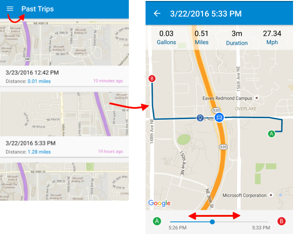

<properties
    pageTitle="Exemplo de MyDriving Azure IoT: início rápido | Microsoft Azure"
    description="Começar a usar um aplicativo que é uma demonstração abrangente de como projetar um sistema IoT usando o Microsoft Azure, incluindo a análise de fluxo, aprendizado de máquina e Hubs de evento."
    services=""
    documentationCenter=".net"
    suite=""
    authors="harikmenon"
    manager="douge"/>

<tags
    ms.service="multiple"
    ms.workload="tbd"
    ms.tgt_pltfrm="ibiza"
    ms.devlang="dotnet"
    ms.topic="article"
    ms.date="03/25/2016"
    ms.author="harikm"/>

# Sistema de MyDriving IoT: início rápido

MyDriving é um sistema que demonstra o design e a implementação de uma solução de [Internet das coisas](iot-suite-overview.md) (IoT) típica que reúne telemetria de dispositivos, processa esses dados na nuvem e aplica-se a fornecer uma resposta adaptativa de aprendizado de máquina. A demonstração registra dados sobre suas viagens de carro, usando dados de seu telefone celular e um adaptador que coletará informações do sistema de controle do carro. Ele usa esses dados para fornecer comentários sobre seu estilo de carro em comparação com outros usuários.

A finalidade real do MyDriving é começar a criar sua própria solução IoT. Mas antes disso, vamos lhe orientar com MyDriving próprio aplicativo, como um membro da nossa equipe de usuário de teste. Isso proporciona uma experiência de aplicativo e o sistema por trás dele como um consumidor, antes de você aprofundar a arquitetura. Ele também apresenta HockeyApp, uma maneira interessante de Gerenciando as distribuições alfa e beta de seus aplicativos para testar os usuários.

## Use a experiência móvel

Você pode usar o aplicativo de MyDriving se você tiver um dispositivo Android, iOS ou Windows 10.

### Android e instalação do Windows 10 Mobile

Em seu dispositivo:

1.  Permitir o desenvolvimento de aplicativos:

    -   Android: Nas **configurações** > **segurança**, permitir que aplicativos de **fontes desconhecidas**.

    -   Windows 10: Nas **configurações** > **atualizações** > **Para desenvolvedores**, defina o **modo de desenvolvedor**.

2.  Ingressar em nossa equipe de teste beta por inscrição com ou entrando no, [HockeyApp](https://rink.hockeyapp.net). HockeyApp facilita a distribuição primeiras versões do seu aplicativo para testar os usuários.

    Se você estiver usando o Windows 10, use o navegador de borda.

    Se você tivesse um participante de compilação 2016, entre com o email de conta Microsoft mesmo que você registrados para a conferência, usando um dos botões do Microsoft. Você já se inscreveu com HockeyApp.

    

3.  Baixe e instale o aplicativo a partir daqui:

    -   [Android](http://rink.io/spMyDrivingAndroid)

    -   [Windows 10](http://rink.io/spMyDrivingUWP)

    Há dois itens. Instale o certificado no **Pessoas confiáveis**. Em seguida, instale o aplicativo.

*Problemas ao iniciar o aplicativo no Windows 10 Mobile?* Seu telefone pode ser uma atualização ou duas atrás. Verifique se que você tem as atualizações mais recentes, ou instalar:

 - [Microsoft.NET.Native.Framework.1.2.appx](https://download.hockeyapp.net/packages/win10/Microsoft.NET.Native.Framework.1.2.appx) 

 - [Microsoft.NET.Native.Runtime.1.1.appx](https://download.hockeyapp.net/packages/win10/Microsoft.NET.Native.Runtime.1.1.appx) 

 - [Microsoft.VCLibs.ARM.14.00.appx](https://download.hockeyapp.net/packages/win10/Microsoft.VCLibs.ARM.14.00.appx)

### instalação do iOS

Se você participou compilação 2016, baixe o aplicativo como um membro da nossa equipe de teste em HockeyApp:

1.  Em seu dispositivo iOS, entre no [HockeyApp](https://rink.hockeyapp.net).
    Use um dos botões de entrada do Microsoft e entrar com o email de conta Microsoft mesmo que você registrou com a conferência. (Não use os campos de email e senha).

    

2.  No painel HockeyApp, selecione MyDriving e baixá-lo.

3.  Autorize a versão beta do HockeyApp:

    a. Vá para **configurações** > **Geral** > **perfis e gerenciamento de dispositivo.**

    b. Confie no certificado de **Bit Estádio GmbH** .

Se você não participar de compilação 2016, você pode criar e implantar o aplicativo por conta própria:

1.   Baixe o código [do GitHub].

2.   Construa e implante usando [Xamarin].

Encontre mais detalhes no [Guia de referência de MyDriving](http://aka.ms/mydrivingdocs).

## Obter um adaptador OBD (opcional)

Essa é a parte que torna um sistema de Internet das coisas real! Você pode usar o aplicativo sem uma, mas é mais diversão com a situação real, e não forem caros.

Diagnóstico integrado (OBD) é o recurso do seu carro que a garagem usa para ajustar o seu carro e diagnosticar ruídos ímpares e lâmpadas de aviso. A menos que seu carro de época excelente, você encontrará um soquete em algum lugar na cabine, geralmente atrás uma aba no painel. Com o conector certo, você pode obter métricas de desempenho do mecanismo e fazer alguns ajustes. Um conector OBD pode ser adquirido sem grandes custos os locais de costume. Ele se conecta usando Bluetooth ou Wi-Fi para um aplicativo em seu telefone.

Nesse caso, vamos abordar a conectar seu carro na nuvem. A conexão direta no OBD é para o seu telefone, mas nosso aplicativo funciona como uma retransmissão. Telemetria do carro é enviada diretamente para o hub de MyDriving IoT, onde ela é processada para efetuar sua viagem e avaliar seu estilo carro.

Para conectar um dispositivo OBD:

1.  Verifique se seu carro tem um soquete OBD.

2.  Obter um adaptador OBD:

    -   Se você estiver usando um telefone Android ou Windows, é necessário um adaptador habilitado para Bluetooth OBD II. Usamos a [Ferramenta de verificação de OBDII do BAFX produtos 34t5 Bluetooth].

    -   Se você estiver usando um telefone de iOS, é necessário um adaptador OBD habilitado Wi-Fi. Usamos [ScanTool OBDLink MX Wi-Fi: OBD adaptador/diagnóstico Scanner].

3.  Siga as instruções que acompanham o adaptador OBD conectá-lo ao seu telefone. Tenha em mente o seguinte:

    -   Um adaptador Bluetooth deve estar combinado com o telefone, na página **configurações** .

    -   Um adaptador de rede Wi-Fi deve ter um endereço na 192.168.xxx.xxx intervalo.

4.  Se você tiver várias carros, você pode obter um adaptador separado para cada (máximo de três).

Se você não tiver um adaptador OBD, o aplicativo ainda enviarão dados local e a velocidade de receptor GPS do telefone ao back-end e perguntará se você deseja simular uma OBD.

Você pode encontrar mais informações sobre como o aplicativo usa dados do adaptador OBD e opções para criar seu próprio dispositivo OBD seção 2.1, "IoT dispositivos," no [Guia de referência de MyDriving](http://aka.ms/mydrivingdocs).

## Usar o aplicativo

Inicie o aplicativo. Não há um início rápido inicial para orientá-lo como ele funciona.

### Controlar seu viagens

Toque no botão de registro (círculo vermelho grande na parte inferior da tela) para iniciar uma viagem e, em seguida, toque novamente para encerrar.

Toda vez que iniciar uma viagem, se não houver nenhum dispositivo OBD, você será solicitado se deseja usar o simulator.

No final de uma viagem, toque no botão Parar e obtenha um resumo.

### Examine suas viagens

### Revisar o seu perfil

## Envie-nos seus comentários de teste

Como criamos MyDriving para ajudar a introdução seus próprios sistemas IoT, certamente queremos ouvir você sobre como ele funciona. Fale conosco se:

- Você enfrentar dificuldades ou desafios.

- Não há um ponto de extensão que tornaria mais adequado ao seu cenário.

- Encontrar uma maneira mais eficiente para realizar certas necessidades.

- Você tiver quaisquer outras sugestões para melhorar MyDriving ou esta documentação.

Dentro do aplicativo de MyDriving em si, você pode usar o mecanismo de comentários de HockeyApp interno: no iOS e Android, basta dar seu telefone um shake, ou usar o comando de menu de **comentários** . Isso automaticamente irá anexar uma captura de tela, para que nós Saiba o que você está falando. E se houver qualquer travamentos Infelizmente, HockeyApp coleta os logs de falha para nos dizer sobre eles. Você também pode fornecer comentários por meio do [portal de HockeyApp].

Você também pode arquivar um [problema no GitHub]ou deixar um comentário abaixo (pt-br edition).

Esperamos ouvir você!

## Próximas etapas

-   Explore o [Guia de referência de MyDriving](http://aka.ms/mydrivingdocs) para compreender como podemos já projetada e construída todo o sistema de MyDriving.

-   [Criar e implantar um sistema de seu próprio](iot-solution-build-system.md) usando nossos scripts do Gerenciador de recursos do Azure. O [Guia de referência de MyDriving](http://aka.ms/mydrivingdocs) também orienta áreas onde você vai fazer as maioria das personalizações.

  [do GitHub]: https://github.com/Azure-Samples/MyDriving
  [usando Xamarin]: https://developer.xamarin.com/guides/ios/getting_started/installation/
  [Ferramenta de verificação OBDII BAFX produtos 34t5 Bluetooth]: http://www.amazon.com/gp/product/B005NLQAHS
  [ScanTool OBDLink MX Wi-Fi: OBD adaptador/diagnóstico Scanner]: http://www.amazon.com/gp/product/B00OCYXTYY/ref=s9_simh_gw_g263_i1_r?pf_rd_m=ATVPDKIKX0DER&pf_rd_s=desktop-2&pf_rd_r=1MWRMKXK4KK9VYMJ44MP
  [Portal de HockeyApp]: https://rink.hockeyapp.org
  [problema no GitHub]: https://github.com/Azure-Samples/MyDriving/issues
