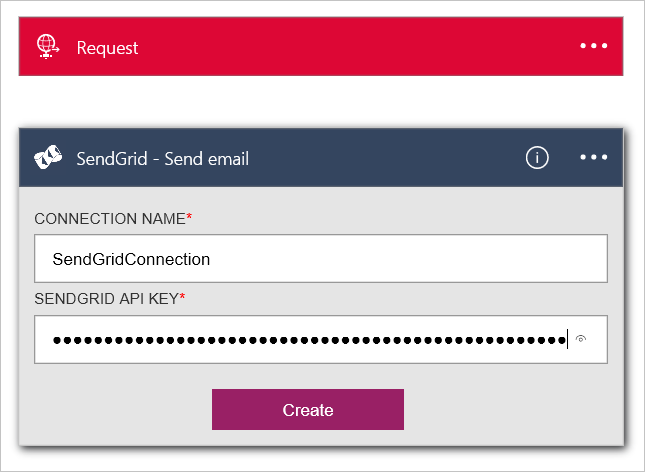

<properties
  pageTitle="Pacote de IoT Azure e aplicativos de lógica | Microsoft Azure"
  description="Um tutorial sobre como ligar aplicativos de lógica no Azure IoT pacote para processo de negócios."
  services=""
  suite="iot-suite"
  documentationCenter=""
  authors="aguilaaj"
  manager="timlt"
  editor=""/>

<tags
  ms.service="iot-suite"
  ms.devlang="na"
  ms.topic="article"
  ms.tgt_pltfrm="na"
  ms.workload="na"
  ms.date="08/16/2016"
  ms.author="araguila"/>
  
# <a name="tutorial-connect-logic-app-to-your-azure-iot-suite-remote-monitoring-preconfigured-solution"></a>Tutorial: Conectar a lógica de aplicativo a sua solução Azure IoT Suite monitoramento remoto pré-configurado

O [Pacote do Microsoft Azure IoT] [ lnk-internetofthings] monitoramento solução pré-configurada remota é uma ótima maneira de começar rapidamente com um conjunto de recursos de ponta a ponta que um exemplo de uma solução IoT. Este tutorial orienta como adicionar lógica de aplicativo ao seu Microsoft Azure IoT Suite monitoramento solução pré-configurada remoto. Estas etapas demonstram como você pode levar a solução de IoT ainda mais, conectando a um processo de negócios.

_Se você estiver procurando um passo a passo sobre como provisionar um monitoramento remoto pré-configurado solução, consulte [Tutorial: começar a usar as soluções IoT pré-configurado][lnk-getstarted]._

Antes de iniciar este tutorial, você deve:

- Provisionar o monitoramento remoto pré-configurado solução em sua assinatura do Azure.

- Crie uma conta de SendGrid para que você possa enviar um email que aciona o processo de negócios. Você pode se inscrever para uma conta de avaliação gratuita em [SendGrid](https://sendgrid.com/) clicando em **Experimente gratuitamente**. Após você ter registrado em sua conta de avaliação gratuita, você precisa criar uma [chave API](https://sendgrid.com/docs/User_Guide/Settings/api_keys.html) no SendGrid que concede permissões de enviar email. É necessário esta chave API posteriormente no tutorial.

Presumindo que você já tiver provisionado seu monitoramento remoto pré-configurado solução, navegue até o grupo de recursos para essa solução no [portal do Azure][lnk-azureportal]. O grupo de recursos tem o mesmo nome que o nome da solução que você escolheu quando você provisionado sua solução de monitoramento remota. No grupo de recursos, você pode ver todos os recursos de Azure provisionados para sua solução, exceto para o aplicativo do Active Directory do Azure que você pode encontrar no Portal de clássico do Azure. A captura de tela a seguir mostra uma lâmina de **grupo de recursos** de exemplo para uma solução de pré-configurado monitoramento remoto:


Para começar, configure o aplicativo de lógica para usar com a solução pré-configurado.

## <a name="set-up-the-logic-app"></a>Configurar o aplicativo de lógica

1. Clique em __Adicionar__ na parte superior da sua blade de grupo de recursos no portal do Azure.

2. Pesquisar __Lógica de aplicativo__, selecione-o e clique em **criar**.

3. Preencha o __nome__ e use a mesma **assinatura** e **grupo de recursos** que você usou quando você provisionado sua solução de monitoramento remota. Clique em __criar__.

    

4. Quando sua implantação for concluído, você pode ver que o aplicativo de lógica é listado como um recurso em seu grupo de recursos.

5. Clique no aplicativo de lógica para navegar até a lâmina lógica aplicativo, selecione o modelo de **Aplicativo de lógica em branco** para abrir o **Designer de aplicativos de lógica**.

    

6. Selecione a __solicitação__. Esta ação especifica que uma solicitação HTTP de entrada com um JSON específico formatados carga atua como um disparador.

7. Cole o seguinte no esquema de solicitação de corpo JSON:

    ```
    {
      "$schema": "http://json-schema.org/draft-04/schema#",
      "id": "/",
      "properties": {
        "DeviceId": {
          "id": "DeviceId",
          "type": "string"
        },
        "measuredValue": {
          "id": "measuredValue",
          "type": "integer"
        },
        "measurementName": {
          "id": "measurementName",
          "type": "string"
        }
      },
      "required": [
        "DeviceId",
        "measurementName",
        "measuredValue"
      ],
      "type": "object"
    }
    ```
    
    > [AZURE.NOTE] Você pode copiar a URL para a postagem HTTP depois de você salvar o aplicativo de lógica, mas primeiro você deve adicionar uma ação.

8. Clique em __+ nova etapa__ em seu disparador manual. Clique em **Adicionar uma ação**.

    

9. Pesquise **SendGrid - enviar email** e clique nele.

    

10. Insira um nome para a conexão, como **SendGridConnection**, insira a **Chave de API do SendGrid** criado quando você configurou sua conta de SendGrid e clique em **criar**.

    

11. Adicione endereços de email que você possui campos **de** e **até** . Adicione o **monitoramento alerta [DeviceId] remoto** para o campo **assunto** . No campo do **Corpo do Email** , adicione **dispositivo [DeviceId] tem relatado [measurementName] com valor [measuredValue].** Você pode adicionar **[DeviceId]**, **[measurementName]**e **[measuredValue]** , clicando na seção **que você pode inserir dados de etapas anteriores** .

    

12. No menu superior, clique em __Salvar__ .

13. Clique no disparador **Solicitar** e copie o valor de __Http Post para esta URL__ . Você precisa esta URL posteriormente neste tutorial.

> [AZURE.NOTE] Lógica Apps permitem que você executar [muitos tipos diferentes de ação] [ lnk-logic-apps-actions] incluindo ações no Office 365. 

## <a name="set-up-the-eventprocessor-web-job"></a>Configurar o trabalho de Web EventProcessor

Nesta seção, você pode conectar sua solução pré-configurada para o aplicativo de lógica que você criou. Para concluir essa tarefa, você adicionar a URL para o aplicativo de lógica para a ação que aciona quando um valor de sensor dispositivo excede um limite de disparar.

1. Usar o cliente gito para clonar a última versão do [azure-iot-monitoramento remoto github repositório][lnk-rmgithub]. Por exemplo:

    ```
    git clone https://github.com/Azure/azure-iot-remote-monitoring.git
    ```

2. No Visual Studio, abra o __RemoteMonitoring.sln__ da cópia local do repositório.

3. Abra o arquivo __ActionRepository.cs__ no **infraestrutura\\repositório** pasta.

4. Atualize o dicionário de **actionIds** com o __Http Post para esta URL__ que você anotou de seu aplicativo de lógica da seguinte maneira:

    ```
    private Dictionary<string,string> actionIds = new Dictionary<string, string>()
    {
        { "Send Message", "<Http Post to this UR>" },
        { "Raise Alarm", "<Http Post to this UR> }
    };
    ```

5. Salvar as alterações na solução e sair do Visual Studio.

## <a name="deploy-from-the-command-line"></a>Implantar da linha de comando

Nesta seção, você implantar sua versão atualizada da solução monitoramento remota para substituir a versão em execução no Azure.

1. Após a [configuração de desenvolvimento] [ lnk-devsetup] instruções para configurar o ambiente para implantação.

2.  Para implantar localmente, siga a [implantação local] [ lnk-localdeploy] instruções.

3.  Para implantar na nuvem e atualizar sua implantação de nuvem existente, siga a [implantação da nuvem] [ lnk-clouddeploy] instruções. Use o nome da sua implantação original como o nome de implantação. Por exemplo, se a implantação original foi chamada **demologicapp**, use o seguinte comando:

    ``
    build.cmd cloud release demologicapp
    ``
    
    Quando o script de construção é executado, certifique-se de usar a mesma conta Azure, assinatura, região e instância do Active Directory usada quando você provisionado a solução.

## <a name="see-your-logic-app-in-action"></a>Consulte seu aplicativo de lógica em ação

A solução de pré-configurado monitoramento remota tem duas regras configuradas por padrão, quando você provisiona uma solução. Ambas as regras são no dispositivo **SampleDevice001** :

* Temperatura > 38.00
* Umidade > 48,00

A regra de temperatura aciona a ação de **Alarme elevar** e a regra de umidade aciona a ação de **SendMessage** . Considerando que você usou a mesma URL para ambas as ações da classe **ActionRepository** , seu aplicativo de lógica aciona para qualquer regra. Ambas as regras usam SendGrid para enviar um email para **o endereço com detalhes do alerta** .

> [AZURE.NOTE] O aplicativo de lógica continua disparar sempre que o limite é atendido. Para evitar desnecessárias emails, você pode desabilitar as regras em seu portal de solução ou desabilitar o aplicativo de lógica no [portal do Azure][lnk-azureportal].

Além de receber emails, você também pode ver quando o aplicativo de lógica é executado no portal:


## <a name="next-steps"></a>Próximas etapas

Agora que você já utilizou um aplicativo de lógica para conectar-se a solução pré-configurada para um processo de negócios, você pode aprender mais sobre as opções para personalizar as soluções predefinidas:

- [Usar telemetria dinâmica com a solução pré-configurada monitoramento remota][lnk-dynamic]
- [Metadados de informações de dispositivo no monitoramento remoto pré-configurado solução][lnk-devinfo]

[lnk-dynamic]: iot-suite-dynamic-telemetry.md
[lnk-devinfo]: iot-suite-remote-monitoring-device-info.md

[lnk-internetofthings]: https://azure.microsoft.com/documentation/suites/iot-suite/
[lnk-getstarted]: iot-suite-getstarted-preconfigured-solutions.md
[lnk-azureportal]: https://portal.azure.com
[lnk-logic-apps-actions]: ../connectors/apis-list.md
[lnk-rmgithub]: https://github.com/Azure/azure-iot-remote-monitoring
[lnk-devsetup]: https://github.com/Azure/azure-iot-remote-monitoring/blob/master/Docs/dev-setup.md
[lnk-localdeploy]: https://github.com/Azure/azure-iot-remote-monitoring/blob/master/Docs/local-deployment.md
[lnk-clouddeploy]: https://github.com/Azure/azure-iot-remote-monitoring/blob/master/Docs/cloud-deployment.md
