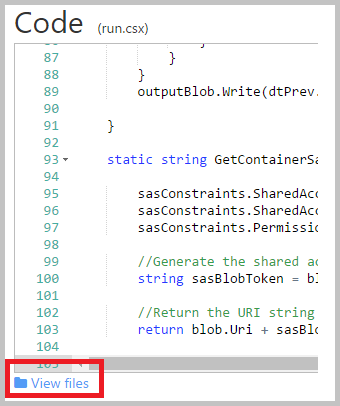

<properties
    pageTitle="Como configurar o Cofre de chave com rotação de chaves de ponta a ponta e auditoria | Microsoft Azure"
    description="Use este instruções para ajudá-lo a obter a configuração com a rotação de chaves e monitoramento cofre chave logs"
    services="key-vault"
    documentationCenter=""
    authors="swgriffith"
    manager="mbaldwin"
    tags=""/>

<tags
    ms.service="key-vault"
    ms.workload="identity"
    ms.tgt_pltfrm="na"
    ms.devlang="na"
    ms.topic="article"
    ms.date="07/05/2016"
    ms.author="jodehavi;stgriffi"/>
#<a name="how-to-setup-key-vault-with-end-to-end-key-rotation-and-auditing"></a>Como configurar o Cofre de chave com rotação de chaves de ponta a ponta e auditoria

##<a name="introduction"></a>Introdução

Depois de criar seu Cofre de chave do Azure, você poderá começar a aproveitar essa cofre para armazenar suas chaves e segredos. Seus aplicativos não seja mais necessário manter suas chaves ou segredos, mas sim solicitará-los no cofre chave de conforme necessário. Isso permite que você atualize chaves e senhas sem afetar o comportamento do seu aplicativo, que abre uma ampla variedade de possibilidades em torno de sua chave e o comportamento de gerenciamento secreta.

Este artigo percorre um exemplo de aproveitando Cofre de chave do Azure para armazenar um segredo, neste caso uma chave de conta de armazenamento do Azure que é acessada por um aplicativo. Ele também demonstraremos a implementação de uma rotação programada dessa chave da conta de armazenamento. Por fim, ele orientará durante uma demonstração de como monitorar os logs de auditoria do cofre chave e gerar alertas quando são feitas solicitações inesperadas.

> \[AZURE. Observação\] este tutorial não pretende explicam detalhadamente o conjunto inicial backup de seu Cofre de chave do Azure. Para obter essas informações, consulte [Introdução ao Azure chave cofre](key-vault-get-started.md). Ou, para obter instruções de Interface de linha de comando de plataforma híbrida, consulte [Este tutorial equivalente](key-vault-manage-with-cli.md).

##<a name="setting-up-keyvault"></a>Configurando KeyVault

Para habilitar um aplicativo recuperar um segredo do Azure chave cofre, você deve primeiro criar o segredo e carregue-o no seu cofre. Isso pode ser feito facilmente por meio do PowerShell conforme mostrado abaixo.

Iniciar uma sessão do PowerShell do Azure e entrar em sua conta do Azure com o seguinte comando:

```powershell
Login-AzureRmAccount
```

Na janela do navegador pop-up, insira seu nome de usuário da conta do Azure e senha. PowerShell Azure obterá todas as assinaturas que são associados com essa conta e por padrão, usa primeiro.

Se você tiver várias assinaturas, talvez seja necessário especificar um grupo específico que foi usado para criar seu Cofre de chave do Azure. Digite o seguinte para ver as assinaturas para sua conta:

```powershell
Get-AzureRmSubscription
```

Em seguida, para especificar a assinatura que está associada a sua chave cofre que fizerem logon, digite:

```powershell
Set-AzureRmContext -SubscriptionId <subscriptionID> 
```

Como este artigo demonstra o armazenamento de uma chave de conta de armazenamento como um segredo, você precisará obter essa chave da conta de armazenamento.

```powershell
Get-AzureRmStorageAccountKey -ResourceGroupName <resourceGroupName> -Name <storageAccountName>
```

Depois de recuperar seu segredo, nesse caso sua chave da conta de armazenamento, você precisará converter que em uma cadeia de segura e depois criar um segredo com esse valor em seu cofre chave.

```powershell
$secretvalue = ConvertTo-SecureString <storageAccountKey> -AsPlainText -Force

Set-AzureKeyVaultSecret -VaultName <vaultName> -Name <secretName> -SecretValue $secretvalue
```
Em seguida, você desejará obter o URI para o segredo que você acabou de criar. Isso será usado em uma etapa posterior quando você chama o Cofre de chave para recuperar seu segredo. Execute o seguinte comando do PowerShell e anote o valor de 'Id', que é o URI secreto.

```powershell
Get-AzureKeyVaultSecret –VaultName <vaultName>
```

##<a name="setting-up-application"></a>Configurando o aplicativo

Agora que você tem um segredo armazenado você desejará recuperar segredo e usá-lo no código. Existem algumas etapas necessárias para fazer isso, a primeira e mais importante do que é registrar seu aplicativo com o Active Directory do Azure e, em seguida, informando Azure chave cofre suas informações de aplicativo para que ele pode permitir solicitações de seu aplicativo.

> \[AZURE. Observação\] seu aplicativo deve ser criado no mesmo locatário Azure Active Directory como seu Cofre de chave. 

Primeiro, abra a guia de aplicativos do Azure Active Directory


Escolha Adicionar para adicionar um novo aplicativo à sua Azure AD


Deixe o tipo de aplicativo como 'API WEB e/ou de aplicativo da Web' e dê um nome para seu aplicativo.


Dê seu aplicativo um 'URL logon' e um 'URI de ID de aplicativo'. Esses podem ser qualquer coisa que você deseja para essa demonstração e podem ser alteradas posteriormente, se necessário.


Depois que o aplicativo é adicionado ao Azure AD, você será levado para a página de aplicativo. Desse ponto clique na guia 'Configurar' e em seguida, localize e copie o valor de 'ID do cliente'. Anote a ID do cliente para etapas posteriores.

Em seguida, você precisará gerar uma chave para o seu aplicativo sejam capazes de interagir com o Azure AD. Você pode criar isso na seção 'Teclas' na guia 'Configuração'. Anote o a chave gerada recentemente do seu aplicativo do Azure AD para uso em uma etapa posterior.


Antes de estabelecer as chamadas do seu aplicativo em chave cofre você precisará informar o Cofre de tecla sobre seu aplicativo e seu ' permissões. O comando a seguir obtém o nome do cofre e a ID do cliente de seu aplicativo do Azure AD e concede 'Get' acesso ao seu cofre chave para o aplicativo.

```powershell
Set-AzureRmKeyVaultAccessPolicy -VaultName <vaultName> -ServicePrincipalName <clientIDfromAzureAD> -PermissionsToSecrets Get
```

Neste ponto, você está pronto para começar a criar suas chamadas de aplicativo. Em seu aplicativo você precisará primeiro instalar os pacotes de NuGet necessários para interagir com Cofre de chave do Azure e o Azure Active Directory. No console do Gerenciador de pacote do Visual Studio, digite os seguintes comandos. Observe que na elaboração deste artigo a versão atual do pacote do Active Directory é 3.10.305231913, portanto, talvez você queira confirmar a versão mais recente e atualizar adequadamente.

```powershell
Install-Package Microsoft.IdentityModel.Clients.ActiveDirectory -Version 3.10.305231913

Install-Package Microsoft.Azure.KeyVault
```

No seu código do aplicativo, crie uma classe para manter o método para a autenticação do Active Directory. Neste exemplo que classe é chamado 'Utilitários'. Você precisará adicionar o seguinte usando.

```csharp
using Microsoft.IdentityModel.Clients.ActiveDirectory;
```

Em seguida, adicione o seguinte método para recuperar o token JWT do Azure AD. Para manutenção, que talvez você queira mover o disco rígido codificados valores de cadeia de caracteres em sua configuração da web ou aplicativo.

```csharp
public async static Task<string> GetToken(string authority, string resource, string scope)
{
    var authContext = new AuthenticationContext(authority);

    ClientCredential clientCred = new ClientCredential("<AzureADApplicationClientID>","<AzureADApplicationClientKey>");

    AuthenticationResult result = await authContext.AcquireTokenAsync(resource, clientCred);

    if (result == null)

    throw new InvalidOperationException("Failed to obtain the JWT token");

    return result.AccessToken;
}
```

Por fim, você pode adicionar o código necessário para chamar chave cofre e recuperar seu valor secreto. Primeiro você deve adicionar o seguinte usando instrução.

```csharp
using Microsoft.Azure.KeyVault;
```

Em seguida, você adicionará as chamadas de método para invocar chave cofre e recuperar seu segredo. Este método, você fornecerá o segredo URI que você salvou na etapa anterior. Observe o uso do método GetToken da classe utilitários criado acima.
    
```csharp
var kv = new KeyVaultClient(new KeyVaultClient.AuthenticationCallback(Utils.GetToken));

var sec = kv.GetSecretAsync(<SecretID>).Result.Value;
```

Quando você executa seu aplicativo, você deverá estar autenticar ao Azure Active Directory e, em seguida, recuperar seu valor secreto de seu Cofre de chave do Azure.

##<a name="key-rotation-using-azure-automation"></a>Rotação de chaves usando automação do Azure

Há várias opções para implementar uma estratégia de rotação em valores que você armazena como segredos Azure chave cofre. Segredos podem ser girados como parte de um processo manual, pode ser girados programaticamente aproveitando chamadas API ou eles podem ser girados por meio de um script de automação. Para os fins deste artigo nós será aproveitando o Azure PowerShell combinado com a automação do Azure para alterar uma tecla de acesso de conta de armazenamento do Azure e, em seguida, atualizaremos um segredo cofre chave com essa nova chave. 

Para permitir que a automação do Azure definir valores secretas em seu cofre chave, você precisará obter a ID do cliente para a conexão chamado 'AzureRunAsConnection' que foi criada quando você estabeleceu sua instância de automação do Azure. Você pode acessar essa ID escolhendo 'Ativos' sua instância de automação do Azure. A partir daí, você escolhe 'Conexões' e, em seguida, selecione o princípio de serviço de 'AzureRunAsConnection'. Você desejará Anote a ID de aplicativo' '. 


Enquanto você estiver ainda na janela de ativos, você também queira escolher 'Módulos'. Do módulos você irá selecione 'Galeria' e, em seguida, pesquise e 'Importação' atualizado versões de cada um dos seguintes módulos.

    Azure
    Azure.Storage   
    AzureRM.Profile
    AzureRM.KeyVault
    AzureRM.Automation
    AzureRM.Storage
    
> \[AZURE. Observação\] na elaboração deste artigo somente acima indicadas módulos necessários para ser atualizado para o script compartilhado abaixo. Se você achar que seu trabalho de automação está falhando, você deverá confirmar que você tem todos os módulos necessários e suas dependências importadas.

Depois de recuperar a ID do aplicativo para sua conexão de automação do Azure, você precisará saber seu Cofre de chave do Azure que este aplicativo tem acesso ao atualizar segredos no seu cofre. Isso pode ser feito com o seguinte comando do PowerShell.

```powershell
Set-AzureRmKeyVaultAccessPolicy -VaultName <vaultName> -ServicePrincipalName <applicationIDfromAzureAutomation> -PermissionsToSecrets Set
```

Em seguida, você seleciona o recurso 'Runbooks' em sua instância de automação do Azure e selecione 'Adicionar uma Runbook'. Selecione 'Criar rápida'. Nomeie sua runbook e selecione 'PowerShell' como o tipo de runbook. Opcionalmente, adicione uma descrição. Por fim, clique em 'Criar'.


No painel editor para seu novo runbook colará o seguinte script do PowerShell.

```powershell
$connectionName = "AzureRunAsConnection"
try
{
    # Get the connection "AzureRunAsConnection "
    $servicePrincipalConnection=Get-AutomationConnection -Name $connectionName         

    "Logging in to Azure..."
    Add-AzureRmAccount `
        -ServicePrincipal `
        -TenantId $servicePrincipalConnection.TenantId `
        -ApplicationId $servicePrincipalConnection.ApplicationId `
        -CertificateThumbprint $servicePrincipalConnection.CertificateThumbprint 
    "Login complete."
}
catch {
    if (!$servicePrincipalConnection)
    {
        $ErrorMessage = "Connection $connectionName not found."
        throw $ErrorMessage
    } else{
        Write-Error -Message $_.Exception
        throw $_.Exception
    }
}

#Optionally you may set the following as parameters
$StorageAccountName = <storageAccountName>
$RGName = <storageAccountResourceGroupName>
$VaultName = <keyVaultName>
$SecretName = <keyVaultSecretName>

#Key name. For example key1 or key2 for the storage account
New-AzureRmStorageAccountKey -ResourceGroupName $RGName -StorageAccountName $StorageAccountName -KeyName "key2" -Verbose
$SAKeys = Get-AzureRmStorageAccountKey -ResourceGroupName $RGName -Name $StorageAccountName

$secretvalue = ConvertTo-SecureString $SAKeys[1].Value -AsPlainText -Force

$secret = Set-AzureKeyVaultSecret -VaultName $VaultName -Name $SecretName -SecretValue $secretvalue
```

No painel editor, você pode escolher 'Painel de teste' testar o script. Depois que o script é executado sem erros, você pode selecionar a opção 'Publicar' e, em seguida, você pode aplicar uma agenda para runbook no painel de configuração do runbook.

##<a name="key-vault-auditing-pipeline"></a>Pipeline de auditoria de Cofre de chave

Ao configurar um cofre de chave do Azure você pode ativar auditoria para coletar logs em solicitações de acesso feitas ao Cofre de chave. Esses logs são armazenados em uma conta de armazenamento do Azure designada e podem, em seguida, ser puxados, monitoramento e analisados. Abaixo movimentações por meio de um cenário que utiliza funções do Azure, aplicativos de lógica do Azure e chave cofre auditam logs para criar um pipeline para enviar um email quando segredos do cofre são recuperados por um aplicativo que correspondem a id de aplicativo do aplicativo web.

Primeiro, você precisará ativar o registro em seu Cofre de chave. Isso pode ser feito via os seguintes comandos do PowerShell (detalhes completos podem ser vistos [aqui](key-vault-logging.md)):

```powershell
$sa = New-AzureRmStorageAccount -ResourceGroupName <resourceGroupName> -Name <storageAccountName> -Type Standard\_LRS -Location 'East US'
$kv = Get-AzureRmKeyVault -VaultName '<vaultName>' 
Set-AzureRmDiagnosticSetting -ResourceId $kv.ResourceId -StorageAccountId $sa.Id -Enabled $true -Categories AuditEvent
```

Quando isso estiver ativado, logs de auditoria serão iniciado coletar para a conta de armazenamento designado. Esses logs conterá eventos sobre como e quando seu compartimentos de chave são acessados e por quem. 

> \[AZURE. Observação\] você pode acessar suas informações de registro em log no máximo, 10 minutos após a chave cofre operação. Na maioria dos casos, será mais rápido do que isso.

A próxima etapa é [criar uma fila de barramento de serviço do Azure](../service-bus-messaging/service-bus-dotnet-get-started-with-queues.md). Este será onde os logs de auditoria do cofre chave são enviados. Uma vez na fila, o aplicativo de lógica será coletá-las e atuar sobre eles. Para criar um barramento de serviço é relativamente direta e seguir as etapas de alto níveis, é:

1. Crie um namespace de barramento de serviço (se você já tiver um que você deseja usar para isso e em seguida, vá para a etapa 2).
2. Navegue até o barramento de serviço no portal e selecione o namespace que você deseja criar a fila no.
3. Selecione novo e escolha barramento de serviço -> fila e insira os detalhes necessários.
4. Captura as informações de conexão de serviço barramento escolhendo namespace e clicando em _Informações de Conexão_. Você precisará dessas informações para a próxima parte.

Em seguida, você irá [criar uma função do Azure](../azure-functions/functions-create-first-azure-function.md) para pesquisar os logs de chave cofre dentro da conta de armazenamento e buscar novos eventos. Este será uma função que é acionada em um cronograma.

Criar uma função Azure (escolha Novo -> aplicativo de função no portal do). Durante a criação, você pode usar um plano de hospedagem existente ou crie um novo. Você também pode optar por dinâmico de hospedagem. Obter mais detalhes sobre opções de hospedagem de função podem ser encontradas [aqui](../azure-functions/functions-scale.md).

Quando a função do Azure é criada, navegue até ele e escolha um temporizador função e C\# , em seguida, clique em **criar** desde a tela inicial.


Na guia _desenvolver_ , substitua o código de run.csx com o seguinte:

```csharp
#r "Newtonsoft.Json"

using System;
using Microsoft.WindowsAzure.Storage;
using Microsoft.WindowsAzure.Storage.Auth;
using Microsoft.WindowsAzure.Storage.Blob;
using Microsoft.ServiceBus.Messaging; 
using System.Text;

public static void Run(TimerInfo myTimer, TextReader inputBlob, TextWriter outputBlob, TraceWriter log) 
{ 
    log.Info("Starting");

    CloudStorageAccount sourceStorageAccount = new CloudStorageAccount(new StorageCredentials("<STORAGE_ACCOUNT_NAME>", "<STORAGE_ACCOUNT_KEY>"), true);

    CloudBlobClient sourceCloudBlobClient = sourceStorageAccount.CreateCloudBlobClient();

    var connectionString = "<SERVICE_BUS_CONNECTION_STRING>";
    var queueName = "<SERVICE_BUS_QUEUE_NAME>";

    var sbClient = QueueClient.CreateFromConnectionString(connectionString, queueName);

    DateTime dtPrev = DateTime.UtcNow;
    if(inputBlob != null)
    {
        var txt = inputBlob.ReadToEnd();

        if(!string.IsNullOrEmpty(txt))
        {
            dtPrev = DateTime.Parse(txt);
            log.Verbose($"SyncPoint: {dtPrev.ToString("O")}");
        }
        else
        {
            dtPrev = DateTime.UtcNow;
            log.Verbose($"Sync point file didnt have a date. Setting to now.");
        }
    }

    var now = DateTime.UtcNow;

    string blobPrefix = "insights-logs-auditevent/resourceId=/SUBSCRIPTIONS/<SUBSCRIPTION_ID>/RESOURCEGROUPS/<RESOURCE_GROUP_NAME>/PROVIDERS/MICROSOFT.KEYVAULT/VAULTS/<KEY_VAULT_NAME>/y=" + now.Year +"/m="+now.Month.ToString("D2")+"/d="+ (now.Day).ToString("D2")+"/h="+(now.Hour).ToString("D2")+"/m=00/";

    log.Info($"Scanning:  {blobPrefix}");

    IEnumerable<IListBlobItem> blobs = sourceCloudBlobClient.ListBlobs(blobPrefix, true);

    log.Info($"found {blobs.Count()} blobs");

    foreach(var item in blobs)
    {
        if (item is CloudBlockBlob)
        {
            CloudBlockBlob blockBlob = (CloudBlockBlob)item;

            log.Info($"Syncing: {item.Uri}");

            string sharedAccessUri = GetContainerSasUri(blockBlob);

            CloudBlockBlob sourceBlob = new CloudBlockBlob(new Uri(sharedAccessUri));

            string text;
            using (var memoryStream = new MemoryStream())
            {
                sourceBlob.DownloadToStream(memoryStream);
                text = System.Text.Encoding.UTF8.GetString(memoryStream.ToArray());
            }

            dynamic dynJson = JsonConvert.DeserializeObject(text);

            //required to order by time as they may not be in the file
            var results = ((IEnumerable<dynamic>) dynJson.records).OrderBy(p => p.time);

            foreach (var jsonItem in results)
            {
                DateTime dt = Convert.ToDateTime(jsonItem.time);

                if(dt>dtPrev){
                    log.Info($"{jsonItem.ToString()}");

                    var payloadStream = new MemoryStream(Encoding.UTF8.GetBytes(jsonItem.ToString()));
                    //When sending to ServiceBus, use the payloadStream and set keeporiginal to true
                    var message = new BrokeredMessage(payloadStream, true);
                    sbClient.Send(message);
                    dtPrev = dt;
                }
            }
        }
    }
    outputBlob.Write(dtPrev.ToString("o"));
}

static string GetContainerSasUri(CloudBlockBlob blob) 
{
    SharedAccessBlobPolicy sasConstraints = new SharedAccessBlobPolicy();

    sasConstraints.SharedAccessStartTime = DateTime.UtcNow.AddMinutes(-5);
    sasConstraints.SharedAccessExpiryTime = DateTime.UtcNow.AddHours(24);
    sasConstraints.Permissions = SharedAccessBlobPermissions.Read;

    //Generate the shared access signature on the container, setting the constraints directly on the signature.
    string sasBlobToken = blob.GetSharedAccessSignature(sasConstraints);

    //Return the URI string for the container, including the SAS token.
    return blob.Uri + sasBlobToken;
}
```
> \[AZURE. Observação\] certificar-se de substituir as variáveis no código acima para apontar para sua conta de armazenamento onde os logs de chave cofre são gravados, para o barramento de serviço que você criou anteriormente e para o caminho específico para os logs de armazenamento de chave cofre.

A função seleciona o arquivo de log mais recente da conta de armazenamento onde os logs de chave cofre são gravados, captura os eventos mais recentes do arquivo e envia-los para uma fila de barramento de serviço. Como um único arquivo pode ter vários eventos, por exemplo, ao longo de uma hora completa, em seguida, podemos criar um arquivo de _sync.txt_ que a função também analisa para determinar o carimbo de hora do último evento que foi entregue. Isso garante que estamos não push o mesmo evento várias vezes. Este arquivo _sync.txt_ simplesmente contém um carimbo de hora para o último evento encontrado. Os logs, quando carregado, precisam ser classificados de acordo com o carimbo de hora para garantir que eles estão ordenados corretamente.

Para essa função, podemos fazer referência a algumas bibliotecas adicionais que não estão disponíveis prontos para uso em funções do Azure. Para incluir esses, precisamos de funções do Azure para recebê-los usando o nuget. Escolha a opção de _Exibir arquivos_ 



e adicione um novo arquivo chamado _project.json_ com o seguinte conteúdo:

```json
    {
      "frameworks": {
        "net46":{
          "dependencies": {
                "WindowsAzure.Storage": "7.0.0",
                "WindowsAzure.ServiceBus":"3.2.2"
          }
        }
       }
    }
```
Ao _Salvar_ esta acionará funções do Azure para baixar os binários necessários. 

Alternar para a guia de **integrar** e dê um nome significativo para usar dentro da função para o parâmetro de timer. No código acima, ele espera o timer a ser chamado _myTimer_. Especificar uma [expressão CRON](../app-service-web/web-sites-create-web-jobs.md#CreateScheduledCRON) da seguinte maneira: 0 \* \* \* \* \* para o timer que fará com que a função para executar uma vez um minuto. 

Na mesma guia **integrar** , adicione uma entrada que será do tipo _Armazenamento de Blob do Azure_. Isto irá apontar para o arquivo de _sync.txt_ que contém o carimbo de hora do último evento observado pela função. Isso estará disponível dentro da função pelo nome do parâmetro. No código acima, a entrada de armazenamento de Blob do Azure espera o nome do parâmetro ser _inputBlob_. Escolher a conta de armazenamento onde o arquivo de _sync.txt_ residirão (pode ser a mesma ou uma conta de armazenamento diferente) e no campo caminho, forneça o caminho onde o arquivo reside, no formato de {container-name}/path/to/sync.txt.

Adicione uma saída que será do tipo saída do _Armazenamento de Blob do Azure_ . Isso também irá apontar para o arquivo de _sync.txt_ que você acabou de definir na entrada. Isso será usado pela função escrever o carimbo de hora do último evento observado. O código acima espera este parâmetro a ser chamado _outputBlob_.

Neste ponto, a função está pronta. Certifique-se voltar para a guia de **desenvolver** e _Salvar_ o código. Verifique a janela de saída para os erros de compilação e corrija aqueles adequadamente. Se ele compila, agora deve estar executando o código e cada minuto verificará os logs de chave cofre e os novos eventos na fila barramento de serviço definido por push. Você deve ver informações de log de gravar a janela de log toda vez que a função é disparada.

###<a name="azure-logic-app"></a>Aplicativo do Azure lógica

Avançar precisamos criar um aplicativo do Azure lógica que buscar os eventos que está fazendo com que a função na fila do barramento de serviço, analisar o conteúdo e enviar um email com base em uma condição que está sendo correspondida.

[Criar um aplicativo de lógica](../app-service-logic/app-service-logic-create-a-logic-app.md) indo para Novo -> lógica de aplicativo. 

Depois de criado o aplicativo de lógica, navegue até ele e escolha _Editar_. Dentro do editor de aplicativo de lógica, escolha que API gerenciada do _Serviço barramento fila_ e insira suas credenciais de barramento de serviço para conectá-lo à fila.


Escolha Avançar para _Adicionar uma condição_. A condição, alterne para o _editor avançado_ e digite o seguinte, substituindo o APP_ID com o APP_ID real de seu aplicativo web:

```
@equals('<APP_ID>', json(decodeBase64(triggerBody()['ContentData']))['identity']['claim']['appid'])
```

Essa expressão essencialmente retornará **false** se a propriedade **appid** a partir do evento de entrada (que é o corpo da mensagem barramento de serviço) não for o **appid** do aplicativo. 

Agora, crie uma ação sob a opção _se não, não faça nada..._ .


Para a ação, escolha _Office 365 - enviar email_. Preencha os campos para criar um email para enviar quando a condição definida retorna false. Se você não tiver o Office 365 você poderia examinar alternativas para atingir o mesmo.

Neste ponto, você tem um pipeline de ponta a ponta que, uma vez por minuto, irá procurar novos logs de auditoria de chave cofre. Qualquer novos logs que ele encontra, ele enviará-los a uma fila de barramento de serviço. O aplicativo de lógica será acionado assim que uma nova mensagem chega na fila e se o appid dentro do evento não correspondem a id de aplicativo do aplicativo de chamada, enviar um email. 
