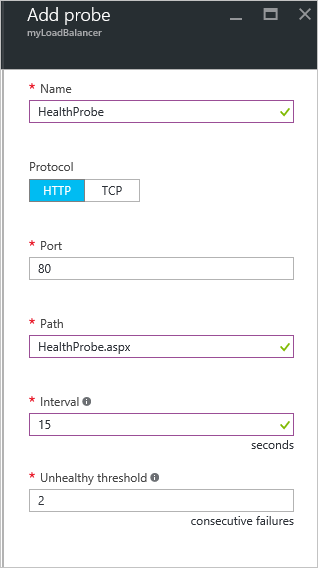

<properties
   pageTitle="Criar um balanceador de carga voltado para a Internet no Gerenciador de recursos usando o portal de Azure | Microsoft Azure"
   description="Aprenda a criar um balanceador de carga voltado para a Internet no Gerenciador de recursos usando o portal do Azure"
   services="load-balancer"
   documentationCenter="na"
   authors="anavinahar"
   manager="narayan"
   editor=""
   tags="azure-resource-manager"
/>
<tags
   ms.service="load-balancer"
   ms.devlang="na"
   ms.topic="hero-article"
   ms.tgt_pltfrm="na"
   ms.workload="infrastructure-services"
   ms.date="09/14/2016"
   ms.author="annahar" />

# Criando um balanceador de carga voltado para a Internet usando o portal do Azure

[AZURE.INCLUDE [load-balancer-get-started-internet-arm-selectors-include.md](../../includes/load-balancer-get-started-internet-arm-selectors-include.md)]

[AZURE.INCLUDE [load-balancer-get-started-internet-intro-include.md](../../includes/load-balancer-get-started-internet-intro-include.md)]

[AZURE.INCLUDE [azure-arm-classic-important-include](../../includes/azure-arm-classic-important-include.md)]Este artigo discute o modelo de implantação do Gerenciador de recursos. Você também pode [aprender a criar um balanceador de carga voltado para a Internet usando a implantação clássica](load-balancer-get-started-internet-classic-portal.md)

[AZURE.INCLUDE [load-balancer-get-started-internet-scenario-include.md](../../includes/load-balancer-get-started-internet-scenario-include.md)]

Isso abrange a sequência de tarefas individuais, que ele deve ser feito para criar um balanceador de carga e explicam detalhadamente o que está sendo feito para atingir a meta.

## O que é necessário para criar um balanceador de carga voltado para a Internet?

Você precisa criar e configurar os objetos a seguir para implantar um balanceador de carga.

- Configuração de IP front-end - contém os endereços IP públicos tráfego de rede.

- Pool de endereços de back-end - contém interfaces de rede (NICs) para as máquinas virtuais receber o tráfego de rede de Balanceador de carga.

- Regras de balanceamento de carga - contém regras mapeando uma porta pública no balanceador de carga para porta no pool de endereços de back-end.

- Regras NAT de entrada - contém regras mapeando uma porta pública no balanceador de carga para uma porta para uma máquina virtual específica no pool de endereços de back-end.

- Testes - contém testes de integridade usadas para verificar a disponibilidade de instâncias de máquinas virtuais no pool de endereços de back-end.

Você pode obter mais informações sobre carga componentes de Balanceador com o Gerenciador de recursos do Azure no [Gerenciador de recursos do Azure suporte do balanceador de carga](load-balancer-arm.md).

## Configurar um balanceador de carga no portal do Azure

> [AZURE.IMPORTANT] Este exemplo pressupõe que você tenha uma rede virtual chamada **myVNet**. Consulte [Criar rede virtual](../virtual-network/virtual-networks-create-vnet-arm-pportal.md) para fazer isso. Ele também pressupõe que existe uma sub-rede dentro **myVNet** chamado **LB-sub-rede-ser** e duas VMs chamado **web1** e **web2** , respectivamente, dentro do mesmo conjunto de disponibilidade chamado **myAvailSet** no **myVNet**. Consulte [Este link](../virtual-machines/virtual-machines-windows-hero-tutorial.md) para criar VMs.

1. Usando um navegador, navegue até o portal Azure: [http://portal.azure.com](http://portal.azure.com) e faça logon com sua conta do Azure.

2. No canto superior esquerdo da tela, selecione **novo** > **rede** > **balanceador de carga.**

3. Na lâmina **balanceador de carga de criar** , digite um nome para seu balanceador de carga. Aqui é chamado **myLoadBalancer**.

4. Em **tipo**, selecione **público**.

5. Em **endereço IP público**, crie um novo IP público chamado **myPublicIP**.

6. Em grupo de recursos, selecione **myRG**. Selecione um **local**de apropriado e clique em **Okey**. O balanceador de carga será iniciado implantar e vai demorar alguns minutos para ser concluída com êxito implantação.

## Criar um pool de endereços de back-end

1. Depois que sua balanceador de carga implantou com sucesso, selecioná-lo de dentro de seus recursos. Em configurações, selecione Pools de back-end. Digite um nome para o pool de back-end. Clique no botão **Adicionar** na parte superior da lâmina que aparece.

2. Clique em **Adicionar uma máquina virtual** na lâmina **Adicionar pool de back-end** .  Selecione **Escolher um conjunto de disponibilidade** sob **conjunto de disponibilidade** e **myAvailSet**. Em seguida, selecione **Escolher as máquinas virtuais** sob a seção de máquinas virtuais na lâmina e clique em **web1** e **web2**, as duas VMs criadas para balanceamento de carga. Certifique-se de que ambos tenham azuis marcas de seleção à esquerda, conforme mostrado na imagem abaixo. Em seguida, clique em **Selecionar** em que lâmina seguida Okey na lâmina **máquinas virtuais escolher** e, em seguida, **Okey** na lâmina **Adicionar pool de back-end** .

    

3. Verifique se suas notificações lista suspensa tem uma atualização sobre como salvar o pool de back-end de Balanceador de carga além de atualizar a interface de rede para VMs **web1** tanto o **web2**.

## Criar um teste, LB regra e regras NAT

1. Crie um teste de integridade.

    Em configurações da sua balanceador de carga, selecione testes. Clique em **Adicionar** localizado na parte superior da lâmina.

    Há duas maneiras para configurar um teste: HTTP ou TCP. Este exemplo mostra HTTP, mas TCP pode ser configurado de maneira semelhante.
    Atualize as informações necessárias. Conforme mencionado, **myLoadBalancer** carregará tráfego de saldo na porta 80. O caminho selecionado é HealthProbe.aspx, intervalo é de 15 segundos e não íntegra limite é 2. Quando terminar, clique em **Okey** para criar o teste.

    Passe o ponteiro sobre o 'i' ícone para saber mais sobre essas configurações individuais e como eles podem ser alterados para atender às suas necessidades.

    

2. Crie uma regra de Balanceador de carga.

    Clique em regras na seção configurações de sua balanceador de carga de balanceamento de carga. Na nova lâmina, clique em **Adicionar**. Nomeie sua regra. Aqui, ele é HTTP. Escolha as portas de front-end e back-end. Aqui, 80 é escolhido para ambos. Escolha **LB-back-end** como seu pool de back-end e o **HealthProbe** criado anteriormente como o teste. Outras configurações podem ser definidas de acordo com suas necessidades. Clique em Okey para salvar a regra de balanceamento de carga.

    

3. Criar regras de NAT de entrada

    Clique em regras de entrada NAT na seção configurações da sua balanceador de carga. Na nova lâmina, clique em **Adicionar**. Nomeie sua regra de NAT de entrada. Aqui é chamado **inboundNATrule1**. O destino deve ser o IP público criado anteriormente. Selecione personalizado em serviço e selecione o protocolo que você gostaria de usar. Aqui TCP está selecionada. Insira a porta, 3441 e a porta de destino, nesse caso, 3389. Clique em Okey para salvar esta regra.

    Depois que a primeira regra é criada, repita essa etapa para a segunda regra NAT entrada chamada inboundNATrule2 da porta 3442 à porta de destino 3389.

    

## Remover um balanceador de carga

Para excluir um balanceador de carga, selecione o balanceador de carga que você deseja remover. Na lâmina *Balanceador de carga* , clique em **Excluir** localizado na parte superior da lâmina. Selecione **Sim** quando solicitado.

## Próximas etapas

[Começar a configurar um balanceador de carga interno](load-balancer-get-started-ilb-arm-cli.md)

[Configurar um modo de distribuição de Balanceador de carga](load-balancer-distribution-mode.md)

[Definir configurações de tempo limite TCP ociosas para seu balanceador de carga](load-balancer-tcp-idle-timeout.md)
