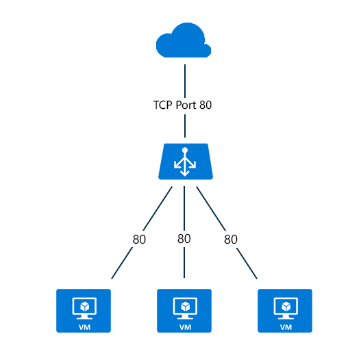

<properties
   pageTitle="Visão geral de Balanceador de carga de com a Internet | Microsoft Azure "
   description="Visão geral para Internet opostas balanceador de carga e seus recursos. Como um balanceador de carga funciona para Azure usando máquinas virtuais e os serviços de nuvem."
   services="load-balancer"
   documentationCenter="na"
   authors="sdwheeler"
   manager="carmonm"
   editor="tysonn" />
<tags
   ms.service="load-balancer"
   ms.devlang="na"
   ms.topic="article"
   ms.tgt_pltfrm="na"
   ms.workload="infrastructure-services"
   ms.date="10/24/2016"
   ms.author="sewhee" />

# Overview de Balanceador de carga oposta Internet

Balanceador de carga Azure mapeia o público endereço IP e porta número de tráfego de entrada para o particular endereço IP e porta número da máquina virtual e vice-versa para o tráfego de resposta na máquina virtual. Regras de balanceamento de carga permitem que você distribua tipos específicos de tráfego entre várias máquinas virtuais ou serviços. Por exemplo, você pode difundir a carga de tráfego de solicitação da web em vários servidores web ou funções da web.

Para um serviço de nuvem que contém as instâncias de funções da web ou funções de trabalho, você pode definir um ponto de extremidade público no arquivo de definição (.csdef) do serviço.

O arquivo _servicedefinition.csdef_ contém a configuração de ponto de extremidade e quando você tem várias instâncias de função para uma implantação de função da web ou de trabalho, o balanceador de carga será configuração para ele. A maneira de adicionar instâncias à sua implantação de nuvem está mudando a contagem de instâncias do arquivo de configuração de serviço (.csfg).

A figura a seguir mostra um ponto de extremidade de balanceamento de carga para o tráfego de web criptografada que é compartilhado entre três máquinas virtuais para a porta TCP pública e privada 443. Estas três máquinas virtuais estão em um conjunto de balanceamento de carga.

)

Figura 1 - ponto de extremidade de balanceamento para tráfego da web criptografada

Quando os clientes de Internet enviam solicitações de página da web para o endereço IP público do serviço de nuvem na porta TCP 443, o balanceador de carga do Azure distribui as solicitações entre as três máquinas virtuais do conjunto de balanceamento de carga. Para obter mais informações sobre os algoritmos de Balanceador de carga, consulte a [página de visão geral de Balanceador de carga](load-balancer-overview.md#load-balancer-features).

Por padrão, balanceador de carga do Azure distribui o tráfego de rede igualmente entre várias instâncias de máquina virtual. Você também pode configurar afinidade de sessão, para obter mais informações, consulte [modo de distribuição de Balanceador de carga](load-balancer-distribution-mode.md).

## Próximas etapas

Saiba mais sobre [balanceador de carga de interno](load-balancer-internal-overview.md) entender melhor qual balanceador de carga é a melhor opção para a sua implantação de nuvem.

Você também pode [começar a criar um opostas balanceador de carga de Internet](load-balancer-get-started-internet-arm-ps.md) e configurar o tipo de [modo de distribuição](load-balancer-distribution-mode.md) para um comportamento de tráfego de rede de Balanceador de carga específico.

Se seu aplicativo precisar manter conexões ativa para servidores atrás de um balanceador de carga, você pode compreender mais sobre [as configurações de tempo limite ociosas TCP para um balanceador de carga](load-balancer-tcp-idle-timeout.md). Ela ajuda para saber mais sobre o comportamento de conexão ocioso quando você estiver usando o balanceador de carga do Azure.
