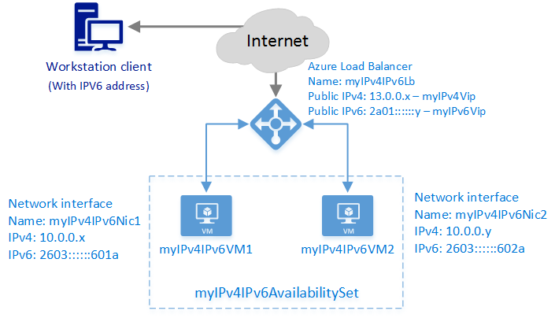

<properties
    pageTitle="Criar uma Internet opostas balanceador de carga com o IPv6 no Azure Gerenciador de recursos utilizando a CLI Azure | Microsoft Azure"
    description="Aprenda a criar uma Internet opostas balanceador de carga com o IPv6 no Azure Gerenciador de recursos utilizando a CLI do Azure"
    services="load-balancer"
    documentationCenter="na"
    authors="sdwheeler"
    manager="carmonm"
    editor=""
    tags="azure-resource-manager"
    keywords="IPv6, balanceador de carga azure, pilha dupla, ip público, ipv6 nativo, mobile, iot"
/>
<tags
    ms.service="load-balancer"
    ms.devlang="na"
    ms.topic="article"
    ms.tgt_pltfrm="na"
    ms.workload="infrastructure-services"
    ms.date="09/14/2016"
    ms.author="sewhee"
/>

# <a name="create-an-internet-facing-load-balancer-with-ipv6-in-azure-resource-manager-using-the-azure-cli"></a>Criar uma Internet opostas balanceador de carga com o IPv6 no Azure Gerenciador de recursos utilizando a CLI do Azure

> [AZURE.SELECTOR]
- [PowerShell](./load-balancer-ipv6-internet-ps.md)
- [CLI Azure](./load-balancer-ipv6-internet-cli.md)
- [Modelo](./load-balancer-ipv6-internet-template.md)

Um balanceador de carga Azure é um balanceador de carga de camada-4 (TCP, UDP). O balanceador de carga fornece alta disponibilidade distribuindo o tráfego de entrada entre instâncias de serviço eficaz, nos serviços de nuvem ou máquinas virtuais em um conjunto de Balanceador de carga. Azure balanceador de carga também pode apresentar esses serviços em várias portas, vários endereços IP ou ambos.

## <a name="example-deployment-scenario"></a>Cenário de implantação de exemplo

O diagrama a seguir ilustra a solução de balanceamento de carga implantadas usando o modelo de exemplo descrito neste artigo.



Neste cenário, você criará os seguintes recursos Azure:

- duas máquinas virtuais (VMs)
- uma interface de rede virtual para cada máquina virtual com endereços IPv4 e IPv6 atribuídos
- um balanceador de carga voltado para a Internet com um IPv4 e um endereço IP público IPv6
- um conjunto de disponibilidade para que contém as duas VMs
- dois carregar balanceamento regras para mapear os VIPs públicos para os pontos de extremidade particulares

## <a name="deploying-the-solution-using-the-azure-cli"></a>Implantação da solução usando a CLI do Azure

As etapas a seguir mostram como criar uma Internet opostas balanceador de carga usando o Gerenciador de recursos do Azure com CLI. Com o Gerenciador de recursos do Azure, cada recurso é criado configurado individualmente e, em seguida, coloque juntos para criar um recurso.

Para implantar um balanceador de carga, crie e configure os seguintes objetos:

- Configuração de IP front-end - contém os endereços IP públicos tráfego de rede.
- Pool de endereços de back-end - contém interfaces de rede (NICs) para as máquinas virtuais receber o tráfego de rede de Balanceador de carga.
- Regras de balanceamento de carga - contém regras mapeando uma porta pública no balanceador de carga para porta no pool de endereços de back-end.
- Regras NAT de entrada - contém regras mapeando uma porta pública no balanceador de carga para uma porta para uma máquina virtual específica no pool de endereços de back-end.
- Testes - contém testes de integridade usadas para verificar a disponibilidade de instâncias de máquinas virtuais no pool de endereços de back-end.

Para obter mais informações, consulte [Gerenciador de recursos do Azure suporte do balanceador de carga](load-balancer-arm.md).

## <a name="set-up-your-cli-environment-to-use-azure-resource-manager"></a>Configurar seu ambiente CLI para usar o Gerenciador de recursos do Azure

Neste exemplo, estamos executando as ferramentas CLI em uma janela de comando do PowerShell. Não estamos usando os cmdlets do PowerShell do Azure, mas podemos usar recursos de script do PowerShell para melhorar a legibilidade e reutilização.

1. Se você nunca usou CLI do Azure, consulte [instalar e configurar o CLI do Azure](../../articles/xplat-cli-install.md) e siga as instruções para cima até o ponto onde você selecionar sua conta do Azure e assinatura.

2. Execute o comando **modo config azure** para alternar para modo de Gerenciador de recursos.

        azure config mode arm

    Saída esperada:

        info:    New mode is arm

3. Entre no Azure e obter uma lista de assinaturas.

        azure login

    Insira suas credenciais Azure quando solicitado.

        azure account list

    Escolha a assinatura que você deseja usar. Anote a Id de inscrição para a próxima etapa.

4. Configure variáveis do PowerShell para uso com os comandos.

        ```
        $subscriptionid = "########-####-####-####-############"  # enter subscription id
        $location = "southcentralus"
        $rgName = "pscontosorg1southctrlus09152016"
        $vnetName = "contosoIPv4Vnet"
        $vnetPrefix = "10.0.0.0/16"
        $subnet1Name = "clicontosoIPv4Subnet1"
        $subnet1Prefix = "10.0.0.0/24"
        $subnet2Name = "clicontosoIPv4Subnet2"
        $subnet2Prefix = "10.0.1.0/24"
        $dnsLabel = "contoso09152016"
        $lbName = "myIPv4IPv6Lb"
        ```

## <a name="create-a-resource-group-a-load-balancer-a-virtual-network-and-subnets"></a>Criar um grupo de recursos, um balanceador de carga, uma rede virtual e sub-redes

1. Criar um grupo de recursos

        azure group create $rgName $location

2. Criar um balanceador de carga

        $lb = azure network lb create --resource-group $rgname --location $location --name $lbName

3. Crie uma rede virtual (VNet).

        $vnet = azure network vnet create  --resource-group $rgname --name $vnetName --location $location --address-prefixes $vnetPrefix

    Crie duas sub-redes neste VNet.

        $subnet1 = azure network vnet subnet create --resource-group $rgname --name $subnet1Name --address-prefix $subnet1Prefix --vnet-name $vnetName
        $subnet2 = azure network vnet subnet create --resource-group $rgname --name $subnet2Name --address-prefix $subnet2Prefix --vnet-name $vnetName

## <a name="create-public-ip-addresses-for-the-front-end-pool"></a>Criar endereços IP públicos para o pool de front-end

1. Configurar as variáveis do PowerShell

        $publicIpv4Name = "myIPv4Vip"
        $publicIpv6Name = "myIPv6Vip"

2. Crie um endereço IP público pool de front-end IP.

        $publicipV4 = azure network public-ip create --resource-group $rgname --name $publicIpv4Name --location $location --ip-version IPv4 --allocation-method Dynamic --domain-name-label $dnsLabel
        $publicipV6 = azure network public-ip create --resource-group $rgname --name $publicIpv6Name --location $location --ip-version IPv6 --allocation-method Dynamic --domain-name-label $dnsLabel

    >[AZURE.IMPORTANT]O balanceador de carga usa o rótulo de domínio do público IP como seu FQDN. Isso uma alteração de implantação clássica, que usa o serviço de nuvem nomeie como o balanceador de carga FQDN.
    >Neste exemplo, o FQDN é *contoso09152016.southcentralus.cloudapp.azure.com*.

## <a name="create-front-end-and-back-end-pools"></a>Criar pools de front-end e back-end

Este exemplo cria o pool de IP front-end que recebe o tráfego de rede de entrada no balanceador de carga e o pool IP de back-end onde o pool de front-end envia o tráfego de rede de balanceamento de carga.

1. Configurar as variáveis do PowerShell

        $frontendV4Name = "FrontendVipIPv4"
        $frontendV6Name = "FrontendVipIPv6"
        $backendAddressPoolV4Name = "BackendPoolIPv4"
        $backendAddressPoolV6Name = "BackendPoolIPv6"

2. Crie um pool IP front-end associando o IP público criado na etapa anterior e balanceador de carga.

        $frontendV4 = azure network lb frontend-ip create --resource-group $rgname --name $frontendV4Name --public-ip-name $publicIpv4Name --lb-name $lbName
        $frontendV6 = azure network lb frontend-ip create --resource-group $rgname --name $frontendV6Name --public-ip-name $publicIpv6Name --lb-name $lbName
        $backendAddressPoolV4 = azure network lb address-pool create --resource-group $rgname --name $backendAddressPoolV4Name --lb-name $lbName
        $backendAddressPoolV6 = azure network lb address-pool create --resource-group $rgname --name $backendAddressPoolV6Name --lb-name $lbName

## <a name="create-the-probe-nat-rules-and-lb-rules"></a>Criar o teste, regras NAT e LB regras

Este exemplo cria os seguintes itens:

- uma regra de teste para verificar se há conectividade com a porta TCP 80
- uma regra NAT para traduzir todo o tráfego de entrada na porta 3389 à porta 3389 para RDP<sup>1</sup>
- uma regra NAT para traduzir todo o tráfego de entrada na porta 3391 a porta 3389 para RDP<sup>1</sup>
- uma regra de Balanceador de carga para saldo todo o tráfego de entrada na porta 80 à porta 80 nos endereços do pool de back-end.

<sup>1</sup> regras NAT são associadas a uma instância de máquina virtual específica atrás balanceador de carga. O tráfego de rede que chegam na porta 3389 é enviado para a máquina virtual específica e porta associada a regra NAT. Você deve especificar um protocolo (UDP ou TCP) para uma regra NAT. Ambos os protocolos não podem ser atribuídos para a mesma porta.

1. Configurar as variáveis do PowerShell

        $probeV4V6Name = "ProbeForIPv4AndIPv6"
        $natRule1V4Name = "NatRule-For-Rdp-VM1"
        $natRule2V4Name = "NatRule-For-Rdp-VM2"
        $lbRule1V4Name = "LBRuleForIPv4-Port80"
        $lbRule1V6Name = "LBRuleForIPv6-Port80"

2. Criar o teste

    O exemplo a seguir cria um teste TCP que verifica para conectividade com a porta TCP 80 back-end a cada 15 segundos. Ele irá marcar o recurso de back-end não está disponível após duas falhas consecutivas.

        $probeV4V6 = azure network lb probe create --resource-group $rgname --name $probeV4V6Name --protocol tcp --port 80 --interval 15 --count 2 --lb-name $lbName

3. Criar regras de NAT de entrada que permitem conexões RDP para os recursos de back-end

        $inboundNatRuleRdp1 = azure network lb inbound-nat-rule create --resource-group $rgname --name $natRule1V4Name --frontend-ip-name $frontendV4Name --protocol Tcp --frontend-port 3389 --backend-port 3389 --lb-name $lbName
        $inboundNatRuleRdp2 = azure network lb inbound-nat-rule create --resource-group $rgname --name $natRule2V4Name --frontend-ip-name $frontendV4Name --protocol Tcp --frontend-port 3391 --backend-port 3389 --lb-name $lbName

4. Crie regras que enviar tráfego para portas de back-end diferentes dependendo de qual front-end recebeu a solicitação de um balanceador de carga

        $lbruleIPv4 = azure network lb rule create --resource-group $rgname --name $lbRule1V4Name --frontend-ip-name $frontendV4Name --backend-address-pool-name $backendAddressPoolV4Name --probe-name $probeV4V6Name --protocol Tcp --frontend-port 80 --backend-port 80 --lb-name $lbName
        $lbruleIPv6 = azure network lb rule create --resource-group $rgname --name $lbRule1V6Name --frontend-ip-name $frontendV6Name --backend-address-pool-name $backendAddressPoolV6Name --probe-name $probeV4V6Name --protocol Tcp --frontend-port 80 --backend-port 8080 --lb-name $lbName

5. Verifique suas configurações

        azure network lb show --resource-group $rgName --name $lbName

    Saída esperada:

        info:    Executing command network lb show
        info:    Looking up the load balancer "myIPv4IPv6Lb"
        data:    Id                              : /subscriptions/########-####-####-####-############/resourceGroups/pscontosorg1southctrlus09152016/providers/Microsoft.Network/loadBalancers/myIPv4IPv6Lb
        data:    Name                            : myIPv4IPv6Lb
        data:    Type                            : Microsoft.Network/loadBalancers
        data:    Location                        : southcentralus
        data:    Provisioning state              : Succeeded
        data:
        data:    Frontend IP configurations:
        data:    Name             Provisioning state  Private IP allocation  Private IP   Subnet  Public IP
        data:    ---------------  ------------------  ---------------------  -----------  ------  ---------
        data:    FrontendVipIPv4  Succeeded           Dynamic                                     myIPv4Vip
        data:    FrontendVipIPv6  Succeeded           Dynamic                                     myIPv6Vip
        data:
        data:    Probes:
        data:    Name                 Provisioning state  Protocol  Port  Path  Interval  Count
        data:    -------------------  ------------------  --------  ----  ----  --------  -----
        data:    ProbeForIPv4AndIPv6  Succeeded           Tcp       80          15        2
        data:
        data:    Backend Address Pools:
        data:    Name             Provisioning state
        data:    ---------------  ------------------
        data:    BackendPoolIPv4  Succeeded
        data:    BackendPoolIPv6  Succeeded
        data:
        data:    Load Balancing Rules:
        data:    Name                  Provisioning state  Load distribution  Protocol  Frontend port  Backend port  Enable floating IP  Idle timeout in minutes
        data:    --------------------  ------------------  -----------------  --------  -------------  ------------  ------------------  -----------------------
        data:    LBRuleForIPv4-Port80  Succeeded           Default            Tcp       80             80            false               4
        data:    LBRuleForIPv6-Port80  Succeeded           Default            Tcp       80             8080          false               4
        data:
        data:    Inbound NAT Rules:
        data:    Name                 Provisioning state  Protocol  Frontend port  Backend port  Enable floating IP  Idle timeout in minutes
        data:    -------------------  ------------------  --------  -------------  ------------  ------------------  -----------------------
        data:    NatRule-For-Rdp-VM1  Succeeded           Tcp       3389           3389          false               4
        data:    NatRule-For-Rdp-VM2  Succeeded           Tcp       3391           3389          false               4
        info:    network lb show


## <a name="create-nics"></a>Criar NICs

Crie NICs e associá-los NAT regras, regras de Balanceador de carga e testes.

1. Configurar as variáveis do PowerShell

        $nic1Name = "myIPv4IPv6Nic1"
        $nic2Name = "myIPv4IPv6Nic2"
        $subnet1Id = "/subscriptions/$subscriptionid/resourceGroups/$rgName/providers/Microsoft.Network/VirtualNetworks/$vnetName/subnets/$subnet1Name"
        $subnet2Id = "/subscriptions/$subscriptionid/resourceGroups/$rgName/providers/Microsoft.Network/VirtualNetworks/$vnetName/subnets/$subnet2Name"
        $backendAddressPoolV4Id = "/subscriptions/$subscriptionid/resourceGroups/$rgname/providers/Microsoft.Network/loadbalancers/$lbName/backendAddressPools/$backendAddressPoolV4Name"
        $backendAddressPoolV6Id = "/subscriptions/$subscriptionid/resourceGroups/$rgname/providers/Microsoft.Network/loadbalancers/$lbName/backendAddressPools/$backendAddressPoolV6Name"
        $natRule1V4Id = "/subscriptions/$subscriptionid/resourceGroups/$rgname/providers/Microsoft.Network/loadbalancers/$lbName/inboundNatRules/$natRule1V4Name"
        $natRule2V4Id = "/subscriptions/$subscriptionid/resourceGroups/$rgname/providers/Microsoft.Network/loadbalancers/$lbName/inboundNatRules/$natRule2V4Name"

2. Crie uma NIC para cada back-end e adicione uma configuração IPv6.

        $nic1 = azure network nic create --name $nic1Name --resource-group $rgname --location $location --private-ip-version "IPv4" --subnet-id $subnet1Id --lb-address-pool-ids $backendAddressPoolV4Id --lb-inbound-nat-rule-ids $natRule1V4Id
        $nic1IPv6 = azure network nic ip-config create --resource-group $rgname --name "IPv6IPConfig" --private-ip-version "IPv6" --lb-address-pool-ids $backendAddressPoolV6Id --nic-name $nic1Name

        $nic2 = azure network nic create --name $nic2Name --resource-group $rgname --location $location --subnet-id $subnet1Id --lb-address-pool-ids $backendAddressPoolV4Id --lb-inbound-nat-rule-ids $natRule1V4Id
        $nic2IPv6 = azure network nic ip-config create --resource-group $rgname --name "IPv6IPConfig" --private-ip-version "IPv6" --lb-address-pool-ids $backendAddressPoolV6Id --nic-name $nic2Name

## <a name="create-the-back-end-vm-resources-and-attach-each-nic"></a>Criar os recursos de máquina virtual de back-end e anexar cada NIC

Para criar VMs, você deve ter uma conta de armazenamento. Balanceamento de carga, VMs devem ser membros de um conjunto de disponibilidade. Para obter mais informações sobre a criação de VMs, consulte [criar uma máquina virtual do Azure usando o PowerShell](../virtual-machines/virtual-machines-windows-ps-create.md)

1. Configurar as variáveis do PowerShell

        $storageAccountName = "ps08092016v6sa0"
        $availabilitySetName = "myIPv4IPv6AvailabilitySet"
        $vm1Name = "myIPv4IPv6VM1"
        $vm2Name = "myIPv4IPv6VM2"
        $nic1Id = "/subscriptions/$subscriptionid/resourceGroups/$rgname/providers/Microsoft.Network/networkInterfaces/$nic1Name"
        $nic2Id = "/subscriptions/$subscriptionid/resourceGroups/$rgname/providers/Microsoft.Network/networkInterfaces/$nic2Name"
        $disk1Name = "WindowsVMosDisk1"
        $disk2Name = "WindowsVMosDisk2"
        $osDisk1Uri = "https://$storageAccountName.blob.core.windows.net/vhds/$disk1Name.vhd"
        $osDisk2Uri = "https://$storageAccountName.blob.core.windows.net/vhds/$disk2Name.vhd"
        $imageurn "MicrosoftWindowsServer:WindowsServer:2012-R2-Datacenter:latest"
        $vmUserName = "vmUser"
        $mySecurePassword = "PlainTextPassword*1"

    >[AZURE.WARNING] Este exemplo usa o nome de usuário e a senha para as VMs em texto não criptografado. Apropriado deve ter cuidado ao usar credenciais em Limpar. Para um método mais seguro de lidar com as credenciais do PowerShell, consulte o cmdlet [Get-Credential](https://technet.microsoft.com/library/hh849815.aspx) .

2. Criar o conjunto de conta e disponibilidade de armazenamento

    Você pode usar uma conta existente do armazenamento ao criar VMs. O comando a seguir cria uma nova conta de armazenamento.

        $storageAcc = azure storage account create $storageAccountName --resource-group $rgName --location $location --sku-name "LRS" --kind "Storage"

    Em seguida, crie o conjunto de disponibilidade.

        $availabilitySet = azure availset create --name $availabilitySetName --resource-group $rgName --location $location

3. Criar máquinas virtuais com as NICs associadas

        $vm1 = azure vm create --resource-group $rgname --location $location --availset-name $availabilitySetName --name $vm1Name --nic-id $nic1Id --os-disk-vhd $osDisk1Uri --os-type "Windows" --admin-username $vmUserName --admin-password $mySecurePassword --vm-size "Standard_A1" --image-urn $imageurn --storage-account-name $storageAccountName --disable-bginfo-extension

        $vm2 = azure vm create --resource-group $rgname --location $location --availset-name $availabilitySetName --name $vm2Name --nic-id $nic2Id --os-disk-vhd $osDisk2Uri --os-type "Windows" --admin-username $vmUserName --admin-password $mySecurePassword --vm-size "Standard_A1" --image-urn $imageurn  --storage-account-name $storageAccountName --disable-bginfo-extension

## <a name="next-steps"></a>Próximas etapas

[Começar a configurar um balanceador de carga interno](load-balancer-get-started-ilb-arm-cli.md)

[Configurar um modo de distribuição de Balanceador de carga](load-balancer-distribution-mode.md)

[Definir configurações de tempo limite TCP ociosas para seu balanceador de carga](load-balancer-tcp-idle-timeout.md)
