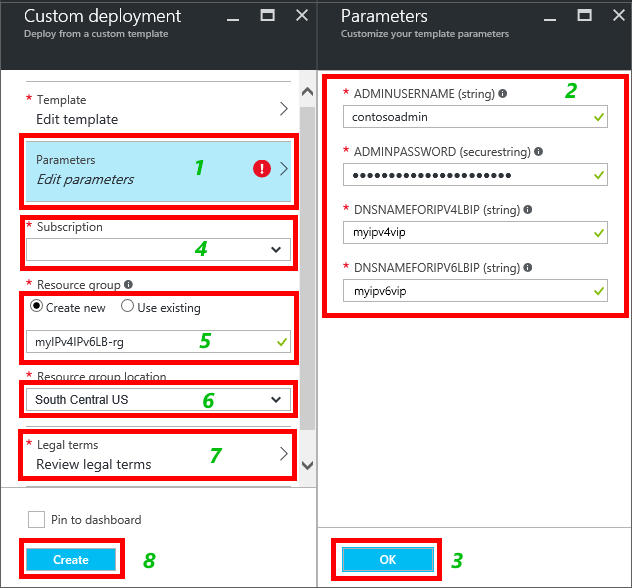
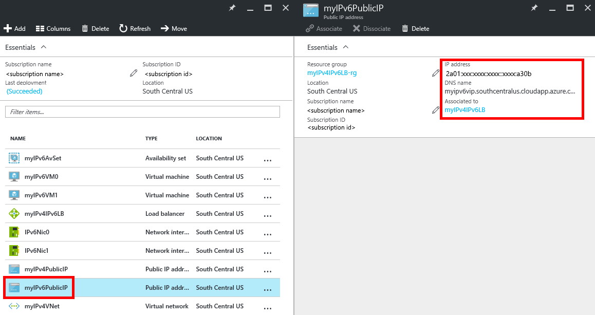

<properties
    pageTitle="Implantar uma voltado para a Internet balanceamento de carga solução com o IPv6 usando um modelo | Microsoft Azure"
    description="Como implantar o suporte a IPv6 balanceador de carga do Azure e VMs balanceamento de carga."
    services="load-balancer"
    documentationCenter="na"
    authors="sdwheeler"
    manager="carmonm"
    editor=""
    tags="azure-resource-manager"
    keywords="IPv6, balanceador de carga azure, pilha dupla, ip público, ipv6 nativo, mobile, iot"
/>
<tags
    ms.service="load-balancer"
    ms.devlang="na"
    ms.topic="article"
    ms.tgt_pltfrm="na"
    ms.workload="infrastructure-services"
    ms.date="09/14/2016"
    ms.author="sewhee"
/>

# Implantar uma solução de Balanceador de carga voltado para a Internet com o IPv6 usando um modelo

> [AZURE.SELECTOR]
- [PowerShell](./load-balancer-ipv6-internet-ps.md)
- [CLI Azure](./load-balancer-ipv6-internet-cli.md)
- [Modelo](./load-balancer-ipv6-internet-template.md)

Um balanceador de carga Azure é um balanceador de carga de camada-4 (TCP, UDP). O balanceador de carga fornece alta disponibilidade distribuindo o tráfego de entrada entre instâncias de serviço eficaz, nos serviços de nuvem ou máquinas virtuais em um conjunto de Balanceador de carga. Azure balanceador de carga também pode apresentar esses serviços em várias portas, vários endereços IP ou ambos.

## Cenário de implantação de exemplo

O diagrama a seguir ilustra a solução de balanceamento de carga implantadas usando o modelo de exemplo descrito neste artigo.

Neste cenário, você criará os seguintes recursos Azure:

- uma interface de rede virtual para cada máquina virtual com endereços IPv4 e IPv6 atribuídos
- um balanceador de carga voltado para a Internet com um IPv4 e um endereço IP público IPv6
- dois carregar balanceamento regras para mapear os VIPs públicos para os pontos de extremidade particulares
- um conjunto de disponibilidade que contém as duas VMs
- duas máquinas virtuais (VMs)

## Implantando o modelo usando o portal do Azure

Este artigo faz referência a um modelo que é publicado na Galeria de [Modelos de início rápido do Azure](https://azure.microsoft.com/documentation/templates/201-load-balancer-ipv6-create/) . Você pode baixar o modelo na galeria ou iniciar a implantação no Azure diretamente da Galeria. Este artigo pressupõe que você baixou o modelo para seu computador local.

1. Abra o portal do Azure e entrar com uma conta que tenha permissões para criar VMs e recursos de rede dentro de uma assinatura do Azure. Além disso, a menos que você estiver usando recursos existentes, a conta precisa permissão para criar um grupo de recursos e uma conta de armazenamento.

2. Clique em "+ novo" do menu tipo "modelo" na caixa de pesquisa. Selecione "Implantação de modelo" nos resultados da pesquisa.

    

3. Em tudo blade, clique em "Implantação de modelo".

    

4. Clique em "Criar".

    

5. Clique em "Editar modelo". Excluir o conteúdo existente e copiar/colar em todo o conteúdo do arquivo de modelo (para incluir iniciar e encerrar {}), em seguida, clique em "Salvar".

    > [AZURE.NOTE] Se você estiver usando o Microsoft Internet Explorer, quando você cola você recebe uma caixa de diálogo pedindo para permitir o acesso para a área de transferência do Windows. Clique em "Permitir acesso".

    

6. Clique em "Editar parâmetros". Na lâmina parâmetros, especifique os valores pela orientação na seção de parâmetros de modelo, clique em "Salvar" para fechar a lâmina de parâmetros. Na lâmina implantação personalizada, selecione sua assinatura, um grupo de recursos existente ou criar uma. Se você estiver criando um grupo de recursos, selecione um local para o grupo de recursos. Em seguida, clique em **termos legais**, clique em **comprar** para os termos legais. Azure começa implantando os recursos. Ele leva vários minutos para implantar todos os recursos.

    

    Para obter mais informações sobre esses parâmetros, consulte a seção de [variáveis e parâmetros de modelo](#template-parameters-and-variables) neste artigo.

7. Para ver os recursos criados pelo modelo, clique em Procurar, role a lista para baixo até ver "Grupos de recursos", então clique nele.

    

8. Sobre a lâmina de grupos de recursos, clique no nome do grupo de recursos especificada na etapa 6. Você vê uma lista de todos os recursos que foram implantadas. Se tudo tiver ocorrido bem, ela deverá dizer "Êxito" em "Última implantação." Caso contrário, certifique-se de que a conta que você está usando tem permissões para criar os recursos necessários.

    

    > [AZURE.NOTE] Se você procurar seus grupos de recursos imediatamente após concluir a etapa 6, "Última implantação" exibirá o status de "Implantando" enquanto os recursos estão sendo implantados.

9. Clique em "myIPv6PublicIP" na lista de recursos. Você verá que ela tem um endereço IPv6 em endereço IP e seu nome DNS é o valor especificado para o parâmetro dnsNameforIPv6LbIP na etapa 6. Este recurso é o público IPv6 endereço e nome do host acessível para clientes da Internet.

    

## Validar a conectividade

Quando o modelo foi implantado com êxito, você pode validar conectividade realizando as seguintes tarefas:

1. Entre no portal do Azure e conecte a cada uma das VMs criadas pela implantação do modelo. Se você implantou uma VM de servidor Windows, execute ipconfig/tudo a partir de um prompt de comando. Você verá que as VMs tenham endereços IPv4 e IPv6. Se você implantou Linux VMs, você precisa configurar o SO Linux para receber endereços IPv6 dinâmicos usando as instruções fornecidas para a sua distribuição Linux.
2. Em um cliente conectado à Internet IPv6, inicie uma conexão para o endereço IPv6 público de Balanceador de carga. Para confirmar que o balanceador de carga é balanceamento entre as duas VMs, você pode instalar um servidor web como os serviços de informações da Internet (IIS) da Microsoft em cada uma das VMs. A página da web padrão em cada servidor pode conter o texto "Server0" ou "Server1" para identificá-lo exclusivamente. Em seguida, abra um navegador da Internet em um cliente conectado à Internet IPv6 e navegue até o nome do host que você especificou para o parâmetro dnsNameforIPv6LbIP de Balanceador de carga para confirmar a conectividade IPv6 de ponta a ponta para cada máquina virtual. Se você vir somente a página da web de apenas um servidor, talvez você precise limpe o cache do navegador. Abra várias sessões de navegação particulares. Você deve ver uma resposta de cada servidor.
3. Em um cliente conectado à Internet IPv4, inicie uma conexão no endereço IPv4 público de Balanceador de carga. Para confirmar que o balanceador de carga é duas VMs de balanceamento de carga, você pode testar usando o IIS, conforme detalhado na etapa 2.
4. De cada máquina virtual, inicie uma conexão de saída para um dispositivo de Internet conectados IPv4 ou IPv6. Em ambos os casos, o IP de origem visto por dispositivo de destino é o endereço público de IPv4 ou IPv6 de Balanceador de carga.

>[AZURE.NOTE]
ICMP para IPv4 e IPv6 está bloqueado na rede do Azure. Como resultado, as ferramentas de ICMP como ping sempre falharem. Para testar a conectividade, use uma alternativa TCP como TCPing ou o cmdlet do PowerShell teste-NetConnection. Observe que os endereços IP mostrados no diagrama são exemplos de valores que você pode ver. Como os endereços IPv6 são atribuídos dinamicamente, os endereços que você receber serão diferentes e podem variar por região. Além disso, é comum para o endereço IPv6 público no balanceador de carga para iniciar com um prefixo diferente que os endereços IPv6 particulares do pool de back-end.

## Variáveis e parâmetros de modelo

Um modelo do Gerenciador de recursos do Azure contém várias variáveis e parâmetros que você pode personalizar às suas necessidades. Variáveis são usadas para valores fixos que você não deseja que um usuário altere. Parâmetros são usados para os valores que você deseja que um usuário para fornecer ao implantar o modelo. O modelo de exemplo está configurado para o cenário descrito neste artigo. Você pode personalizá-la às necessidades de seu ambiente.

O modelo de exemplo usado neste artigo inclui as variáveis e parâmetros a seguir:

| Parâmetro / variável | Anotações |
|-----------|-------|
| adminUsername | Especifique o nome da conta de administrador usada para entrar em máquinas virtuais com. |
| adminPassword | Especifica a senha da conta de administrador usada para entrar em máquinas virtuais com. |
| dnsNameforIPv4LbIP | Especifique o nome de host DNS que você deseja atribuir como o nome público do balanceador de carga. Esse nome resolve para endereço público de IPv4 do balanceador de carga. O nome deve ser em letras minúsculas e corresponda ao regex: ^ [a-z][a-z0-9-]{1,61}[a-z0-9]$. |
| dnsNameforIPv6LbIP | Especifique o nome de host DNS que você deseja atribuir como o nome público do balanceador de carga. Esse nome resolve para endereço público de IPv6 do balanceador de carga. O nome deve ser em letras minúsculas e corresponda ao regex: ^ [a-z][a-z0-9-]{1,61}[a-z0-9]$. Isso pode ser o mesmo nome que o endereço IPv4. Quando um cliente envia uma consulta DNS para esse nome Azure retornará um tanto o AAAA registros quando o nome é compartilhado. |
| vmNamePrefix | Especifique o prefixo de nome de máquina virtual. O modelo acrescenta um número (0, 1, etc.) para o nome quando as VMs são criadas. |
| nicNamePrefix | Especifique o prefixo de nome de interface de rede. O modelo acrescenta um número (0, 1, etc.) para o nome quando as interfaces de rede são criadas. |
| storageAccountName | Insira o nome de uma conta de armazenamento existente ou especificar o nome de um novo a ser criado pelo modelo. |
| availabilitySetName | Em seguida, digite nome da disponibilidade definida para ser usado com VMs |
| addressPrefix | O prefixo de endereço usado para definir o intervalo de endereços da rede Virtual |
| subnetName | O nome da sub-rede no criadas para o VNet |
| subnetPrefix | O prefixo de endereço usado para definir o intervalo de endereços da sub-rede |
| vnetName | Especifique o nome para o VNet usado pelas VMs. |
| ipv4PrivateIPAddressType | O método de alocação usado para o endereço IP privado (estática ou dinâmica) |
| ipv6PrivateIPAddressType | O método de alocação usado para o endereço IP privado (dinâmico). IPv6 só oferece suporte a alocação dinâmica. |
| numberOfInstances | O número de instâncias de balanceamento de carga implantados pelo modelo |
| ipv4PublicIPAddressName | Especifique o nome DNS que você deseja usar para se comunicar com o endereço IPv4 público de Balanceador de carga. |
| ipv4PublicIPAddressType | O método de alocação usado para o endereço IP público (estática ou dinâmica) |
| Ipv6PublicIPAddressName | Especifique o nome DNS que você deseja usar para se comunicar com o endereço de IPv6 público de Balanceador de carga. |
| ipv6PublicIPAddressType | O método de alocação usado para o endereço IP público (dinâmico). IPv6 só oferece suporte a alocação dinâmica. |
| lbName | Especifique o nome do balanceador de carga. Esse nome é exibido no portal ou usado para se referir a ela com um comando CLI ou PowerShell. |

As variáveis restantes no modelo contêm valores derivados atribuídos quando Azure cria os recursos. Não altere essas variáveis.
