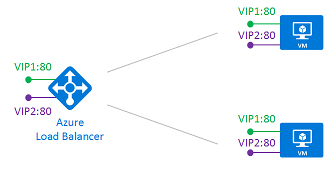

<properties
   pageTitle="Balanceador de carga de vários VIPs Azure | Microsoft Azure"
   description="Visão geral dos VIPs múltiplos na balanceador de carga Azure"
   services="load-balancer"
   documentationCenter="na"
   authors="chkuhtz"
   manager="narayan"
   editor=""
/>
<tags
   ms.service="load-balancer"
   ms.devlang="na"
   ms.topic="article"
   ms.tgt_pltfrm="na"
   ms.workload="infrastructure-services"
   ms.date="08/11/2016"
   ms.author="chkuhtz"
/>

# Balanceador de carga de vários VIPs do Azure

Azure balanceador de carga permite que você carregue serviços de saldo em várias portas, vários endereços IP ou ambos. Você pode usar definições de Balanceador de carga públicas e interno para carregar fluxos de saldo em um conjunto de VMs.

Este artigo descreve os conceitos básicos desta capacidade, conceitos importantes e restrições. Se você pretende expor serviços em um endereço IP, você pode encontrar instruções simplificadas para o [público](load-balancer-get-started-internet-portal.md) ou [interno](load-balancer-get-started-ilb-arm-portal.md) carregar balanceador configurações. Adicionar vários VIPs é incremental para uma única configuração VIP. Usando os conceitos neste artigo, você pode expandir uma configuração simplificada a qualquer momento.

Quando você define um balanceador de carga do Azure, front-end e uma configuração de back-end estão conectados com regras. O teste de integridade referenciado pela regra é usado para determinar como novos fluxos são enviadas para um nó do pool de back-end. O frontend é definida por um IP Virtual (VIP), que é uma 3-tupla composta por um endereço IP (público ou interno), um protocolo de transporte (UDP ou TCP) e um número de porta. Um DIP é um endereço IP em uma NIC virtual Azure anexada a uma máquina virtual do pool de back-end.

A tabela a seguir contém alguns exemplos de configurações de frontend:

| VIP | Endereço IP | protocolo | porta |
|-----|------------|----------|------|
|1|65.52.0.1|TCP|80|
|2|65.52.0.1|TCP|_8080_|
|3|65.52.0.1|_UDP_|80|
|4|_65.52.0.2_|TCP|80|

A tabela mostra quatro frontends diferentes. Frontends #1, 2 # e #3 são um único VIP com várias regras. O mesmo endereço IP é usado, mas a porta ou protocolo é diferente para cada frontend. Frontends #1 e #4 são um exemplo de VIPs múltiplos, onde o mesmo frontend protocolo e porta são reutilizadas em VIPs múltiplos.

Azure balanceador de carga fornece flexibilidade na definição de regras de balanceamento de carga. Uma regra declara como um endereço e porta a frontend é mapeado para o endereço de destino e porta no back-end. Ou não portas de back-end são reutilizadas em regras dependem do tipo de regra. Cada tipo de regra tem requisitos específicos que podem afetar o design de configuração e teste de host. Há dois tipos de regras:

1. A regra padrão com nenhuma reutilização de porta de back-end
2. A regra de IP flutuantes onde portas de back-end são reutilizadas

Azure balanceador de carga permite combinar os dois tipos de regra na mesma configuração de Balanceador de carga. O balanceador de carga pode usá-los simultaneamente para uma determinada VM ou qualquer combinação, desde que você cumprir as restrições da regra. Que tipo de regra que você escolher depende dos requisitos do seu aplicativo e a complexidade da configuração de suporte. Você deve avaliar a quais tipos de regra estão melhores para seu cenário.

Exploraremos esses cenários ainda mais iniciando com o comportamento padrão.

## Regra de tipo #1: nenhuma reutilização de porta de back-end

Neste cenário, VIPs frontend são configurados da seguinte maneira:

| VIP | Endereço IP | protocolo | porta |
|-----|------------|----------|------|
| 1|65.52.0.1|TCP|80|
| 2|*65.52.0.2*|TCP|80|

O DIP é o destino do fluxo de entrada. No pool de back-end, cada máquina virtual expõe o serviço desejado em uma porta exclusivo em um DIP. Esse serviço está associado a frontend por meio de uma definição de regra.

Definimos duas regras:

| Regra | Frontend de mapa | Ao pool de back-end |
|------|--------------|-----------------|
| 1 |  VIP1:80 |  DIP1:80,  DIP2:80 |
| 2 |  VIP2:80 |  DIP1:81,  DIP2:81 |

O mapeamento concluído no balanceador de carga do Azure agora é da seguinte maneira:

| Regra | Endereço IP de VIP | protocolo | porta | Destino | porta |
|------|----------------|----------|------|-----|------|
| 1|65.52.0.1|TCP|80|Endereço IP DIP|80|
| 2|65.52.0.2|TCP|80|Endereço IP DIP|81|

Cada regra deve produzir um fluxo com uma combinação exclusiva de endereço IP de destino e porta de destino. Variando a porta de destino do fluxo, várias regras podem proporcionar fluxos para a mesma DIP em portas diferentes.

Testes de integridade sempre são direcionados para o DIP de uma máquina virtual. Você deve garantir que seu teste reflete a integridade da máquina virtual.

## Regra de tipo #2: reutilização de porta de back-end usando IP flutuantes

Azure balanceador de carga fornece flexibilidade para reutilizar a porta frontend em VIPs múltiplos, independentemente do tipo de regra usada. Além disso, alguns cenários de aplicativo preferem ou exigem a mesma porta para ser usado em várias instâncias do aplicativo em uma única VM no pool de back-end. Exemplos comuns de reutilização de porta incluir clusters para alta disponibilidade, dispositivos virtuais e expor vários pontos de extremidade TLS sem nova criptografia de rede.

Se você quiser reutilizar a porta de back-end em várias regras, você deve habilitar IP flutuante na definição da regra.

Flutuantes IP é uma parte do que é conhecido como direto servidor retornar (DSR). DSR consiste em duas partes: uma topologia de fluxo e um endereço IP esquema de mapeamento. Em um nível de plataforma, balanceador de carga do Azure sempre opera em uma topologia de fluxo DSR independentemente se flutuante IP está habilitada ou não. Isso significa que a saída parte de um fluxo é sempre corretamente reescrita para fluxo diretamente de volta para a origem.

Com o tipo de regra padrão, o Azure expõe uma esquema de mapeamento de endereço IP para facilidade de uso de balanceamento de carga tradicional. Habilitando flutuantes IP altera o esquema de mapeamento de endereço IP para permitir flexibilidade adicional conforme explicado abaixo.

O diagrama a seguir ilustra essa configuração:

Nesse cenário, cada máquina virtual do pool de back-end tem três interfaces de rede:

* DIP: uma NIC Virtual associado com a máquina virtual (recurso NIC do Azure)
* VIP1: uma interface de loopback no sistema operacional que está configurado com o endereço IP do VIP1 convidado
* VIP2: uma interface de loopback no sistema operacional que está configurado com o endereço IP do VIP2 convidado

>[AZURE.IMPORTANT] A configuração das interfaces lógicas é executada dentro do sistema operacional de convidado. Essa configuração não é executada ou gerenciada pelo Azure. Sem essa configuração, as regras não funcionará. As definições de teste de integridade usam o DIP da máquina virtual em vez de VIP lógico. Portanto, seu serviço deve fornecer respostas de teste em uma porta DIP que refletem o status do serviço oferecido no VIP lógico.

Vamos supor que a mesma configuração de frontend como no cenário anterior:

| VIP | Endereço IP | protocolo | porta |
|-----|------------|----------|------|
| 1|65.52.0.1|TCP|80|
| 2|*65.52.0.2*|TCP|80|

Definimos duas regras:

| Regra | Frontend de mapa | Ao pool de back-end |
|------|--------------|-----------------|
| 1 |  VIP1:80 |  VIP1:80 (em VM1 e da VM2) |
| 2 |  VIP2:80 |  VIP2:80 (em VM1 e da VM2) |

A tabela a seguir mostra o mapeamento concluído no balanceador de carga:

| Regra | Endereço IP de VIP | protocolo | porta | Destino | porta |
|------|----------------|----------|------|-------------|------|
| 1|65.52.0.1|TCP|80|mesmo que VIP (65.52.0.1)|mesmo que VIP (80)|
| 2|65.52.0.2|TCP|80|mesmo que VIP (65.52.0.2)|mesmo que VIP (80)|

O destino do fluxo de entrada é o endereço de VIP na interface autoretorno na máquina virtual. Cada regra deve produzir um fluxo com uma combinação exclusiva de endereço IP de destino e porta de destino. Variando o endereço IP de destino do fluxo, reutilização de porta é possível na mesma VM. Seu serviço é exposto ao balanceador de carga vinculando-o para o endereço IP e porta da interface de loopback respectivos do VIP.

Observe que este exemplo não altera a porta de destino. Embora esse é um cenário de IP flutuante, balanceador de carga do Azure também suporta definir uma regra para regravar a porta de destino de back-end e para torná-lo diferente da porta de destino frontend.

O tipo de regra de IP flutuante é a fundação de diversos padrões de configuração de Balanceador de carga. Um exemplo que está disponível no momento é a configuração de [SQL AlwaysOn com vários ouvintes](../virtual-machines/virtual-machines-windows-portal-sql-ps-alwayson-int-listener.md) . Ao longo do tempo, podemos irá documentar mais desses cenários.

## Limitações

* Só há suporte para várias configurações de VIP IaaS VMs.
* Com a regra de IP flutuante, seu aplicativo deve usar o DIP para fluxos de saída. Se seu aplicativo vincula ao endereço VIP configurado na interface autoretorno no sistema operacional convidado, então SNAT não está disponível para reconfigurar o fluxo de saída e o fluxo falha.
* Endereços IP públicos têm um efeito sobre cobrança. Para obter mais informações, consulte [preços de endereço IP](https://azure.microsoft.com/pricing/details/ip-addresses/)
* Limites de assinatura se aplicam. Para obter mais informações, consulte [limites de serviço](../azure-subscription-service-limits.md#networking-limits) para obter detalhes.
