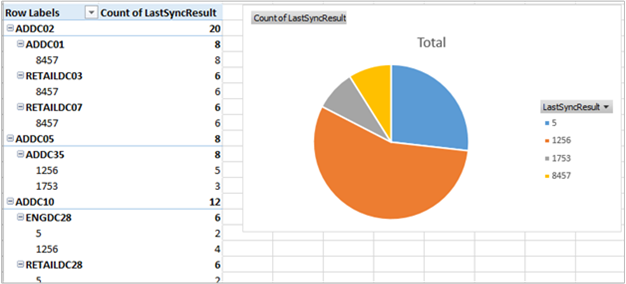

<properties
    pageTitle="Solução de Status de replicação de diretório ativo no Log Analytics | Microsoft Azure"
    description="O pacote de solução de Status de replicação do Active Directory monitora o ambiente do Active Directory para qualquer falhas de replicação e relata os resultados no painel OMS regularmente."
    services="log-analytics"
    documentationCenter=""
    authors="bandersmsft"
    manager="jwhit"
    editor=""/>

<tags
    ms.service="log-analytics"
    ms.workload="na"
    ms.tgt_pltfrm="na"
    ms.devlang="na"
    ms.topic="article"
    ms.date="10/10/2016"
    ms.author="banders"/>

# Solução de Status de replicação de diretório ativo no Log de análise

Active Directory é um componente-chave de um ambiente de TI corporativo. Para garantir alta disponibilidade e alto desempenho, cada controlador de domínio tem sua própria cópia do banco de dados do Active Directory. Controladores de domínio duplicam uns com os outros para propagar alterações em toda a empresa. Falhas neste processo de replicação podem causar uma variedade de problemas em toda a empresa.

O pacote de solução de Status de replicação do AD monitora o ambiente do Active Directory para qualquer falhas de replicação e relata os resultados no painel OMS regularmente.

## Instalando e configurando a solução
Use as informações a seguir para instalar e configurar a solução.

- Agentes devem ser instalados em controladores de domínio que são membros do domínio a ser avaliada ou em servidores de membro configurados para enviar dados de replicação do AD para OMS. Para compreender como conectar computadores Windows ao OMS, consulte [computadores com Windows conectar-se para a análise de Log](log-analytics-windows-agents.md). Se seu controlador de domínio já faz parte de um ambiente existente do System Center Operations Manager que você gostaria de se conectar ao OMS, consulte [Conectar o Operations Manager para análise de Log](log-analytics-om-agents.md).
- Adicione a solução de Status de replicação do Active Directory ao seu espaço de trabalho OMS usando o processo descrito em [soluções de adicionar a análise de Log da Galeria de soluções](log-analytics-add-solutions.md).  Não há nenhuma configuração adicional necessária.

## Detalhes de conjunto de dados de Status de replicação AD

A tabela a seguir mostra os métodos de coleta de dados e outros detalhes sobre como os dados são coletados para Status de replicação do AD.

| plataforma | Agente de direta | Agente do SCOM | Armazenamento do Azure | SCOM necessário? | Enviados via grupo de gerenciamento de dados do SCOM agente | frequência de conjunto |
|---|---|---|---|---|---|---|
|Windows|||||| cada 5 dias|

## Opcionalmente, habilite um controlador de domínio não enviar dados de AD para OMS
Se você não quiser se conectar a qualquer um dos seus controladores de domínio diretamente para OMS, você pode usar qualquer outro computador conectado OMS em seu domínio para coletar dados para o pacote de solução de Status de replicação do AD e enviar os dados.

### Para habilitar um controlador de domínio não enviar dados de AD para OMS
1.  Verifique se o computador é um membro do domínio que você deseja monitorar usando a solução de Status de replicação do AD.
2.  [Conectar o computador Windows OMS](log-analytics-windows-agents.md) ou [conectá-lo usando o seu ambiente existente do Operations Manager OMS](log-analytics-om-agents.md), se ele ainda não está conectado.
3.  No computador, defina a seguinte chave do registro:
    - Chave: **grupos de HKEY_LOCAL_MACHINE\SYSTEM\CurrentControlSet\Services\HealthService\Parameters\Management\<ManagementGroupName > \Solutions\ADReplication**
    - Valor: **IsTarge**
    - Dados de valor: **verdadeiro**

    >[AZURE.NOTE]Essas alterações serão efetivadas até reiniciar o serviço de agente de monitoramento do Microsoft (HealthService.exe).

## Noções básicas sobre erros de replicação
Depois que você tiver dados de status de replicação do AD enviados para OMS, você verá um bloco semelhante à seguinte no painel OMS indicando quantos erros de replicação que você possui no momento.  

**Erros de replicação críticos** são aqueles que estão em ou acima 75% da [desativação](https://technet.microsoft.com/library/cc784932%28v=ws.10%29.aspx) da floresta do Active Directory.

Quando você clica no bloco, você verá mais informações sobre os erros.

### Status do servidor de destino e Status do servidor de origem
Essas lâminas mostram o status de servidores de destino e os servidores de origem que estão enfrentando erros de replicação. O número após cada nome de controlador de domínio indica o número de erros de replicação nesse controlador de domínio.

Os erros para os servidores de destino e servidores de origem são mostrados como alguns problemas são mais fáceis de solucionar problemas do perspectiva do servidor de origem e de outras pessoas da perspectiva do servidor de destino.

Neste exemplo, você pode ver que muitos servidores de destino aproximadamente tem o mesmo número de erros, mas há um servidor de origem (ADDC35) que tem muitos mais erros de todos os outros. É provável que há algum problema no ADDC35 que está causando a ele falha enviar dados para parceiros de replicação. Corrigindo problemas em ADDC35 provavelmente resolverá muitos dos erros que aparecem na lâmina do servidor de destino.

### Tipos de erros de replicação
Este blade fornece informações sobre os tipos de erros detectados em toda a empresa. Cada erro tem um código numérico exclusivo e uma mensagem que pode ajudá-lo a determinar a causa do erro.

A rosca na parte superior lhe dá uma ideia de quais erros aparecem mais e menos frequência em seu ambiente.

Isso pode mostrar quando vários controladores de domínio experimentar o mesmo erro de replicação. Nesse caso, você pode ser capaz de descobrir identificar uma solução no controlador de domínio, em seguida, repeti-la em outros controladores de domínio afetados pelo mesmo erro.

### Desativação
O tempo de desativação determina quanto tempo um objeto excluído, conhecido como uma marca de exclusão, são mantidos no banco de dados do Active Directory. Quando um objeto excluído passa a desativação, um processo de coleta de lixo automaticamente remove-o banco de dados do Active Directory.

A desativação do padrão é 180 dias para versões mais recentes do Windows, mas ele foi 60 dias em versões mais antigas e podem ser alterada explicitamente por um administrador do Active Directory.

É importante saber se estiver tendo erros de replicação que estão se aproximando ou passaram a desativação. Se dois controladores de domínio tiver um erro de replicação que persiste após a desativação, replicação será desativada entre esses dois controladores de domínio, mesmo se o erro de replicação subjacente é fixo.

A lâmina desativação ajuda você a identificar lugares onde este é o risco de ocorra. Cada erro na **mais de 100% TSL** categoria representa uma partição que não foi replicado entre seu servidor de origem e destino para pelo menos o tempo de desativação da floresta.

Nessa situação, simplesmente corrigir o erro de replicação não será suficiente. No mínimo, você precisará investigar manualmente para identificar e objetos remanescentes de limpeza antes de você poderá reiniciar a replicação. Mesmo que você talvez precise encerrar um controlador de domínio.

Além de identificar os erros de replicação que têm persistentes após a desativação, você desejará também prestar atenção a quaisquer erros caiam nas categorias **TSL 50-75%** ou **TSL de 75 a 100%** .

Esses são os erros que estão claramente remanescentes, não temporárias, para que eles provavelmente precisará sua intervenção resolver. A boa notícia é que eles ainda não atingiram o tempo de desativação. Se você corrigir esses problemas imediatamente e *antes de* atingirem o tempo de desativação, replicação pode reiniciar com intervenção manual mínima.

Conforme mencionado anteriormente, o bloco de dashboard para a solução de Status de replicação do AD mostra o número de *crítico* erros de replicação em seu ambiente, que é definido como erros que são mais de 75% de desativação (incluindo erros que são mais de 100% da TSL). Esforce-se para manter esse número em 0.

>[AZURE.NOTE] Todos os cálculos de porcentagem de vida útil desativação baseiam a vida real para floresta do Active Directory, para que você pode confiar aquelas porcentagens precisas, mesmo se você tiver um valor de vida útil de desativação personalizado definido.

### Detalhes de status de replicação do AD
Quando você clica em qualquer item em uma das listas, você verá detalhes adicionais sobre ele usando a pesquisa de Log. Os resultados são filtrados para mostrar somente os erros relacionados a esse item. Por exemplo, se você clicar no primeiro controlador de domínio listado em **Status do servidor de destino (ADDC02)**, você verá os resultados de pesquisa filtrados para mostrar erros com o controlador de domínio listado como o servidor de destino:

A partir daqui, você pode filtrar ainda mais, modificar a consulta de pesquisa e assim por diante. Para obter mais informações sobre como usar a pesquisa de Log, consulte [pesquisas de Log](log-analytics-log-searches.md).

O campo **HelpLink** mostra a URL de uma página do TechNet com detalhes adicionais sobre esse erro específico. Você pode copiar e colar este link em janela do navegador para ver informações sobre solução de problemas e corrigir o erro.

Você também pode clicar em **Exportar** para exportar os resultados para o Excel. Isso permite que você visualize dados de erro de replicação de qualquer forma que você gostaria.

## Status de replicação do AD perguntas Frequentes
**P: frequência são dados de status de replicação do AD atualizados?**
R: as informações são atualizadas a cada 5 dias.

**P: existe uma maneira de configurar a frequência os dados são atualizados?**
R: não neste momento.

**P: preciso adicionar todos os meus controladores de domínio ao meu espaço de trabalho do OMS para ver o status de replicação?**
R: não, somente um único controlador de domínio deve ser adicionado. Se você tiver vários controladores de domínio em seu espaço de trabalho do OMS, dados a partir de todos eles são enviados à OMS.

**P: eu não quero adicionar controladores de domínio ao meu espaço de trabalho do OMS. Ainda posso usar a solução de Status de replicação do AD?**
R: Sim. Você pode definir o valor de uma chave do registro para permitir isso. Consulte [para ativar um controlador de domínio não enviar dados de AD para OMS](#to-enable-a-non-domain-controller-to-send-ad-data-to-oms).

**P: o que é o nome do processo que faz a coleta de dados?**
R: AdvisorAssessment.exe

**P: quanto tempo leva para dados a serem coletados?**
R horário de coleta de dados depende do tamanho do ambiente do Active Directory, mas normalmente leva menos de 15 minutos.

**P: que tipo de dados é coletada?**
R: replicação informações são coletadas via LDAP.

**P: existe uma maneira de configurar quando os dados são coletados?**
R: não neste momento.

**P: quais permissões são necessárias coletar dados?**
R permissões de usuário normal para o Active Directory geralmente são suficientes.

## Solucionar problemas de conjunto de dados
Para coletar dados, o pacote de solução de Status de replicação do AD requer pelo menos um controlador de domínio estar conectado ao seu espaço de trabalho do OMS. Enquanto isso, você verá uma mensagem indicando que **ainda está sendo coletados dados**.

Se precisar de assistência para conectar um dos seus controladores de domínio, você pode visualizar a documentação em [computadores com Windows conectar-se para a análise de Log](log-analytics-windows-agents.md). Como alternativa, se seu controlador de domínio já estiver conectado a um ambiente existente do System Center Operations Manager, você pode exibir documentação ao [Conectar o System Center Operations Manager para análise de Log](log-analytics-om-agents.md).

Se você não quiser se conectar algum dos controladores de domínio diretamente para OMS ou SCOM, consulte [Ativar um controlador de domínio não enviar dados de AD para OMS](#to-enable-a-non-domain-controller-to-send-ad-data-to-oms).

## Próximas etapas

- Use [as pesquisas de Log no Log de análise](log-analytics-log-searches.md) para exibir dados detalhados de status de replicação do Active Directory.
