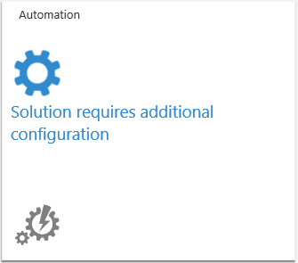

<properties
    pageTitle="Adicionar soluções de análise de Log da Galeria de soluções | Microsoft Azure"
    description="Soluções de análise de log são que um conjunto de lógica, visualização e aquisição de dados de regras que fornecem métricas pivotadas ao redor de uma área do problema específico."
    services="log-analytics"
    documentationCenter=""
    authors="bandersmsft"
    manager="jwhit"
    editor=""/>

<tags
    ms.service="log-analytics"
    ms.workload="na"
    ms.tgt_pltfrm="na"
    ms.devlang="na"
    ms.topic="article"
    ms.date="10/10/2016"
    ms.author="banders"/>

# Adicionar soluções de análise de Log da Galeria de soluções

As soluções de análise de log são um conjunto de **lógica**, **visualização** e **regras de aquisição de dados** que fornecem métricas pivotadas ao redor de uma área do problema específico. Soluções de listas neste artigo com suporte a análise de Log e explica como adicionar e removê-los usando a Galeria de soluções.

Soluções permitem mais profundas ideias para:

- ajudar a investigar e resolver problemas operacionais com mais rapidez
- coletar e correlação vários tipos de dados de máquina
- ajudá-lo a ser proativo com atividades como planejamento de capacidade, relatórios de status de patch e auditoria de segurança.

>[AZURE.NOTE] Análise de log inclui a funcionalidade de pesquisa de Log, então você não precisa instalar uma solução para habilitá-lo. No entanto, você pode obter ideias, pesquisas sugeridas e visualizações de dados adicionando soluções da Galeria de soluções.

Depois que você adicionou uma solução, os dados são coletados dos servidores em sua infraestrutura e enviados para o serviço OMS. Processamento do OMS serviço normalmente leva alguns minutos em uma hora. Depois que o serviço processa os dados, você pode exibi-la no OMS.

Você pode facilmente remover uma solução quando ele não for mais necessário. Quando você remove uma solução, seus dados não são enviados para OMS, que pode reduzir a quantidade de dados usados por sua cota de diária, se você tiver um.

## Soluções compatíveis com o agente de monitoramento da Microsoft

No momento, servidores que estão conectados ao OMS usando o agente de monitoramento Microsoft podem usar a maioria das soluções disponíveis, incluindo:

- Avaliação do Active Directory
- Gerenciamento de alerta (sem alertas SCOM)
- Antimalware
- Controle de alterações
- Segurança
- Avaliação de SQL
- Atualizações do sistema

No entanto, as seguintes soluções são *não* compatíveis com o agente de monitoramento da Microsoft e requer agente do System Center Operations Manager (SCOM).

- Gerenciamento de alerta (incluindo alertas SCOM)
- Gerenciamento de capacidade
- Avaliação de configuração

Consulte [Conectando Operations Manager para análise de Log](log-analytics-om-agents.md) para obter informações sobre como conectar o agente do SCOM a análise de Log.

### Para adicionar uma solução usando a Galeria de soluções

1. Na página Visão geral do OMS, clique no bloco da **Galeria de soluções** .    
    
2. Na página Galeria de soluções de OMS, saiba mais sobre cada solução disponível. Clique no nome da solução que você deseja adicionar ao OMS.
3. Na página para a solução que você escolheu, informações detalhadas sobre a solução são exibidas. Clique em **Adicionar**.
4. Um novo bloco para a solução que você adicionou aparece na visão geral de página em OMS e você pode começar a usá-la após o serviço OMS processa seus dados.

## Para configurar as soluções
1. Você precisará configurar algumas soluções. Por exemplo, você precisará configurar automação, recuperação de Site do Azure e Backup antes de você pode usá-los.
2. Para qualquer uma dessas soluções, clique em seu bloco na página Visão geral.  
    
3. Em seguida, configure a solução com as informações necessárias e clique em **Salvar**.  
    

### Para remover uma solução usando a Galeria de soluções

1. Na página Visão geral do OMS, clique no bloco de **configurações** .
2. Na página Configurações, na guia soluções, clique em **Remover** para a solução que você deseja remover.
3. Na caixa de diálogo de confirmação, clique em **Sim** para remover a solução.

## Detalhes do conjunto de dados para recursos OMS e soluções

A tabela a seguir mostra os métodos de coleta de dados e outros detalhes sobre como os dados são coletados para soluções e recursos OMS. Agentes diretos e agentes SCOM são essencialmente o mesmo, mas o agente direto inclui funcionalidade adicional para permitir que ele se conectar ao espaço de trabalho do OMS e rotear através de um proxy. Se você usar um agente SCOM, ele deve ser direcionado como um agente OMS para se comunicar com OMS. Agentes SCOM nesta tabela são agentes OMS que estão conectados por SCOM. Consulte [Conectar o Operations Manager para análise de Log](log-analytics-om-agents.md) para obter informações sobre como conectar seu ambiente existente do SCOM OMS.

>[AZURE.NOTE] O tipo de agente que você usa determina como os dados são enviados para OMS, com as seguintes condições:

- Você usa o agente direto ou um agente OMS anexados SCOM.
- Quando SCOM é necessário, dados do agente do SCOM para a solução é sempre enviados para OMS usando o grupo de gerenciamento do SCOM. Além disso, quando SCOM é necessário, somente o agente do SCOM é usado pela solução.
- Quando SCOM não é necessário e a tabela mostra que dados do agente SCOM são enviados para OMS usando o grupo de gerenciamento, em seguida, dados do agente SCOM é sempre enviados ao OMS usando grupos de gerenciamento. Agentes diretos ignoram o grupo de gerenciamento e enviar seus dados diretamente para OMS.
- Quando os dados do agente SCOM não são enviados para usar um grupo de gerenciamento, em seguida, os dados são enviados diretamente para OMS — ignorando o grupo de gerenciamento.

|tipo de dados| plataforma | Agente de direta | Agente do SCOM | Armazenamento do Azure | SCOM necessário? | Enviados via grupo de gerenciamento de dados do SCOM agente | frequência de conjunto |
|---|---|---|---|---|---|---|---|
|Avaliação do AD|Windows||||||  7 dias|
|Status de replicação do AD|Windows||||||5 dias|
|Alertas (Nagios)|Linux||||||na chegada|
|Alertas (Zabbix)|Linux||||||1 minuto|
|Alertas (Operations Manager)|Windows||||||3 minutos|
|Antimalware|Windows|||||| por hora|
|Gerenciamento de capacidade|Windows|||||| por hora|
|Controle de alterações|Windows|||||| por hora|
|Controle de alterações|Linux||||||por hora|
|Avaliação de configuração (Supervisor herdado)|Windows|||||| duas vezes por dia|
|ETW|Windows||||||5 minutos|
|Logs do IIS|Windows||||||5 minutos|
|Compartimentos de chave|Windows||||||10 minutos|
|Gateways de aplicativos de rede|Windows||||||10 minutos|
|Grupos de segurança de rede|Windows||||||10 minutos|
|Office 365|Windows||||||notificação|
|Contadores de desempenho|Windows||||||agendado, mínimo de 10 segundos|
|Contadores de desempenho|Linux||||||agendado, mínimo de 10 segundos|
|Estrutura de serviço|Windows||||||5 minutos|
|Avaliação de SQL|Windows|||||| 7 dias|
|SurfaceHub|Windows||||||na chegada|
|Syslog|Linux||||||de armazenamento do Azure: 10 minutos; do agente: na chegada|
|Atualizações do sistema|Windows|||||| pelo menos de 2 multiplicado por dia e 15 minutos depois de instalar uma atualização|
|Logs de eventos de segurança do Windows|Windows|||||| para o armazenamento do Azure: 10 min; para o agente: na chegada|
|Logs de firewall do Windows|Windows|||||| na chegada|
|Logs de eventos do Windows|Windows|||||| para o armazenamento do Azure: 1 min; para o agente: na chegada|
|Dados de fios|Windows (2012 R2 / 8.1 ou posterior)|||||| cada 1 minuto|

## Recursos e soluções de visualização de análise de log

Executando um serviço e seguir práticas devops nós são capazes de parceiro com clientes para desenvolver soluções e recursos.

Durante a visualização particular, oferecemos um pequeno grupo de acesso de clientes para uma implementação inicial do recurso ou solução para obter comentários e melhorias. Essa implementação antecipada possui recursos mínimo e recursos operacionais.

Nosso objetivo é tentar coisas rapidamente para que possamos encontrá o que funciona e o que não funciona. Iteramos nesse processo até que os comentários de clientes a visualização particular informa que estamos prontos para obter uma visualização pública.

Durante a visualização pública, podemos disponibilizar o recurso ou a solução para todos os usuários para obter mais comentários e validar nossa dimensionamento e eficiência. Durante esta fase:

- Recursos de visualização serão exibida na guia Configurações e podem ser habilitados por qualquer usuário
- Soluções de visualização podem ser adicionadas por meio da galeria ou usando um script publicado

### O que devo saber sobre os recursos de visualização e soluções?

Estamos animados sobre novos recursos e soluções e podemos adora trabalhar com você para desenvolvê-los.

Recursos de visualização e soluções não adequadas para todos no entanto, portanto, antes de pedindo para ingressar uma visualização particular ou habilitar uma visualização pública Verifique se você está trabalhando com algo que está em desenvolvimento Okey.

Ao ativar um recurso de visualização por meio do portal que será exibido um aviso lembrá-lo que o recurso é na visualização.

#### Para visualização *particulares* e *públicos*

A seguir se aplica aos visualizações públicas e privadas:

- Coisas que sempre pode não funcionar corretamente.
  - Intervalo de problemas sejam pequenas perturbações através para algo não está funcionando em todos os
- Não há potencial para a visualização para ter um impacto negativo nos sistemas / ambiente
  - Vamos tentar evitar negativas coisas acontecendo com os sistemas você está usando com o OMS mas coisas às vezes inesperadas ocorrem
- Perda de dados / corrupção pode ocorrer
- Podemos pedir que você colete logs de diagnóstico ou outros dados para ajudar a solucionar problemas
- O recurso ou a solução pode ser removida (temporariamente ou permanentemente)
  - Com base em nossas lições durante a visualização que nós pode decidir não liberar o recurso ou a solução
- Visualizações podem não funcionar ou não ter sido testadas com todas as configurações e podemos limitar:
  - Os sistemas operacionais que podem ser usados (por exemplo, um recurso pode aplicar somente a Linux enquanto estiver na visualização)
  - O tipo de agente (MMA, SCOM) que pode ser usado (por exemplo, um recurso pode não funcionar com SCOM enquanto estiver no modo de visualização)  
- Soluções de visualização e recursos não estão cobertos por contrato de nível de serviço
- Uso de recursos de visualização provocará encargos de uso
- Recursos ou recursos que você precisa para o recurso / solução para ser útil pode estar ausentes ou incompleta
- Recursos / soluções podem não estar disponíveis em todas as regiões
- Recursos / soluções não podem ser localizadas
- Recursos / soluções podem ter um limite no número de clientes ou dispositivos que podem usá-lo
- Talvez você precise usar scripts para executar a configuração e habilitar o recurso de solução /
- A interface do usuário (UI) serão incompleta e pode mudar do dia a dia
- Visualizações públicas podem não ser apropriado para sua produção / críticas sistemas

#### Para visualização *particular*

Além dos itens acima, é específico para visualizações particulares o seguinte:

- Esperamos que você nos fornecer comentários sobre sua experiência com o poderemos do recurso/solução melhor
- Nós podem contatá-lo para obter comentários usando pesquisas, chamadas telefônicas ou email
- Coisas que sempre não funcionarão corretamente
- Podemos podem exigir um contrato de confidencialidade (NDA) pela participação ou pode incluir conteúdo confidencial
  - Antes de blogs, TWEETS ou caso contrário, comunicar-se com terceiros, verifique com o programa Gerenciador responsável pela visualização para entender quaisquer restrições sobre divulgação
- Não é possível executar produção / críticas sistemas

### Como posso obter acesso aos recursos de visualização particular e soluções?

Podemos convidar clientes para visualizações particulares por meio de várias maneiras diferentes dependendo da visualização.

- Respondendo a pesquisa de cliente mensal e dando permissão para acompanhamento com você melhoram as chances de sendo convidado para uma visualização particular.
- Sua equipe de conta da Microsoft pode designam você.
- Você pode se inscrever com base nos detalhes postadas em twitter [msopsmgmt](https://twitter.com/msopsmgmt)
- Você pode se inscrever com base em eventos de comunidade compartilhado detalhes – examine para nós reunir ups, conferências e em comunidades online.

## Próximas etapas

- [Logs de pesquisa](log-analytics-log-searches.md) para exibir informações detalhadas coletadas por soluções.
