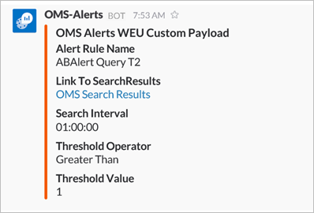

<properties
   pageTitle="Exemplo de alerta webhook do log de análise"
   description="Uma das ações que você pode executar em resposta a um alerta de análise de Log é um *webhook*, que permite que você invocar um processo externo por meio de uma única solicitação HTTP. Este artigo percorre um exemplo de criação de uma ação de webhook em uma alerta de análise de Log usando a margem de atraso."
   services="log-analytics"
   documentationCenter=""
   authors="bwren"
   manager="jwhit"
   editor="tysonn" />
<tags
   ms.service="log-analytics"
   ms.devlang="na"
   ms.topic="article"
   ms.tgt_pltfrm="na"
   ms.workload="infrastructure-services"
   ms.date="10/27/2016"
   ms.author="bwren" />

# <a name="webhooks-in-log-analytics-alerts"></a>Webhooks em alertas de análise de Log

Uma das ações que você pode executar em resposta a um [alerta de análise de Log](log-analytics-alerts.md) é um *webhook*, que permite que você invocar um processo externo por meio de uma única solicitação HTTP.  Você pode ler sobre detalhes de alertas e webhooks em [alertas na análise de Log](log-analytics-alerts.md)

Neste artigo, vamos examinar um exemplo de criação de uma ação de webhook em uma alerta de análise de Log usando a margem de atraso que é um serviço de mensagens.

>[AZURE.NOTE] Você deve ter uma conta de margem de atraso para concluir este exemplo.  Você pode se inscrever para uma conta gratuita em [slack.com](http://slack.com).

## <a name="step-1---enable-webhooks-in-slack"></a>Etapa 1 - habilitar webhooks na margem de atraso
2.  Entre no atraso em [slack.com](http://slack.com).
3.  Selecione um canal na seção de **canais** no painel esquerdo.  Esse é o canal que a mensagem será enviada para.  Você pode selecionar um dos canais padrão como **Geral** ou **aleatório**.  Em um cenário de produção, provavelmente você criaria um canal especial como **criticalservicealerts**. <br>

    

3. Clique em **Adicionar um aplicativo ou integração personalizada** para abrir o diretório de aplicativos.
3.  Digite *webhooks* na caixa de pesquisa e selecione **WebHooks recebidas**. <br>

    

4.  Ao lado do nome da sua equipe, clique em **instalar** .
5.  Clique em **Adicionar configuração**.
6.  Selecione o canal que você vai usar para esse exemplo e clique em **Adicionar entrada WebHooks integração**.  
6. Copie a **URL de Webhook**.  Você estará colando isso para a configuração de alerta. <br>

    

## <a name="step-2---create-alert-rule-in-log-analytics"></a>Etapa 2 - Criar regra de alerta no Log de análise
1.  [Criar uma regra de alerta](log-analytics-alerts.md) com as seguintes configurações.
    - Consulta:```    Type=Event EventLevelName=error ```
    - Verificar se há esse alerta cada: 5 minutos
    - O número de resultados é: maior que 10
    - Sobre esta janela de tempo: 60 minutos
    - Selecione **Sim** para **Webhook** e **não** para as outras ações.
7. Cole a URL de margem de atraso no campo **URL de Webhook** .
8. Selecione a opção para **incluir uma carga JSON personalizada**.
9. Uma margem de atraso espera uma carga formatada em JSON com um parâmetro chamado *texto*.  Este é o texto que ele exibirá na mensagem que cria.  Você pode usar um ou mais dos parâmetros de alerta usando o *#* símbolo tais como no exemplo a seguir.

    ```
    {
    "text":"#alertrulename fired with #searchresultcount records which exceeds the over threshold of #thresholdvalue ."
    }
    ```

    

9.  Clique em **Salvar** para salvar a regra de alerta.

10. Aguarde tempo suficiente para um alerta para ser criado e depois marque margem de atraso para uma mensagem que será semelhante à seguinte.

    


### <a name="advanced-webhook-payload-for-slack"></a>Advanced webhook carga para margem de atraso

Você pode personalizar extensivamente mensagens de entrada com margem de atraso. Para obter mais informações, consulte [Webhooks de entrada](https://api.slack.com/incoming-webhooks) no site da margem de atraso. A seguir é uma carga mais complexa para criar uma mensagem avançada com formatação:

    {
        "attachments": [
            {
                "title":"OMS Alerts Custom Payload",
                "fields": [
                    {
                        "title": "Alert Rule Name",
                        "value": "#alertrulename"},
                    {
                        "title": "Link To SearchResults",
                        "value": "<#linktosearchresults|OMS Search Results>"},
                    {
                        "title": "Search Interval",
                        "value": "#searchinterval"},
                    {
                        "title": "Threshold Operator",
                        "value": "#thresholdoperator"},
                    {
                        "title": "Threshold Value",
                        "value": "#thresholdvalue"}
                ],
                "color": "#F35A00"
            }
        ]
    }


Isso poderia gerar uma mensagem na margem de atraso semelhante à seguinte.



## <a name="summary"></a>Resumo

Com essa regra de alerta no lugar, você teria uma mensagem enviada a margem de atraso sempre que o critério é atendido.  

Este é apenas um exemplo de uma ação que você pode criar em resposta a um alerta.  Você pode criar uma ação de webhook que chama outro serviço externo, uma ação de runbook para iniciar uma runbook em automação Azure ou uma ação de email para enviar um email para si mesmo ou para outros destinatários.   

## <a name="next-steps"></a>Próximas etapas

- Saiba mais sobre mais sobre [alertas no Log Analytics](log-analytics-alerts.md) incluindo outras ações.
- [Criar runbooks na automação do Azure](../automation/automation-webhooks.md) que pode ser chamado de um webhook.
