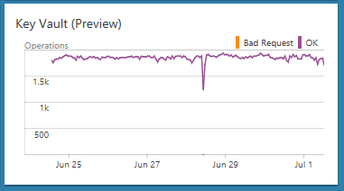
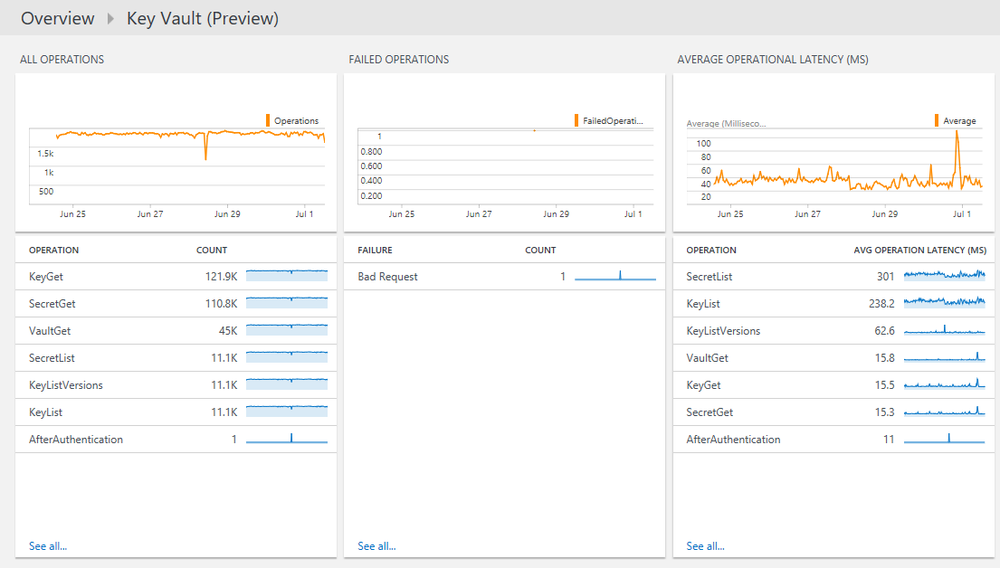

<properties
    pageTitle="Solução de chave cofre Azure no Log Analytics | Microsoft Azure"
    description="Você pode usar a solução de compartimento de chave do Azure em análise de Log para analisar logs do Azure chave cofre."
    services="log-analytics"
    documentationCenter=""
    authors="richrundmsft"
    manager="jochan"
    editor=""/>

<tags
    ms.service="log-analytics"
    ms.workload="na"
    ms.tgt_pltfrm="na"
    ms.devlang="na"
    ms.topic="article"
    ms.date="07/12/2016"
    ms.author="richrund"/>

# Solução de chave cofre (visualização) Azure em análise de Log

>[AZURE.NOTE] Esta é uma [solução de visualização](log-analytics-add-solutions.md#log-analytics-preview-solutions-and-features).

Você pode usar a solução de compartimento de chave do Azure em análise de Log para analisar logs do Azure chave cofre AuditEvent.

Você pode habilitar o log de eventos de auditoria para Azure chave cofre. Esses logs são gravados ao armazenamento de Blob do Azure onde eles podem então ser indexados por análise de Log para pesquisa e análise.

## Instalar e configurar a solução

Use as instruções a seguir para instalar e configurar a solução do Azure Cofre de chave:

1.  Habilitar o [log de diagnóstico para chave cofre](../key-vault/key-vault-logging.md) recursos que você deseja monitorar
2.  Configure a análise de Log para ler os logs do armazenamento de blob usando o processo descrito em [arquivos JSON no armazenamento de blob](../log-analytics/log-analytics-azure-storage-json.md).
3.  Habilite a solução de compartimento de chave do Azure usando o processo descrito em [soluções de adicionar a análise de Log da Galeria de soluções](log-analytics-add-solutions.md).  

## Examine os detalhes de conjunto de dados do Azure chave cofre

Solução de chave cofre Azure coleta logs de diagnóstico do armazenamento de blob do Microsoft Azure para Azure chave cofre.
Nenhum agente é necessário para coleta de dados.

A tabela a seguir mostra os métodos de coleta de dados e outros detalhes sobre como os dados são coletados para Azure chave cofre.

| Plataforma | Agente de direta | Agente de Center Operations Manager (SCOM) de sistemas | Armazenamento do Azure | SCOM necessário? | Enviados via grupo de gerenciamento de dados do SCOM agente | Frequência de conjunto |
|---|---|---|---|---|---|---|
|Azure||||            || 10 minutos|

## Usar o Azure cofre chave

Depois de instalar a solução, você pode exibir o resumo de solicitação de status ao longo do tempo para seu monitorar compartimentos de chave usando o **Azure chave cofre** lado a lado na página **Visão geral** da análise de Log.

Depois de clicar no bloco de **Visão geral** , você pode exibir resumos dos seus logs e fazer drill em detalhes para as seguintes categorias:

- Volume de todas as operações de chave cofre ao longo do tempo
- Falha volumes de operação ao longo do tempo
- Latência média de operacional por operação
- Qualidade de serviço para operações com o número de operações que levar mais de 1000 ms e uma lista das operações que levar mais de 1000 ms

### Exibir detalhes para qualquer operação

1. Na página **Visão geral** , clique no bloco do **Azure chave cofre** .
2. No painel **Cofre de chave do Azure** , examine as informações de resumo em uma das lâminas e, em seguida, clique em um para exibir informações detalhadas sobre ele na página de pesquisa de log.

    Em qualquer uma das páginas de pesquisa de log, você pode exibir os resultados por hora, resultados detalhados e seu histórico de pesquisa de log. Você também pode filtrar por aspectos para restringir os resultados.

## Registros de log de análise

A solução do Azure chave cofre analisa registros que têm um tipo de **KeyVaults** que são coletados de [logs de AuditEvent](../key-vault/key-vault-logging.md) no diagnóstico do Azure.  Propriedades para esses registros estão na tabela a seguir.  

| Propriedade | Descrição |
|:--|:--|
| Tipo | *KeyVaults* |
| SourceSystem | *AzureStorage* |
| CallerIpAddress | Endereço IP do cliente que fizeram a solicitação |
| Categoria      | Para logs de chave cofre, AuditEvent é o valor único, disponível.|
| CorrelationId | Um GUID opcional que o cliente pode passar para correlação logs do lado cliente com logs no lado do serviço (compartimento de chave). |
| DurationMs | Tempo necessário para atender à solicitação de API REST, em milissegundos. Isso não inclui latência de rede, para que o tempo que você medir no lado do cliente pode não corresponder neste momento. |
| HttpStatusCode_d | Código de status HTTP retornado pela solicitação |
| Id_s       | ID exclusiva da solicitação |
| Identity_o | Identidade do token apresentado ao fazer a solicitação de API REST. Isso geralmente é um "usuário", "capital de serviço" ou uma combinação "usuário + appId" como no caso de uma solicitação resultante de um cmdlet do PowerShell do Azure. |
| OperationName      | Nome da operação, como documentadas no [Log de Cofre de chave do Azure](../key-vault/key-vault-logging.md)|
| OperationVersion      | Versão da API REST solicitado pelo cliente|
| RemoteIPLatitude | Latitude do cliente que fizeram a solicitação |
| RemoteIPLongitude | Longitude do cliente que fizeram a solicitação |
| RemoteIPCountry | País/região do cliente que fizeram a solicitação  |
| RequestUri_s | URI da solicitação |
| Recurso   | Nome do Cofre de chave |
| ResourceGroup | Grupo de recursos do Cofre de chave |
| Identificação de recurso | ID do Azure recurso Gerenciador de recursos. Para logs de chave cofre, isso é sempre a identificação do recurso de chave cofre. |
| ResourceProvider | *MICROSOFT. KEYVAULT* |
| ResultSignature  | Status do HTTP|
| ResultType      | Resultado de solicitação de API REST|
| SubscriptionId | ID da assinatura Azure da assinatura contendo o Cofre de chave |

## Próximas etapas

- Use [pesquisas de Log no Log de análise](log-analytics-log-searches.md) para exibir dados detalhados de Cofre de chave do Azure.
