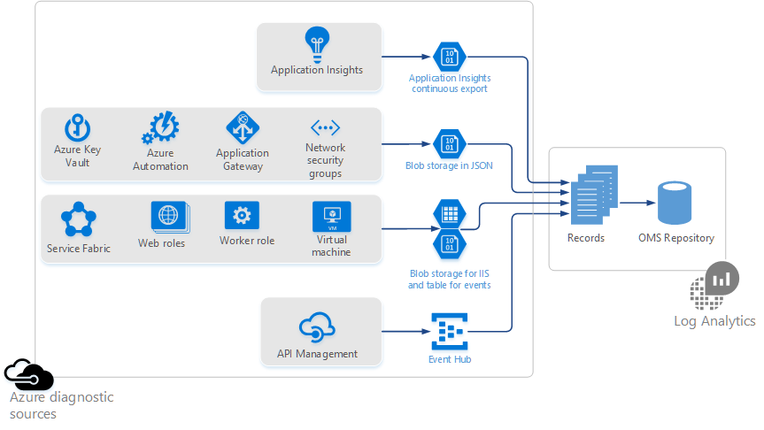

<properties
    pageTitle="Coleta de dados de armazenamento do Azure na visão geral de análise de Log | Microsoft Azure"
    description="Recursos Azure podem gravar logs e métricas para uma conta de armazenamento do Azure, geralmente usando o diagnóstico do Azure. Análise de log pode indexar esses dados e torná-los pesquisáveis."
    services="log-analytics"
    documentationCenter=""
    authors="bandersmsft"
    manager="jwhit"
    editor=""/>

<tags
    ms.service="log-analytics"
    ms.workload="na"
    ms.tgt_pltfrm="na"
    ms.devlang="na"
    ms.topic="article"
    ms.date="10/10/2016"
    ms.author="banders"/>

# Coleta de dados de armazenamento do Azure na visão geral de análise de Log

Muitos recursos Azure são capazes de gravar logs e métricas de uma conta de armazenamento do Azure. Análise de log pode consumir dados e facilitar a monitorar seus recursos Azure.

Para gravar armazenamento do Azure um recurso pode usar o diagnóstico do Azure ou tiver sua própria maneira de gravar dados. Esses dados podem ser escritos em vários formatos para um dos seguintes locais:

+ Tabela do Microsoft Azure
+ Blob do Microsoft Azure
+ EventHub

Análise de log suporta Azure serviços que gravar dados usando o [Azure logs de diagnóstico](../monitoring-and-diagnostics/monitoring-overview-of-diagnostic-logs.md). Além disso, a análise de Log é compatível com outros serviços que os logs e métricas de diferentes formatos e locais de saída.  

>[AZURE.NOTE] Cobrado taxas de dados do Azure normais para armazenamento e transações ao enviar diagnósticos para uma conta de armazenamento e para quando a análise de Log lê os dados de sua conta de armazenamento.

## Suporte para recursos do Azure

Análise de log pode coletar dados para os seguintes recursos Azure:

| Tipo de recurso | Logs (diagnósticos categorias) | Solução de análise de log |
| --------------------------------------- | -------------------------------- | --------------- |
| Obtenção de informações de aplicativo | Disponibilidade   Eventos personalizados   Exceções   Solicitações   | Obtenção de informações de aplicativo (prévia) |
| Gerenciamento de API | | *Nenhum* (Visualização) |
| Automação   Microsoft.Automation/AutomationAccounts | JobLogs   JobStreams          | AzureAutomation (prévia) |
| Chave cofre   Microsoft.KeyVault/Vaults               | AuditEvent                       | KeyVault (prévia) |
| Gateway de aplicativo   Microsoft.Network/ApplicationGateways   | ApplicationGatewayAccessLog   ApplicationGatewayPerformanceLog | AzureNetworking (prévia) |
| Grupo de segurança de rede   Microsoft.Network/NetworkSecurityGroups | NetworkSecurityGroupEvent   NetworkSecurityGroupRuleCounter | AzureNetworking (prévia) |
| Estrutura de serviço                          | ETWEvent   Evento operacional   Evento de ator confiável   Evento de serviço confiável| ServiceFabric (prévia) |
| Máquinas virtuais | Linux Syslog   Eventos do Windows   Log do IIS   ETWEvent do Windows | *Nenhum* |
| Funções da Web   Funções de trabalho | Linux Syslog   Eventos do Windows   Log do IIS   ETWEvent do Windows | *Nenhum* |

>[AZURE.NOTE] Para monitoramento Azure máquinas virtuais (Linux e Windows), recomendamos instalar a [extensão de máquina virtual de análise de Log](log-analytics-azure-vm-extension.md). O agente oferece mais profundas ideias nas máquinas virtuais que se você usar o diagnóstico gravado no armazenamento.

Você pode ajudar a priorizar logs adicionais para OMS analisar por votação em nossa [página de comentários](http://feedback.azure.com/forums/267889-azure-log-analytics/category/88086-log-management-and-log-collection-policy).

- Consulte [os logs de diagnóstico analisar Azure usando a análise de Log](log-analytics-azure-storage-json.md) para saber mais sobre como a análise de Log pode ler os logs do Azure services que oferecem suporte ao [Azure logs de diagnóstico](../monitoring-and-diagnostics/monitoring-overview-of-diagnostic-logs.md):
  - Azure cofre chave
  - Automação Azure
  - Gateway de aplicativo
  - Grupos de segurança de rede
- Consulte [armazenamento de blob do uso do IIS e armazenamento de tabela para eventos](log-analytics-azure-storage-iis-table.md) para saber mais sobre como a análise de Log pode ler os logs para Azure dos serviços que diagnóstico de gravação para armazenamento de tabela ou logs do IIS gravados blob storage, incluindo:
  - Estrutura de serviço
  - Funções da Web
  - Funções de trabalho
  - Máquinas virtuais

Obtenção de informações de aplicativo é em Visualizar particular e ele usa contínuo exportação para armazenamento de blob. Para ingressar a visualização particular, entre em contato com sua equipe de Account da Microsoft ou consulte os detalhes sobre o [site de comentários](https://feedback.azure.com/forums/267889-log-analytics/suggestions/6519248-integration-with-app-insights).

## Próximas etapas

- [Logs de diagnóstico analisar Azure usando a análise de Log](log-analytics-azure-storage-json.md) de ler os logs do Azure serviços que diagnóstico de gravação para armazenamento de blob no formato JSON.
- [Armazenamento de blob do uso do IIS e armazenamento de tabela para eventos](log-analytics-azure-storage-iis-table.md) para ler os logs do Azure serviços que diagnóstico de gravação para armazenamento de tabela ou logs do IIS gravados armazenamento de blob.
- [Habilitar soluções](log-analytics-add-solutions.md) agregar os dados.
- [Consultas de pesquisa de uso](log-analytics-log-searches.md) para analisar os dados.
