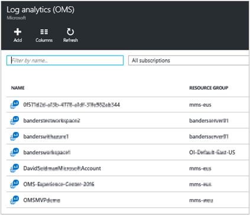
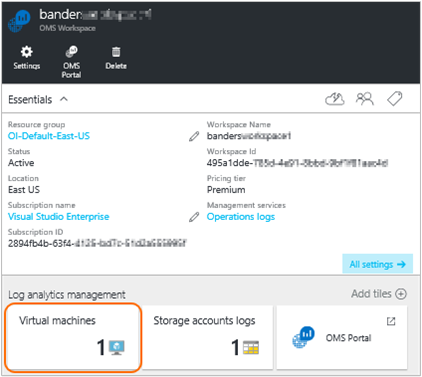

<properties
    pageTitle="Conectar o Azure máquinas virtuais a análise de Log | Microsoft Azure"
    description="Para Windows e Linux máquinas virtuais em execução no Azure, a maneira recomendada de métricas e logs coletados é instalando a extensão de máquina virtual do Azure de análise de Log. Você pode usar o portal do Azure ou PowerShell instalar a extensão de máquina virtual de análise de Log para VMs do Azure."
    services="log-analytics"
    documentationCenter=""
    authors="richrundmsft"
    manager="jochan"
    editor=""/>

<tags
    ms.service="log-analytics"
    ms.workload="na"
    ms.tgt_pltfrm="na"
    ms.devlang="na"
    ms.topic="article"
    ms.date="10/10/2016"
    ms.author="richrund"/>

# <a name="connect-azure-virtual-machines-to-log-analytics"></a>Conectar o Azure máquinas virtuais a análise de Log

Para computadores Windows e Linux, o método recomendado para coletar logs e métricas está instalando o agente de análise de Log.

A maneira mais fácil de instalar o agente de análise de Log no Azure máquinas virtuais é através da extensão de máquina virtual de análise de Log.  Usando a extensão simplifica o processo de instalação e configura automaticamente o agente para enviar dados para o espaço de trabalho de análise de Log que você especificar. O agente também é atualizado automaticamente, garantindo que você tenha os recursos e as correções mais recentes.

Para máquinas virtuais do Windows, você deve habilitar a extensão de máquina virtual do *Microsoft Agent de monitoramento* .
Para máquinas virtuais Linux você habilitar a extensão de máquina virtual do *Agente do OMS para Linux* .

Saiba mais sobre [extensões do Azure máquina virtual](../virtual-machines/virtual-machines-windows-extensions-features.md) e o [agente de Linux] (... / virtual-machines/virtual-machines-linux-agent-user-guide.md).

Quando você usa o conjunto baseada em agente para dados de log, você deve configurar [fontes de dados em análise de Log](log-analytics-data-sources.md) para especificar os logs e métricas que deseja coletar.

>[AZURE.IMPORTANT] Se você configurar a análise de Log aos dados do registro de índice usando o [Diagnóstico do Azure](log-analytics-azure-storage.md)e você configurar o agente para coletar logs de mesmo, os logs são coletados duas vezes. Cobrado para ambas as fontes de dados. Se você tiver o agente instalado, e em seguida, você deve coletar dados de log usando o agente sozinho - não configurar a análise de Log para coletar dados de log de diagnóstico do Azure.

Há três maneiras fáceis de habilitar a extensão de máquina virtual de análise de Log:

+ Usando o portal do Azure
+ Usando o PowerShell do Azure
+ Usando um modelo do Gerenciador de recursos do Azure

## <a name="enable-the-vm-extension-in-the-azure-portal"></a>Habilitar a extensão de máquina virtual no portal do Azure

Você pode instalar o agente para análise de Log e se conectar a máquina virtual Azure que é executado usando o [portal do Azure](https://portal.azure.com).

### <a name="to-install-the-log-analytics-agent-and-connect-the-virtual-machine-to-a-log-analytics-workspace"></a>Para instalar o agente de análise de Log e conectar a máquina virtual a um espaço de trabalho de análise de Log

1.  Entrar no [portal do Azure](http://portal.azure.com).
2.  Selecione **Procurar** no lado esquerdo do portal, vá para **a análise de Log (OMS)** e selecioná-lo.
3.  Em sua lista de espaços de trabalho de análise de Log, selecione aquele que você deseja usar com a máquina virtual do Azure.  
    
4.  Em **gerenciamento de análise de Log**, selecione **máquinas virtuais**.  
    
5.  Na lista de **máquinas virtuais**, selecione a máquina virtual no qual você deseja instalar o agente. O **status de conexão do OMS** para a máquina virtual indica que ele **não conectado**.  
    
6.  Os detalhes de sua máquina virtual, selecione **Conectar**. O agente é automaticamente instalado e configurado para o seu espaço de trabalho de análise de Log. Esse processo leva alguns minutos, durante esse período o status de Conexão de OMS é *conectando...*  
    
7.  Depois de instalar e conectar o agente, o status de **conexão de OMS** será atualizado para mostrar **este espaço de trabalho**.  
    


## <a name="enable-the-vm-extension-using-powershell"></a>Habilitar a extensão de máquina virtual usando o PowerShell

Há comandos diferentes para Azure máquinas virtuais clássicas e máquinas virtuais de Gerenciador de recursos. A seguir estão exemplos para clássico e máquinas virtuais do Gerenciador de recursos.

Para máquinas virtuais clássicas, use o PowerShell de exemplo a seguir:

```
Add-AzureAccount

$workspaceId = "enter workspace ID here"
$workspaceKey = "enter workspace key here"
$hostedService = "enter hosted service here"

$vm = Get-AzureVM –ServiceName $hostedService

# For Windows VM uncomment the following line
# Set-AzureVMExtension -VM $vm -Publisher 'Microsoft.EnterpriseCloud.Monitoring' -ExtensionName 'MicrosoftMonitoringAgent' -Version '1.*' -PublicConfiguration "{'workspaceId': '$workspaceId'}" -PrivateConfiguration "{'workspaceKey': '$workspaceKey' }" | Update-AzureVM -Verbose

# For Linux VM uncomment the following line
# Set-AzureVMExtension -VM $vm -Publisher 'Microsoft.EnterpriseCloud.Monitoring' -ExtensionName 'OmsAgentForLinux' -Version '1.*' -PublicConfiguration "{'workspaceId': '$workspaceId'}" -PrivateConfiguration "{'workspaceKey': '$workspaceKey' }" | Update-AzureVM -Verbose
```

Para máquinas virtuais de Gerenciador de recursos, use o PowerShell de exemplo a seguir:

```
Login-AzureRMAccount
Select-AzureSubscription -SubscriptionId "**"

$workspaceName = "your workspace name"
$VMresourcegroup = "**"
$VMresourcename = "**"

$workspace = (Get-AzureRmOperationalInsightsWorkspace).Where({$_.Name -eq $workspaceName})

if ($workspace.Name -ne $workspaceName)
{
    Write-Error "Unable to find OMS Workspace $workspaceName. Do you need to run Select-AzureRMSubscription?"
}

$workspaceId = $workspace.CustomerId
$workspaceKey = (Get-AzureRmOperationalInsightsWorkspaceSharedKeys -ResourceGroupName $workspace.ResourceGroupName -Name $workspace.Name).PrimarySharedKey

$vm = Get-AzureRmVM -ResourceGroupName $VMresourcegroup -Name $VMresourcename
$location = $vm.Location

# For Windows VM uncomment the following line
# Set-AzureRmVMExtension -ResourceGroupName $VMresourcegroup -VMName $VMresourcename -Name 'MicrosoftMonitoringAgent' -Publisher 'Microsoft.EnterpriseCloud.Monitoring' -ExtensionType 'MicrosoftMonitoringAgent' -TypeHandlerVersion '1.0' -Location $location -SettingString "{'workspaceId': '$workspaceId'}" -ProtectedSettingString "{'workspaceKey': '$workspaceKey'}"

# For Linux VM uncomment the following line
# Set-AzureRmVMExtension -ResourceGroupName $VMresourcegroup -VMName $VMresourcename -Name 'OmsAgentForLinux' -Publisher 'Microsoft.EnterpriseCloud.Monitoring' -ExtensionType 'OmsAgentForLinux' -TypeHandlerVersion '1.0' -Location $location -SettingString "{'workspaceId': '$workspaceId'}" -ProtectedSettingString "{'workspaceKey': '$workspaceKey'}"


```
Quando você configura sua máquina virtual usando o PowerShell, você precisa fornecer a **Identificação de espaço de trabalho** e a **Chave primária**. Você pode encontrar o Id e chave na página **configurações** do portal do OMS ou usando o PowerShell conforme mostrado no exemplo anterior.


## <a name="deploy-the-vm-extension-using-a-template"></a>Implantar a extensão de máquina virtual usando um modelo

Usando o Gerenciador de recursos do Azure, você pode criar um modelo simple (no formato JSON) que define a implantação e configuração do aplicativo. Este modelo é conhecido como um modelo do Gerenciador de recursos e fornece uma maneira declarativa para definir a implantação. Usando um modelo, pode repetidamente implantar seu aplicativo em todo o ciclo de vida do aplicativo e tiver confiança que seus recursos estão sendo implantados em um estado consistente.

Incluindo o agente de análise de Log como parte de seu modelo de Gerenciador de recursos, você pode garantir que cada máquina virtual é pré-configurada para relatar ao seu espaço de trabalho de análise de Log.

Para obter mais informações sobre modelos do Gerenciador de recursos, consulte [modelos de coautoria Gerenciador de recursos do Azure](../resource-group-authoring-templates.md).

A seguir é um exemplo de um modelo do Gerenciador de recursos que é usado para implantar uma máquina virtual que esteja executando o Windows com a extensão Microsoft Monitoring Agent instalada. Este modelo é um modelo de máquina virtual típica, com as seguintes adições:

+ parâmetros workspaceId e nome
+ Seção de extensão do recurso de Microsoft.EnterpriseCloud.Monitoring
+ Saídas para procurar a workspaceId e workspaceSharedKey


```
{
  "$schema": "https://schema.management.azure.com/schemas/2015-01-01/deploymentTemplate.json#",
  "contentVersion": "1.0.0.0",
  "parameters": {
    "adminUsername": {
      "type": "string",
      "metadata": {
        "description": "Username for the Virtual Machine."
      }
    },
    "adminPassword": {
      "type": "securestring",
      "metadata": {
        "description": "Password for the Virtual Machine."
      }
    },
    "dnsLabelPrefix": {
       "type": "string",
       "metadata": {
          "description": "DNS Label for the Public IP. Must be lowercase. It should match with the following regular expression: ^[a-z][a-z0-9-]{1,61}[a-z0-9]$ or it will raise an error."
       }
    },
    "workspaceId": {
      "type": "string",
      "metadata": {
        "description": "OMS workspace ID"
      }
    },
    "workspaceName": {
      "type": "string",
      "metadata": {
         "description": "OMD workspace name"
      }
    },
    "windowsOSVersion": {
      "type": "string",
      "defaultValue": "2012-R2-Datacenter",
      "allowedValues": [
        "2008-R2-SP1",
        "2012-Datacenter",
        "2012-R2-Datacenter",
        "Windows-Server-Technical-Preview"
      ],
      "metadata": {
        "description": "The Windows version for the VM. This will pick a fully patched image of this given Windows version. Allowed values: 2008-R2-SP1, 2012-Datacenter, 2012-R2-Datacenter, Windows-Server-Technical-Preview."
      }
    }
  },
  "variables": {
    "storageAccountName": "[concat(uniquestring(resourceGroup().id), 'standardsa')]",
    "apiVersion": "2015-06-15",
    "imagePublisher": "MicrosoftWindowsServer",
    "imageOffer": "WindowsServer",
    "OSDiskName": "osdiskforwindowssimple",
    "nicName": "myVMNic",
    "addressPrefix": "10.0.0.0/16",
    "subnetName": "Subnet",
    "subnetPrefix": "10.0.0.0/24",
    "storageAccountType": "Standard_LRS",
    "publicIPAddressName": "myPublicIP",
    "publicIPAddressType": "Dynamic",
    "vmStorageAccountContainerName": "vhds",
    "vmName": "MyWindowsVM",
    "vmSize": "Standard_DS1",
    "virtualNetworkName": "MyVNET",
    "resourceId": "[resourceGroup().id]",
    "vnetID": "[resourceId('Microsoft.Network/virtualNetworks',variables('virtualNetworkName'))]",
    "subnetRef": "[concat(variables('vnetID'),'/subnets/',variables('subnetName'))]"
  },
  "resources": [
    {
      "type": "Microsoft.Storage/storageAccounts",
      "name": "[variables('storageAccountName')]",
      "apiVersion": "[variables('apiVersion')]",
      "location": "[resourceGroup().location]",
      "properties": {
        "accountType": "[variables('storageAccountType')]"
      }
    },
    {
      "apiVersion": "[variables('apiVersion')]",
      "type": "Microsoft.Network/publicIPAddresses",
      "name": "[variables('publicIPAddressName')]",
      "location": "[resourceGroup().location]",
      "properties": {
        "publicIPAllocationMethod": "[variables('publicIPAddressType')]",
        "dnsSettings": {
          "domainNameLabel": "[parameters('dnsLabelPrefix')]"
        }
      }
    },
    {
      "apiVersion": "[variables('apiVersion')]",
      "type": "Microsoft.Network/virtualNetworks",
      "name": "[variables('virtualNetworkName')]",
      "location": "[resourceGroup().location]",
      "properties": {
        "addressSpace": {
          "addressPrefixes": [
            "[variables('addressPrefix')]"
          ]
        },
        "subnets": [
          {
            "name": "[variables('subnetName')]",
            "properties": {
              "addressPrefix": "[variables('subnetPrefix')]"
            }
          }
        ]
      }
    },
    {
      "apiVersion": "[variables('apiVersion')]",
      "type": "Microsoft.Network/networkInterfaces",
      "name": "[variables('nicName')]",
      "location": "[resourceGroup().location]",
      "dependsOn": [
        "[concat('Microsoft.Network/publicIPAddresses/', variables('publicIPAddressName'))]",
        "[concat('Microsoft.Network/virtualNetworks/', variables('virtualNetworkName'))]"
      ],
      "properties": {
        "ipConfigurations": [
          {
            "name": "ipconfig1",
            "properties": {
              "privateIPAllocationMethod": "Dynamic",
              "publicIPAddress": {
                "id": "[resourceId('Microsoft.Network/publicIPAddresses',variables('publicIPAddressName'))]"
              },
              "subnet": {
                "id": "[variables('subnetRef')]"
              }
            }
          }
        ]
      }
    },
    {
      "apiVersion": "2015-06-15",
      "type": "Microsoft.Compute/virtualMachines",
      "name": "[variables('vmName')]",
      "location": "[resourceGroup().location]",
      "dependsOn": [
        "[concat('Microsoft.Storage/storageAccounts/', variables('storageAccountName'))]",
        "[concat('Microsoft.Network/networkInterfaces/', variables('nicName'))]"
      ],
      "properties": {
        "hardwareProfile": {
          "vmSize": "[variables('vmSize')]"
        },
        "osProfile": {
          "computername": "[variables('vmName')]",
          "adminUsername": "[parameters('adminUsername')]",
          "adminPassword": "[parameters('adminPassword')]"
        },
        "storageProfile": {
          "imageReference": {
            "publisher": "[variables('imagePublisher')]",
            "offer": "[variables('imageOffer')]",
            "sku": "[parameters('windowsOSVersion')]",
            "version": "latest"
          },
          "osDisk": {
            "name": "osdisk",
            "vhd": {
              "uri": "[concat('http://',variables('storageAccountName'),'.blob.core.windows.net/',variables('vmStorageAccountContainerName'),'/',variables('OSDiskName'),'.vhd')]"
            },
            "caching": "ReadWrite",
            "createOption": "FromImage"
          }
        },
        "networkProfile": {
          "networkInterfaces": [
            {
              "id": "[resourceId('Microsoft.Network/networkInterfaces',variables('nicName'))]"
            }
          ]
        },
        "diagnosticsProfile": {
          "bootDiagnostics": {
             "enabled": "true",
             "storageUri": "[concat('http://',variables('storageAccountName'),'.blob.core.windows.net')]"
          }
        }
      },
      "resources": [
        {
          "type": "extensions",
          "name": "Microsoft.EnterpriseCloud.Monitoring",
          "apiVersion": "[variables('apiVersion')]",
          "location": "[resourceGroup().location]",
          "dependsOn": [
            "[concat('Microsoft.Compute/virtualMachines/', variables('vmName'))]"
          ],
          "properties": {
            "publisher": "Microsoft.EnterpriseCloud.Monitoring",
            "type": "MicrosoftMonitoringAgent",
            "typeHandlerVersion": "1.0",
            "autoUpgradeMinorVersion": true,
            "settings": {
              "workspaceId": "[parameters('workspaceId')]"
            },
            "protectedSettings": {
              "workspaceKey": "[listKeys(resourceId('Microsoft.OperationalInsights/workspaces', parameters('workspaceName')), '2015-03-20').primarySharedKey]"
            }
          }
        }
      ]
    }
  ],
  "outputs": {
      "sharedKeyOutput": {
         "value": "[listKeys(resourceId('Microsoft.OperationalInsights/workspaces/', parameters('workspaceName')), '2015-03-20').primarySharedKey]",
         "type": "string"
      },
      "workspaceIdOutput": {
         "value": "[reference(concat('Microsoft.OperationalInsights/workspaces/', parameters('workspaceName')), '2015-03-20').customerId]",
        "type" : "string"
      }
  }
}
```

Você pode implantar um modelo usando o seguinte comando do PowerShell:

```
New-AzureRmResourceGroupDeployment -ResourceGroupName $resourceGroupName -TemplateFile $templateFilePath
```

## <a name="troubleshooting-windows-virtual-machines"></a>Solução de problemas de máquinas virtuais do Windows

Se a extensão do agente do *Microsoft Agent de monitoramento* máquina virtual não está instalando ou relatório você pode executar as seguintes etapas para solucionar o problema.

1. Verificar se o agente de máquina virtual do Azure está instalado e funcionando corretamente usando as etapas no [2965986 KB](https://support.microsoft.com/kb/2965986#mt1).
  + Você também pode revisar o arquivo de log do agente de máquina virtual`C:\WindowsAzure\logs\WaAppAgent.log`
  + Se o registro não existir, o agente de máquina virtual não está instalado.
    - [Instalar o agente de máquina virtual do Azure em VMs clássicas](../virtual-machines/virtual-machines-windows-classic-agents-and-extensions.md)
2. Confirme que a tarefa de pulsação de extensão Microsoft Agent de monitoramento está em execução usando as seguintes etapas:
  + Faça logon máquina virtual
  + Abra o Agendador de tarefas e localize o `update_azureoperationalinsight_agent_heartbeat` tarefa
  + Confirme a tarefa está habilitada e está executando cada um minuto
  + Verificar o arquivo de log de pulsação`C:\WindowsAzure\Logs\Plugins\Microsoft.EnterpriseCloud.Monitoring.MicrosoftMonitoringAgent\heartbeat.log`
3. Examine os arquivos de log de extensão da máquina virtual Microsoft monitoramento agente em`C:\Packages\Plugins\Microsoft.EnterpriseCloud.Monitoring.MicrosoftMonitoringAgent`
3. Certifique-se de que a máquina virtual pode executar scripts do PowerShell
4. Certifique-se de que não sofreram alterações permissões em c:\Windows\Temp.
5. Exibir o status do agente de monitoramento do Microsoft digitando o seguinte em uma janela do PowerShell elevada na máquina virtual`  (New-Object -ComObject 'AgentConfigManager.MgmtSvcCfg').GetCloudWorkspaces() | Format-List`
6. Examine os arquivos de log de instalação do Microsoft Agent de monitoramento no`C:\Windows\System32\config\systemprofile\AppData\Local\SCOM\Logs`

Para obter mais informações, consulte [solução de problemas de extensões do Windows](../virtual-machines/virtual-machines-windows-extensions-troubleshoot.md).

## <a name="troubleshooting-linux-virtual-machines"></a>Máquinas virtuais Linux de solução de problemas

Se a extensão do agente de máquina virtual do *Agente de OMS para Linux* não está instalando ou relatório você pode executar as seguintes etapas para solucionar o problema.

1. Se o status de extensão for *desconhecido* verificar se o agente de máquina virtual do Azure está instalado e trabalhando corretamente por revisando o arquivo de log do agente de máquina virtual`/var/log/waagent.log`
  + Se o registro não existir, o agente de máquina virtual não está instalado.
  - [Instalar o agente de máquina virtual Azure em Linux VMs](../virtual-machines/virtual-machines-linux-agent-user-guide.md)
2. Para outros status não íntegras, examine o agente de OMS para arquivos de log de extensão Linux VM `/var/log/azure/Microsoft.EnterpriseCloud.Monitoring.OmsAgentForLinux/*/extension.log` e`/var/log/azure/Microsoft.EnterpriseCloud.Monitoring.OmsAgentForLinux/*/CommandExecution.log`
3. Se o status da extensão for íntegro, mas não está sendo carregados dados revisar o agente de OMS para arquivos de log de Linux em`/var/opt/microsoft/omsagent/log/omsagent.log`

Para obter mais informações, consulte [Linux extensões de solução de problemas](../virtual-machines/virtual-machines-linux-extensions-troubleshoot.md).


## <a name="next-steps"></a>Próximas etapas

+ Configure [fontes de dados em análise de Log](log-analytics-data-sources.md) para especificar os logs e métricas para coletar.
+ Para coletar dados de virtual máquinas [soluções de adicionar a análise de Log da Galeria de soluções](log-analytics-add-solutions.md).
+ [Coletar dados usando o diagnóstico do Azure](log-analytics-azure-storage.md) para outros recursos que estejam em execução no Azure.

Para computadores que não estão no Azure, você pode instalar o agente de análise de Log usando os métodos descritos nos seguintes artigos:

+ [Conectar computadores Windows a análise de Log](log-analytics-windows-agents.md)
+ [Conectar computadores Linux a análise de Log](log-analytics-linux-agents.md)
