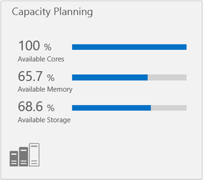
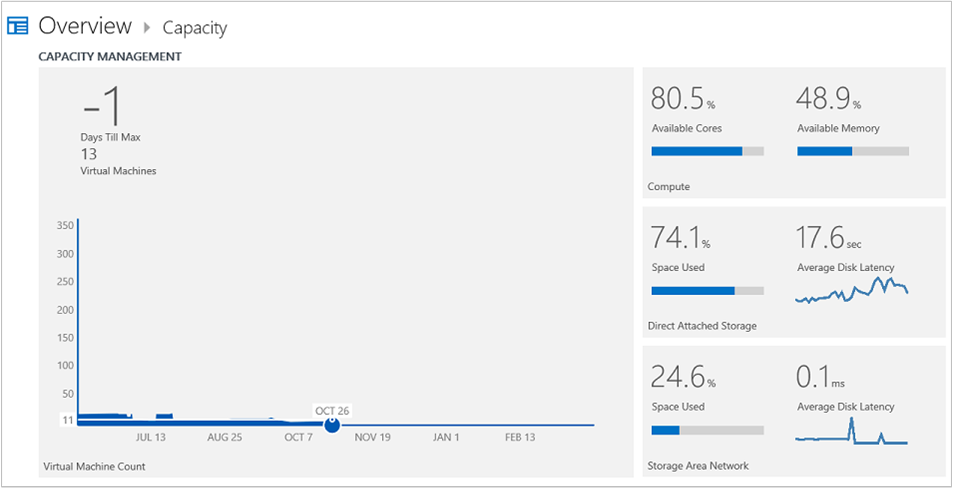

<properties
    pageTitle="Solução de gerenciamento de capacidade na análise de Log | Microsoft Azure"
    description="Você pode usar a solução de planejamento de capacidade em análise de Log para ajudá-lo a compreender a capacidade dos seus servidores de Hyper-V gerenciado pelo Gerenciador de máquina Virtual do System Center"
    services="log-analytics"
    documentationCenter=""
    authors="bandersmsft"
    manager="jwhit"
    editor=""/>

<tags
    ms.service="log-analytics"
    ms.workload="na"
    ms.tgt_pltfrm="na"
    ms.devlang="na"
    ms.topic="article"
    ms.date="10/10/2016"
    ms.author="banders"/>

# Solução de gerenciamento de capacidade na análise de Log

Você pode usar a solução de planejamento da capacidade de análise de Log para ajudá-lo a compreender a capacidade dos seus servidores de Hyper-V gerenciado pelo Gerenciador de máquina Virtual do System Center. Essa solução requer System Center Operations Manager e Gerenciador de máquina Virtual do System Center. Planejamento da capacidade não estará disponível se você usar apenas agentes diretamente conectadas. Instale a solução para atualizar o agente do Operations Manager. A solução lê contadores de desempenho no servidor monitorar e envia dados de uso para o serviço OMS na nuvem para processamento. Lógica é aplicada aos dados de uso e os dados de registros do serviço de nuvem. Ao longo do tempo, padrões de uso são identificados e capacidade é projetada, com base no consumo atual.

Por exemplo, uma projeção pode identificar quando as cores de processador adicional ou memória adicional será necessário para um servidor individual. Neste exemplo, a projeção pode indicar que 30 dias o servidor precisam memória adicional. Isso pode ajudá-lo a planejar uma atualização de memória durante próxima janela de manutenção do servidor, que pode ocorrer uma vez a cada duas semanas.

>[AZURE.NOTE] A solução de gerenciamento de capacidade não está disponível para ser adicionado a espaços de trabalho. Clientes que tenham a solução de gerenciamento de capacidade instalada podem continuar a usar a solução.  

A solução de planejamento de capacidade está em processo de sendo atualizado lidar com o cliente seguir relatado desafios:

- Requisito para usar o Gerenciador de máquina Virtual e Operations Manager
- Impossibilidade de personalizar/filtro com base nos grupos
- Por hora agregação de dados não frequentes suficiente
- Nenhum ideias de nível de máquina virtual
- Confiabilidade de dados

Benefícios da nova solução capacidade:

- Suporte a coleta de dados granular com maior confiabilidade e precisão
- Suporte para Hyper-V sem a necessidade de VMM
- Visualização de métricas no PowerBI
- Obtenção de informações sobre a utilização de nível de máquina virtual

## Instalando e configurando a solução
Use as informações a seguir para instalar e configurar a solução.

- Operations Manager é necessário para a solução de gerenciamento de capacidade.
- Gerenciador de máquina virtual é necessário para a solução de gerenciamento de capacidade.
- Operations Manager conectividade com o Gerenciador de máquina Virtual (VMM) é necessária. Para obter informações adicionais sobre como conectar os sistemas, consulte [como conectar VMM com o Operations Manager](http://technet.microsoft.com/library/hh882396.aspx).
- Operations Manager deve estar conectado a análise de Log.
- Adicione a solução de gerenciamento de capacidade ao seu espaço de trabalho OMS usando o processo descrito em [soluções de adicionar a análise de Log da Galeria de soluções](log-analytics-add-solutions.md).  Não há nenhuma configuração adicional necessária.

## Capacidade detalhes de conjunto de dados de gerenciamento

Gerenciamento da capacidade coleta dados de desempenho, metadados e dados de estado usando os agentes que você ativou.

A tabela a seguir mostra os métodos de coleta de dados e outros detalhes sobre como os dados são coletados para gerenciamento de capacidade.

| plataforma | Agente de direta | Agente do SCOM | Armazenamento do Azure | SCOM necessário? | Enviados via grupo de gerenciamento de dados do SCOM agente | frequência de conjunto |
|---|---|---|---|---|---|---|
|Windows||||            || por hora|

A tabela a seguir mostra exemplos de tipos de dados coletados pelo gerenciamento de capacidade:

|**Tipo de dados**|**Campos**|
|---|---|
|Metadados|BaseManagedEntityId, ObjectStatus, OrganizationalUnit, ActiveDirectoryObjectSid, PhysicalProcessors, NetworkName, endereço IP, ForestDNSName, NetbiosComputerName, VirtualMachineName, LastInventoryDate, HostServerNameIsVirtualMachine, endereço IP, NetbiosDomainName, LogicalProcessors, DNSName, DisplayName, DomainDnsName, ActiveDirectorySite, PrincipalName, OffsetInMinuteFromGreenwichTime|
|Desempenho|ObjectName, CounterName, PerfmonInstanceName, PerformanceDataId, PerformanceSourceInternalID, SampleValue, TimeSampled, TimeAdded|
|Estado|StateChangeEventId, StateId, NewHealthState, OldHealthState, contexto, TimeGenerated, TimeAdded, StateId2, BaseManagedEntityId, MonitorId, HealthState, LastModified, LastGreenAlertGenerated, DatabaseTimeModified|

## Página de gerenciamento de capacidade

 Após a solução de planejamento de capacidade é instalada, você pode exibir a capacidade de seus servidores monitoradas usando o bloco de **Planejamento da capacidade** na página **Visão geral** na OMS.

O bloco abre o painel de **Gerenciamento de capacidade** onde você pode exibir um resumo de sua capacidade de servidor. A página exibe os seguintes blocos que você pode clicar em:

- *Contagem de máquina virtual*: mostra o número de dias restantes para a capacidade de máquinas virtuais
- *Calcular*: mostra cores de processador e memória disponível
- *Armazenamento*: mostra o espaço em disco usado e média de latência de disco
- *Pesquisa*: Explorador de dados que você pode usar para pesquisar todos os dados no sistema OMS

### Para visualizar uma página de capacidade

- Na página **Visão geral** , clique em **Gerenciamento de capacidade**e, em seguida, clique em **Calcular** ou **armazenamento**.

## Calcular a página

Você pode usar o painel de **computação** no Microsoft Azure OMS para exibir informações de capacidade sobre utilização, projetado dias da capacidade e a eficiência relacionados a sua infraestrutura. Use a área de **utilização** para exibir core e memória da CPU em seus hosts de máquina virtual. Você pode usar a ferramenta de projeção para estimar quanto capacidade deve estar disponível para um determinado intervalo de datas. Você pode usar a área de **eficiência** para ver como eficiente seus hosts de máquina virtual. Você pode exibir detalhes sobre itens vinculados clicando neles.

Você pode gerar uma pasta de trabalho do Excel para as seguintes categorias:

- Principais hosts com maior utilização de núcleo
- Principais hosts com maior utilização de memória
- Principais hosts com ineficazes máquinas virtuais
- Principais hosts por utilização
- Hosts inferior pela utilização

As seguintes áreas são mostradas no painel **Calcular** :

**Utilização**: utilização de modo de exibição da CPU core e memória em seus hosts de máquina virtual.

- *Cores usadas*: Soma para todos os hosts (% da CPU utilizada multiplicada pelo número de cores físicos no host).
- *Cores livre*: Total físicas cores menos cores usadas.
- *Porcentagem Cores disponíveis*: livre físicos cores divididos pelo número total de cores físicas.
- *Cores virtual por máquina virtual*: Total cores virtuais no sistema dividido pelo número total de máquinas virtuais do sistema.
- *Cores virtual para física proporção de Cores*: proporção do totais cores físicos para físicos cores que são usadas pelas máquinas virtuais do sistema.
- *Número de virtual Cores disponíveis*: core Virtual para proporção de cores física multiplicado pelas cores físicos disponíveis.
- *Memória usada*: soma de memória utilizada por todos os hosts.
- *Memória livre*: memória física subtração usado memória Total.
- *Porcentagem de memória disponível*: liberar memória física dividida por memória física total.
- *Memória virtual por máquina virtual*: memória virtual Total no sistema dividido pelo número total de máquinas virtuais do sistema.
- *Memória virtual para física proporção de memória*: memória virtual Total no sistema dividido pela memória física total no sistema.
- *Disponível de memória virtual*: Memória Virtual para proporção de memória física multiplicada pela memória disponível física.

**Ferramenta de projeção**

Usando a ferramenta de projeção, você pode exibir tendências de históricas para a utilização do recurso. Isso inclui as tendências de uso de máquinas virtuais, memória, core e armazenamento. A capacidade de projeção usa um algoritmo de projeção para ajudá-lo a saber quando você está ficando sem cada um dos recursos. Isso ajuda você a calcular planejamento para que você possa saber quando você precisa adquirir mais capacidade (como memória, cores ou armazenamento) adequado da capacidade.

**Eficiência**

- *Máquina virtual Idle*: usando menos de 10% da memória CPU e 10% para o período de tempo especificado.
- *Máquina virtual utilizado em excesso*: usando mais de 90% da memória CPU e 90% para o período de tempo especificado.
- *Host Idle*: usando menos de 10% da memória CPU e 10% para o período de tempo especificado.
- *Host utilizado em excesso*: usando mais de 90% da memória CPU e 90% para o período de tempo especificado.

### Para trabalhar com itens na página de computação

1. No painel **de computação** na área de **utilização** , exiba informações de capacidade sobre as cores de CPU e memória em uso.
2. Clique em um item para abri-lo na página de **pesquisa** e exibir informações detalhadas sobre ele.
3. Na ferramenta de **projeção** , mova o controle deslizante de data para exibir uma projeção da capacidade que será usada na data que você escolher.
4. Na área de **eficiência** , exiba informações de eficiência de capacidade sobre máquinas virtuais e hosts de máquina virtual.

## Página de armazenamento anexado direta

Você pode usar o painel de **Armazenamento com conexão direta** em OMS para exibir informações de capacidade sobre utilização do armazenamento, desempenho do disco e projetados dias da capacidade de disco. Use a área de **utilização** para exibir o uso de espaço em disco no seu hosts de máquina virtual. Você pode usar a área de **Desempenho de disco** para exibir a taxa de transferência do disco e a latência em seus hosts de máquina virtual. Você também pode usar a ferramenta de projeção para estimar quanto capacidade deve estar disponível para um determinado intervalo de datas. Você pode exibir detalhes sobre itens vinculados clicando neles.

Você pode gerar uma pasta de trabalho do Excel dessas informações de capacidade para as seguintes categorias:

- Uso do espaço de disco superior por host
- Latência média superior pelo host

As seguintes áreas são mostradas na página de **armazenamento** :

- *Utilização*: Exibir uso espaço em disco no seu hosts de máquina virtual.
- *Espaço de disco total*: Soma (espaço de disco lógico) para todos os hosts
- *Espaço em disco usado*: Soma (espaço em disco lógico utilizado) para todos os hosts
- *Espaço disponível em disco*: espaço de disco menos espaço em disco utilizado Total
- *Porcentagem disco usado*: espaço de disco dividido por espaço em disco total usado
- *Porcentagem disco disponível*: espaço em disco disponível dividido por espaço em disco total

**Desempenho do disco**

Usando o OMS, você pode exibir a tendência de uso históricos de seu espaço de disco. A capacidade de projeção usa um algoritmo para uso futuro do projeto. Para uso do espaço em particular, a capacidade de projeção permite ao projeto quando você pode ficar sem espaço em disco. Isso ajudará a planejar adequada de armazenamento e souber quando você precisar comprar mais armazenamento.

**Ferramenta de projeção**

Usando a ferramenta de projeção, você pode exibir tendências de históricas de utilização do espaço de disco. A capacidade de projeção também permite projeto quando você está ficando sem espaço em disco. Isso ajudará a planejar capacidade adequado e saber quando você precisa adquirir mais capacidade de armazenamento.

### Para trabalhar com itens na página de armazenamento com conexão direta

1. No painel de ferramentas **Armazenamento com conexão direta** , na área de **utilização** , você pode exibir as informações de utilização do disco.
2. Clique em um item vinculado para abri-lo na página de **pesquisa** e exibir informações detalhadas sobre ele.
3. Na área de **Desempenho de disco** , você pode exibir informações de taxa de transferência e latência de disco.
4. Na **ferramenta de projeção**, mova o controle deslizante de data para exibir uma projeção da capacidade que será usada na data que você escolher.

## Próximas etapas

- Use [pesquisas de Log no Log de análise](log-analytics-log-searches.md) para exibir dados de gerenciamento de capacidade detalhadas.
