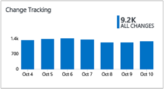

<properties
    pageTitle="Solução de análise de Log de controle de alterações | Microsoft Azure"
    description="Você pode usar a solução de controle de alteração de configuração em análise de Log para ajudá-lo a identificar facilmente o software e alterações de serviços do Windows que ocorrem em seu ambiente — identificar essas alterações na configuração pode ajudá-lo a identificar problemas operacionais."
    services="operations-management-suite"
    documentationCenter=""
    authors="bandersmsft"
    manager="jwhit"
    editor=""/>

<tags
    ms.service="operations-management-suite"
    ms.workload="na"
    ms.tgt_pltfrm="na"
    ms.devlang="na"
    ms.topic="article"
    ms.date="10/10/2016"
    ms.author="banders"/>

# Alterar a solução de acompanhamento no Log de análise

Você pode usar a solução de controle de alteração de configuração em análise de Log para ajudá-lo a identificar facilmente o software e serviços do Windows alterações e alterações de daemon Linux que ocorrem em seu ambiente — identificar essas alterações na configuração pode ajudá-lo a identificar problemas operacionais.

Instale a solução para atualizar o tipo de agente que você instalou. Alterações para instalar o software e serviços do Windows nos servidores monitorados sejam lidas e, em seguida, os dados são enviados para o serviço de análise de Log na nuvem para processamento. Lógica é aplicada aos dados recebidos e os dados de registros do serviço de nuvem. Quando as alterações forem encontradas, servidores com as alterações são mostrados no painel de controle de alterações. Usando as informações no painel de controle de alterações, você pode ver facilmente as alterações que foram feitas em sua infraestrutura de servidor.

## Instalando e configurando a solução
Use as informações a seguir para instalar e configurar a solução.

- Operations Manager é necessário para a solução de controle de alterações.
- Você deve ter um agente do Windows ou Operations Manager em cada computador onde você deseja monitorar as alterações.
- Adicione a solução de controle de alterações ao seu espaço de trabalho OMS usando o processo descrito em [soluções de adicionar a análise de Log da Galeria de soluções](log-analytics-add-solutions.md).  Não há nenhuma configuração adicional necessária.

## Alterar detalhes de conjunto de dados de acompanhamento

Controle de alterações coleta inventário de software e metadados de serviço do Windows usando os agentes que você ativou.

A tabela a seguir mostra os métodos de coleta de dados e outros detalhes sobre como os dados são coletados para controle de alterações.

| plataforma | Agente de direta | Agente do SCOM | Armazenamento do Azure | SCOM necessário? | Enviados via grupo de gerenciamento de dados do SCOM agente | frequência de conjunto |
|---|---|---|---|---|---|---|
|Windows||||            || por hora|

## Use o controle de alterações

Depois que a solução estiver instalada, você pode exibir o resumo das alterações para os servidores monitorados usando o bloco de **Controle de alteração** na página **Visão geral** na OMS.

Você pode exibir alterações em sua infraestrutura e drill-em detalhes para as seguintes categorias:

- Alterações por tipo de configuração de software e serviços do Windows
- Alterações de software para aplicativos e atualizações para os servidores individuais
- Número total de alterações de software para cada aplicativo
- Alterações de serviço do Windows para servidores individuais

### Para exibir as alterações para uma alteram tipo

1. Na página **Visão geral** , clique no bloco de **Controle de alterações** .
2. No painel de **Controle de alterar** , examine as informações de resumo em uma das lâminas alterar tipo e clique em um para exibir informações detalhadas sobre ele na página de **pesquisa de log** .
3. Em qualquer uma das páginas de pesquisa de log, você pode exibir os resultados por hora, resultados detalhados e seu histórico de pesquisa de log. Você também pode filtrar por aspectos para restringir os resultados.

## Próximas etapas

- Use [pesquisas de Log no Log de análise](log-analytics-log-searches.md) para exibir dados de rastreamento de alterações detalhado.
