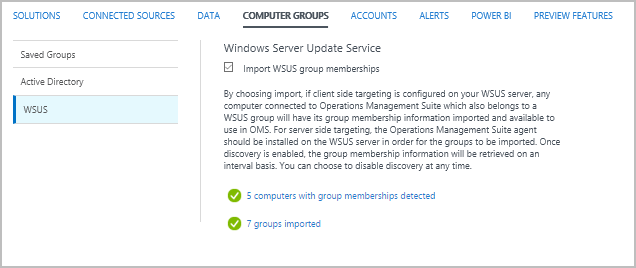

<properties
    pageTitle="Grupos de computador em análise de Log efetuar pesquisas | Microsoft Azure"
    description="Grupos de computador em análise de Log permitem pesquisas de log de escopo a um conjunto específico de computadores.  Este artigo descreve os diferentes métodos que você pode usar para criar grupos de computador e como usá-las em uma pesquisa de log."
    services="log-analytics"
    documentationCenter=""
    authors="bwren"
    manager="jwhit"
    editor=""/>

<tags
    ms.service="log-analytics"
    ms.workload="na"
    ms.tgt_pltfrm="na"
    ms.devlang="na"
    ms.topic="article"
    ms.date="09/06/2016"
    ms.author="bwren"/>

# Grupos de computador em análise de Log efetuar pesquisas
Grupos de computador em análise de Log permitem escopo [efetuar pesquisas de](log-analytics-log-searches.md) um determinado conjunto de computadores.  Cada grupo é preenchido com computadores usando uma consulta que você definir ou importando grupos de diferentes fontes.  Quando o grupo é incluído em uma pesquisa de log, os resultados são limitados aos registros que correspondem os computadores no grupo.

## Criar um grupo de computador
Você pode criar um grupo de computador em análise de Log usando qualquer um dos métodos na tabela a seguir.  Para obter detalhes sobre cada método são fornecidas nas seções a seguir. 

| Método | Descrição |
|:---|:---|
| Pesquisa de log       | Criar uma pesquisa de log que retorna uma lista de computadores e salvar os resultados como um grupo de computador. |
| API de pesquisa de log   | Use a API de pesquisa de Log para criar um grupo de computador com base nos resultados de uma pesquisa de log programaticamente. |
| Do Active Directory | Verificar automaticamente a associação de quaisquer computadores de agente que são membros de um domínio do Active Directory e criar um grupo no Log de análise para cada grupo de segurança.
| WSUS              | Digitalizar servidores WSUS ou clientes de direcionamento de grupos e criar um grupo no Log de análise para cada automaticamente. |

### Pesquisa de log

Grupos de computador criados a partir de uma pesquisa de Log irá conter todos os computadores retornados por uma consulta de pesquisa que você definir.  Essa consulta é executada toda vez que o grupo de computador é usado para que as alterações desde que foi criado o grupo serão refletidas.

Use o procedimento a seguir para criar um grupo de computador de uma pesquisa de log.

1. [Criar uma pesquisa de log](log-analytics-log-searches.md) que retorna uma lista de computadores.  A pesquisa deve retornar um conjunto distinto de computadores usando algo como **Computador distintas** ou **Count () medida por computador** na consulta.  
2. Clique no botão **Salvar** na parte superior da tela.
3. Selecione **Sim** para **salvar essa consulta como um grupo de computador:**.
4. Digite um **nome** e uma **categoria** para o grupo.  Se já existir uma pesquisa com o mesmo nome e categoria, em seguida, você será solicitado para substituí-lo.  Você pode ter várias pesquisas com o mesmo nome em diferentes categorias. 

A seguir estão as pesquisas de exemplo que você pode salvar como um grupo de computador.

    Computer="Computer1" OR Computer="Computer2" | distinct Computer 
    Computer=*srv* | measure count() by Computer

### API de pesquisa de log

Grupos de computador criados com a API de pesquisa de Log são os mesmos pesquisas criadas com uma pesquisa de Log.

Para obter detalhes sobre como criar um grupo de computadores usando a API de pesquisa de Log consulte [grupos de computador em análise de Log log API REST de pesquisa](log-analytics-log-search-api.md#computer-groups).

### Do Active Directory

Quando você configura a análise de Log para importar associações de grupo do Active Directory, ele analisará a associação de quaisquer computadores de domínio associado com o agente OMS.  Um grupo de computador é criado no Log de análise para cada grupo de segurança no Active Directory, e cada computador é adicionado aos grupos de computador correspondente para os grupos de segurança que eles são membros.  Essa associação é atualizada continuamente cada 4 horas.  

Configurar a análise de Log para importar os grupos de segurança do Active Directory no menu de **Grupos de computador** em Log Analytics **configurações**.  Selecione **automação** e **associações de grupo do Active Directory de importação de computadores**.  Não há nenhuma configuração adicional necessária.

Quando grupos tiverem sido importados, o menu listará o número de computadores com associações de grupo detectado e o número de grupos importados.  Você pode clicar em qualquer um desses links para retornar os registros de **ComputerGroup** com essas informações.

### Serviço de atualização do Windows Server

Quando você configura a análise de Log para importar associações de grupo WSUS, ele analisará a associação direcionamento de qualquer computador com o agente OMS.  Se você estiver usando o cliente-alvo, qualquer computador que está conectado ao OMS e faz parte de qualquer WSUS direcionamento grupos terão suas associações de grupo importada para a análise de Log. Se você estiver usando o servidor-alvo, o OMS agente deve ser instalado no servidor WSUS para que as informações de associação de grupo para serem importados para OMS.  Essa associação é atualizada continuamente cada 4 horas. 

Configurar a análise de Log para importar os grupos de segurança do Active Directory no menu de **Grupos de computador** em Log Analytics **configurações**.  Selecione **Active Directory** e **associações de grupo do Active Directory de importação de computadores**.  Não há nenhuma configuração adicional necessária.

Quando grupos tiverem sido importados, o menu listará o número de computadores com associações de grupo detectado e o número de grupos importados.  Você pode clicar em qualquer um desses links para retornar os registros de **ComputerGroup** com essas informações.

## Gerenciando grupos de computador

Você pode exibir grupos de computador que foram criados a partir de uma pesquisa de log ou a API de pesquisa de Log no menu de **Grupos de computador** em Log Analytics **configurações**.  Clique no **x** na coluna **Remover** para excluir o grupo de computador.  Clique no ícone **Exibir membros** de um grupo para executar a pesquisa de log do grupo que retorna seus membros. 

Para modificar o grupo, crie um novo grupo com a mesma **categoria** e **nome** para substituir o grupo original.

## Usar um grupo de computador em uma pesquisa de log
Use a seguinte sintaxe para se referir a um grupo de computadores em uma pesquisa de log.  Especifica que a **categoria** é opcional e apenas necessário se você tiver grupos de computador com o mesmo nome em diferentes categorias. 

    $ComputerGroups[Category: Name]

Quando uma pesquisa é executada, os membros de grupos computador incluídos na pesquisa primeiro são resolvidos.  Se o grupo é baseado em uma pesquisa de log, que a pesquisa é executada para retornar os membros do grupo antes de executar a pesquisa de log de nível superior.

Grupos de computador são normalmente usados com a cláusula **IN** na pesquisa de log como no exemplo a seguir.

    Type=UpdateSummary Computer IN $ComputerGroups[My Computer Group]

## Registros de grupo de computador

Um registro é criado no repositório OMS para cada computador associação um grupo criado a partir do Active Directory ou WSUS.  Esses registros têm um tipo de **ComputerGroup** e as propriedades da tabela a seguir.  Registros não são criados para os grupos de computador com base em pesquisas de log.

| Propriedade | Descrição |
|:--|:--|
| Tipo                | *ComputerGroup* |
| SourceSystem        | *SourceSystem*  |
| Computador            | Nome do computador membro. |
| Grupo               | Nome do grupo. |
| GroupFullName       | Caminho completo para o grupo, incluindo a origem e o nome da fonte.
| GroupSource         | Grupo de origem foi coletados de.   Active Directory WSUS WSUSClientTargeting |
| GroupSourceName     | Nome da fonte que foram coletados os grupos do.  Active Directory, este é o nome de domínio. |
| ManagementGroupName | Nome do grupo de gerenciamento de agentes SCOM.  Para outros agentes, isso é AOI -\<identificação de espaço de trabalho\> |
| TimeGenerated       | Data e hora, o grupo de computador foi criado ou atualizado. |

## Próximas etapas

- Saiba mais sobre [as pesquisas de log](log-analytics-log-searches.md) analisar os dados coletados de fontes de dados e soluções.  