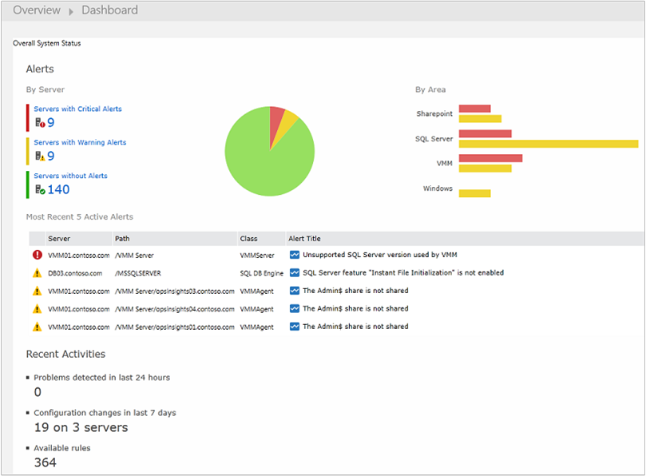
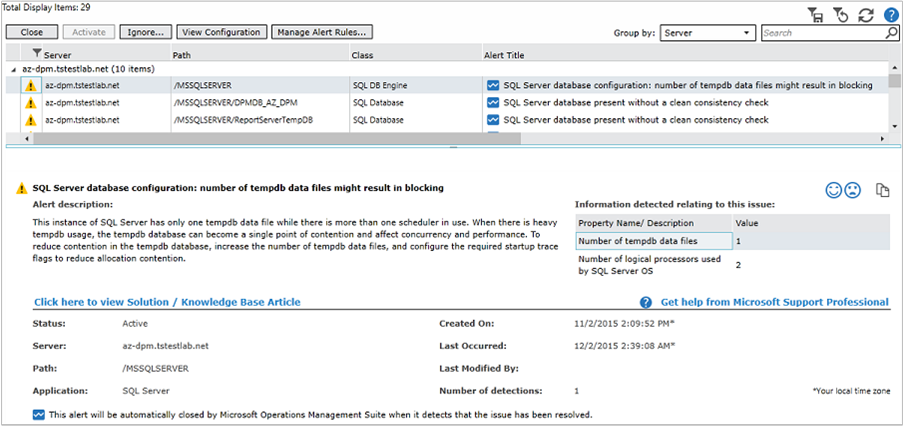
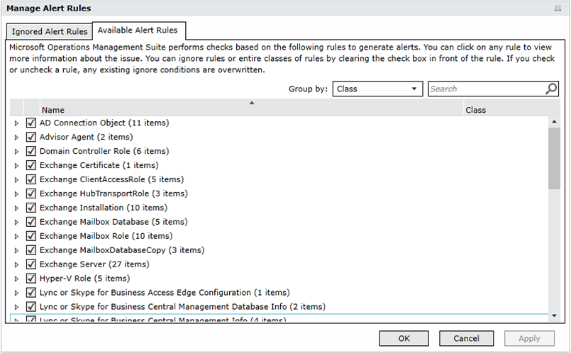

<properties
    pageTitle="Solução de avaliação de configuração em análise de Log | Microsoft Azure"
    description="A solução de avaliação de configuração em análise de Log fornece informações detalhadas sobre o estado atual de sua infraestrutura de servidor do System Center Operations Manager ao usar agentes do Operations Manager ou um grupo de gerenciamento do Operations Manager."
    services="log-analytics"
    documentationCenter=""
    authors="bandersmsft"
    manager="jwhit"
    editor=""/>

<tags
    ms.service="log-analytics"
    ms.workload="na"
    ms.tgt_pltfrm="na"
    ms.devlang="na"
    ms.topic="article"
    ms.date="10/10/2016"
    ms.author="banders"/>

# Solução de avaliação de configuração em análise de Log

A solução de avaliação de configuração em análise de Log ajuda você a encontrar possíveis problemas de configuração de servidor por meio de alertas e recomendações de Conhecimento.

Essa solução requer System Center Operations Manager. Avaliação de configuração não estará disponível se você usar apenas agentes diretamente conectadas.

Exibir algumas informações de solução de avaliação de configuração requer o plug-in do Silverlight para seu navegador.

>[AZURE.NOTE] Começando 5 de julho de 2016, a solução de avaliação de configuração não pode ser adicionada a espaços de trabalho de análise de Log e esta solução já não estará disponível para usuários existentes após 1 de agosto de 2016. Para clientes que usam essa solução para SQL Server ou do Active Directory, recomendamos que você usar a [Avaliação do SQL Server](log-analytics-sql-assessment.md), soluções de [Avaliação do Active Directory](log-analytics-ad-assessment.md) e [Status de replicação do Active Directory](log-analytics-ad-replication-status.md) . Para clientes que usam avaliação de configuração para Windows, Hyper-V e Gerenciador de máquina Virtual do System Center, recomendamos que você usa o conjunto de eventos e recursos para obter uma visão abrangente dos problemas em seus ambientes de controle de alterações.

Dados de configuração são obtidos servidores monitorados e, em seguida, enviados para o serviço OMS na nuvem para processamento. Lógica é aplicada aos dados recebidos e os dados de registros do serviço de nuvem. Dados processados para os servidores são mostrados para as seguintes áreas:

- **Alertas:** Mostra os alertas relacionados à configuração e proativos suscitadas para monitoradas servidores. Eles são produzidos por regras criadas pela Microsoft Customer e organização de suporte (CSS) com as práticas recomendadas do campo.
- **Recomendações de Conhecimento:** Mostra os artigos da Base de Conhecimento Microsoft recomendados para cargas de trabalho que são encontradas em sua infraestrutura; Estes são sugeridas automaticamente com base na sua configuração por meio do uso de aprendizado de máquina.
- **Servidores e cargas de trabalho analisadas:** Mostra os servidores e cargas de trabalho que estão sendo monitoradas pelo OMS.

### Tecnologias que você pode analisar com avaliação de configuração

Avaliação de configuração de OMS analisa as cargas de trabalho a seguintes:

- Windows Server 2012 e Microsoft Hyper-V Server 2012
- Windows Server 2008 e Windows Server 2008 R2, incluindo:
    - Do Active Directory
    - Host Hyper-V
    - Gerais do sistema operacional
- SQL Server 2008 e posterior
    - Mecanismo de banco de dados do SQL Server
- Microsoft SharePoint 2010
- Microsoft Exchange Server 2010 e o Microsoft Exchange Server 2013
- O Microsoft Lync Server 2013 e o Lync Server 2010
- System Center 2012 SP1 – Gerenciador de máquina Virtual

Para SQL Server, as seguintes edições de 32 bits e 64 bits são suportadas para análise:

- SQL Server 2016 - todas as edições
- SQL Server 2014 - todas as edições
- SQL Server 2008 e 2008 R2 - todas as edições

O mecanismo de banco de dados do SQL Server é analisado em todas as edições com suporte. Além disso, a edição de 32 bits do SQL Server é suportada quando executando na implementação WOW64.

## Instalando e configurando a solução
Use as informações a seguir para instalar e configurar a solução.

- Operations Manager é necessário para a solução de avaliação de configuração.
- Você deve ter um agente do Operations Manager em cada computador onde você deseja avaliar sua configuração.
- Adicione a solução de avaliação de configuração para seu espaço de trabalho OMS usando o processo descrito em [soluções de adicionar a análise de Log da Galeria de soluções](log-analytics-add-solutions.md).  Não há nenhuma configuração adicional necessária.

## Detalhes de conjunto de dados de avaliação de configuração

Avaliação de configuração coleta dados de configuração, metadados e dados de estado usando os agentes que você ativou.

A tabela a seguir mostra os métodos de coleta de dados e outros detalhes sobre como os dados são coletados para avaliação de configuração.

| plataforma | Agente de direta | Agente do SCOM | Armazenamento do Azure | SCOM necessário? | Enviados via grupo de gerenciamento de dados do SCOM agente | frequência de conjunto |
|---|---|---|---|---|---|---|
|Windows||||            || duas vezes por dia|

A tabela a seguir mostra exemplos de tipos de dados coletados pelo avaliação de configuração:

|**Tipo de dados**|**Campos**|
|---|---|
|Configuração|CustomerID, AgentID, EntityID, ManagedTypeID, ManagedTypePropertyID, Valoratual, ChangeDate|
|Metadados|BaseManagedEntityId, ObjectStatus, OrganizationalUnit, ActiveDirectoryObjectSid, PhysicalProcessors, NetworkName, endereço IP, ForestDNSName, NetbiosComputerName, VirtualMachineName, LastInventoryDate, HostServerNameIsVirtualMachine, endereço IP, NetbiosDomainName, LogicalProcessors, DNSName, DisplayName, DomainDnsName, ActiveDirectorySite, PrincipalName, OffsetInMinuteFromGreenwichTime|
|Estado|StateChangeEventId, StateId, NewHealthState, OldHealthState, contexto, TimeGenerated, TimeAdded, StateId2, BaseManagedEntityId, MonitorId, HealthState, LastModified, LastGreenAlertGenerated, DatabaseTimeModified|

## Alertas de avaliação de configuração
Você pode exibir e gerenciar alertas da avaliação de configuração com a página de alertas. Alertas informam o problema detectado, a causa e como resolver o problema. Eles também fornecem informações sobre definições de configuração em seu ambiente que possam causar problemas de desempenho.

>[AZURE.NOTE] Os alertas de avaliação de configuração são diferentes dos outros alertas na análise de Log. Exibir alertas requer um plug-in do Silverlight para seu navegador.

Quando você seleciona um item ou categoria de itens na página alertas, você verá uma lista de servidores ou cargas de trabalho com alertas que se aplicam a cada item.

Cada alerta inclui um link para um artigo na Base de dados de Conhecimento da Microsoft. Estes artigos fornecem informações adicionais sobre o alerta.

>[AZURE.TIP] Por padrão, o número máximo de alertas exibidos é 2.000. Para exibir mais alertas, clique na barra de notificação acima da lista de alertas.

Você pode clicar em qualquer item na lista para ler o artigo KB que pode ajudar a resolver a causa do problema que gerou o alerta.

Você pode gerenciar regras de alerta para ignorar regras específicas ou uma classes de regras.

## Recomendações de Conhecimento
Quando você vê recomendações de Conhecimento, você verá resultados de pesquisa de log listando artigos do Microsoft KB recomendados para cargas de trabalho e computadores que fornecem informações adicionais sobre o alerta.

## Servidores e cargas de trabalho analisadas
Quando você vê recomendações de Conhecimento, você verá resultados de pesquisa de log listando todos os servidores e cargas de trabalho que são conhecidas por OMS do Operations Manager.

## Próximas etapas

- Use [pesquisas de Log no Log de análise](log-analytics-log-searches.md) para exibir dados de avaliação de configuração detalhada.
