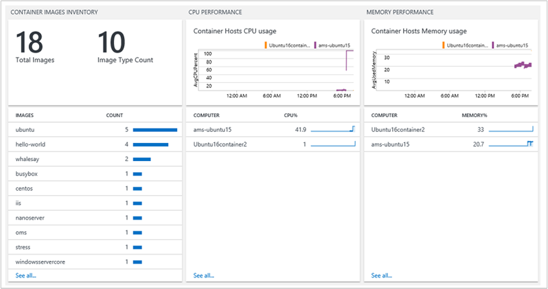
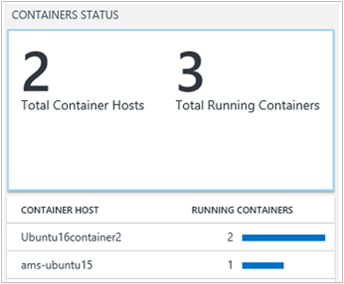

<properties
    pageTitle="Solução de contêineres no Log Analytics | Microsoft Azure"
    description="A solução de contêineres na análise de Log ajuda você a exibir e gerenciar seus hosts de contêiner Docker em um único local."
    services="log-analytics"
    documentationCenter=""
    authors="bandersmsft"
    manager="jwhit"
    editor=""/>

<tags
    ms.service="log-analytics"
    ms.workload="na"
    ms.tgt_pltfrm="na"
    ms.devlang="na"
    ms.topic="article"
    ms.date="10/10/2016"
    ms.author="banders"/>


# <a name="containers-preview-solution-log-analytics"></a>Análise de Log de solução de contêineres (prévia)

Este artigo descreve como configurar e usar a solução de contêineres na análise de Log, que ajuda você a exibir e gerenciar seus hosts de contêiner Docker em um único local. Docker é um sistema de virtualização de software usado para criar contêineres que automatizam a implantação de software para sua infraestrutura.

Com a solução, você pode ver quais contêineres estiver executando em seus hosts contêiner e quais imagens estão sendo executados nos contêineres. Você pode exibir informações detalhadas de auditoria mostrando comandos usados com contêineres. Além disso, você pode solucionar contêineres exibindo e pesquisando logs centralizados sem precisar exibir remotamente hosts Docker. Você pode encontrar contêineres que podem ser ruídos e consome recursos em excesso em um host. E, você pode exibir centralizado de CPU, memória, armazenamento e informações de uso e desempenho de rede para contêineres.

## <a name="installing-and-configuring-the-solution"></a>Instalando e configurando a solução

Use as informações a seguir para instalar e configurar a solução.

Adicione a solução de contêineres ao seu espaço de trabalho OMS usando o processo descrito em [soluções de adicionar a análise de Log da Galeria de soluções](log-analytics-add-solutions.md).

Há duas maneiras de instalar e usar Docker com OMS:

- Em sistemas operacionais Linux suportados, instalar e executar Docker e, em seguida, instalar e configurar OMS agente para Linux
- Em CoreOS, instalar e executar Docker e, em seguida, configure o OMSAgent para executar dentro de um contêiner

Examine as versões de sistema operacional Docker e Linux com suporte do seu host de contêiner no [GitHub](https://github.com/Microsoft/OMS-docker).

>[AZURE.IMPORTANT] Docker deve estar em execução **antes de** você instala o [Agente de OMS para Linux](log-analytics-linux-agents.md) em seus hosts de contêiner. Se você já tiver instalado o agente antes de instalar Docker, você precisará reinstalar o agente de OMS para Linux. Para obter mais informações sobre Docker, consulte o [site Docker](https://www.docker.com).

Você precisa as configurações a seguir configuradas nos hosts contêiner antes de poder monitorar contêineres.

## <a name="configure-settings-for-the-linux-container-host"></a>Definir configurações para o host de contêiner Linux

Após ter instalado o Docker, use as seguintes configurações do seu host de contêiner para configurar o agente para uso com Docker. CoreOS não dá suporte a este método de configuração.

### <a name="to-configure-settings-for-the-container-host---systemd-suse-opensuse-centos-7x-rhel-7x-and-ubuntu-15x-and-higher"></a>Para definir configurações para o host de contêiner - d (SUSE, openSUSE, CentOS 7. x, RHEL 7. x e Ubuntu 15.x e superior)

1. Edite docker.service para adicionar o seguinte:

    ```
    [Service]
    ...
    Environment="DOCKER_OPTS=--log-driver=fluentd --log-opt fluentd-address=localhost:25225"
    ...
    ```

2. Adicionar $DOCKER\_OPTA no &quot;daemon de = / usr/bin/docker ExecStart&quot; no seu arquivo de docker.service. Usando o exemplo a seguir.

    ```
    [Service]
    Environment="DOCKER_OPTS=--log-driver=fluentd --log-opt fluentd-address=localhost:25225"
    ExecStart=/usr/bin/docker daemon -H fd:// $DOCKER_OPTS
    ```

3. Reinicie o serviço de Docker. Por exemplo:

    ```
    sudo systemctl restart docker.service
    ```

### <a name="to-configure-settings-for-the-container-host---upstart-ubuntu-14x"></a>Para definir configurações para o host de contêiner - Upstart (Ubuntu 14.x)

1. Edite /etc/default/docker e adicione o seguinte:

    ```
    DOCKER_OPTS="--log-driver=fluentd --log-opt fluentd-address=localhost:25225"
    ```

2. Salve o arquivo e, em seguida, reinicie os serviços Docker e OMS.

    ```
    sudo service docker restart
    ```

### <a name="to-configure-settings-for-the-container-host---amazon-linux"></a>Para definir configurações para o host de contêiner - Linux Amazon

1. Edite /etc/sysconfig/docker e adicione o seguinte:

    ```
    OPTIONS="--log-driver=fluentd --log-opt fluentd-address=localhost:25225"
    ```

2. Salve o arquivo e reinicie o serviço de Docker.

    ```
    sudo service docker restart
    ```

## <a name="configure-settings-for-coreos-containers"></a>Definir configurações para contêineres de CoreOS

Após ter instalado o Docker, use as seguintes configurações para CoreOS para executar Docker e criar um contêiner. Você pode usar qualquer versão suportada do Linux — incluindo CoreOS, com este método de configuração. Você precisará sua [ID de espaço de trabalho OMS e chave](log-analytics-linux-agents.md).

### <a name="to-use-oms-for-all-containers-with-coreos"></a>Para usar o OMS para todos os contêineres com CoreOS

- Inicie o contêiner OMS que você deseja monitorar. Modificar e use o exemplo a seguir.

  ```
sudo docker run --privileged -d -v /var/run/docker.sock:/var/run/docker.sock -e WSID="your workspace id" -e KEY="your key" -h=`hostname` -p 127.0.0.1:25224:25224/udp -p 127.0.0.1:25225:25225 --name="omsagent" --log-driver=none --restart=always microsoft/oms
```

### <a name="switching-from-using-an-installed-agent-to-one-in-a-container"></a>Migrando do usando um agente instalado para outra em um contêiner

Se você anteriormente usado o agente instalado diretamente e quiser usar um agente em execução em um contêiner, você deve primeiro remover OMSAgent. Consulte [as etapas para instalar o agente de OMS para Linux](https://github.com/Microsoft/OMS-Agent-for-Linux/blob/master/docs/OMS-Agent-for-Linux.md).

## <a name="containers-data-collection-details"></a>Detalhes de conjunto de dados de contêineres

A solução de contêineres coleta vários dados de log e métricas de desempenho de hosts de contêiner e contêineres usando os agentes de OMS para Linux que você ativou e de OMSAgent em execução em contêineres.

A tabela a seguir mostra os métodos de coleta de dados e outros detalhes sobre como os dados são coletados para contêineres.

| plataforma | Agente OMS para Linux | Agente do SCOM | Armazenamento do Azure | SCOM necessário? | Enviados via grupo de gerenciamento de dados do SCOM agente | frequência de conjunto |
|---|---|---|---|---|---|---|
|Linux||||            || cada 3 minutos|


A tabela a seguir mostram exemplos dos tipos de dados coletados pela solução contêineres:

| Tipo de dados | Campos |
| --- | --- |
| Desempenho para hosts e contêineres | Computador, ObjectName, CounterName e 40; % tempo de processador, disco lê MB, gravações no disco MB, MB de uso de memória, rede receber Bytes, rede enviar Bytes, processador sec de uso, rede & 41; CounterValue, TimeGenerated, CounterPath, SourceSystem |
| Inventário de contêiner | TimeGenerated, o computador, o nome do contêiner, ContainerHostname, imagem, ImageTag, ContinerState, código_de_saída, EnvironmentVar, comando, CreatedTime, StartedTime, FinishedTime, SourceSystem, ContainerID, ImageID |
| Inventário de imagem de contêiner | TimeGenerated, computador, imagem, ImageTag, ImageSize, VirtualSize, em execução, pausados, interrompido, falha, SourceSystem, ImageID, TotalContainer |
| Log de contêiner | TimeGenerated, o computador, o ID da imagem, o nome do contêiner, LogEntrySource, LogEntry, SourceSystem, ContainerID |
| Log de serviço do contêiner | TimeGenerated, computador, TimeOfCommand, imagem, comando, SourceSystem, ContainerID |

## <a name="monitor-containers"></a>Monitor contêineres

Depois que a solução habilitada no portal do OMS, você verá o bloco de **contêineres** mostrando informações resumidas sobre seus hosts contêiner e os contêineres executado em hosts.


O bloco mostra uma visão geral dos contêineres de quantos você tem no ambiente e se estiver falha, em execução ou parado.

### <a name="using-the-containers-dashboard"></a>Usando o painel de contêineres

Clique no bloco de **contêineres** . A partir daí, você verá modos de exibição organizados por:

- Eventos de contêiner
- Erros
- Status de contêineres
- Inventário de imagem de contêiner
- Desempenho de CPU e memória

Cada painel no painel é uma representação visual de uma pesquisa que é executada no dados coletados.




Na lâmina **Status do contêiner** , clique na área superior, conforme mostrado abaixo.



Pesquisa de log é aberta, exibindo informações sobre os hosts e contêineres executados neles.


A partir daqui, você pode editar a consulta de pesquisa para modificá-lo para encontrar as informações específicas que você está interessado. Para obter mais informações sobre pesquisas de Log, consulte [pesquisas de Log no Log de análise](log-analytics-log-searches.md).

Por exemplo, você pode modificar a consulta de pesquisa para que ela mostra todos os contêineres parados em vez de contêineres de execução alterando **executando** para **parado** na consulta de pesquisa.

## <a name="troubleshoot-by-finding-a-failed-container"></a>Solucionar problemas localizando um contêiner de falha

OMS marca um contêiner como **falhou** se ele foi encerrado com um código de saída diferente de zero. Você pode ver uma visão geral dos erros e falhas no ambiente na lâmina **Contêineres de falha** .

### <a name="to-find-failed-containers"></a>Para localizar falha contêineres

1. Clique na lâmina de **Eventos do contêiner** .  
  
2. Pesquisa de log é aberta, exibindo o status de contêineres, semelhantes à seguinte.  
  
3. Em seguida, clique no valor falhou para exibir informações adicionais, como o tamanho da imagem e o número de imagens parou e falhas. Expanda **Mostrar mais** para exibir a ID da imagem.  
  
4. Em seguida, localize o contêiner que está executando esta imagem. Digite o seguinte em uma consulta de pesquisa.
  `Type=ContainerInventory <ImageID>`Isso exibe os logs. Você pode rolar para ver o contêiner falhou.  
  


## <a name="search-logs-for-container-data"></a>Logs de pesquisa para dados de contêiner

Quando você está solucionando problemas de um erro específico, ele pode ajudar a ver onde ele está ocorrendo no seu ambiente. Os seguintes tipos de log ajudará você a criar consultas para retornar as informações desejadas.

- **ContainerInventory** – Use esse tipo quando você deseja informações sobre a localização do contêiner, quais são seus nomes e quais imagens estiverem em execução.
- **ContainerImageInventory** – Use este tipo quando você está tentando encontrar informações organizados por imagem e exibir informações de imagem como imagem IDs ou tamanhos.
- **ContainerLog** – Use esse tipo quando desejar localizar entradas e informações de log de erro específico.
- **ContainerServiceLog** – Use este tipo quando você está tentando encontrar informações de trilha de auditoria para o daemon Docker, como iniciar, parar, excluir ou comandos pegar.

### <a name="to-search-logs-for-container-data"></a>Pesquisar logs para dados de contêiner

- Escolha uma imagem que você sabe que falhou recentemente e encontrar os logs de erros para ele. Comece localizando um nome de recipiente que está executando a imagem com uma pesquisa **ContainerInventory** . Por exemplo, procurar por`Type=ContainerInventory ubuntu Failed`  
    

  Observe o nome do contêiner ao lado do **nome**e pesquise por esses logs. Neste exemplo, é `Type=ContainerLog adoring_meitner`.

**Exibir informações de desempenho**

Quando você estiver começando a construir consultas, ele pode ajudar a ver o que é possível primeiro. Por exemplo, para ver todos os dados de desempenho, tente uma consulta ampla digitando a seguinte consulta de pesquisa.

```
Type=Perf
```


Você pode ver isto em um formulário mais gráfico quando você clica na palavra **métricas** nos resultados.


Você pode fazer os dados de desempenho que você está vendo a um contêiner específico digitando o nome à direita da sua consulta.

```
Type=Perf <containerName>
```

Que mostra a lista de métricas de desempenho que são coletadas para um contêiner individual.


## <a name="example-log-search-queries"></a>Consultas de pesquisa de log de exemplo

Muitas vezes é útil compilar consultas começando com um ou dois exemplos e, em seguida, modificá-los para ajustar seu ambiente. Como ponto de partida, você pode experimentar com a lâmina de **Consultas notáveis** para ajudá-lo a criar consultas mais avançadas.


## <a name="saving-log-search-queries"></a>Salvando consultas de pesquisa de log

Salvar consultas é um recurso padrão na análise de Log. Salvando-as, você terá que aqueles que você encontrou útil práticos para uso futuro.

Depois de criar uma consulta que você ache útil, salvá-lo clicando em **Favoritos** na parte superior da página de pesquisa de Log. Em seguida, você pode acessá-lo facilmente mais tarde da página **Dashboard meu** .

## <a name="next-steps"></a>Próximas etapas

- [Logs de pesquisa](log-analytics-log-searches.md) para exibir registros de dados de contêiner detalhadas.
