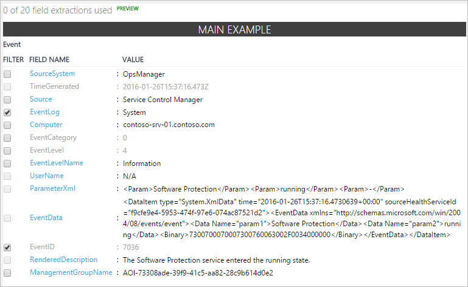
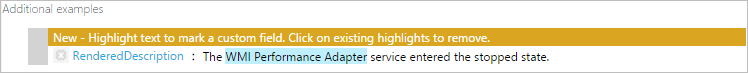

<properties
   pageTitle="Campos personalizados de análise de Log | Microsoft Azure"
   description="O recurso de campos personalizados de análise de Log permite que você crie seus próprios campos de pesquisa de dados OMS que adicionar às propriedades de um registro coletado.  Este artigo descreve o processo para criar um campo personalizado e fornece instruções passo a passo detalhada com um evento de amostra."
   services="log-analytics"
   documentationCenter=""
   authors="bwren"
   manager="jwhit"
   editor="tysonn" />
<tags
   ms.service="log-analytics"
   ms.devlang="na"
   ms.topic="article"
   ms.tgt_pltfrm="na"
   ms.workload="infrastructure-services"
   ms.date="10/18/2016"
   ms.author="bwren" />

# Campos personalizados de análise de Log

O recurso de **Campos personalizados** de análise de Log permite estender os registros existentes no repositório OMS adicionando seus próprios campos de pesquisa.  Campos personalizados são preenchidos automaticamente de extraídas de outras propriedades no mesmo registro de dados.

Por exemplo, o registro de exemplo abaixo tem dados úteis incluídos na descrição do evento.  Extrair dados em propriedades separadas, ele fica disponível para ações como filtragem e classificação.

>[AZURE.NOTE] Na visualização, você está limitado a 100 campos personalizados em seu espaço de trabalho.  Esse limite será expandido quando este recurso atinge disponibilidade geral.

## Criar um campo personalizado

Quando você cria um campo personalizado, a análise de Log deve compreender quais dados a serem usados para preencher seu valor.  Ele usa uma tecnologia da Microsoft Research chamado FlashExtract para identificar rapidamente esses dados.  Em vez de exigir que você forneça instruções explícitas, a análise de Log aprende sobre os dados que você deseja extrair dos exemplos que você fornecer.

As seções a seguir fornecem o procedimento para criar um campo personalizado.  Na parte inferior deste artigo é um passo a passo de uma extração de amostra.

> [!NOTE] O campo personalizado é preenchido como registros correspondentes aos critérios especificados são adicionados ao armazenamento de dados OMS, para que ele só aparecerá em registros agrupados após o campo personalizado é criado.  O campo personalizado não será adicionado aos registros que já estão no repositório de dados quando ele é criado.

### Etapa 1: identificar os registros que terão o campo personalizado
A primeira etapa é identificar os registros que obtenção o campo personalizado.  Inicie com uma [pesquisa de log padrão](log-analytics-log-searches.md) e, em seguida, selecione um registro para agir como o modelo de análise de Log aprenderá a partir.  Quando você especifica que você vai extrair dados em um campo personalizado, o **Assistente de extração do campo** é aberto onde você valida e refina os critérios.

2. Vá para **Pesquisa de Log** e usar uma [consulta para recuperar os registros](log-analytics-log-searches.md) que terá o campo personalizado.
2. Selecione um registro que a análise de Log usará para agir como um modelo para extrair dados para preencher o campo personalizado.  Identifique os dados que você deseja extrair esse registro e a análise de Log usará essas informações para determinar a lógica para preencher o campo personalizado para todos os registros semelhantes.
3. Clique no botão à esquerda de qualquer propriedade de texto do registro e selecione **extrair campos de**.
4. O **Assistente de extração do campo é aberto**e o registro selecionado é exibido na coluna **Principal exemplo** .  O campo personalizado será definido para esses registros com os mesmos valores nas propriedades que estão selecionados.  
5. Se a seleção não é exatamente o que você deseja, selecione campos adicionais para restringir os critérios.  Para alterar os valores de campo para os critérios, você deverá cancelar e selecione um registro diferente que correspondem aos critérios que você deseja.

### Etapa 2 - executar extrair inicial.
Depois de identificar os registros que terão o campo personalizado, você identificar os dados que você deseja extrair.  Análise de log usará essas informações para identificar padrões similares em registros semelhantes.  Na etapa depois disso você poderá validar os resultados e fornecem mais detalhes para análise de Log usar em sua análise.

1. Realce o texto do registro de exemplo que você deseja preencher o campo personalizado.  Em seguida, você verá com uma caixa de diálogo para fornecer um nome para o campo e executar a extração inicial.  Os caracteres ** \_CF** será acrescentado automaticamente.
2. Clique em **extrair** para executar uma análise de registros coletados.  
3. As seções de **Resumo** e **Os resultados de pesquisa** exibem os resultados da extração para que você pode inspecionar sua precisão.  **Resumo** exibe os critérios usados para identificar registros e uma contagem de cada um dos valores de dados identificados.  **Resultados da pesquisa** fornece uma lista detalhada dos registros que correspondem aos critérios.

### Etapa 3: verificar a precisão da extração e criar campo personalizado

Depois de ter executado a extração inicial, a análise de Log exibirá seus resultados com base em dados que já foram coletados.  Se os resultados são precisos, em seguida, você pode criar o campo personalizado sem trabalho adicional.  Caso contrário, em seguida, você pode refinar os resultados para que a análise de Log pode melhorar sua lógica.

2.  Se todos os valores na extração inicial não estiverem corretos, clique no ícone **Editar** ao lado de um registro incorreto e selecione **modificar esse realce** para modificar a seleção.
3.  A entrada é copiada para a seção de **exemplos adicionais** sob o **Exemplo principal**.  Você pode ajustar o realce aqui para ajudar a análise de Log a compreender a seleção deve fez.
4.  Clique em **extrair** para usar estes novas informações para avaliar todos os registros existentes.  Os resultados podem ser modificados para registros diferente da modificada apenas com base nessa nova inteligência.
5.  Continue a adicionar correções até que todos os registros na extração corretamente identificam os dados para preencher o novo campo personalizado.
6. Clique em **Salvar extrair** quando estiver satisfeito com os resultados.  O campo personalizado agora está definido, mas ele não será adicionado a todos os registros ainda.
7.  Aguarde novos registros correspondentes aos critérios especificados para ser coletados e execute a pesquisa de log novamente. Novos registros devem ter o campo personalizado.
8.  Use o campo personalizado como qualquer outra propriedade de registro.  Você pode usá-lo para agregados e agrupar dados e usá-lo para gerar novas reflexões.

## Exibindo os campos personalizados
Você pode exibir uma lista de todos os campos personalizados em seu grupo de gerenciamento do bloco **configurações** do painel OMS.  Selecione os **dados** e **campos personalizados** para uma lista de todos os campos personalizados em seu espaço de trabalho.  

## Remover um campo personalizado
Há duas maneiras de remover um campo personalizado.  O primeiro é a opção **Remover** para cada campo ao exibir a lista completa de conforme descrito acima.  O outro método é recuperar um registro e clique no botão à esquerda do campo.  No menu terá uma opção para remover o campo personalizado.

## Explicação passo a passo de amostra

A seção a seguir percorre um exemplo completo de criação de um campo personalizado.  Este exemplo extrai o nome do serviço de eventos do Windows que indicam um serviço de alteração de estado.  Isso depende de eventos criados pelo Gerenciador de controle de serviço no log do sistema em computadores com Windows.  Se você desejar acompanhar neste exemplo, você deve ser [coletando eventos de informações para o log do sistema](log-analytics-data-sources-windows-events.md).

Podemos insira a seguinte consulta para retornar todos os eventos do Gerenciador de controle do serviço que têm uma ID de evento de 7036 que é o evento que indica um serviço iniciar ou parar.

Em seguida, selecionamos qualquer registro com evento ID 7036.

Queremos que o nome do serviço que aparece na propriedade **RenderedDescription** e selecione o botão próximo essa propriedade.

O **Assistente de extração do campo** é aberta, e os campos de **log de eventos** e **Iddoevento** são selecionados na coluna **Principal exemplo** .  Isso indica que o campo personalizado será definido para eventos de log do sistema com uma identificação de 7036 evento.  Isso é suficiente para que não precisamos selecionar todos os demais campos.

Estamos realce o nome do serviço na propriedade **RenderedDescription** e use o **serviço** para identificar o nome do serviço.  O campo personalizado será chamado **Service_CF**.

Podemos ver que o nome do serviço é identificado corretamente para alguns registros, mas não para outras pessoas.   Os **Resultados da pesquisa** mostram que parte do nome do **Adaptador de desempenho WMI** não foi selecionada.  O **Resumo** mostra que quatro registros com o serviço de **DPRMA** incluída incorretamente uma palavra extra, e dois registros identificado **Módulos Installer** em vez de **Módulos do Windows Installer**.  

Vamos começar com o registro de **Adaptador de desempenho WMI** .  Clicamos em seu ícone de edição e **modificar esse realce**.  

Aumentaremos o realce para incluir a palavra **WMI** e execute novamente a extração.  

Podemos ver que as entradas para **Adaptador de desempenho WMI** foram corrigidas e a análise de Log usado também essas informações para corrigir os registros para o **Windows Installer do módulo**.  Podemos ver na seção **Resumo** Apesar dessa **DPMRA** ainda não estiver sendo identificado corretamente.

Estamos rolar para um registro com o serviço DPMRA e use o mesmo processo para corrigir o registro.

 Ao executar a extração, podemos ver se todos os nossos resultados agora estão precisos.

Podemos ver que **Service_CF** é criada, mas ainda não é adicionado a todos os registros.

Depois de algum tempo passou portanto novos eventos são coletados, podemos ver que que o campo **Service_CF** agora está sendo adicionado para os registros que correspondem nossos critérios.

Agora podemos usar o campo personalizado como qualquer outra propriedade de registro.  Para ilustrar isso, podemos criar uma consulta que agrupa pelo novo campo de **Service_CF** para inspecionar quais serviços estão mais ativos.

## Próximas etapas

- Saiba mais sobre [as pesquisas de log](log-analytics-log-searches.md) compilar consultas usando campos personalizados para critérios.
- Monitorar [os arquivos de log personalizados](log-analytics-data-sources-custom-logs.md) que você analisa usando campos personalizados.