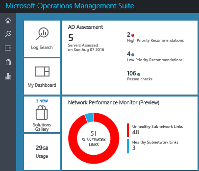
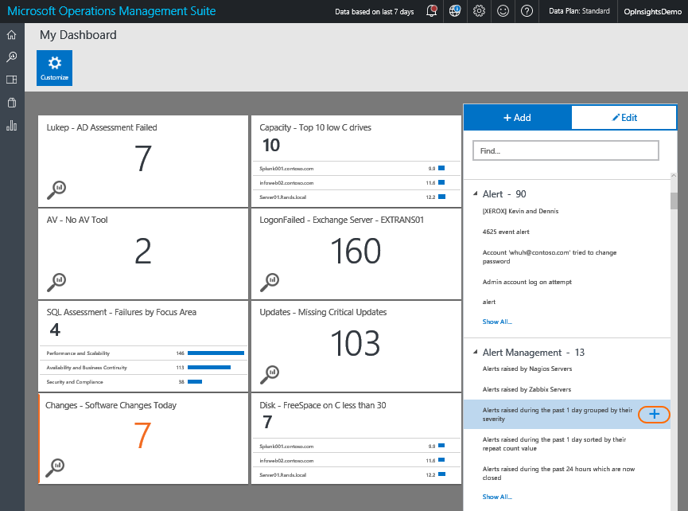

<properties
    pageTitle="Criar um painel personalizado no Log Analytics | Microsoft Azure"
    description="Este guia ajudará você a entender como o painéis de análise de Log pode visualizar todas as pesquisas de log salvo, dando a você uma lente única para exibir seu ambiente."
    services="log-analytics"
    documentationCenter=""
    authors="bandersmsft"
    manager="jwhit"
    editor=""/>

<tags
    ms.service="log-analytics"
    ms.workload="na"
    ms.tgt_pltfrm="na"
    ms.devlang="na"
    ms.topic="article"
    ms.date="10/10/2016"
    ms.author="banders"/>

# Criar um painel personalizado no Log de análise

Este guia ajuda você a entender como os painéis de análise de Log podem visualizar todas as pesquisas de log salvo, dando a você uma lente única para exibir seu ambiente.

Todos os painéis personalizados que você cria no portal do OMS também estão disponíveis no aplicativo OMS Mobile. Consulte as seguintes páginas para obter mais informações sobre os aplicativos.

- [Aplicativo móvel do OMS da Microsoft Store](http://www.windowsphone.com/store/app/operational-insights/4823b935-83ce-466c-82bb-bd0a3f58d865)
- [Aplicativo móvel do OMS do Apple iTunes](https://itunes.apple.com/app/microsoft-operations-management/id1042424859?mt=8)

## Como para criar meu dashboard?

Para começar, vá para a página Visão geral do OMS. Você verá no bloco do **Meu painel** à esquerda. Clique nele para fazer busca detalhada em seu painel.

## Adicionando um bloco

Em painéis, peças são ativadas pelo pesquisas log salvo. OMS vem com muitos feitas previamente pesquisas de log salvo, para que você possa começar imediatamente. Use as seguintes etapas que descrevem como começar.

Na minha Dashboard exibição, basta clicar **Personalizar** inserir Personalizar modo.

 O painel que se abre no lado direito da página mostra todas as pesquisas de log salvo do seu espaço de trabalho. Para visualizar uma pesquisa de log salvo como um bloco, passe o mouse sobre uma pesquisa salva e clique no símbolo **plus** .

Quando você clica no símbolo **plus** , um novo bloco aparece no modo de exibição Minhas Dashboard.

## Editar um bloco

Na minha Dashboard exibição, basta clicar **Personalizar** inserir Personalizar modo. Clique no bloco que você deseja editar. As alterações do painel direito para editar e fornece uma seleção de opções:

### Visualizações de bloco#
Há três tipos de visualizações de bloco à sua escolha:

|tipo de gráfico|o que ela faz|
|---|---|
||Exibe uma linha do tempo dos resultados da pesquisa seu log salvo como um gráfico de barras ou uma lista de resultados por um campo dependendo se sua pesquisa log agrega resultados por um campo ou não.
||Exibe seu ocorrências de resultados de pesquisa de log total como um número em um bloco. Blocos métricos permitem que você defina um limite realçará o bloco quando o limite é alcançado.|
||Exibe um cronograma de sua ocorrências de resultados de pesquisa de log salvo com valores como um gráfico de linhas.|

### Limite
Você pode criar um limite em um bloco usando a visualização métrica. Selecione para criar um valor limite no bloco. Escolha se deseja realçar o bloco quando o valor está acima ou abaixo do limite escolhido, em seguida, defina o valor de limite abaixo.

## Organizando o painel
Para organizar seu painel, navegue até o modo de exibição do painel meu e clique em **Personalizar** para inserir Personalizar modo. Clique e arraste o bloco que você deseja mover e mova-o para onde deseja que o seu bloco seja.

## Remover uma peça
Para remover uma peça, navegue até o modo de exibição do painel meu e clique em **Personalizar** para inserir Personalizar modo. Selecione o bloco que você deseja remover e, em seguida, no painel direito, selecione **Remover bloco**.

## Próximas etapas

- Crie [alertas](log-analytics-alerts.md) na análise de Log para gerar notificações e corrigir problemas.
