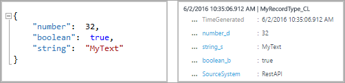

<properties
    pageTitle="Faça logon Analytics dados HTTP coletor API | Microsoft Azure"
    description="Você pode usar a API de Coletores de dados do Log Analytics HTTP para adicionar dados de POSTAGEM JSON para o repositório de análise de Log de qualquer cliente que pode chamar a API REST. Este artigo descreve como usar a API e tem exemplos de como publicar dados usando diferentes linguagens de programação."
    services="log-analytics"
    documentationCenter=""
    authors="bwren"
    manager="jwhit"
    editor=""/>

<tags
    ms.service="log-analytics"
    ms.workload="na"
    ms.tgt_pltfrm="na"
    ms.devlang="na"
    ms.topic="article"
    ms.date="10/26/2016"
    ms.author="bwren"/>


# <a name="log-analytics-http-data-collector-api"></a>API de Coletores de dados de HTTP de análise do log

Quando você usa a API de coletor do Azure Log Analytics HTTP dados, você pode adicionar dados de POSTAGEM JSON JavaScript Object Notation () para o repositório de análise de Log de qualquer cliente que pode chamar a API REST. Usando esse método, você pode enviar dados de aplicativos de terceiros ou de scripts, como de um runbook no Azure automação.  

## <a name="create-a-request"></a>Criar uma solicitação

As próximas duas tabelas listam os atributos necessários para cada solicitação para a API de Coletores de dados do Log Analytics HTTP. Podemos descrevem cada atributo mais detalhadamente posteriormente neste artigo.

### <a name="request-uri"></a>URI de solicitação

| Atributo | Propriedade |
|:--|:--|
| Método | Postar |
| URI | https://\<CustomerId\>.ods.opinsights.azure.com/api/logs?api-version=2016-04-01 |
| Tipo de conteúdo | aplicativo/json |

### <a name="request-uri-parameters"></a>Parâmetros de URI de solicitação
| Parâmetro | Descrição |
|:--|:--|
| CustomerID  | O identificador exclusivo para o espaço de trabalho do pacote de gerenciamento de operações do Microsoft. |
| Recurso    | O nome do recurso de API: / api/logs. |
| Versão da API | A versão da API para usar com esta solicitação. Atualmente, ele é 2016-04-01. |

### <a name="request-headers"></a>Cabeçalhos de solicitação
| Cabeçalho | Descrição |
|:--|:--|
| Autorização | A assinatura de autorização. Posteriormente neste artigo, você pode ler sobre como criar um cabeçalho HMAC-SHA256. |
| Tipo de log | Especifique o tipo de registro dos dados que estão sendo enviados. Atualmente, o tipo de log suporta somente caracteres alfabéticos. Ele não suporta numéricos ou caracteres especiais. |
| x-ms-data | A data em que a solicitação foi processada, no formato de RFC 1123. |
| campo gerado hora | O nome de um campo dos dados que contém o carimbo de hora do item de dados. Se você especificar um campo seu conteúdo é usado para **TimeGenerated**. Se esse campo não for especificado, o padrão para **TimeGenerated** é o tempo que a mensagem é incluída. O conteúdo do campo mensagem deverá seguir o formato ISO 8601 aaaa-MM-DDThh:mm:ssZ. |


## <a name="authorization"></a>Autorização

Qualquer solicitação para a API de Coletores de dados do Log Analytics HTTP deve incluir um cabeçalho de autorização. Para autenticar uma solicitação, você deve entrar a solicitação com primário ou a chave secundária do espaço de trabalho que está fazendo a solicitação. Em seguida, passe essa assinatura como parte da solicitação.   

Aqui é o formato para o cabeçalho de autorização:

```
Authorization: SharedKey <WorkspaceID>:<Signature>
```

*WorkspaceID* é o identificador exclusivo para o espaço de trabalho do pacote de gerenciamento de operações. *Assinatura* é um [Código de autenticação de mensagem baseado em Hash (HMAC)](https://msdn.microsoft.com/library/system.security.cryptography.hmacsha256.aspx) que é construída da solicitação e, em seguida, calculado usando o [algoritmo de SHA256](https://msdn.microsoft.com/library/system.security.cryptography.sha256.aspx). Em seguida, você o codificar usando codificação na Base 64.

Use este formato para codificar a cadeia de caracteres de assinatura de **SharedKey** :

```
StringToSign = VERB + "\n" +
               Content-Length + "\n" +
               Content-Type + "\n" +
               x-ms-date + "\n" +
               "/api/logs";
```

Aqui está um exemplo de uma cadeia de caracteres de assinatura:

```
POST\n1024\napplication/json\nx-ms-date:Mon, 04 Apr 2016 08:00:00 GMT\n/api/logs
```

Quando você tiver a cadeia de caracteres de assinatura, codificá-lo usando o algoritmo HMAC-SHA256 na cadeia de caracteres codificado em UTF-8 e, em seguida, codificar o resultado como na Base 64. Use este formato:

```
Signature=Base64(HMAC-SHA256(UTF8(StringToSign)))
```

Os exemplos nas próximas seções tem código de amostra para ajudá-lo a criar um cabeçalho de autorização.

## <a name="request-body"></a>Corpo da solicitação

O corpo da mensagem deve ser em JSON. Ele deve incluir um ou mais registros com os pares de nome e o valor de propriedade neste formato:

```
{
"property1": "value1",
" property 2": "value2"
" property 3": "value3",
" property 4": "value4"
}
```

Você pode lote vários registros juntos em uma única solicitação usando o seguinte formato. Todos os registros devem ser o mesmo tipo de registro.

```
{
"property1": "value1",
" property 2": "value2"
" property 3": "value3",
" property 4": "value4"
},
{
"property1": "value1",
" property 2": "value2"
" property 3": "value3",
" property 4": "value4"
}
```

## <a name="record-type-and-properties"></a>Propriedades e tipo de registro

Você define um tipo de registro personalizado quando você envia dados por meio da API de Coletores de dados do Log Analytics HTTP. Atualmente, você não pode gravar dados em tipos de registro existentes criadas por outras soluções e tipos de dados. Análise de log lê os dados de entrada e cria propriedades que correspondem aos tipos de dados dos valores que você insere.

Cada solicitação para a API de análise de Log deve incluir um cabeçalho de **Tipo de Log** com o nome do tipo de registro. O sufixo **_CL** automaticamente é acrescentado ao nome que você insere para distingui-lo de outros tipos de log como um log personalizado. Por exemplo, se você inserir o nome **MyNewRecordType**, a análise de Log cria um registro com o tipo de **MyNewRecordType_CL**. Isso ajuda a garantir que não há nenhum conflito entre os nomes de tipo criados pelo usuário e os fornecida no Microsoft solutions atual ou futuro.

Para identificar um tipo de dados, a análise de Log adiciona um sufixo ao nome da propriedade. Se uma propriedade contiver um valor nulo, a propriedade não será incluída no registro. Esta tabela lista o tipo de dados de propriedade e o sufixo correspondente:

| Tipo de dados de propriedade | Sufixo |
|:--|:--|
| Cadeia de caracteres    | t |
| Booliano   | _b |
| Duplo    | _d |
| Data/hora | t |
| GUID      | _g |


O tipo de dados que usa a análise de Log para cada propriedade depende de se o tipo de registro do novo registro já existe.

- Se o tipo de registro não existir, a análise de Log cria um novo. Análise de log usa a inferência JSON para determinar o tipo de dados para cada propriedade do novo registro.
- Se o tipo de registro existir, a análise de Log tenta criar um novo registro com base em propriedades existentes. Se o tipo de dados para uma propriedade no novo registro não corresponderem ao e não pode ser convertida para o tipo existente, ou se o registro inclui uma propriedade que não existe, a análise de Log cria uma nova propriedade que tem o sufixo relevante.

Por exemplo, essa entrada de envio deve criar um registro com três propriedades, **number_d**, **boolean_b**e **string_s**:



Se você enviou depois essa entrada próxima, com todos os valores formatados como cadeias de caracteres, as propriedades não altere. Esses valores podem ser convertidas em tipos de dados existentes:


Mas, se você tiver feito, em seguida, o próximo envio, a análise de Log criaria a novas propriedades **boolean_d** e **string_d**. Esses valores não podem ser convertidos:


Se você enviou a seguinte entrada, em seguida, antes do tipo de registro foi criado, a análise de Log cria um registro com três propriedades, **núm_s**, **boolean_s**e **string_s**. Nesta entrada, cada um dos valores iniciais é formatada como uma cadeia de caracteres:


## <a name="data-limits"></a>Limites de dados
Há algumas restrições em torno dos dados postados para o conjunto de dados de análise de Log API.

- Máximo de 30 MB por postagem para API de coletor de dados de análise de Log. Este é um limite de tamanho de uma única postagem. Se os dados de uma única postagem que excede 30 MB, você deverá dividir os dados até o menores tamanho blocos e enviá-las simultaneamente. 
- Máximo de limite de 32 KB para valores de campo. Se o valor do campo for maior que 32 KB, os dados serão truncados. 
- Número máximo recomendado de campos para um determinado tipo é 50. Este é um limite prático de uma perspectiva de experiência de pesquisa e usabilidade.  


## <a name="return-codes"></a>Códigos de retorno

O código de status HTTP 202 significa que a solicitação foi aceita para processamento, mas o processamento ainda não terminou. Isso indica que a operação concluída com êxito.

Esta tabela lista o conjunto completo de códigos de status que o serviço pode retornar:

| Código | Status | Código de erro | Descrição |
|:--|:--|:--|:--|
| 202 | Aceita |  | A solicitação foi aceita com êxito. |
| 400 | Solicitação inválida | InactiveCustomer | O espaço de trabalho foi fechado. |
| 400 | Solicitação inválida | InvalidApiVersion | A versão da API que você especificou não foi reconhecida pelo serviço. |
| 400 | Solicitação inválida | InvalidCustomerId | O ID de espaço de trabalho especificado é inválido. |
| 400 | Solicitação inválida | InvalidDataFormat | JSON inválido foi enviado. Corpo da resposta pode conter mais informações sobre como resolver o erro. |
| 400 | Solicitação inválida | InvalidLogType | O tipo de registro especificado contidas caracteres especiais ou numéricos. |
| 400 | Solicitação inválida | MissingApiVersion | A versão de API não foi especificada. |
| 400 | Solicitação inválida | MissingContentType | O tipo de conteúdo não foi especificado. |
| 400 | Solicitação inválida | MissingLogType | O tipo de log de valor necessário não foi especificado. |
| 400 | Solicitação inválida | UnsupportedContentType | O tipo de conteúdo não foi definido como **application/json**. |
| 403 | Proibido | InvalidAuthorization | O serviço falhou autenticar a solicitação. Verifique se a chave de ID e a conexão do espaço de trabalho são válidos. |
| 500 | Erro interno do servidor | UnspecifiedError | O serviço encontrou um erro interno. Repita a solicitação. |
| 503 | Serviço indisponível | ServiceUnavailable | O serviço atualmente não está disponível para receber solicitações. Repita a solicitação. |

## <a name="query-data"></a>Dados da consulta

Para consultar dados enviados pela API de Coletores de dados do Log Analytics HTTP, procurar registros com **tipo** que é igual ao valor **LogType** que você especificado, acrescentadas com **_CL**. Por exemplo, se você usou **MyCustomLog**, em seguida, você retorna todos os registros com **tipo = MyCustomLog_CL**.


## <a name="sample-requests"></a>Solicitações de amostra

As próximas seções, você encontrará exemplos de como enviar dados para a API de Coletores de dados do Log Analytics HTTP usando diferentes linguagens de programação.

Para cada exemplo, siga estas etapas para definir as variáveis para o cabeçalho de autorização:

1. No portal do pacote de gerenciamento de operações, selecione o bloco **configurações** e selecione a guia de **Fontes conectadas** .
2. À direita da **ID de espaço de trabalho**, selecione o ícone de cópia e cole a ID como o valor da variável **ID do cliente** .
3. À direita de **Chave primária**, selecione o ícone de cópia e, em seguida, cole a ID como o valor da variável **Chave compartilhada** .

Como alternativa, você pode alterar as variáveis para o tipo de log e dados JSON.

### <a name="powershell-sample"></a>Exemplo do PowerShell

```
# Replace with your Workspace ID
$CustomerId = "xxxxxxxx-xxxx-xxxx-xxxx-xxxxxxxxxxxx"  

# Replace with your Primary Key
$SharedKey = "xxxxxxxxxxxxxxxxxxxxxxxxxxxxxx"

# Specify the name of the record type that you'll be creating
$LogType = "MyRecordType"

# Specify a field with the created time for the records
$TimeStampField = "DateValue"


# Create two records with the same set of properties to create
$json = @"
[{  "StringValue": "MyString1",
    "NumberValue": 42,
    "BooleanValue": true,
    "DateValue": "2016-05-12T20:00:00.625Z",
    "GUIDValue": "9909ED01-A74C-4874-8ABF-D2678E3AE23D"
},
{   "StringValue": "MyString2",
    "NumberValue": 43,
    "BooleanValue": false,
    "DateValue": "2016-05-12T20:00:00.625Z",
    "GUIDValue": "8809ED01-A74C-4874-8ABF-D2678E3AE23D"
}]
"@

# Create the function to create the authorization signature
Function Build-Signature ($customerId, $sharedKey, $date, $contentLength, $method, $contentType, $resource)
{
    $xHeaders = "x-ms-date:" + $date
    $stringToHash = $method + "`n" + $contentLength + "`n" + $contentType + "`n" + $xHeaders + "`n" + $resource

    $bytesToHash = [Text.Encoding]::UTF8.GetBytes($stringToHash)
    $keyBytes = [Convert]::FromBase64String($sharedKey)

    $sha256 = New-Object System.Security.Cryptography.HMACSHA256
    $sha256.Key = $keyBytes
    $calculatedHash = $sha256.ComputeHash($bytesToHash)
    $encodedHash = [Convert]::ToBase64String($calculatedHash)
    $authorization = 'SharedKey {0}:{1}' -f $customerId,$encodedHash
    return $authorization
}


# Create the function to create and post the request
Function Post-OMSData($customerId, $sharedKey, $body, $logType)
{
    $method = "POST"
    $contentType = "application/json"
    $resource = "/api/logs"
    $rfc1123date = [DateTime]::UtcNow.ToString("r")
    $contentLength = $body.Length
    $signature = Build-Signature `
        -customerId $customerId `
        -sharedKey $sharedKey `
        -date $rfc1123date `
        -contentLength $contentLength `
        -fileName $fileName `
        -method $method `
        -contentType $contentType `
        -resource $resource
    $uri = "https://" + $customerId + ".ods.opinsights.azure.com" + $resource + "?api-version=2016-04-01"

    $headers = @{
        "Authorization" = $signature;
        "Log-Type" = $logType;
        "x-ms-date" = $rfc1123date;
        "time-generated-field" = $TimeStampField;
    }

    $response = Invoke-WebRequest -Uri $uri -Method $method -ContentType $contentType -Headers $headers -Body $body -UseBasicParsing
    return $response.StatusCode

}

# Submit the data to the API endpoint
Post-OMSData -customerId $customerId -sharedKey $sharedKey -body ([System.Text.Encoding]::UTF8.GetBytes($json)) -logType $logType  
```

### <a name="c-sample"></a>Amostra c#

```
using System;
using System.Net;
using System.Security.Cryptography;

namespace OIAPIExample
{
    class ApiExample
    {
// An example JSON object, with key/value pairs
        static string json = @"[{""DemoField1"":""DemoValue1"",""DemoField2"":""DemoValue2""},{""DemoField1"":""DemoValue3"",""DemoField2"":""DemoValue4""}]";

// Update customerId to your Operations Management Suite workspace ID
        static string customerId = "xxxxxxxx-xxx-xxx-xxx-xxxxxxxxxxxx";

// For sharedKey, use either the primary or the secondary Connected Sources client authentication key   
        static string sharedKey = "xxxxxxxxxxxxxxxxxxxxxxxxxxxxxx";

// LogName is name of the event type that is being submitted to Log Analytics
        static string LogName = "DemoExample";

// You can use an optional field to specify the timestamp from the data. If the time field is not specified, Log Analytics assumes the time is the message ingestion time
        static string TimeStampField = "";

        static void Main()
        {
// Create a hash for the API signature
            var datestring = DateTime.UtcNow.ToString("r");
            string stringToHash = "POST\n" + json.Length + "\napplication/json\n" + "x-ms-date:" + datestring + "\n/api/logs";
            string hashedString = BuildSignature(stringToHash, sharedKey);
            string signature = "SharedKey " + customerId + ":" + hashedString;

            PostData(signature, datestring, json);
        }

// Build the API signature
        public static string BuildSignature(string message, string secret)
        {
            var encoding = new System.Text.ASCIIEncoding();
            byte[] keyByte = Convert.FromBase64String(secret);
            byte[] messageBytes = encoding.GetBytes(message);
            using (var hmacsha256 = new HMACSHA256(keyByte))
            {
                byte[] hash = hmacsha256.ComputeHash(messageBytes);
                return Convert.ToBase64String(hash);
            }
        }

// Send a request to the POST API endpoint
        public static void PostData(string signature, string date, string json)
        {
            string url = "https://"+ customerId +".ods.opinsights.azure.com/api/logs?api-version=2016-04-01";
            using (var client = new WebClient())
            {
                client.Headers.Add(HttpRequestHeader.ContentType, "application/json");
                client.Headers.Add("Log-Type", LogName);
                client.Headers.Add("Authorization", signature);
                client.Headers.Add("x-ms-date", date);
                client.Headers.Add("time-generated-field", TimeStampField);
                client.UploadString(new Uri(url), "POST", json);
            }
        }
    }
}
```

### <a name="python-sample"></a>Amostra de Python

```
import json
import requests
import datetime
import hashlib
import hmac
import base64

# Update the customer ID to your Operations Management Suite workspace ID
customer_id = 'xxxxxxx-xxxx-xxxx-xxxx-xxxxxxxxxxxx'

# For the shared key, use either the primary or the secondary Connected Sources client authentication key   
shared_key = "xxxxxxxxxxxxxxxxxxxxxxxxxxxxxx"

# The log type is the name of the event that is being submitted
log_type = 'WebMonitorTest'

# An example JSON web monitor object
json_data = [{
   "slot_ID": 12345,
    "ID": "5cdad72f-c848-4df0-8aaa-ffe033e75d57",
    "availability_Value": 100,
    "performance_Value": 6.954,
    "measurement_Name": "last_one_hour",
    "duration": 3600,
    "warning_Threshold": 0,
    "critical_Threshold": 0,
    "IsActive": "true"
},
{   
    "slot_ID": 67890,
    "ID": "b6bee458-fb65-492e-996d-61c4d7fbb942",
    "availability_Value": 100,
    "performance_Value": 3.379,
    "measurement_Name": "last_one_hour",
    "duration": 3600,
    "warning_Threshold": 0,
    "critical_Threshold": 0,
    "IsActive": "false"
}]
body = json.dumps(json_data)

#####################
######Functions######  
#####################

# Build the API signature
def build_signature(customer_id, shared_key, date, content_length, method, content_type, resource):
    x_headers = 'x-ms-date:' + date
    string_to_hash = method + "\n" + str(content_length) + "\n" + content_type + "\n" + x_headers + "\n" + resource
    bytes_to_hash = bytes(string_to_hash).encode('utf-8')  
    decoded_key = base64.b64decode(shared_key)
    encoded_hash = base64.b64encode(hmac.new(decoded_key, bytes_to_hash, digestmod=hashlib.sha256).digest())
    authorization = "SharedKey {}:{}".format(customer_id,encoded_hash)
    return authorization

# Build and send a request to the POST API
def post_data(customer_id, shared_key, body, log_type):
    method = 'POST'
    content_type = 'application/json'
    resource = '/api/logs'
    rfc1123date = datetime.datetime.utcnow().strftime('%a, %d %b %Y %H:%M:%S GMT')
    content_length = len(body)
    signature = build_signature(customer_id, shared_key, rfc1123date, content_length, method, content_type, resource)
    uri = 'https://' + customer_id + '.ods.opinsights.azure.com' + resource + '?api-version=2016-04-01'

    headers = {
        'content-type': content_type,
        'Authorization': signature,
        'Log-Type': log_type,
        'x-ms-date': rfc1123date
    }

    response = requests.post(uri,data=body, headers=headers)
    if (response.status_code == 202):
        print 'Accepted'
    else:
        print "Response code: {}".format(response.status_code)

post_data(customer_id, shared_key, body, log_type)
```

## <a name="next-steps"></a>Próximas etapas

- Use o [Designer de modo de exibição](log-analytics-view-designer.md) para criar exibições personalizadas nos dados que você enviar.
