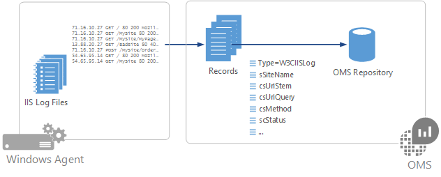

<properties
   pageTitle="O IIS registra em Log Analytics | Microsoft Azure"
   description="Serviços de informações da Internet (IIS) armazena atividade do usuário em arquivos de log que podem ser obtidos pela análise de Log.  Este artigo descreve como configurar coleção de logs do IIS e detalhes dos registros criam no repositório OMS."
   services="log-analytics"
   documentationCenter=""
   authors="bwren"
   manager="jwhit"
   editor="tysonn" />
<tags
   ms.service="log-analytics"
   ms.devlang="na"
   ms.topic="article"
   ms.tgt_pltfrm="na"
   ms.workload="infrastructure-services"
   ms.date="10/18/2016"
   ms.author="bwren" />

# Logs de IIS na análise de Log
Serviços de informações da Internet (IIS) armazena atividade do usuário em arquivos de log que podem ser obtidos pela análise de Log.  

## Logs de configuração do IIS
Análise de log coleta entradas de arquivos de log criados pelo IIS, portanto você deve [Configurar o IIS para registrar em log](https://technet.microsoft.com/library/hh831775.aspx).

Análise de log somente dá suporte a arquivos de log do IIS armazenados no formato de W3C e não suporta campos personalizados ou avançadas de log do IIS.  
Análise de log não coletar logs em formato nativo NCSA ou IIS.

Configure logs do IIS em análise de Log no [menu de dados nas configurações de análise de Log](log-analytics-data-sources.md#configuring-data-sources).  Não há nenhuma configuração necessária senão selecionando **arquivos de log de formato de coletar W3C IIS**.

Recomendamos que, quando você habilita a coleta de log do IIS, você deve configurar a configuração de sobreposição de log do IIS em cada servidor.

## Coleta de dados

Análise de log coleta entradas de log do IIS de cada fonte conectada aproximadamente a cada 15 minutos.  O agente registra seu lugar em cada log de eventos que ela coleta de.  Se o agente de ficar offline, em seguida, a análise de Log coleta eventos do onde parou, mesmo se os eventos foram criados enquanto o agente estava offline.

## Propriedades de registro de log do IIS

Registros de log do IIS têm um tipo de **W3CIISLog** e tem as propriedades da tabela a seguir:

| Propriedade | Descrição |
|:--|:--|
| Computador | Nome do computador que o evento foram coletado do. |
| cIP | Endereço IP do cliente. |
| csMethod | Método de solicitação de como obter ou POSTAGEM. |
| csReferer | Site que o usuário seguiu um link de para o site atual. |
| csUserAgent | Tipo de navegador do cliente. |
| csUserName | Nome do usuário autenticado que acessados no servidor. Usuários anônimos são indicados por um hífen. |
| csUriStem | Destino da solicitação como uma página da web. |
| csUriQuery | Consulta, se houver, que o cliente estava tentando executar. |
| ManagementGroupName | Nome do grupo de gerenciamento de agentes do Operations Manager.  Para outros agentes, isso é AOI -\<identificação de espaço de trabalho\> |
| RemoteIPCountry | País/região do endereço IP do cliente. |
| RemoteIPLatitude | Latitude do endereço IP do cliente. |
| RemoteIPLongitude | Longitude do endereço IP do cliente. |
| scStatus | Código de status HTTP. |
| scSubStatus | Código de erro de substatus. |
| scWin32Status | Código de status do Windows. |
| sIP | Endereço IP do servidor web. |
| SourceSystem  | OpsMgr |
| Esporte | Porta do cliente conectado ao servidor. |
| sSiteName | Nome do site do IIS. |
| TimeGenerated | Data e hora que a entrada foi registrada. |
| TimeTaken | Período de tempo para processar a solicitação em milissegundos. |

## Pesquisas de log com logs do IIS

A tabela a seguir fornece exemplos diferentes de consultas de log que recuperam registros de log do IIS.

| Consulta | Descrição |
|:--|:--|
| Tipo = IISLog | Todos os registros de log do IIS. |
| Tipo = IISLog EventLevelName = erro | Todos os eventos do Windows com gravidade do erro. |
| Tipo = W3CIISLog & #124; Count () medida por cIP | Contagem do IIS entradas de log pelo endereço IP do cliente. |
| Tipo = W3CIISLog csHost = "www.contoso.com" & #124; Count () medida por csUriStem | Contagem do IIS faça logon entradas por URL para o host www.contoso.com. |
| Tipo = W3CIISLog & #124; Meça Sum(csBytes) por computador & #124; início 500000| Total de bytes recebidos por cada computador IIS. |

## Próximas etapas

- Configure a análise de Log para coletar outras [fontes de dados](log-analytics-data-sources.md) para análise.
- Saiba mais sobre [as pesquisas de log](log-analytics-log-searches.md) analisar os dados coletados de fontes de dados e soluções.
- Configure alertas em análises de Log para notificá-lo de condições importantes encontradas em logs do IIS proativamente.
