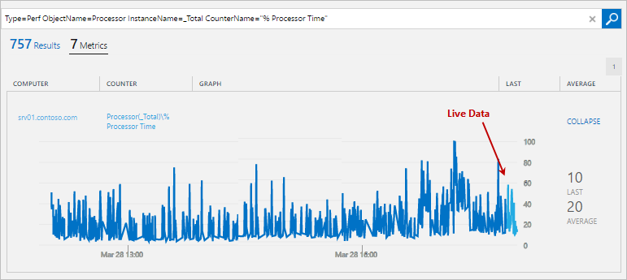

<properties 
   pageTitle="Contadores de desempenho do Windows e Linux em análise de Log | Microsoft Azure"
   description="Contadores de desempenho são coletados pela análise de Log para analisar o desempenho em agentes Windows e Linux.  Este artigo descreve como configurar o conjunto de contadores de desempenho para Windows e Linux agentes, detalhes do que eles são armazenados no repositório OMS e como analisá-los no portal do OMS."
   services="log-analytics"
   documentationCenter=""
   authors="bwren"
   manager="jwhit"
   editor="tysonn" />
<tags 
   ms.service="log-analytics"
   ms.devlang="na"
   ms.topic="article"
   ms.tgt_pltfrm="na"
   ms.workload="infrastructure-services"
   ms.date="10/27/2016"
   ms.author="bwren" />

# Windows e Linux fontes de dados de desempenho em análise de Log 

Contadores de desempenho no Windows e Linux fornecem informações sobre o desempenho dos componentes de hardware, sistemas operacionais e aplicativos.  Análise de log pode coletar contadores de desempenho em intervalos frequentes para análise de perto Tempo Real (NRT) além de agregar dados de desempenho para uma análise mais termos e relatórios.

## Configurando contadores de desempenho

Configure contadores de desempenho no [menu de dados nas configurações de análise de Log](log-analytics-data-sources.md#configuring-data-sources).

Quando você configura o Windows ou Linux desempenho contadores para um novo espaço de trabalho OMS pela primeira vez, você terá a opção para criar rapidamente vários contadores comuns.  Eles são listados com uma caixa de seleção ao lado de cada.  Certifique-se de que qualquer contador que você deseja criar inicialmente está marcadas e clique em **Adicionar contadores de desempenho selecionados**.

Siga este procedimento para adicionar um novo contador de desempenho do Windows para coletar.

1. Digite o nome do contador na caixa de texto na Formatar *objeto (instância) \counter*.  Quando você começa a digitar, são apresentadas com uma lista correspondente de contadores comuns.  Você pode selecionar um contador na lista ou digite em um dos seus próprios.  Você também pode retornar todas as instâncias de um contador específico, especificando *objeto\contador*. 
2. Clique em **+** ou pressione **Enter** para adicionar o contador à lista.
3. Quando você adiciona um contador, ele usa o padrão de 10 segundos para seu **Intervalo de exemplo**.  Você pode alterar isso para um valor maior de até 1800 segundos (30 minutos) se você quiser reduzir os requisitos de armazenamento os dados de desempenho coletados.
4. Quando terminar de adicionar contadores, clique no botão **Salvar** na parte superior da tela para salvar a configuração.

Siga este procedimento para adicionar um novo contador de desempenho de Linux para coletar.

1. Por padrão, todas as alterações de configuração são enviadas automaticamente para todos os agentes.  Para agentes Linux, um arquivo de configuração é enviado para o coletor de dados de Fluentd.  Se você deseja modificar esse arquivo manualmente em cada agente Linux, desmarque a caixa *Aplicar abaixo de configuração para minha máquinas Linux*.
2. Digite o nome do contador na caixa de texto na Formatar *objeto (instância) \counter*.  Quando você começa a digitar, são apresentadas com uma lista correspondente de contadores comuns.  Você pode selecionar um contador na lista ou digite em um dos seus próprios.  
2. Clique em **+** ou pressione **Enter** para adicionar o contador à lista de outros contadores para o objeto.
3. Todos os contadores para um objeto usam o mesmo **Intervalo de exemplo**.  O padrão é 10 segundos.  Você alterar isso para um valor maior de até 1800 segundos (30 minutos) se você quiser reduzir os requisitos de armazenamento os dados de desempenho coletados.
4. Quando terminar de adicionar contadores, clique no botão **Salvar** na parte superior da tela para salvar a configuração.

## Coleta de dados

Análise de log coleta todos os contadores de desempenho especificado em seu intervalo de amostra especificado em todos os agentes que têm que contador instalado.  Os dados não são agregados, e os dados processados estão disponíveis em todos os modos de pesquisa de log para a duração especificada por sua assinatura do OMS.

## Propriedades do registro de desempenho

Os registros de desempenho têm um tipo de **desempenho** e as propriedades da tabela a seguir.

| Propriedade | Descrição |
|:--|:--|
| Computador         | Computador que o evento foram coletado do. |
| CounterName      | Nome do contador de desempenho |
| CounterPath      | Caminho completo do contador no formulário \\ \\ \<computador >\\objeto (instância)\\contador. |
| CounterValue     | Valor numérico do contador.  |
| Nome     | Nome da instância do evento.  Vazia se nenhuma instância. |
| ObjectName       | Nome do objeto de desempenho |
| SourceSystem  | Tipo de agente que os dados foram coletados do.   Conectar OpsManager – agente do Windows, direta ou SCOM   Linux – todos os agentes de Linux    AzureStorage – diagnóstico do Azure |
| TimeGenerated       | Data e hora que dos dados foi amostra. |

## Estimativas de dimensionamento

 Uma estimativa aproximada para conjunto de um contador específico em intervalos de 10 segundos é cerca de 1 MB por dia por instância.  Você pode estimar os requisitos de armazenamento de um contador específico com a seguinte fórmula.

    1 MB x (number of counters) x (number of agents) x (number of instances)

## Pesquisas de log com registros de desempenho

A tabela a seguir fornece exemplos diferentes de pesquisas de log que recuperar registros de desempenho.

| Consulta | Descrição |
|:--|:--|
| Tipo = desempenho | Todos os dados de desempenho |
| Tipo = desempenho computador = "Meu computador" | Todos os dados de desempenho de um computador específico |
| Tipo = desempenho CounterName = "Comprimento de fila de disco atual" | Todos os dados de desempenho de um contador específico |
| Tipo = desempenho (ObjectName = processador) CounterName = "% tempo de processador" InstanceName = total & #124; Meça Avg(Average) como AVGCPU por computador | Utilização média da CPU em todos os computadores |
| Tipo = desempenho (CounterName = "hora de processador %") & #124;  Meça max(Max) por computador | Utilização de CPU máxima em todos os computadores |
| Tipo = desempenho ObjectName = disco lógico CounterName = computador "Comprimento da fila de disco atual" = "Nome_do_meu_computador" & #124; Meça Avg(Average) por nome | Comprimento médio da fila de disco atual em todas as instâncias de um determinado computador |
| Tipo = desempenho CounterName = "DiskTransfers/seg" & #124; Meça percentile95(Average) por computador | 95 percentil de transferências de disco/segundo em todos os computadores |
| Tipo = desempenho CounterName = "% tempo de processador" InstanceName = total"& #124; Meça avg(CounterValue) pelo intervalo de computador 1 hora | Por hora média de uso da CPU entre todos os computadores |
| Tipo = desempenho computador = CounterName "Meu computador" = % * InstanceName = total & #124; Meça percentile70(CounterValue) pelo intervalo de CounterName 1 hora | Percentil 70 por hora de cada contador de porcentagem % de um determinado computador |
| Tipo = desempenho CounterName = "% tempo de processador" InstanceName = total"(computador ="Meu computador") & #124; Meça min(CounterValue), avg(CounterValue), percentile75(CounterValue), max(CounterValue) pelo intervalo de computador 1 hora | Por hora média, mínima, máxima e 75 percentil da CPU para um computador específico |

## Exibir dados de desempenho

Quando você executa uma pesquisa de log de dados de desempenho, o modo de exibição de **Log** é exibido por padrão.  Para exibir os dados no formato gráfico, clique em **métricas**.  Para uma exibição detalhada de gráfica, clique na **+** ao lado de um contador.  

Se o intervalo de tempo que você selecionou é 6 horas ou menos, o gráfico é atualizado cada alguns segundos.  Os dados ao vivo são exibidos no lado direito do gráfico em azul clara.

Agregar dados de desempenho em uma pesquisa de log, consulte [agregação métrica sob demanda e visualização em OMS](http://blogs.technet.microsoft.com/msoms/2016/02/26/on-demand-metric-aggregation-and-visualization-in-oms/).

## Próximas etapas

- Saiba mais sobre [as pesquisas de log](log-analytics-log-searches.md) analisar os dados coletados de fontes de dados e soluções.  
- Exporte dados coletados para o [Power BI](log-analytics-powerbi.md) para análise e visualizações adicionais.