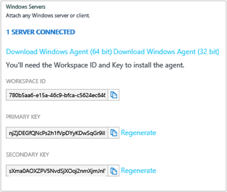

<properties
    pageTitle="Começar a usar a análise de Log | Microsoft Azure"
    description="Você pode começar a trabalhar com a análise de Log no pacote de gerenciamento do Microsoft operações (OMS) em minutos."
    services="log-analytics"
    documentationCenter=""
    authors="bandersmsft"
    manager="jwhit"
    editor=""/>

<tags
    ms.service="log-analytics"
    ms.workload="na"
    ms.tgt_pltfrm="na"
    ms.devlang="na"
    ms.topic="get-started-article"
    ms.date="10/10/2016"
    ms.author="banders"/>

# Começar a usar a análise de Log

Você pode começar a trabalhar com a análise de Log no pacote de gerenciamento do Microsoft operações (OMS) em minutos. Ao escolher como criar um espaço de trabalho do OMS, que é semelhante a uma conta, você tem duas opções:

- Site do pacote de gerenciamento de operações do Microsoft
- Assinatura do Microsoft Azure

Você pode criar um espaço de trabalho OMS livre usando o site OMS. Ou, você pode usar uma assinatura do Microsoft Azure para criar um espaço de trabalho do OMS. Ambos os espaços de trabalho são funcionalidades equivalentes, exceto que um espaço de trabalho do OMS gratuito só pode enviar 500 MB de dados diariamente para o serviço OMS. Se você usar uma assinatura do Azure, você também pode usar essa assinatura para acessar outros serviços do Azure. Independentemente do método que você usa para criar o espaço de trabalho, você vai criar o espaço de trabalho com uma conta da Microsoft ou conta organizacional.

Aqui está uma olhada no processo:

## Análise de log pré-requisitos e considerações de implantação

- Você precisa de uma assinatura paga do Microsoft Azure totalmente usar a análise de Log. Se você não tiver uma assinatura do Azure, crie uma [conta gratuita](https://azure.microsoft.com/free/) que permite que você acesse qualquer serviço Azure. Ou, você pode criar uma conta gratuita do OMS no site do [Pacote de gerenciamento de operações](http://microsoft.com/oms) e clique em **Experimente gratuitamente**.
- Um espaço de trabalho do OMS
- Cada computador com Windows que você deseja coletar dados de devem executar o Windows Server 2008 SP1 ou superior
- Acesso de [firewall](log-analytics-proxy-firewall.md) para o OMS endereços do serviço da web
- Um servidor de [OMS Log Analytics encaminhadores](https://blogs.technet.microsoft.com/msoms/2016/03/17/oms-log-analytics-forwarder) (Gateway) para encaminhar o tráfego de servidores para OMS, se o acesso à Internet não está disponível nos computadores
- Se você usar o Operations Manager, suportes de análise de Log Operations Manager 2012 SP1 UR6 e acima e Operations Manager 2012 R2 UR2 e acima. Suporte de proxy foi adicionado no Operations Manager 2012 SP1 UR7 e UR3 do Operations Manager 2012 R2. Determine como ele será integrado ao OMS.
- Determine se seus computadores têm acesso direto à Internet. Se não, eles exigem um servidor de gateway para acessar o serviço de sites OMS. Todo o acesso é via HTTPS.
- Determine quais tecnologias e servidores enviará dados ao OMS. Por exemplo, controladores de domínio, SQL Server, etc.
- Conceder permissão para usuários em OMS e Azure.
- Se você estiver preocupado sobre o uso de dados, implantar cada solução individualmente e testar o impacto de desempenho antes de adicionar soluções adicionais.
- Revise o uso de dados e o desempenho conforme você adicionar recursos e soluções para a análise de Log. Isso inclui coleta de eventos, conjunto de log, coleta de dados de desempenho, etc. Começar com melhor é conjunto mínimo até o uso de dados ou impacto no desempenho foi identificado.
- Verificar se os agentes Windows não também são gerenciados usando Operations Manager, caso contrário resultará dados duplicados. Isso também se aplica ao Azure--agentes que tenham o diagnóstico do Azure habilitado.
- Depois de instalar agentes, verifique se o agente está funcionando corretamente. Se não, verifique se que a API de criptografia: isolamento de chave de próxima geração (CNG) não está desativado usando diretiva de grupo.
- Algumas soluções de análise de Log possuem requisitos adicionais

## Inscrever-se em 3 etapas usando o pacote de gerenciamento de operações

1. Acesse o site do [Pacote de gerenciamento de operações](http://microsoft.com/oms) e clique em **Experimente gratuitamente**. Entrar com sua conta da Microsoft como o Outlook.com, ou com uma conta organizacional fornecidas pela sua empresa ou instituição educacional para usar com o Office 365 ou outros serviços da Microsoft.
2. Forneça um nome exclusivo do espaço de trabalho. Um espaço de trabalho é um contêiner lógico onde os seus dados de gerenciamento estão armazenados. Ele fornece uma maneira de dados de partição entre equipes diferentes em sua organização, como os dados são exclusivos para seu espaço de trabalho. Especifica um endereço de email e a região onde você deseja ter seus dados armazenados.  
    
3. Em seguida, você pode criar uma nova assinatura Azure ou vincular a uma assinatura existente do Azure. Se você quiser continuar usando a versão de avaliação gratuita, clique em **Não agora**.  
  

Você está pronto para começar a usar o portal do pacote de gerenciamento de operações.

Você pode aprender mais sobre configuração de seu espaço de trabalho e vincular contas de Azure existente para espaços de trabalho criados com o pacote de gerenciamento de operações em [Gerenciar o acesso para a análise de Log](log-analytics-manage-access.md).

## Inscrever-se rapidamente usando o Microsoft Azure

1. Acesse o [portal do Azure](https://portal.azure.com) e entrar, navegue pela lista de serviços e selecione **a análise de Log (OMS)**.  
    
2. Clique em **Adicionar**e selecione opções para os seguintes itens:
    - Nome do **Espaço de trabalho de OMS**
    - **Assinatura** - se você tiver várias assinaturas, escolha aquele que você deseja associar ao novo espaço de trabalho.
    - **Grupo de recursos**
    - **Local**
    - **Nível de preço**  
        
3. Clique em **criar** e você verá os detalhes de espaço de trabalho no portal do Azure.       
             
4. Clique no link do **Portal de OMS** para abrir o site do pacote de gerenciamento de operações com seu novo espaço de trabalho.

Você está pronto para começar a usar o portal do pacote de gerenciamento de operações.

Você pode aprender mais sobre a configuração seu espaço de trabalho e espaços de trabalho existentes que você criou com o pacote de gerenciamento de operações às assinaturas Azure em [Gerenciar o acesso para a análise de Log](log-analytics-manage-access.md)de vinculação.

## Introdução ao portal do pacote de gerenciamento de operações
Para escolher as soluções e conectar os servidores que você deseja gerenciar, clique no bloco de **configurações** e siga as etapas nesta seção.  

  

1. **Adicionar soluções** - exibir suas soluções instaladas.  
      
    Clique em **visite a Galeria** para adicionar mais soluções.  
      
    Selecione uma solução e, em seguida, clique em **Adicionar**.
2. **Conectar uma fonte de** - escolha como você deseja se conectar ao seu ambiente de servidor para coletar dados:
    - Conecte qualquer cliente Windows Server ou diretamente pela instalação de um agente.
    - Conecte servidores Linux com o agente de OMS para Linux.
    - Use uma conta de armazenamento do Azure configurada com a extensão de máquina virtual diagnóstico do Windows ou Linux Azure.
    - Use o System Center Operations Manager para anexar seus grupos de gerenciamento ou sua implantação do Operations Manager inteira.
    - Habilite telemetria do Windows usar a análise de atualização.
            

3. **Coletar dados** Configure pelo menos uma fonte de dados para preencher dados para seu espaço de trabalho. Quando terminar, clique em **Salvar**.    

        

## Opcionalmente, conectar servidores diretamente para o pacote de gerenciamento de operações instalando um agente

O exemplo a seguir mostra como instalar um agente do Windows.

1. Clique no bloco de **configurações** , clique na guia **Fontes conectadas** , clique em uma guia para o tipo de fonte que você deseja adicionar e baixar um agente ou Saiba mais sobre como habilitar um agente. Por exemplo, clique em **Baixar o Windows Agent (64 bits)**. Para agentes do Windows, você só pode instalar o agente no Windows Server 2008 SP 1 ou posterior ou no Windows 7 SP1 ou posterior.
2. Instale o agente em um ou mais servidores. Você pode instalar agentes um por um, ou usando um método mais automatizado com um [script personalizado](log-analytics-windows-agents.md), ou você pode usar uma solução de distribuição de software existente que você possa ter.
3. Depois de você aceitar o contrato de licença e você escolher a pasta de instalação, selecione **conectar o agente para análise de Log do Azure (OMS)**.   
    

4. Na próxima página, você será solicitado para sua ID de espaço de trabalho e a chave de espaço de trabalho. Sua ID de espaço de trabalho e chave são exibidos na tela onde você baixou o arquivo de agente.  
      

    
5. Durante a instalação, você pode clicar em **Avançado** para configurar o seu servidor proxy opcionalmente e fornecer informações de autenticação. Clique no botão **Avançar** para retornar à tela de informações de espaço de trabalho.
6. Clique em **Avançar** para validar sua ID de espaço de trabalho e chave. Se os erros forem encontrados, você pode clicar em **Voltar** para fazer correções. Quando sua ID de espaço de trabalho e chave são validados, clique em **instalar** para concluir a instalação do agente.
7. No painel de controle, clique em Microsoft Agent de monitoramento > guia de análise de Log do Azure (OMS). Um ícone de marca de seleção verde aparecerá quando os agentes de se comunicar com o serviço do pacote de gerenciamento de operações. Inicialmente, isso o leva cerca de 5 a 10 minutos.

>[AZURE.NOTE] As soluções de avaliação de configuração e gerenciamento de capacidade não são aceitos atualmente por servidores conectados diretamente para o pacote de gerenciamento de operações.

Você também pode conectar o agente ao System Center Operations Manager 2012 SP1 e posterior. Para fazer isso, selecione **conectar o agente do System Center Operations Manager**. Quando você escolhe que opção, você envia dados para o serviço sem a necessidade de hardware adicional ou carrega em seus grupos de gerenciamento.

Você pode ler mais sobre como se conectar a agentes para o pacote de gerenciamento de operações em [computadores com Windows conectar-se para a análise de Log](log-analytics-windows-agents.md).

## Opcionalmente, conectar servidores usando System Center Operations Manager

1. No console do Operations Manager, selecione **Administração**.
2. Expanda o nó de **Ideias operacionais** e selecione **Operacionais obtenção de informações de Conexão**.

  >[AZURE.NOTE] Dependendo de qual atualização Rollup do SCOM você está usando, você poderá ver um nó do *System Center Advisor*, *Ideias operacionais*ou *Pacote de gerenciamento de operações*.

3. Clique no link **Register de obtenção de informações operacionais** na parte superior direita e siga as instruções.
4. Depois de concluir o Assistente de registro, clique no link **Adicionar um computador/grupo** .
5. Na caixa de diálogo de **Pesquisa do computador** , você pode pesquisar para computadores ou grupos monitorados pelo Operations Manager. Selecionar computadores ou grupos para integrado-las para a análise de Log, clique em **Adicionar**e, em seguida, clique em **Okey**. Você pode verificar se o serviço OMS está recebendo dados indo para o bloco de **uso** no portal do pacote de gerenciamento de operações. Dados deverão aparecer no cerca de 5 a 10 minutos.

Você pode ler mais sobre como conectar o Operations Manager para o pacote de gerenciamento de operações em [Conectar o Operations Manager para análise de Log](log-analytics-om-agents.md).

## Opcionalmente, analisar dados dos serviços de nuvem do Microsoft Azure

Com o pacote de gerenciamento de operações, você pode pesquisar rapidamente os logs de eventos e IIS para serviços de nuvem e máquinas virtuais habilitando diagnóstico para serviços de nuvem do Azure. Você também pode receber obtenção de informações adicionais para suas máquinas virtuais Azure instalando o agente de monitoramento da Microsoft. Você pode ler mais sobre como configurar seu ambiente do Azure para usar o pacote de gerenciamento de operações de armazenamento do [Azure conectar-se para a análise de Log](log-analytics-azure-storage.md).

## Próximas etapas

- [Soluções de adicionar a análise de Log da Galeria de soluções](log-analytics-add-solutions.md) para adicionar funcionalidade e reunir dados.
- Familiarize-se com [pesquisas de log](log-analytics-log-searches.md) exibir informações detalhadas coletadas por soluções.
- Use [painéis](log-analytics-dashboards.md) para salvar e exibir suas próprias pesquisas personalizadas.
