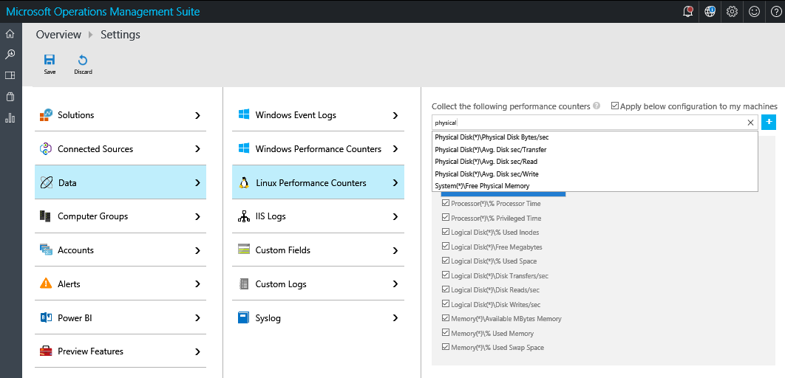
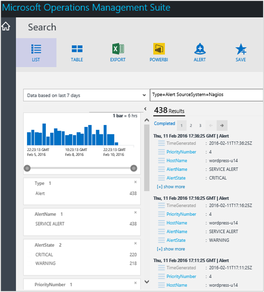

<properties
    pageTitle="Conectar computadores Linux a análise de Log | Microsoft Azure"
    description="Usando a análise de Log, você pode coletar e atuar em dados gerados de computadores Linux."
    services="log-analytics"
    documentationCenter=""
    authors="bandersmsft"
    manager="jwhit"
    editor=""/>

<tags
    ms.service="log-analytics"
    ms.workload="na"
    ms.tgt_pltfrm="na"
    ms.devlang="na"
    ms.topic="article"
    ms.date="10/10/2016"
    ms.author="banders"/>

# <a name="connect-linux-computers-to-log-analytics"></a>Conectar computadores Linux a análise de Log

Usando a análise de Log, você pode coletar e atuar em dados gerados de computadores Linux. Adicionar dados coletados de Linux OMS permite que você gerencie sistemas Linux e soluções de contêiner como Docker, independentemente de onde estão localizados seus computadores — praticamente qualquer lugar. Portanto, as fontes de dados podem residem no seu centro de dados local como servidores físicos, computadores virtuais em um serviço hospedado na nuvem como Amazon Web Services (AWS) ou Microsoft Azure ou até mesmo laptop na sua mesa. Além disso, OMS também coleta dados de computadores Windows da mesma forma, para que ele dá suporte a uma verdadeiramente híbrida do ambiente de TI.

Você pode exibir e gerenciar dados de todas as fontes com a análise de Log no OMS com um portal de gerenciamento único. Isso reduz a necessidade de monitorar usando vários sistemas diferentes, torna fácil consumir e você pode exportar os dados que você deseja para qualquer solução de análise de negócios ou um sistema que você já possui.

Este artigo é uma rápida iniciar guia que ajudará você a coletar e gerenciar dados para seus computadores Linux usando o agente de OMS para Linux. Para obter mais detalhes técnicos como configuração do servidor de proxy, informações sobre métricas de CollectD e fontes de dados JSON personalizados, você encontrará essas informações no [Agente de OMS para visão geral de Linux](https://github.com/Microsoft/OMS-Agent-for-Linux) e [Agente de OMS documentação completa Linux](https://github.com/Microsoft/OMS-Agent-for-Linux/blob/master/docs/OMS-Agent-for-Linux.md) no Github.


Atualmente, você pode coletar os seguintes tipos de dados de computadores Linux:

- Métricas de desempenho
- Eventos de syslog
- Alertas de Nagios e Zabbix
- Logs, estoque e métricas de desempenho do contêiner de docker

## <a name="supported-linux-versions"></a>Versões de Linux com suporte

Versões x86 e x64 são suportadas oficialmente em uma variedade de distribuições Linux. No entanto, o agente de OMS para Linux também podem executar em outras distribuições não listadas.

- Amazon Linux 2012.09 por meio de 2015.09
- CentOS Linux 5, 6 e 7
- Oracle Linux 5, 6 e 7
- Servidor do Red Hat Enterprise Linux 5, 6 e 7
- Debian GNU/Linux 6, 7 e 8
- Ubuntu 12.04 LTS, 14.04 LTS, 15.04, 15.10
- SUSE Linux Enterprise Server 11 e 12

## <a name="oms-agent-for-linux"></a>Agente OMS para Linux
O agente de pacote de gerenciamento de operações para Linux consiste em vários pacotes. O arquivo de lançamento contém os seguintes pacotes, disponíveis executando o pacote de shell com `--extract`.

**Pacote** | **Versão** | **Descrição**
----------- | ----------- | --------------
omsagent | 1.1.0 | O agente de pacote de gerenciamento de operações para Linux
omsconfig | 1.1.1 | Agente de configuração para o agente de OMS
Omi | 1.0.8.3 | Infraestrutura de gerenciamento aberta (OMI) – um CIM servidor leve
scx | 1.6.2 | Provedores de CIM OMI para métricas de desempenho do sistema operacional
Apache-cimprov | 1.0.0 | Provedor para OMI de monitoramento do desempenho do Apache HTTP Server. Instalado somente se Apache HTTP Server for detectado.
MySQL-cimprov | 1.0.0 | Provedor para OMI de monitoramento do desempenho do servidor MySQL. Instalado apenas se o servidor MySQL/MariaDB for detectado.
docker-cimprov | será 0.1.0 | Provedor de docker para OMI. Instalado somente se Docker for detectado.

### <a name="additional-installation-artifacts"></a>Artefatos de instalação adicionais
Depois de instalar o agente OMS para pacotes Linux, as seguintes alterações de configuração de todo o sistema adicionais são aplicadas. Esses artefatos são removidos quando o pacote de omsagent é desinstalado.
- Um usuário sem privilégios chamado: `omsagent` é criado. Esta é a conta que executa o daemon omsagent como
- Um arquivo de "incluir" sudoers é criado em /etc/sudoers.d/omsagent Isso autoriza omsagent reiniciar os daemons syslog e omsagent. Se sudo "incluir" diretivas não são suportadas na versão instalada do sudo, essas entradas serão gravadas para /etc/sudoers.
- A configuração de syslog é modificada para encaminhar um subconjunto de eventos para o agente. Para obter mais informações, consulte a seção de **Coleta de dados Configurando** abaixo

### <a name="linux-data-collection-details"></a>Detalhes de conjunto de dados de Linux

A tabela a seguir mostra os métodos de coleta de dados e outros detalhes sobre como os dados são coletados.

| fonte | Agente de direta | Agente do SCOM | Armazenamento do Azure | SCOM necessário? | Enviados via grupo de gerenciamento de dados do SCOM agente | frequência de conjunto |
|---|---|---|---|---|---|---|
|Zabbix||||            ||1 minuto|
|Nagios||||            ||na chegada|
|syslog||||            ||de armazenamento do Azure: 10 minutos; do agente: na chegada|
|Contadores de desempenho de Linux||||            ||Como agendado, mínimo de 10 segundos|
|o controle de alterações||||            ||por hora|


### <a name="package-requirements"></a>Requisitos de pacote
| **Pacote necessário**  | **Descrição**   | **Versão mínima**|
|--------------------- | --------------------- | -------------------|
|Glibc |    Biblioteca de GNU C   | 2.5-12|
|OpenSSL    | Bibliotecas de OpenSSL | 0.9.8e ou 1.0|
|Ondulação | cliente da web de ondulação | 7.15.5
|Python ctypes |bibliotecas de função | n/d|
|PAM | Módulos de autenticação conectável  |n/d |

>[AZURE.NOTE] Rsyslog ou ng syslog são necessários para coletar mensagens syslog. O daemon do syslog padrão na versão 5 do Red Hat Enterprise Linux, CentOS e Oracle Linux versão (sysklog) não há suporte para conjunto de evento syslog. Para coletar dados de syslog nesta versão dessas distribuições, o daemon rsyslog deve ser instalado e configurado para substituir sysklog.

## <a name="quick-install"></a>Instalação rápida

Execute os seguintes comandos para baixar o omsagent, validar a soma de verificação, depois de instalar e integrado o agente. Comandos são para 64 bits. A identificação de espaço de trabalho e a chave primária são encontrados no portal do OMS em **configurações** na guia **Fontes conectadas** .


```
wget https://github.com/Microsoft/OMS-Agent-for-Linux/releases/download/v1.1.0-28/omsagent-1.1.0-28.universal.x64.sh
sha256sum ./omsagent-1.1.0-28.universal.x64.sh
sudo sh ./omsagent-1.1.0-28.universal.x64.sh --upgrade -w <YOUR OMS WORKSPACE ID> -s <YOUR OMS WORKSPACE PRIMARY KEY>
```

Há uma variedade de outros métodos para instalar o agente e atualizá-lo. Você pode ler mais sobre eles em [etapas para instalar o agente de OMS para Linux](https://github.com/Microsoft/OMS-Agent-for-Linux/blob/master/docs/OMS-Agent-for-Linux.md#steps-to-install-the-oms-agent-for-linux).

Você também pode exibir [Azure vídeo explicação passo a passo](https://www.youtube.com/watch?v=mF1wtHPEzT0).

## <a name="choose-your-linux-data-collection-method"></a>Escolha seu método de conjunto de dados de Linux

Como você escolhe os tipos de dados que você gostaria de coletar depende de se você deseja usar o portal OMS ou se você desejar editar vários arquivos de configuração diretamente em seus clientes Linux. Se você optar por usar o portal, a configuração é enviada para todos os seus clientes Linux automaticamente. Se você precisar diferentes configurações para diferentes clientes Linux, você precisará editar os arquivos de cliente individualmente – ou use uma alternativa como PowerShell DSC, chefe ou Puppet.

Você pode especificar os eventos de syslog e contadores de desempenho que você deseja coletar usando arquivos de configuração nos computadores Linux. *Se você optar por configurar coleta de dados editando arquivos de configuração do agente, você deve desativar a configuração centralizada.*  São fornecidas instruções abaixo para configurar a coleta de dados em arquivos de configuração do agente bem como desativar a configuração central para todos os agentes de OMS para computadores individuais ou Linux.

### <a name="disable-oms-management-for-an-individual-linux-computer"></a>Desabilitar o gerenciamento de OMS para um computador Linux individual

Coleta de dados centralizada para os dados de configuração está desativada para um computador Linux individual com o script OMS_MetaConfigHelper.py. Isso pode ser útil se um subconjunto de computadores deve ter uma configuração especializada.

Para desativar a configuração centralizada:

```
sudo /opt/microsoft/omsconfig/Scripts/OMS_MetaConfigHelper.py --disable
```

Para reativar configuração centralizada:

```
sudo /opt/microsoft/omsconfig/Scripts/OMS_MetaConfigHelper.py –enable
```

## <a name="linux-performance-counters"></a>Contadores de desempenho de Linux

Contadores de desempenho de Linux são semelhantes aos contadores de desempenho do Windows — ambos funcionam de maneira semelhante. Você pode usar os procedimentos a seguir para adicionar e configurá-los. Depois que eles são adicionados ao OMS, dados são coletados para eles a cada 30 segundos.

### <a name="to-add-a-linux-performance-counter-in-oms"></a>Para adicionar um contador de desempenho de Linux em OMS

1. Para configurar agentes de OMS para Linux usando o portal OMS, você pode adicionar contadores de desempenho de Linux na página Configurações, clique em **dados**.  
2. Na página **configurações** em **dados** , clique em **contadores de desempenho de Linux** e selecione ou digite o nome do contador que você deseja adicionar.  
    
3. Se você não souber o nome completo do contador, você pode começar a digitar um nome parcial e será exibida uma lista de contadores disponíveis. Quando você encontrar o contador que você deseja adicionar, clique no nome na lista e clique no ícone de sinal de mais para adicionar o contador.
4. Após adicionar o contador, ele aparece na lista de contadores destacadas com uma barra colorida.
5. Por padrão, a opção de **Aplicar abaixo de configuração para minhas máquinas** está selecionada. Se desejar desabilitar o envio de dados de configuração, desmarque a seleção.
6. Quando terminar de modificar contadores de desempenho, na parte inferior da página clique em **Salvar** para finalizar suas alterações. As alterações de configuração feitas, em seguida, são enviadas para todos os agentes de OMS para Linux que são registrados com o OMS, normalmente dentro de 5 minutos.

### <a name="configure-linux-performance-counters-in-oms"></a>Configurar contadores de desempenho de Linux no OMS

Para contadores de desempenho do Windows, você pode escolher uma instância específica para cada contador de desempenho. No entanto, para contadores de desempenho de Linux, qualquer instância de um contador que você escolher se aplica a todos os contadores filho do contador pai. A tabela a seguir mostra os casos comuns disponíveis para contadores de desempenho de Linux e Windows.

| **Nome da instância** | **Significado** |
| --- | --- |
| \_Total | Total de todas as instâncias |
| \* | Todas as instâncias |
| (/ & #124; / var) | Corresponde a instâncias denominadas: / ou /var |


Da mesma forma, o intervalo de exemplo que você escolhe para um contador pai se aplica a todos os seus contadores filho. Em outras palavras, todos os intervalos de amostra de contador filho e instâncias são vinculadas.

### <a name="add-and-configure-performance-metrics-with-linux"></a>Adicionar e configurar métricas de desempenho com Linux

Métricas de desempenho para coletar são controladas pela configuração no /etc/opt/microsoft/omsagent/conf/omsagent.conf. Consulte [métricas de desempenho disponíveis](https://github.com/Microsoft/OMS-Agent-for-Linux/blob/master/docs/OMS-Agent-for-Linux.md#appendix-available-performance-metrics) para métricas e classes disponíveis para o agente de OMS para Linux.

Cada objeto ou categoria, medidas de desempenho para coletar deve ser definidos no arquivo de configuração como um único `<source>` elemento. A sintaxe segue o padrão abaixo.

```
<source>
  type oms_omi  
  object_name "Processor"
  instance_regex ".*"
  counter_name_regex ".*"
  interval 30s
</source>

```

Os parâmetros configuráveis desse elemento são:

- **Objeto\_nome**: o nome do objeto para o conjunto.
- **Instância\_regex**: uma *expressão regular* que define quais instâncias para coletar. O valor: `.*` especifica todas as instâncias. Para coletar métricas de processador para somente o \_instância Total, você pode especificar `_Total`. Para coletar métricas de processo para somente as instâncias de crond ou sshd, você pode especificar: `(crond|sshd)`.
- **Contador\_nome\_regex**: uma *expressão regular* que define os contadores (para o objeto) para coletar. Para coletar todos os contadores para o objeto, especifique: `.*`. Para coletar apenas contadores de espaço de trocar para o objeto de memória, você pode especificar:`.+Swap.+`
- **Intervalo:**: a frequência na qual contadores do objeto são coletados.

A configuração padrão de métricas de desempenho é:

```
<source>
  type oms_omi
  object_name "Physical Disk"
  instance_regex ".*"
  counter_name_regex ".*"
  interval 5m
</source>

<source>
  type oms_omi
  object_name "Logical Disk"
  instance_regex ".*
  counter_name_regex ".*"
  interval 5m
</source>

<source>
  type oms_omi
  object_name "Processor"
  instance_regex ".*
  counter_name_regex ".*"
  interval 30s
</source>

<source>
  type oms_omi
  object_name "Memory"
  instance_regex ".*"
  counter_name_regex ".*"
  interval 30s
</source>

```

### <a name="enable-mysql-performance-counters-using-linux-commands"></a>Ativar contadores de desempenho de MySQL usando os comandos do Linux

Se o servidor MySQL ou MariaDB for detectado no computador quando o pacote de omsagent estiver instalado, um provedor para o servidor MySQL de monitoramento do desempenho é instalado automaticamente. Este provedor conecta-se ao servidor MySQL/MariaDB local para expor estatísticas de desempenho. Você precisa configurar credenciais de usuário do MySQL para que o provedor possa acessar o servidor MySQL.

Para definir uma conta de usuário padrão do servidor MySQL no host local, use o seguinte exemplo de comando.

>[AZURE.NOTE] O arquivo de credenciais deve ser legível pela conta omsagent. É recomendável executar o comando mycimprovauth como omsgent.


```
sudo su omsagent -c '/opt/microsoft/mysql-cimprov/bin/mycimprovauth default 127.0.0.1 <username> <password>'

sudo service omiserverd restart
```


Como alternativa, você pode especificar as credenciais necessárias do MySQL em um arquivo, criando o arquivo: /var/opt/microsoft/mysql-cimprov/auth/omsagent/mysql-auth. Para obter mais informações sobre como gerenciar credenciais de MySQL para monitoramento através do arquivo auth mysql, consulte [Gerenciar MySQL monitoramento credenciais no arquivo de autenticação](#manage-mysql-monitoring-credentials-in-the-authentication-file).

Consulte [necessárias permissões de banco de dados MySQL para contadores de desempenho](#database-permissions-required-for-mysql-performance-counters) para obter detalhes sobre permissões de objetos exigidas pelo usuário MySQL para coletar dados de desempenho do servidor MySQL.

### <a name="enable-apache-http-server-performance-counters-using-linux-commands"></a>Ativar contadores de desempenho de Apache HTTP Server usando os comandos do Linux

Se Apache HTTP Server for detectado no computador quando o pacote de omsagent estiver instalado, um provedor para Apache HTTP Server de monitoramento do desempenho é instalado automaticamente. Este provedor depende de um Apache "módulo" que deve ser carregado no Apache HTTP Server para acessar os dados de desempenho.

Você pode carregar o módulo com o seguinte comando:

```
sudo /opt/microsoft/apache-cimprov/bin/apache_config.sh -c
```

Para descarregar o módulo de monitoramento Apache, execute o seguinte comando:

```
sudo /opt/microsoft/apache-cimprov/bin/apache_config.sh -u
```
### <a name="to-view-performance-data-with-log-analytics"></a>Para exibir dados de desempenho com a análise de Log

1. No portal do pacote de gerenciamento de operações, clique no bloco de pesquisa de Log.
2. Na barra de pesquisa, digite `* (Type=Perf)` para exibir todos os contadores de desempenho.


Porque OMS também coleta dados de contador de desempenho do Windows, você deve escopo-down a pesquisa para dados específicos do Linux. Portanto, o exemplo a seguir mostra dados de desempenho específicos para um servidor de Linux de exemplo denominado Chorizo21.

```
Type=Perf Computer=chorizo*
```


Nos resultados, você pode clicar em **métricas** para exibir os dados coletados para contadores. Dados em tempo real são mostrados como gráficos para cada contador.


## <a name="syslog"></a>Syslog

Syslog é um protocolo de log de eventos semelhante aos logs de eventos do Windows — ambos operam da mesma forma quando exibido em OMS.

### <a name="to-add-a-new-linux-syslog-facility-in-oms"></a>Para adicionar um novo recurso de syslog Linux na OMS

1. Na página **configurações** em **dados** , clique em **Syslog** e à esquerda do ícone de sinal de adição, digite o nome do recurso syslog que você deseja adicionar.
    
2.  Se você não souber o nome completo do recurso, você pode começar a digitar um nome parcial e será exibida uma lista de instalações disponíveis syslog. Quando você encontrar o recurso de syslog que você deseja adicionar, clique no nome na lista e clique no ícone de sinal de mais para adicionar o recurso de syslog.
3.  Após adicionar o recurso, ele aparece na lista de destacadas com uma barra colorida. Em seguida, escolha as severidades (categorias de informações do recurso de syslog) que você deseja coletar.
4.  Na parte inferior da página, clique em **Salvar** para finalizar suas alterações. As alterações de configuração feitas, em seguida, são enviadas para todos os agentes de OMS para Linux que são registrados com o OMS, normalmente dentro de 5 minutos.


### <a name="configure-linux-syslog-facilities-in-linux"></a>Configurar Linux syslog instalações no Linux

Eventos de syslog são enviados do syslog daemon, por exemplo, rsyslog ou syslog-ng, para uma porta local que o agente está escutando. Por padrão, porta 25224. Quando o agente é instalado, uma configuração de syslog padrão é aplicada. Isso é encontrado em:


Rsyslog: /etc/rsyslog.d/rsyslog-oms.conf

Syslog ng: /etc/syslog-ng/syslog-ng.conf


A configuração padrão do syslog agente OMS carrega os eventos de syslog de todos os recursos com uma gravidade de aviso ou superior.

>[AZURE.NOTE] Se você editar a configuração de syslog, você deve reiniciar o daemon do syslog para que as alterações tenham efeito.

A configuração de syslog do padrão para o agente de OMS para Linux para OMS é:

#### <a name="rsyslog"></a>Rsyslog

```
kern.warning       @127.0.0.1:25224
user.warning       @127.0.0.1:25224
daemon.warning     @127.0.0.1:25224
auth.warning       @127.0.0.1:25224
syslog.warning     @127.0.0.1:25224
uucp.warning       @127.0.0.1:25224
authpriv.warning   @127.0.0.1:25224
ftp.warning        @127.0.0.1:25224
cron.warning       @127.0.0.1:25224
local0.warning     @127.0.0.1:25224
local1.warning     @127.0.0.1:25224
local2.warning     @127.0.0.1:25224
local3.warning     @127.0.0.1:25224
local4.warning     @127.0.0.1:25224
local5.warning     @127.0.0.1:25224
local6.warning     @127.0.0.1:25224
local7.warning     @127.0.0.1:25224
```

#### <a name="syslog-ng"></a>Syslog ng

```
#OMS_facility = all
filter f_warning_oms { level(warning); };
destination warning_oms { tcp("127.0.0.1" port(25224)); };
log { source(src); filter(f_warning_oms); destination(warning_oms); };
```

### <a name="to-view-all-syslog-events-with-log-analytics"></a>Para exibir todos os eventos de Syslog com a análise de Log

1. No portal do pacote de gerenciamento de operações, clique no bloco de **Pesquisa de Log** .
2. No agrupamento de **Gerenciamento de registros** , escolha uma pesquisa de syslog predefinido e selecione uma para executá-la.

Este exemplo mostra todos os eventos de Syslog.


Agora você pode analisar os resultados da pesquisa.

## <a name="linux-alerts"></a>Alertas de Linux

Se você usar Nagios ou Zabbix para gerenciar suas máquinas Linux, OMS pode receber os alertas gerados dessas ferramentas. No entanto, não há atualmente nenhuma método para configurar dados de alerta de entrada usando o portal OMS. Em vez disso, você precisará editar um arquivo de configuração para começar a enviar alertas para OMS.


### <a name="collect-alerts-from-nagios"></a>Coletar alertas de Nagios

Para coletar alertas de um servidor de Nagios, você precisa fazer as seguintes alterações de configuração.

1. Conceda acesso de leitura de **omsagent** ao usuário para o arquivo de log de Nagios (ou seja, /var/log/nagios/nagios.log/var/log/nagios/nagios.log). Considerando que o arquivo de nagios.log pertence o grupo **nagios** , você pode adicionar o usuário **omsagent** ao grupo **nagios** .

    ```
    sudo usermod –a -G nagios omsagent
    ```

2. Modificar o arquivo omsagent.confconfiguration (/ etc/opt/microsoft/omsagent/conf/omsagent.conf). Certifique-se de que as seguintes entradas estão presentes e não comentados:

    ```
    <source>
    type tail
    #Update path to point to your nagios.log
    path /var/log/nagios/nagios.log
    format none
    tag oms.nagios
    </source>

    <filter oms.nagios>
    type filter_nagios_log
    </filter>
    ```

3. Reinicie o daemon omsagent:

    ```
    sudo service omsagent restart
    ```

### <a name="collect-alerts-from-zabbix"></a>Coletar alertas de Zabbix

Para coletar alertas de um servidor de Zabbix, você irá executar etapas semelhantes de Nagios acima, exceto você precisará especificar um usuário e senha em *Limpar texto*. Isso não é ideal, mas provavelmente será alterado em breve. Para resolver esse problema, recomendamos que você crie o usuário e concede permissão para somente o monitor.

Uma seção de exemplo do arquivo de configuração omsagent.conf (/ etc/opt/microsoft/omsagent/conf/omsagent.conf) para Zabbix deve ser semelhante ao seguinte:

```
<source>
  type zabbix_alerts
  run_interval 1m
  tag oms.zabbix
  zabbix_url http://localhost/zabbix/api_jsonrpc.php
  zabbix_username Admin
  zabbix_password zabbix
</source>

```

### <a name="view-alerts-in-log-analytics-search"></a>Exibir alertas na pesquisa de análise de Log

Depois de ter configurado seus computadores Linux para enviar alertas para OMS, você pode usar algumas consultas de pesquisa de log simples para exibir os alertas. O seguinte exemplo de consulta de pesquisa retorna todos os alertas registrados geradas. Por exemplo, se algum tipo de problema ocorrer em sua infraestrutura, em seguida, os resultados para a consulta de exemplo a seguir podem indicar onde o problema pode se originam. E, você pode facilmente analisar para os alertas pelo sistema de origem para ajudar a reduzir sua investigação. A vantagem é que você não necessariamente precisa ir para vários sistemas de gerenciamento do início — desde que seus alertas são enviadas para OMS, você pode começar lá.

```
Type=Alert
```

#### <a name="to-view-all-nagios-alerts-with-log-analytics"></a>Para exibir todos os alertas de Nagios com a análise de Log
1. No portal do pacote de gerenciamento de operações, clique no bloco de **Pesquisa de Log** .
2. Na barra de consulta, digite a seguinte consulta de pesquisa

    ```
    Type=Alert SourceSystem=Nagios
    ```


Depois de ver os resultados da pesquisa, você pode aprofundar detalhes adicionais, como *AlertState*.

### <a name="to-view-all-zabbix-alerts-with-log-analytics"></a>Para exibir todos os alertas de Zabbix com a análise de Log
1. No portal do pacote de gerenciamento de operações, clique no bloco de **Pesquisa de Log** .
2. Na barra de consulta, digite a seguinte consulta de pesquisa

    ```
    Type=Alert SourceSystem=Zabbix
    ```


Depois de ver os resultados da pesquisa, você pode aprofundar detalhes adicionais, como *AlertName*.


## <a name="compatibility-with-system-center-operations-manager"></a>Compatibilidade com o System Center Operations Manager

O agente de OMS para Linux compartilha binários do agente com o agente do System Center Operations Manager. Instalando o agente de OMS para Linux em um sistema gerenciado atualmente pelo Operations Manager atualiza os pacotes OMI e SCX no computador para uma versão mais recente. O agente de OMS para Linux e System Center 2012 R2 são compatíveis. No entanto, **System Center 2012 SP1 e versões anteriores atualmente não são compatíveis ou compatíveis com o agente de OMS para Linux.**

>[AZURE.NOTE] Se o agente de OMS para Linux é instalado em um computador que não está sendo gerenciado pelo Operations Manager e posteriormente você quiser gerenciar o computador com o Operations Manager, você deve modificar a configuração de OMI antes de você descubra o computador. **Esta etapa não é necessário se o agente do Operations Manager é instalado antes do agente de OMS para Linux.**

### <a name="to-enable-the-oms-agent-for-linux-to-communicate-with-operations-manager"></a>Para habilitar o agente de OMS para Linux para se comunicar com o Operations Manager

1. Editar o arquivo /etc/opt/omi/conf/omiserver.conf
2. Certifique-se de que a linha que começa com **httpsport =** define a porta 1270. Como`httpsport=1270`
3. Reinicie o servidor OMI:

    ```
    service omiserver restart or systemctl restart omiserver
    ```


## <a name="database-permissions-required-for-mysql-performance-counters"></a>Permissões de banco de dados necessárias para contadores de desempenho do MySQL

Para conceder permissões a um usuário de monitoramento MySQL, o usuário concedendo deve ter o privilégio 'CONCEDER option' bem como o privilégio sendo concedido.

Para que o usuário MySQL retornar dados de desempenho o usuário precisará acessar as consultas a seguir:

```
SHOW GLOBAL STATUS;
SHOW GLOBAL VARIABLES:
```

Além dessas consultas o MySQL usuário requer acesso selecione tabelas de padrão a seguir:

- information_schema
- MySQL

Esses privilégios podem ser concedidos executando os seguintes comandos de conceder.

```
GRANT SELECT ON information_schema.* TO ‘monuser’@’localhost’;
GRANT SELECT ON mysql.* TO ‘monuser’@’localhost’;
```

## <a name="manage-mysql-monitoring-credentials-in-the-authentication-file"></a>Gerenciar MySQL monitoramento credenciais no arquivo de autenticação

As seções a seguir o ajudarão a gerenciar credenciais de MySQL.

### <a name="configure-the-mysql-omi-provider"></a>Configurar o provedor de MySQL OMI

O provedor de MySQL OMI requer um usuário MySQL pré-configurado e instalado bibliotecas de cliente do MySQL para consultar as informações de integridade do desempenho da instância do MySQL.

### <a name="mysql-omi-authentication-file"></a>Arquivo de autenticação MySQL OMI

Provedor de MySQL OMI usa um arquivo de autenticação para determinar qual vincular-endereço e porta o MySQL instância está escutando e quais credenciais usar para reunir métricas. Durante a instalação do MySQL OMI provedor será digitalizar arquivos de configuração de my.cnf MySQL (padrão) para o endereço de ligação e porta e definir parcialmente o MySQL OMI arquivo de autenticação.

Para concluir o monitoramento de uma instância do servidor MySQL, adicione um arquivo de autenticação MySQL OMI previamente gerado no diretório correto.

### <a name="authentication-file-format"></a>Formato de arquivo de autenticação

O arquivo de autenticação MySQL OMI é um arquivo de texto que contém informações sobre:

- Porta
- Endereço de ligação
- Nome de usuário do MySQL
- Senha de codificação Base64

O arquivo de autenticação MySQL OMI apenas concede privilégios de leitura/gravação ao usuário Linux que gerou a ele.

```
[Port]=[Bind-Address], [username], [Base64 encoded Password]
(Port)=(Bind-Address), (username), (Base64 encoded Password)
(Port)=(Bind-Address), (username), (Base64 encoded Password)
AutoUpdate=[true|false]
```

Um arquivo de autenticação MySQL OMI padrão contém uma instância padrão e um número de porta dependendo de quais informações estão disponível e analisado do arquivo de configuração de MySQL encontrado.

A instância padrão é um meio para tornar o gerenciamento de várias instâncias de MySQL em um host Linux mais fácil e é indicada pela instância com porta 0. Todas as instâncias adicionadas herdarão propriedades definidas da instância padrão. Por exemplo, se a instância do MySQL escutar na porta '3308' é adicionada, endereço de ligação a instância padrão, nome de usuário e senha de codificação Base64 serão ser usados experimentar e monitorar a instância listening em 3308. Se a instância no 3308 é vinculada a outro endereço e usa o mesmo par de usuário e senha do MySQL somente o respecification do endereço de vinculação é necessária e outras propriedades serão herdadas.

Exemplos do arquivo autenticação semelhante ao seguinte:

Instância padrão e instância com porta 3308:

```
0=127.0.0.1, myuser, cnBwdA==3308=, ,AutoUpdate=true
```

Instância padrão e instância com porta 3308 + diferentes Base 64 codificadas senha:

```
0=127.0.0.1, myuser, cnBwdA==3308=127.0.1.1, , AutoUpdate=true
```


| **Propriedade** | **Descrição** |
| --- | --- |
| Porta | Porta representa a porta atual em que a instância do MySQL é listening.  A porta 0 indica que as propriedades acompanhando são usadas para instância padrão. |
| Endereço de ligação | o endereço de vincular é o endereço de vincular MySQL atual |
| nome de usuário | Este o nome de usuário do usuário MySQL que você deseja usar para monitorar a instância do servidor MySQL. |
| Senha de codificado na Base 64 | Esta é a senha do usuário monitoramento MySQL codificada na Base 64. |
| AutoUpdate | Quando o provedor de OMI MySQL é atualizado o provedor será examinar para alterações no arquivo my.cnf e substituir o arquivo MySQL OMI autenticação. Defina esse sinalizador como true ou false, dependendo as atualizações necessárias para o arquivo de autenticação MySQL OMI. |

#### <a name="authentication-file-location"></a>Local do arquivo de autenticação

O arquivo de autenticação do MySQL OMI deve ser localizado no seguinte local e denominado "mysql-auth":

/var/opt/Microsoft/MySQL-cimprov/AUTH/omsagent/MySQL-AUTH

O arquivo (e auth/omsagent diretório) devem pertencer pelo usuário omsagent.

## <a name="agent-logs"></a>Logs de agente

Os logs para o agente de OMS para Linux está no:

/ var/opt/microsoft/omsagent/log /

Os logs para o agente de OMS para Linux para o programa omsconfig (configuração do agente) está no:

/ var/opt/microsoft/omsconfig/log /

Logs para os componentes OMI e SCX (que fornecem dados de métricas de desempenho) está no:

/ var/opt/omi/log/e /var/opt/microsoft/scx/log

## <a name="troubleshooting-the-oms-agent-for-linux"></a>O agente OMS para Linux de solução de problemas

Use as seguintes informações para diagnosticar e solucionar problemas comuns.

Se nenhuma das informações de solução de problemas desta seção ajuda você a, você também pode usar os seguintes recursos para ajudar a resolver o problema.

- Clientes com Premier suporte pode registrar um caso de suporte via [Premier](https://premier.microsoft.com/)
- Os clientes com contratos de suporte Azure podem fazer logon casos de suporte no [portal do Azure](https://manage.windowsazure.com/?getsupport=true)
- Um [Problema de GitHub](https://github.com/Microsoft/OMS-Agent-for-Linux/issues) de arquivo
- Fórum de comentários para obter ideias e criar um bug [http://aka.ms/opinsightsfeedback](http://aka.ms/opinsightsfeedback) de relatório

### <a name="important-log-locations"></a>Locais de log importantes

Arquivo | Caminho
---- | -----
Agente OMS para arquivo de Log de Linux | `/var/opt/microsoft/omsagent/log/omsagent.log `
Arquivo de Log de configuração do OMS Agent | `/var/opt/microsoft/omsconfig/omsconfig.log`

### <a name="important-configuration-files"></a>Arquivos de configuração importantes

Catergory | Local do arquivo
----- | -----
Syslog | `/etc/syslog-ng/syslog-ng.conf`ou `/etc/rsyslog.conf` ou`/etc/rsyslog.d/95-omsagent.conf`
Desempenho, Nagios, Zabbix, saída OMS e agente geral | `/etc/opt/microsoft/omsagent/conf/omsagent.conf`
Configurações adicionais | `/etc/opt/microsoft/omsagent/conf.d/*.conf`

>[AZURE.NOTE] Edição de arquivos de configuração para contadores de desempenho e syslog são substituídos se OMS Portal está ativada. Você pode desabilitar a configuração no Portal do OMS (para todos os nós) ou para nós único executando o seguinte:

```
sudo su omsagent -c /opt/microsoft/omsconfig/Scripts/OMS_MetaConfigHelper.py --disable
```


### <a name="enable-debug-logging"></a>Habilitar o log de depuração

Para habilitar o log de depuração, você pode usar o plug-in do OMS saída e saída detalhada.

#### <a name="oms-output-plugin"></a>Plug-in do OMS saída

FluentD permite que o plug-in especificar níveis de log para níveis de log diferente de entradas e saídas. Para especificar um nível de log diferente para saída OMS, edite a configuração do agente geral no `/etc/opt/microsoft/omsagent/conf/omsagent.conf` arquivo.

Na parte inferior do arquivo de configuração, altere o `log_level` propriedade de `info` para `debug`.

 ```
 <match oms.** docker.**>
  type out_oms
  log_level debug
  num_threads 5
  buffer_chunk_limit 5m
  buffer_type file
  buffer_path /var/opt/microsoft/omsagent/state/out_oms*.buffer
  buffer_queue_limit 10
  flush_interval 20s
  retry_limit 10
  retry_wait 30s
</match>
 ```

Log de depuração permite que você veja carregamentos em lote para o serviço de OMS separados por tipo, o número de itens de dados e tempo necessário para enviar.

*Log de depuração ativada de exemplo:*
```
Success sending oms.nagios x 1 in 0.14s
Success sending oms.omi x 4 in 0.52s
Success sending oms.syslog.authpriv.info x 1 in 0.91s
```

#### <a name="verbose-output"></a>Saída detalhada
Em vez de usar o plug-in do OMS saída, você pode também saída itens de dados diretamente para `stdout`, que fica visível no agente de OMS para arquivo de log de Linux.

No arquivo de configuração de agente geral OMS em `/etc/opt/microsoft/omsagent/conf/omsagent.conf`, comentário-out o OMS plug-in de saída, adicionando um `#` na frente de cada linha.

```
#<match oms.** docker.**>
#  type out_oms
#  log_level info
#  num_threads 5
#  buffer_chunk_limit 5m
#  buffer_type file
#  buffer_path /var/opt/microsoft/omsagent/state/out_oms*.buffer
#  buffer_queue_limit 10
#  flush_interval 20s
#  retry_limit 10
#  retry_wait 30s
#</match>
```

Abaixo o plug-in de saída, remova o comentário na seção a seguir, removendo o `#` símbolo no início de cada linha.

```
<match **>
  type stdout
</match>
```

### <a name="forwarded-syslog-messages-do-not-appear-in-the-log"></a>Mensagens de Syslog encaminhadas não aparecem no log de

#### <a name="probable-causes"></a>Causas prováveis

- A configuração aplicada ao servidor Linux não permitir a coleção da instalações enviadas e/ou níveis de log
- Syslog não está sendo encaminhado corretamente para o servidor Linux
- O número de mensagens sejam encaminhadas por segundo é muito grande para a configuração básica do agente OMS para Linux tratar

#### <a name="resolutions"></a>Resoluções

- Verifique se a configuração no Portal do OMS para Syslog tem todos os recursos e os níveis de log correto
  - **Portal OMS > Configurações > dados > Syslog**
-  Verifique se que syslog nativo daemons de mensagens (`rsyslog`, `syslog-ng`) são capazes de receber as mensagens encaminhadas
- Verificar as configurações de firewall no servidor de Syslog para garantir que as mensagens não estão sendo bloqueadas
-  Simular uma mensagem de Syslog OMS usando o `logger` comando - por exemplo:
  - `logger -p local0.err "This is my test message"`

### <a name="problems-connecting-to-oms-when-using-a-proxy"></a>Problemas para se conectar ao OMS ao usar um proxy

#### <a name="probable-causes"></a>Causas prováveis

- O proxy especificado quando instalando e configurando o agente estão incorreto
- Os pontos de extremidade do serviço OMS não são whitelistested no seu data center

#### <a name="resolutions"></a>Resoluções

- Reinstalar o agente de OMS para Linux usando o seguinte comando com a opção `-v` habilitado. Isso permite saída detalhada do agente conectando através do proxy para o serviço de OMS.
  - `/opt/microsoft/omsagent/bin/omsadmin.sh -w <OMS Workspace ID> -s <OMS Workspace Key> -p <Proxy Conf> -v`
  - Revise a documentação para proxy OMS em [Configurando o agente para usar com um servidor proxy HTTP](https://github.com/Microsoft/OMS-Agent-for-Linux/blob/master/docs/OMS-Agent-for-Linux.md#configuring-the-agent-for-use-with-an-http-proxy-server)
- Verifique se os seguintes pontos de extremidade do serviço OMS estão na lista branca

Recurso do agente | Portas
---- | ----
& 42;. ods.opinsights.Azure.com | Porta 443
& 42;. OMS.opinsights.Azure.com | Porta 443
ods.systemcenteradvisor.com | Porta 443
& #42;.blob.core.windows.net/ | Porta 443

### <a name="a-403-error-is-displayed-when-onboarding"></a>Um erro 403 é exibido quando integração

#### <a name="probable-causes"></a>Causas prováveis

- A data e hora estão incorretos em servidor Linux
- O ID de espaço de trabalho e a chave de espaço de trabalho usada estão incorretos

#### <a name="resolution"></a>Resolução

- Verificar a hora no seu servidor Linux com o `date` comando. Se os dados são maiores ou menor do que 15 minutos da hora atual, integração falhará. Para corrigir isso, atualize a data e/ou o fuso horário do seu servidor Linux.
- A versão mais recente do agente OMS para Linux notifica se uma diferença de horário está causando falha de integração
- Re-integrado usando a identificação de espaço de trabalho e a chave de espaço de trabalho corretos. Para obter mais informações, consulte [integração usando a linha de comando](https://github.com/Microsoft/OMS-Agent-for-Linux/blob/master/docs/OMS-Agent-for-Linux.md#onboarding-using-the-command-line) .

### <a name="a-500-error-or-404-error-appears-in-the-log-file-after-onboarding"></a>Um erro 500 ou erro 404 é exibida no arquivo de log após a integração

Este é um problema conhecido que ocorre durante o carregamento primeiro Linux dados em um espaço de trabalho do OMS. Isso não afetará os dados que está sendo enviados ou outros problemas. Você pode ignorar os erros quando inicialmente integração.

### <a name="nagios-data-does-not-appear-in-the-oms-portal"></a>Dados de Nagios não aparecem no Portal do OMS

#### <a name="probable-causes"></a>Causas prováveis
- O usuário omsagent não tem permissões para ler o arquivo de log Nagios
- As seções de origem e filtro de Nagios ainda são comentadas no arquivo omsagent.conf

#### <a name="resolutions"></a>Resoluções

- Adicione o usuário omsagent para ler o arquivo Nagios. Consulte [Nagios alertas](https://github.com/Microsoft/OMS-Agent-for-Linux/blob/master/docs/OMS-Agent-for-Linux.md#nagios-alerts) para obter mais informações.
- No agente de OMS para o arquivo de configuração gerais de Linux em `/etc/opt/microsoft/omsagent/conf/omsagent.conf`, certifique-se de que **tanto** a fonte de Nagios e seções de filtro tiverem comentários removidos, semelhantes ao seguinte exemplo.

```
<source>
  type tail
  path /var/log/nagios/nagios.log
  format none
  tag oms.nagios
</source>

<filter oms.nagios>
  type filter_nagios_log
</filter>
```


### <a name="linux-data-doesnt-appear-in-the-oms-portal"></a>Dados de Linux não aparecem no Portal do OMS

#### <a name="probable-causes"></a>Causas prováveis

- Falha de integração para o serviço de OMS
- Conexão ao serviço OMS é bloqueado
- O agente de OMS para dados de Linux é backup

#### <a name="resolutions"></a>Resoluções

- Verifique se essa integração serviço OMS foi bem-sucedida, verificando que o `/etc/opt/microsoft/omsagent/conf/omsadmin.conf` existe.
- Re-integrado usando a linha de comando omsadmin.sh. Para obter mais informações, consulte [integração usando a linha de comando](https://github.com/Microsoft/OMS-Agent-for-Linux/blob/master/docs/OMS-Agent-for-Linux.md#onboarding-using-the-command-line) .
- Se usando um proxy, use o etapas acima de solução de problemas de proxy
- Em alguns casos, quando o agente de OMS para Linux não conseguir se comunicar com o serviço de OMS, dados do agente é backup até o tamanho de buffer cheio de 50 MB. Reinicie o agente de OMS para Linux executando o tanto a `service omsagent restart` ou `systemctl restart omsagent` comandos.
  >[AZURE.NOTE] Esse problema é corrigido no agente versão 1.1.0-28 e posterior.

### <a name="syslog-linux-performance-counter-configuration-is-not-applied-in-the-oms-portal"></a>Configuração de contador de desempenho de Syslog Linux não é aplicada no portal do OMS

#### <a name="probable-causes"></a>Causas prováveis

- O agente de configuração no agente de OMS para Linux não recuperou a configuração mais recente do portal do OMS.
- As configurações revisadas no portal não foram aplicadas

#### <a name="resolutions"></a>Resoluções

`omsconfig`é o agente de configuração no agente de OMS para Linux que recupera alterações de configuração de portal OMS cada 5 minutos. Esta configuração é então aplicada ao agente OMS para arquivos de configuração do Linux localizado em `/etc/opt/microsoft/omsagent/conf/omsagent.conf`.

- Em alguns casos, o agente de OMS para agente de configuração do Linux talvez não consiga para se comunicar com o serviço de configuração de portal resulta em configuração mais recente não sendo aplicada.
- Verifique o `omsconfig` agente está instalado com o seguinte:
  - `dpkg --list omsconfig`ou`rpm -qi omsconfig`
  - Se não instalado, reinstalar a versão mais recente do agente OMS para Linux

- Verifique o `omsconfig` agente possa se comunicar com o serviço OMS
  - Executar o `sudo su omsagent -c 'python /opt/microsoft/omsconfig/Scripts/GetDscConfiguration.py'` comando
    - O comando acima retorna a configuração agente recupera no portal do, incluindo configurações de Syslog, contadores de desempenho de Linux e logs personalizados
    - Se o comando acima falhar, execute o `sudo su omsagent -c 'python /opt/microsoft/omsconfig/Scripts/PerformRequiredConfigurationChecks.py` comando. Este comando força o agente omsconfig para se comunicar com o serviço OMS para recuperar a configuração mais recente.


### <a name="custom-linux-log-data-does-not-appear-in-the-oms-portal"></a>Dados de log de Linux personalizados não aparece no Portal do OMS

#### <a name="probable-causes"></a>Causas prováveis

- Integração ao serviço de OMS falhou
- A configuração **Aplicar a seguinte configuração para meus servidores Linux** não foi selecionada
- omsconfig não tenha separado o log personalizado mais recente do portal
- O `omsagent` uso é não é possível acessar o log personalizado devido a um problema de permissões ou `omsagent` não foi encontrado. Nesse caso, você verá a seguinte saída:
  - `[DATETIME] [warn]: file not found. Continuing without tailing it.`
  - `[DATETIME] [error]: file not accessible by omsagent.`
- Este é um problema conhecido com a condição de corrida que foi corrigido no agente de OMS para Linux versão 1.1.0-217

#### <a name="resolutions"></a>Resoluções
- Verifique se que você tenha êxito onboarded, determinando se os `/etc/opt/microsoft/omsagent/conf/omsadmin.conf` arquivo existe.
  - Se necessário, integrado novamente usando a linha de comando omsadmin.sh. Para obter mais informações, consulte [integração usando a linha de comando](https://github.com/Microsoft/OMS-Agent-for-Linux/blob/master/docs/OMS-Agent-for-Linux.md#onboarding-using-the-command-line) .
- No Portal do OMS, em **configurações** na guia **dados** , verifique se a configuração **Aplicar a seguinte configuração para meus servidores Linux** está selecionada  
  

- Verifique o `omsconfig` agente possa se comunicar com o serviço OMS
  - Executar o `sudo su omsagent -c 'python /opt/microsoft/omsconfig/Scripts/GetDscConfiguration.py'` comando
  - O comando acima retorna a configuração agente recupera no Portal do, incluindo configurações de Syslog, contadores de desempenho de Linux e Logs personalizados
  - Se o comando acima falhar, execute o `sudo su omsagent -c 'python /opt/microsoft/omsconfig/Scripts/PerformRequiredConfigurationChecks.py` comando. Este comando força o agente omsconfig para se comunicar com o serviço de OMS e recuperar a configuração mais recente.


Em vez do agente de OMS executando como um usuário com privilégios de usuário de Linux `root`, o agente de OMS para Linux é executado como a `omsagent` usuário. Na maioria dos casos, permissão explícita deve ser concedida ao usuário para ler determinados arquivos.

Para conceder permissão para `omsagent` usuário, execute os seguintes comandos:

1. Adicionar o `omsagent` usuário a um grupo específico com`sudo usermod -a -G <GROUPNAME> <USERNAME>`
2. Conceder acesso universal de leitura para o arquivo necessário com`sudo chmod -R ugo+rw <FILE DIRECTORY>`

Há um problema conhecido com a condição de corrida que foi corrigido no agente de OMS para Linux versão 1.1.0-217. Depois de atualizar para o agente mais recente, execute o seguinte comando para obter a versão mais recente do plug-in a saída:

```
sudo cp /etc/opt/microsoft/omsagent/sysconf/omsagent.conf /etc/opt/microsoft/omsagent/conf/omsagent.conf
```

## <a name="known-limitations"></a>Limitações conhecidas
Examine as seções a seguir para aprender sobre as limitações atuais do agente OMS para Linux.

### <a name="azure-diagnostics"></a>Diagnóstico do Azure

Para máquinas virtuais do Linux em execução no Azure, etapas adicionais podem ser necessárias para permitir que o conjunto de dados por diagnóstico do Azure e pacote de gerenciamento de operações. **Versão 2.2** da extensão de diagnóstico para Linux é necessária para compatibilidade com o agente de OMS para Linux.

Para obter mais informações sobre como instalar e configurar a extensão de diagnóstico para Linux, consulte [usar o comando de CLI do Azure para habilitar a extensão de diagnóstico Linux](../virtual-machines/virtual-machines-linux-classic-diagnostic-extension.md#use-the-azure-cli-command-to-enable-the-linux-diagnostic-extension).

**Atualizando a extensão de Linux diagnóstico do 2.0 para 2.2 ASM CLI Azure:**

```
azure vm extension set -u <vm_name> LinuxDiagnostic Microsoft.OSTCExtensions 2.0
azure vm extension set <vm_name> LinuxDiagnostic Microsoft.OSTCExtensions 2.2 --private-config-path PrivateConfig.json
```

**BRAÇO**

```
azure vm extension set -u <resource-group> <vm-name> Microsoft.Insights.VMDiagnosticsSettings Microsoft.OSTCExtensions 2.0
azure vm extension set <resource-group> <vm-name> LinuxDiagnostic Microsoft.OSTCExtensions 2.2 --private-config-path PrivateConfig.json
```

Esses exemplos de comando se referir a um arquivo denominado PrivateConfig.json. O formato de arquivo deve se parecer com o exemplo a seguir.

```
    {
    "storageAccountName":"the storage account to receive data",
    "storageAccountKey":"the key of the account"
    }
```

### <a name="sysklog-is-not-supported"></a>Não há suporte para Sysklog

Rsyslog ou ng syslog são necessários para coletar mensagens syslog. O daemon do syslog padrão na versão 5 do Red Hat Enterprise Linux, CentOS e Oracle Linux versão (sysklog) não há suporte para conjunto de evento syslog. Para coletar dados de syslog nesta versão dessas distribuições, o daemon rsyslog deve ser instalado e configurado para substituir sysklog. Para obter mais informações sobre como substituir sysklog com rsyslog, consulte [instalar o rsyslog recém-criado RPM](http://wiki.rsyslog.com/index.php/Rsyslog_on_CentOS_success_story#Install_the_newly_built_rsyslog_RPM).

## <a name="next-steps"></a>Próximas etapas

- [Soluções de adicionar a análise de Log da Galeria de soluções](log-analytics-add-solutions.md) para adicionar funcionalidade e reunir dados.
- Familiarize-se com [pesquisas de log](log-analytics-log-searches.md) exibir informações detalhadas coletadas por soluções.
- Use [painéis](log-analytics-dashboards.md) para salvar e exibir suas próprias pesquisas personalizadas.
