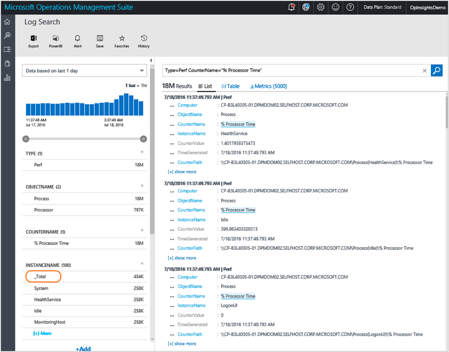
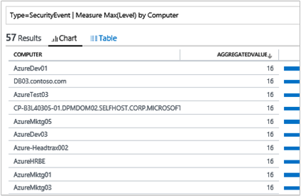
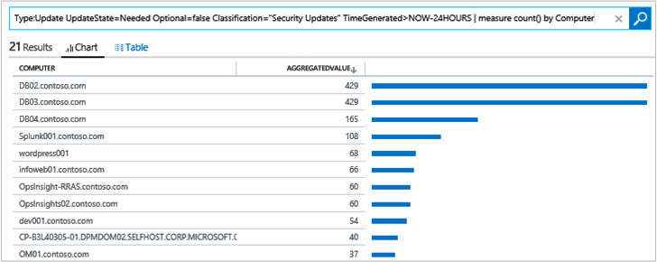
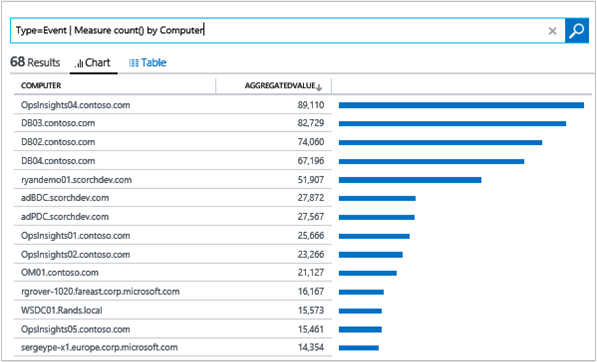
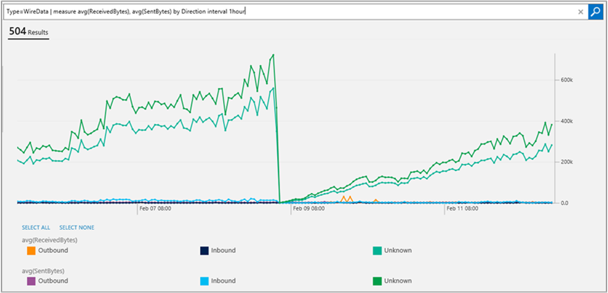

<properties
    pageTitle="Faça logon pesquisas em análise de Log | Microsoft Azure"
    description="Pesquisas de log permite que você combinar e correlação quaisquer dados de máquina de várias fontes em seu ambiente."
    services="log-analytics"
    documentationCenter=""
    authors="bandersmsft"
    manager="jwhit"
    editor=""/>

<tags
    ms.service="log-analytics"
    ms.workload="na"
    ms.tgt_pltfrm="na"
    ms.devlang="na"
    ms.topic="article"
    ms.date="10/10/2016"
    ms.author="banders"/>

# <a name="log-searches-in-log-analytics"></a>Pesquisas de log no Log de análise

No Centro de análise de Log é o recurso de pesquisa de log que permite combinar e correlação quaisquer dados de máquina de várias fontes em seu ambiente. Soluções também são ativadas pelo log pesquisa lhe métricas pivotados ao redor de uma área do problema específico.

Na página de pesquisa, você pode criar uma consulta e, em seguida, quando você pesquisa, você pode filtrar os resultados por meio de controles de faceta. Você também pode criar consultas avançadas transformação, filtro e relatório em seus resultados.

Consultas de pesquisa de log comuns aparecem na maioria das páginas de solução. Em todo o console OMS, você pode clicar blocos ou fazer drill na outros itens para exibir detalhes sobre o item usando a pesquisa de log.

Neste tutorial, examinaremos exemplos para cobrir todos os conceitos quando você usar a pesquisa de log.

Vamos começar com exemplos simples, práticos e depois construa-las para que você pode obter uma compreensão de casos de uso prático sobre como usar a sintaxe para extrair a obtenção de informações que você deseja dos dados.

Depois que você conhece a técnicas de pesquisa, você pode revisar a [referência de pesquisa de log de análise de Log](log-analytics-search-reference.md).

## <a name="use-basic-filters"></a>Usar filtros básicos

A primeira coisa saber é que a primeira parte de uma pesquisa de consulta, antes de qualquer "|" caractere de barra vertical, sempre é um *filtro*. Você pode pensá-la como uma cláusula WHERE na TSQL – ele determina *o* subconjunto de dados retirar fora do armazenamento de dados do OMS. Pesquisando no repositório de dados é amplamente sobre como especificar as características dos dados que você deseja extrair, portanto, é natural que uma consulta deve começar com a cláusula WHERE.

Os filtros mais básicos que você pode usar são *palavras-chave*, como 'erro' ou 'tempo limite' ou um nome de computador. Esses tipos de consultas simples geralmente retornam diversas formas dos dados dentro do mesmo conjunto de resultados. Isso ocorre porque a análise de Log tem diferentes *tipos* de dados no sistema.


### <a name="to-conduct-a-simple-search"></a>Para realizar uma pesquisa simple
1. No portal do OMS, clique em **Pesquisa de Log**.  
    
2. No campo de consulta, digite `error` e, em seguida, clique em **Pesquisar**.  
      
    Por exemplo, a consulta para `error` na imagem a seguir retornado 100.000 **eventos** registros (coletados pelo gerenciamento de registros), 18 registros **ConfigurationAlert** (gerados por avaliação de configuração) e 12 **ConfigurationChange** (capturado pelo controle de alteração).   
      

Esses filtros não são realmente classes/tipos de objeto. *Tipo* é apenas uma marca, ou uma propriedade ou uma cadeia de caracteres/nome/categoria, que está anexada a um pedaço de dados. Alguns documentos no sistema são marcados como **Tipo: ConfigurationAlert** e alguns são marcados como **Tipo: desempenho**ou **Tipo: evento**e assim por diante. Cada resultado da pesquisa, documento, registro ou entrada exibe todas as propriedades brutas e seus valores para cada uma dessas partes de dados, e você pode usar os nomes de campo para especificar no filtro quando você deseja recuperar somente os registros onde o campo tem que determinado valor.

*Tipo* é realmente apenas um campo que tem todos os registros, não é diferente de qualquer outro campo. Isso foi estabelecido com base no valor do campo tipo. Esse registro terá uma forma. Aliás, **tipo = desempenho**, ou **tipo = evento** também é a sintaxe que você precisa saber consultar dados de desempenho ou eventos.

Você pode usar dois-pontos (:) ou um sinal de igual (=) após o nome do campo e antes do valor. **Tipo: evento** e **tipo = evento** são equivalentes significado, você pode escolher o estilo desejado.

Portanto, se o tipo = desempenho registros têm um campo chamado 'CounterName', em seguida, você pode escrever uma consulta semelhante `Type=Perf CounterName="% Processor Time"`.

Isso permitirá que somente os dados de desempenho onde o nome de contador de desempenho é "% tempo de processador".

### <a name="to-search-for-processor-time-performance-data"></a>Para procurar dados de desempenho de tempo de processador
- No campo de consulta de pesquisa, digite`Type=Perf CounterName="% Processor Time"`

Você também pode ser mais específico e usar **InstanceName = _ 'Total'** na consulta, que é um contador de desempenho do Windows. Você também pode selecionar uma faceta e outro **: valor do campo**. O filtro é adicionado automaticamente ao seu filtro na barra de consulta. Você pode ver isto na imagem a seguir. Ele mostra onde clicar para adicionar **InstanceName: total'** à consulta sem digitar nada.



Agora torna-se a sua consulta`Type=Perf CounterName="% Processor Time" InstanceName="_Total"`

Neste exemplo, você não precisa especificar **tipo = desempenho** para acessar esse resultado. Porque os campos CounterName e InstanceName existem somente para registros do tipo = desempenho, a consulta é específica o suficiente para retornar os mesmos resultados que aquele mais tempo, anterior:
```
CounterName="% Processor Time" InstanceName="_Total"
```

Isso ocorre porque todos os filtros na consulta são avaliados como sendo de *AND* uns com os outros. Efetivamente, os campos mais que você adicionar aos critérios, você recebe menos, resultados mais refinados e específicos.

Por exemplo, a consulta `Type=Event EventLog="Windows PowerShell"` é idêntico ao `Type=Event AND EventLog="Windows PowerShell"`. Ela retorna todos os eventos que estavam conectados e coletados do log de eventos do Windows PowerShell. Se você adicionar um filtro várias vezes selecionando repetidamente a mesma faceta, então o problema é puramente decorativas – ele pode truncar da barra de pesquisa, mas ele ainda retorna os mesmos resultados porque o operador e implícito sempre está lá.

Você pode facilmente reverter o operador e implícito usando um operador não explicitamente. Por exemplo:

`Type:Event NOT(EventLog:"Windows PowerShell")`ou seu equivalente `Type=Event EventLog!="Windows PowerShell"` retornar todos os eventos de todos os outros logs não o log do Windows PowerShell.

Ou, você pode usar outros operadores booleanos como 'Ou'. A seguinte consulta retorna registros para o qual o log de eventos é um sistema ou do aplicativo.

```
EventLog=Application OR EventLog=System
```

Usando a consulta acima, você receberá as entradas para ambos os logs no mesmo conjunto de resultados.

No entanto, se você remover ou deixando a implícita e no local, em seguida, a seguinte consulta não produzirá resultados porque não há uma entrada de log de eventos que pertence a ambos os logs. Cada entrada de log de eventos foi gravada apenas um dos dois logs.

```
EventLog=Application EventLog=System
```


## <a name="use-additional-filters"></a>Usar filtros adicionais

A seguinte consulta retorna entradas para 2 logs de eventos para todos os computadores que enviaram dados.

```
EventLog=Application OR EventLog=System
```


Selecionar um dos campos ou filtros diminuirá a consulta para um computador específico, excluindo todos os outros números. A consulta resultante seria semelhante ao seguinte:

```
EventLog=Application OR EventLog=System Computer=SERVER1.contoso.com
```

Que é equivalente à seguinte, devido a implícito and.

```
EventLog=Application OR EventLog=System AND Computer=SERVER1.contoso.com
```

Cada consulta é avaliada na seguinte ordem explícita. Observe o parêntese.

```
(EventLog=Application OR EventLog=System) AND Computer=SERVER1.contoso.com
```

Como o campo de log de eventos, você pode recuperar dados apenas para um conjunto de computadores específicos, adicionando ou. Por exemplo:

```
(EventLog=Application OR EventLog=System) AND (Computer=SERVER1.contoso.com OR Computer=SERVER2.contoso.com OR Computer=SERVER3.contoso.com)
```

Da mesma forma, isso a seguinte consulta retornar **% tempo de CPU** para somente os computadores de duas selecionados.

```
CounterName="% Processor Time"  AND InstanceName="_Total" AND (Computer=SERVER1.contoso.com OR Computer=SERVER2.contoso.com)
```


### <a name="boolean-operators"></a>Operadores booleanos
Com datetime e campos numéricos, você pode procurar por valores usando *maior*, *menor que*, e *menor ou igual*. Você pode usar os operadores simples como >, <>, =, < =,! = na barra de pesquisa de consulta.


Você pode consultar um log de eventos específico para um período específico de tempo. Por exemplo, as últimas 24 horas é expresso com a seguinte expressão mnemônica.

```
EventLog=System TimeGenerated>NOW-24HOURS
```


#### <a name="to-search-using-a-boolean-operator"></a>Para pesquisar usando um operador booliano
- No campo de consulta de pesquisa, digite`EventLog=System TimeGenerated>NOW-24HOURS"`  
    

Embora você pode controlar o intervalo de tempo graficamente e a maioria das vezes você talvez queira fazer isso, há vantagens incluindo um filtro tempo diretamente na consulta. Por exemplo, isso funciona muito bem com painéis onde você pode substituir o tempo para cada bloco, independentemente de seletor de tempo *global* na página de painel. Para obter mais informações, consulte [Questões de tempo no painel de controle](http://cloudadministrator.wordpress.com/2014/10/19/system-center-advisor-restarted-time-matters-in-dashboard-part-6/).

Ao filtrar por hora, tenha em mente que você obtém resultados para a *interseção* dos dois períodos de tempo: uma especificado no portal do OMS (S1) e a outra especificado na consulta (S2).


Isso significa que, se os períodos de tempo não formam uma interseção, por exemplo no portal do OMS onde você escolher **Esta semana** e na consulta onde você definir **semana passada**, então não há nenhuma interseção e você não receberá nenhum resultado.

Operadores de comparação usados para o campo TimeGenerated também são úteis em outras situações. Por exemplo, com os campos numéricos.

Por exemplo, considerando que alertas da avaliação de configurações tem os seguintes valores de gravidade:

- 0 = informações
- 1 = aviso
- 2 = crítica

Você pode consultar para alertas de aviso e críticas e também excluir aquelas informativas com a seguinte consulta:

```
Type=ConfigurationAlert  Severity>=1
```


Você também pode usar consultas de intervalo. Isso significa que você pode fornecer o intervalo de início e fim de valores em uma sequência. Por exemplo, se você quiser eventos de log de eventos do Operations Manager onde o Iddoevento é maior que ou igual a 2100 mas não maior do que 2199, em seguida, a seguinte consulta retorna-los.

```
Type=Event EventLog="Operations Manager" EventID:[2100..2199]
```


>[AZURE.NOTE] A sintaxe de intervalo que você deve usar é o separador de campo: valor de pontos (:) e *não* o sinal de igual (=). Coloque a extremidade inferior e superior do intervalo colchetes e separe-as com dois pontos (.).

## <a name="manipulate-search-results"></a>Manipular resultados da pesquisa

Quando você estiver procurando por dados, você desejará refinar sua consulta de pesquisa e ter um bom nível de controle sobre os resultados. Quando os resultados são recuperados, você pode aplicar comandos para transformá-los.

Comandos em Log Analytics pesquisas *devem* acompanhar após o caractere de barra vertical (|). Um filtro sempre deve ser a primeira parte de uma cadeia de caracteres de consulta. Ele define o conjunto de dados que você estiver trabalhando com e, em seguida, "pipes" os resultados em um comando. Em seguida, você pode usar a barra vertical para adicionar comandos adicionais. Isso é menos semelhante ao pipeline do Windows PowerShell.

Em geral, o idioma de pesquisa de análise de Log tenta seguir estilo do PowerShell e diretrizes para torná-lo semelhante para profissionais de TI e para facilitar a curva de aprendizado.

Comandos têm nomes de verbos para que você possa ver facilmente que fazem.  

### <a name="sort"></a>Classificar

O comando Classificar permite que você defina a ordem de classificação por um ou vários campos. Mesmo se você não usá-lo, por padrão, um horário em que ordem decrescente é aplicado. Os resultados mais recentes são sempre na parte superior dos resultados da pesquisa. Isso significa que, quando você executa uma pesquisa, com `Type=Event EventID=1234` é o que realmente é executado para você:

```
Type=Event EventID=1234 **| Sort TimeGenerated desc**
```

Isso ocorre porque ele é o tipo de experiência que você estiver familiarizado com em logs. Por exemplo, no Visualizador de eventos do Windows.

Você pode usar Classificar para alterar a maneira como os resultados são retornados. Os exemplos a seguir mostram como isso funciona.

```
Type=Event EventID=1234 | Sort TimeGenerated asc
```

```
Type=Event EventID=1234 | Sort Computer asc
```

```
Type=Event EventID=1234 | Sort Computer asc,TimeGenerated desc
```


Os exemplos simples acima mostram como comandos funcionam – eles alteram a forma dos resultados que o filtro é retornado.

### <a name="limit-and-top"></a>Limite e superior
O limite é de outro menos comando conhecido. Limite é de um verbo PowerShell semelhante. Limite é de funcionalidade idêntico ao comando superior. As consultas a seguir retornam os mesmos resultados.

```
Type=Event EventID=600 | Limit 1
```

```
Type=Event EventID=600 | Top 1
```


#### <a name="to-search-using-top"></a>Para pesquisar usando superior
- No campo de consulta de pesquisa, digite`Type=Event EventID=600 | Top 1`   
    

Na imagem acima, existem registros de mil 358 com Iddoevento = 600. Os campos, aspectos e filtros à esquerda sempre mostram informações sobre os resultados retornados *pela parte filtro* da consulta, que é a parte antes de qualquer caractere de barra vertical. O painel de **resultados** somente retorna o resultado de 1 mais recente, porque o comando de exemplo em forma e transformados os resultados.

### <a name="select"></a>Selecione

O comando Selecionar se comporta como Select-Object no PowerShell. Ela retorna resultados filtrados que não têm todas as suas propriedades originais. Em vez disso, ela seleciona somente as propriedades que você especificar.

#### <a name="to-run-a-search-using-the-select-command"></a>Para executar uma pesquisa usando o comando select

1. Em pesquisa, digite `Type=Event` e, em seguida, clique em **Pesquisar**.
2. Clique em **+ Mostrar mais** em um dos resultados para exibir todas as propriedades que têm os resultados.
3. Selecione alguns desses explicitamente e a consulta é alterado para `Type=Event | Select Computer,EventID,RenderedDescription`.  
    

Esse é o comando especialmente útil quando você quiser controlar saída de pesquisa e escolha apenas as partes de dados que realmente importam para sua exploração, que geralmente não é o registro completo. Isso também é útil quando os registros de diferentes tipos tem *algumas* propriedades comuns, mas não *todas as* suas propriedades são comuns. O, você pode gerar saída mais naturalmente parecido com uma tabela ou funciona bem quando exportados para um arquivo CSV e, em seguida, manipulados no Excel.


## <a name="use-the-measure-command"></a>Use o comando de medida

MEDIDA é um dos comandos mais versátil em pesquisas de análise de Log. Ele permite que você aplique estatísticas *funções* aos seus dados e agregar resultados agrupados por um determinado campo. Há várias funções estatísticas que medida ofereça suporte.

### <a name="measure-count"></a>Meça Count)

A primeira função estatística para trabalhar com e uma das mais simples de entender é a função *Count ()* .

Resulta de qualquer consulta de pesquisa, como `Type=Event`, Mostrar filtros também chamados aspectos no lado esquerdo de resultados da pesquisa. Os filtros mostram uma distribuição de valores por um determinado campo para os resultados na pesquisa executada.


Por exemplo, na imagem acima, você verá o campo do **computador** e mostra que dentro os eventos de quase 739 mil nos resultados, há 68 valores exclusivos e distintas no campo **computador** nesses registros. O bloco somente mostra as 5 principais, que é os 5 valores mais comuns que são gravados nos campos nome de **computador** ), classificados pelo número de documentos que contêm um valor específico nesse campo. Na imagem, você pode ver que – entre os eventos de quase 369 mil – 90 mil vêm do computador OpsInsights04.contoso.com, 83 mil do computador DB03.contoso.com e assim por diante.


O que acontece se você quiser ver todos os valores, desde que o bloco só mostra apenas os primeiros 5?

Esse é o que o comando de medida pode fazer com a função Count (). Esta função não usa quaisquer parâmetros. Especifique o campo pelo qual você deseja agrupar por – o campo **computador** nesse caso apenas:

`Type=Event | Measure count() by Computer`


No entanto, o **computador** é apenas um campo usado *em* cada parte dos dados – não há nenhuma bancos de dados relacionais envolvidos e não há nenhum objeto separado do **computador** em qualquer lugar. Apenas os valores *em* dados pode descrever qual entidade gerado-los e um número de outras características e aspectos dos dados – daí o termo *faceta*. No entanto, você pode agrupar tão bem por outros campos. Como os resultados originais de eventos de quase 739 mil que são roteados para o comando de medida também têm um campo chamado **Iddoevento**, você pode aplicar a mesma técnica para agrupar por esse campo e obter uma contagem de eventos por Iddoevento:

```
Type=Event | Measure count() by EventID
```

Se você não estiver interessado na contagem de registro real que contêm um valor específico, mas em vez disso, se desejar somente uma lista dos valores próprios, você pode adicionar um comando *Select* no final dele e apenas selecione a primeira coluna:

```
Type=Event | Measure count() by EventID | Select EventID
```

Em seguida, você pode obter mais complexas e previamente classificar os resultados da consulta, ou você pode clicar em colunas na grade, também.

```
Type=Event | Measure count() by EventID | Select EventID | Sort EventID asc
```

#### <a name="to-search-using-measure-count"></a>Para pesquisar usando contagem de medida

- No campo de consulta de pesquisa, digite`Type=Event | Measure count() by EventID`
- Acrescentar `| Select EventID` até o final da consulta.
- Por fim, anexe `| Sort EventID asc` até o final da consulta.


Há alguns pontos importantes Observe e enfatize:

Primeiro, os resultados exibidos não são os resultados de brutos originais mais. Em vez disso, eles são resultados agregados – essencialmente grupos de resultados. Isso não é um problema, mas você deve compreender que você está interagindo com uma forma muito diferente dos dados que é diferente da forma bruta original que obtém criada instantâneos como resultado a função de agregação/estatísticas.

Segundo, **count de medida** atualmente retorna apenas os resultados de distintas 100 primeiras. Esse limite não aplicar às outras funções estatísticas. Portanto, você geralmente precisará usar um filtro mais preciso primeiro para procurar itens específicos antes de aplicar Count () medida.

## <a name="use-the-max-and-min-functions-with-the-measure-command"></a>Use as funções max e min com o comando de medida

Há vários cenários onde **Max () medida** e **Min () medida** são úteis. No entanto, desde que cada função é oposta umas das outras, podemos será ilustrar Max () e você pode experimentar min () na sua própria.

Se você consultar eventos de segurança, eles têm uma propriedade no **nível** que pode variar. Por exemplo:

```
Type=SecurityEvent
```


Se você deseja exibir o valor mais alto para todos a segurança eventos dados um computador comum, grupo por campo, você pode usar

```
Type=ConfigurationAlert | Measure Max(Level) by Computer
```



Ele será exibição que, para os computadores que continha o **nível de** registros, maioria delas tenha pelo menos nível 8, muitos tinham um nível de 16.

```
Type=ConfigurationAlert | Measure Max(Severity) by Computer
```


Esta função funciona bem com números, mas também funciona com campos de DateTime. É útil para verificar o carimbo de hora do último ou mais recente de qualquer parte dos dados indexados para cada computador. Por exemplo: quando o evento de segurança mais recente foi relatado para cada máquina?

```
Type=ConfigurationChange | Measure Max(TimeGenerated) by Computer
```

## <a name="use-the-avg-function-with-the-measure-command"></a>Usar a função avg com o comando de medida

A função de estatísticas de Avg() usada com medida permite calcular o valor médio de alguns campos e resultados de grupo pelo campo iguais ou outro. Isso é útil em uma variedade de casos, como dados de desempenho.

Vamos começar com dados de desempenho. Observe que, atualmente, OMS coleta de contadores de desempenho para máquinas Windows e Linux.

Para pesquisar *todos os* dados de desempenho, a consulta mais básica é:

```
Type=Perf
```


A primeira coisa que você notará é que o Log Analytics mostra três perspectivas: lista, que mostra que mostra os registros reais atrás os gráficos; Tabela, que mostra um modo de exibição tabular dos dados de contador de desempenho; e métricas, que mostra gráficos para os contadores de desempenho.

Na imagem acima, há dois conjuntos de campos marcados que indicam o seguinte:

- O primeiro conjunto identifica o nome de contador de desempenho do Windows, nome do objeto e o nome da instância no filtro da consulta. Esses são os campos que você provavelmente mais comumente usará como aspectos/filtros
- **CounterValue** é o valor real do contador. Neste exemplo, o valor é *75*.
- **TimeGenerated** é 12:51, no formato de 24 horas.

Aqui está um modo de exibição das métricas em um gráfico.


Após ler sobre a forma de registro de desempenho e tendo leia sobre outras técnicas de pesquisa, você pode usar medida Avg() agregar este tipo de dados numéricos.

Aqui está um exemplo simples:

```
Type=Perf  ObjectName:Processor  InstanceName:_Total  CounterName:"% Processor Time" | Measure Avg(CounterValue) by Computer
```


Neste exemplo, você selecionar o desempenho de tempo Total da CPU contador e médio por computador. Se você quiser restringir os resultados apenas as últimos 6 horas, você pode usar o controle de filtro de tempo ou especificar em sua consulta da seguinte maneira:

```
Type=Perf  ObjectName:Processor  InstanceName:_Total  CounterName:"% Processor Time" TimeGenerated>NOW-6HOURS | Measure Avg(CounterValue) by Computer
```

### <a name="to-search-using-the-avg-function-with-the-measure-command"></a>Para pesquisar usando a função média com o comando de medida
- Na caixa de consulta de pesquisa, digite `Type=Perf  ObjectName:Processor  InstanceName:_Total  CounterName:"% Processor Time" TimeGenerated>NOW-6HOURS | Measure Avg(CounterValue) by Computer`.


Você pode agregar e computadores de *através* do dados de correlação. Por exemplo, imagine que você tenha um conjunto de hosts em algum tipo de farm onde cada nó é igual a qualquer outro uma e apenas todos do mesmo tipo de trabalho e deve ser balanceamento de carga aproximadamente. Você pode obter seus contadores que todos em uma ir com a seguinte consulta e obter médias para o farm inteiro. Você pode iniciar, escolhendo os computadores com o exemplo a seguir:

```
Type=Perf AND (Computer="AzureMktg01" OR Computer="AzureMktg02" OR Computer="AzureMktg03")
```

Agora que você tem os computadores, você também apenas deseja selecionar dois indicadores chave de desempenho (KPIs): % da CPU e % de espaço em disco livre. Portanto, essa parte da consulta torna-se:

```
Type=Perf InstanceName:_Total  ((ObjectName:Processor AND CounterName:"% Processor Time") OR (ObjectName="LogicalDisk" AND CounterName="% Free Space")) AND TimeGenerated>NOW-4HOURS
```

Agora você pode adicionar computadores e contadores com o exemplo a seguir:

```
Type=Perf InstanceName:_Total  ((ObjectName:Processor AND CounterName:"% Processor Time") OR (ObjectName="LogicalDisk" AND CounterName="% Free Space")) AND TimeGenerated>NOW-4HOURS AND (Computer="AzureMktg01" OR Computer="AzureMktg02" OR Computer="AzureMktg03")
```

Como você tem uma seleção muito específica, o comando de **medida Avg()** pode retornar a média não por computador, mas no farm, simplesmente agrupar por CounterName. Por exemplo:

```
Type=Perf  InstanceName:_Total  ((ObjectName:Processor AND CounterName:"% Processor Time") OR (ObjectName="LogicalDisk" AND CounterName="% Free Space")) AND TimeGenerated>NOW-4HOURS AND (Computer="AzureMktg01" OR Computer="AzureMktg02" OR Computer="AzureMktg03") | Measure Avg(CounterValue) by CounterName
```

Isso proporciona um modo de exibição compacto útil de alguns dos KPIs do seu ambiente.


Você pode facilmente usar a consulta de pesquisa em um painel. Por exemplo, você pode salvar a consulta de pesquisa e criar um painel a partir dele chamado *Web Farm KPIs*. Para saber mais sobre como usar painéis, consulte [criar um painel personalizado no Log de análise](log-analytics-dashboards.md).


### <a name="use-the-sum-function-with-the-measure-command"></a>Usar a função soma com o comando de medida

A função soma é semelhante a outras funções do comando medida. Você pode ver um exemplo sobre como usar a função soma na [Pesquisa de Logs de IIS W3C no Microsoft Azure operacionais ideias](http://blogs.msdn.com/b/dmuscett/archive/2014/09/20/w3c-iis-logs-search-in-system-center-advisor-limited-preview.aspx).

Você pode usar Max () e min () com números, datas e cadeias de caracteres de texto. Com cadeias de caracteres de texto, eles são classificados em ordem alfabética e chegar primeiro e último.

No entanto, você não pode usar SUM () com algo diferente de campos numéricos. Isso também se aplica a Avg().

### <a name="use-the-percentile-function-with-the-measure-command"></a>Use a função percentil com o comando de medida

A função percentil é semelhante a Avg() e SUM () que você só pode ser usada para campos numéricos. Você pode usar qualquer percentil entre 1 e 99 em um campo numérico. Você também pode usar comandos **percentil** e **pct** . Aqui estão alguns exemplos:  

```
Type:Perf CounterName:"DiskTransers/sec" |measure percentile95(CurrentValue) by Computer
```
```
Type:Perf ObjectName=LogicalDisk CounterName="Current Disk Queue Length" Computer="MyComputerName" | measure pct65(CurrentValue) by InstanceName
```

## <a name="use-the-where-command"></a>Usar onde comando

O onde comando funciona como um filtro, mas ele pode ser aplicado no pipeline para filtrar ainda mais os resultados agregados que foram produzidos por um comando de medida – em vez de resultados brutos que são filtrados no início de uma consulta.

Por exemplo:

```
Type=Perf  CounterName="% Processor Time"  InstanceName="_Total" | Measure Avg(CounterValue) as AVGCPU by Computer
```

Você pode adicionar outra conexão "|" caractere e Where comando obter somente computadores cujo CPU média é acima de 80%, com o exemplo a seguir:

```
Type=Perf  CounterName="% Processor Time"  InstanceName="_Total" | Measure Avg(CounterValue) as AVGCPU by Computer | Where AVGCPU>80
```

Se você estiver familiarizado com o Microsoft System Center - Operations Manager, você pode considerar o comando where em termos de pacote de gerenciamento. Se o exemplo de uma regra, a primeira parte da consulta seria a fonte de dados onde e comando seria a detecção de condição.

Você pode usar a consulta como um bloco no **Meu Dashboard**, como um monitor de classificações, para ver quando CPUs de computador estão excesso de utilização. Para saber mais sobre os painéis, consulte [criar um painel personalizado no Log de análise](log-analytics-dashboards.md). Você também pode criar e usar painéis usando o aplicativo móvel. Para obter mais informações, consulte [OMS Mobile aplicativo ](http://www.windowsphone.com/en-us/store/app/operational-insights/4823b935-83ce-466c-82bb-bd0a3f58d865). Os blocos de inferior dois de imagem a seguir, você pode ver o monitor exibido uma lista e como um número. Essencialmente, sempre desejar que o número a ser zero e a lista para ser vazia. Caso contrário, ele indica uma condição de alerta. Se necessário, você pode usá-lo para dar uma olhada em quais computadores estão sob pressão.


## <a name="use-the-in-operator"></a>Use o operador em

O operador *em* , juntamente com *NOT IN* permite que você use subsearches, que são as pesquisas que incluem outra pesquisa como um argumento. Elas estão contidas em chaves {} dentro de outra pesquisa *primária* ou *externa* . O resultado de um subsearch, muitas vezes uma lista de resultados distintos, em seguida, é usado como um argumento em sua pesquisa primária.

Você pode usar subsearches para corresponder ao subconjuntos dos dados que você não pode descrever diretamente em uma expressão de pesquisa, mas que pode ser gerado a partir de uma pesquisa. Por exemplo, se você estiver interessado em usar uma pesquisa para encontrar todos os eventos de *computadores atualizações de segurança ausentes*, em seguida, você precisa projetar uma subsearch que identifica primeiro que *computadores atualizações de segurança ausentes* antes de encontrar eventos que pertencem a esses hosts.

Portanto, você poderia expressar *computadores atualmente faltando atualizações de segurança necessárias* com a seguinte consulta:

```
Type:Update UpdateState=Needed Optional=false Classification="Security Updates" TimeGenerated>NOW-24HOURS | measure count() by Computer
```    



Depois que você tiver a lista, você pode usar a pesquisa como uma pesquisa interna para alimentar a lista de computadores em uma pesquisa (primária) externa que irá procurar eventos para esses computadores. Você pode fazer isso por delimitador a pesquisa interna entre chaves e alimentação de seus resultados como valores possíveis para um campo/de filtro na pesquisa externa usando o operador IN. A consulta é semelhante a:

```
Type=Event Computer IN {Type:Update UpdateState=Needed Optional=false Classification="Security Updates" TimeGenerated>NOW-24HOURS | measure count() by Computer}
```


Observe também o filtro de tempo usado na pesquisa interna porque a avaliação de atualização do sistema tira um instantâneo de todos os computadores a cada 24 horas. Você pode tornar a consulta interna mais leve e precisas pesquisando apenas um dia. A pesquisa externa usa a seleção de tempo na interface do usuário, recuperando eventos de últimos 7 dias. Consulte [operadores booleanos](#boolean-operators) para obter mais informações sobre os operadores de tempo.

Porque você realmente usar apenas os resultados da pesquisa interna como um filtro de valor para aquele externa, você ainda pode aplicar comandos na pesquisa externa. Por exemplo, você ainda poderá agrupar os eventos acima com outro comando de medida:

```
Type=Event Computer IN {Type:Update UpdateState=Needed Optional=false Classification="Security Updates" TimeGenerated>NOW-24HOURS | measure count() by Computer} | measure count() by Source
```


Geralmente, você querer sua consulta interna para executar rapidamente, pois a análise de Log tem tempos limite do lado do serviço para ele e também para retornar uma pequena quantidade de resultados. Se a consulta interna retorna mais resultados, a lista de resultados é truncada, que podem causar a pesquisa externa retornar resultados incorretos.

Outra regra é que a pesquisa interna atualmente precisa fornecer resultados *agregados* . Em outras palavras, ele deve conter um comando de *medida* ; no momento você não consegue feed brutos resultados em uma pesquisa externa.

Além disso, pode haver apenas um operador em e ele deve ser o último filtro na consulta. Vários operadores em não podem ser ou prefere – isso essencialmente impede que executando subsearches vários: o ponto importante é apenas uma pesquisa sub/interna possível para cada pesquisa externa.

Mesmo com esses limites, em permite que vários tipos de pesquisas correlacionadas e permite que você defina algo semelhante aos grupos como computadores, os usuários ou arquivos – qualquer os campos nos seus dados contêm. Aqui estão mais exemplos:

**Todas as atualizações que estão faltando em computadores onde a configuração de atualização automática está desabilitada**

```
Type=Update UpdateState=Needed Optional=false Computer IN {Type=UpdateSummary WindowsUpdateSetting=Manual | measure count() by Computer} | measure count() by KBID
```

**Todos os eventos de erro de computadores que executam o SQL Server (= onde executou a avaliação de SQL)**

```
Type=Event EventLevelName=error Computer IN {Type=SQLAssessmentRecommendation | measure count() by Computer}
```

**Todos os eventos de segurança de computadores que são controladores de domínio (= onde avaliação AD foi executado)**

```
Type=SecurityEvent Computer IN { Type=ADAssessmentRecommendation | measure count() by Computer }
```

**Quais outras contas de logon para os mesmos computadores onde conta BACONLAND\jochan fez logon?**

```
Type=SecurityEvent EventID=4624   Account!="BACONLAND\\jochan" Computer IN { Type=SecurityEvent EventID=4624   Account="BACONLAND\\jochan" | measure count() by Computer } | measure count() by Account
```

## <a name="use-the-distinct-command"></a>Use o comando distinto

Como o nome sugere, este comando fornece uma lista de valores distintos para um campo. É obviamente simples, mas muito útil. O mesmo pode ser obtido com o comando de Count () medida também, conforme mostrado abaixo.

```
Type=Event | Measure count() by Computer
```



Entretanto, se tudo o que você está interessado é apenas uma lista de valores distintos e não a contagem de documentos com que os valores e, em seguida, DISTINCT pode fornecer mais clara e fácil de ler saída e sintaxe menor, como mostrado abaixo.

```
Type=Event | Distinct Computer
```


## <a name="use-the-countdistinct-function-with-the-measure-command"></a>Use a função de countdistinct com o comando de medida
A função countdistinct conta o número de valores distintos dentro de cada grupo. Por exemplo, ela pode ser usada para contar o número de computadores exclusivos para cada tipo de relatório:

```
* | measure countdistinct(Computer) by Type
```


## <a name="use-the-measure-interval-command"></a>Use o comando de intervalo de medida
Com o próximo conjunto de dados de desempenho em tempo real, você pode coletar e visualizar qualquer contador de desempenho em análise de Log. Basta inserir a consulta **Que tipo: desempenho** retornarão milhares de gráficos métricos com base no número de contadores e servidores em seu ambiente de análise de Log. Com a agregação de métrica sob demanda, você pode examinar as métricas gerais no seu ambiente em um alto nível e detalhamento mais granulares dados conforme necessário.

Digamos que você deseja saber qual é a CPU média em todos os seus computadores. Olhando para a média da CPU para cada computador pode não ser importante porque resultados podem obter suavizados. Para encontrar mais detalhes, você pode agregar o resultado em um tempo menor janela blocos e aparência em uma série de tempo entre dimensões diferentes. Por exemplo, você pode executar a média por hora de uso da CPU em todos os seus computadores da seguinte maneira:

```
Type:Perf CounterName="% Processor Time" InstanceName="_Total" | measure avg(CounterValue) by Computer Interval 1HOUR
```


Por padrão esses resultados serão exibidos em um gráfico de linha interativos da série vários.  Este gráfico dá suporte à série alternando (com o eixo y rescaling), zoom e passar o mouse.  A opção de exibição de tabela ainda está disponível para exibir os dados processados se necessário.

Você também pode agrupar por outros campos. Neste exemplo, eu estou examinando todos os contadores % para um computador específico e eu quiser saber o que é os percentuais por hora 70 de cada contador:

```
Type:Perf Computer=beefpatty4 CounterName=%* InstanceName=_Total | measure percentile70(CounterValue) by CounterName Interval 1HOUR
```
Observação é que essas consultas não são limitadas aos contadores de desempenho. Você pode aplicá-los a qualquer métrica. Neste exemplo, eu estou vendo logs do IIS W3C. Eu quiser saber o que é o tempo máximo que leva ao longo de um intervalo de 5 minutos para cada solicitação de processamento:

```
Type:W3CIISLog | measure max(TimeTaken) by csMethod Interval 5MINUTES
```

### <a name="use-multiple-aggregates-in-one-query"></a>Usar várias agregações em uma consulta
Você pode especificar várias cláusulas de agregação em um comando de medida.  Cada um deles pode ser alias de maneira independente.  Se não for fornecido um alias de nome do campo resultante será a função de agregação que era usado (por exemplo, "avg(CounterValue)" para avg(CounterValue)).

 ```
Type=WireData | measure avg(ReceivedBytes), avg(SentBytes) by Direction interval 1hour
```


Aqui está outro exemplo:
 ```
* | measure countdistinct(Computer) as Computers, count() as TotalRecords by Type
```


## <a name="next-steps"></a>Próximas etapas

Para obter informações adicionais sobre pesquisas de log, consulte:

- Use [campos personalizados na análise de Log](log-analytics-custom-fields.md) para estender pesquisas de log.
- Examine a [referência de pesquisa de log de análise de Log](log-analytics-search-reference.md) para exibir todos os campos de pesquisa e aspectos disponíveis no Log de análise.
