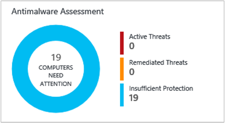

<properties
    pageTitle="Solução de avaliação de malware a análise de Log | Microsoft Azure"
    description="Você pode usar a solução de Antimalware no Log de análise para relatar o status de proteção antimalware em sua infraestrutura."
    services="log-analytics"
    documentationCenter=""
    authors="bandersmsft"
    manager="jwhit"
    editor=""/>

<tags
    ms.service="log-analytics"
    ms.workload="na"
    ms.tgt_pltfrm="na"
    ms.devlang="na"
    ms.topic="article"
    ms.date="10/10/2016"
    ms.author="banders"/>

# Solução de avaliação de malware a análise de Log

Você pode usar a solução de Antimalware no Log de análise para relatar o status de proteção antimalware em sua infraestrutura. Instalar a solução atualiza o agente OMS e configuração básica para OMS. Status de proteção de antimalware e ameaças detectadas nos servidores monitoradas sejam lidas e, em seguida, os dados são enviados para o serviço de análise de Log na nuvem para processamento. Lógica é aplicada aos dados recebidos e os dados de registros do serviço de nuvem. Servidores com ameaças detectadas e servidores com proteção insuficiente são mostrados no painel de **Antimalware** . Usando as informações no painel **Antimalware** , você pode identificar um plano para aplicar proteção aos servidores que precisam dela.

## Instalando e configurando a solução
Use as informações a seguir para instalar e configurar a solução.

- Adicione a solução de avaliação de Malware ao seu espaço de trabalho OMS usando o processo descrito em [soluções de adicionar a análise de Log da Galeria de soluções](log-analytics-add-solutions.md).  Não há nenhuma configuração adicional necessária.

## Use Antimalware

Análise de log relatórios de status de antimalware para:

- Computadores que executam o Windows Defender no Windows 8, Windows 8.1, Windows 10 e Windows Server 2016 TP4 ou posterior
- Centro de segurança do Windows (WSC) no Windows 8, Windows 8.1, Windows 10, Windows Server 2016 TP4 ou posterior
- Servidores que executam a proteção de ponto de extremidade do sistema central (v4.5.216 ou posterior), Azure máquinas virtuais com a [extensão de antimalware](http://go.microsoft.com/fwlink/?linkid=398023)e ferramenta de remoção de Software mal-intencionado (MSRT) Windows  
- Servidores com o Windows Management Framework 3 & 40; ou posterior & 41; [WMF 3.0](https://support.microsoft.com/kb/2506143), [WMF 4.0](http://www.microsoft.com/download/details.aspx?id=40855).

A solução de antimalware não relatar no momento:

- Servidores que executam o Windows Server 2008 e anteriores
- Funções da Web e trabalhador no Microsoft Azure
- 3º produtos de antimalware de festa

Você pode nos ajudar a priorizar a adição de novos recursos de votação ou adicionando uma nova sugestão em nossa [página de comentários](http://feedback.azure.com/forums/267889-azure-operational-insights/category/88093-malware-assessment-solution).

## Detalhes de conjunto de dados de avaliação de malware

Avaliação de malware coleta dados de configuração, metadados e dados de estado usando os agentes que você ativou.

A tabela a seguir mostra os métodos de coleta de dados e outros detalhes sobre como os dados são coletados para avaliação de Malware.

| plataforma | Agente de direta | Agente do SCOM | Armazenamento do Azure | SCOM necessário? | Enviados via grupo de gerenciamento de dados do SCOM agente | frequência de conjunto |
|---|---|---|---|---|---|---|
|Windows||||            || por hora|

A tabela a seguir mostra exemplos de tipos de dados coletados pelo avaliação de Malware:

|**Tipo de dados**|**Campos**|
|---|---|
|Configuração|CustomerID, AgentID, EntityID, ManagedTypeID, ManagedTypePropertyID, Valoratual, ChangeDate|
|Metadados|BaseManagedEntityId, ObjectStatus, OrganizationalUnit, ActiveDirectoryObjectSid, PhysicalProcessors, NetworkName, endereço IP, ForestDNSName, NetbiosComputerName, VirtualMachineName, LastInventoryDate, HostServerNameIsVirtualMachine, endereço IP, NetbiosDomainName, LogicalProcessors, DNSName, DisplayName, DomainDnsName, ActiveDirectorySite, PrincipalName, OffsetInMinuteFromGreenwichTime|
|Estado|StateChangeEventId, StateId, NewHealthState, OldHealthState, contexto, TimeGenerated, TimeAdded, StateId2, BaseManagedEntityId, MonitorId, HealthState, LastModified, LastGreenAlertGenerated, DatabaseTimeModified|

## Analise as ameaças para servidores

Quando seus computadores estão adequadamente protegidos, ameaças active rapidamente em quarentena pelo seu software de antimalware e raramente deverão aparecer como ameaças ativas. Por que motivo, examine ameaças remediadas que mostram a eficiência da solução de avaliação de Antimalware no procedimento de exemplo a seguir.

1. Na página **Visão geral** , clique no bloco de **Avaliação de Antimalware** .  
    
2. No painel **Antimalware** , examine a lâmina **Ameaças detectadas** e clique em um nome de servidor com ameaças remediadas.  
    
3. Na página de **pesquisa** , você pode ver informações detalhadas sobre as ameaças em quarentena. Ao lado de **ameaças**, clique em **Exibir**.  
    
4. Na página de **pesquisa da enciclopédia de malware** , clique no item de malware para exibir mais detalhes sobre ele.  
    
5. Na página do Microsoft **Malware Protection Center** para o item de malware, revise as informações na seção **Resumo** . Esta seção descreve como o seu software de antimalware pode detectar e remover as ameaças e fornece informações sobre o que o malware de ameaças podem ter que seus computadores.  
    

## Status de proteção de revisão

1. No painel **Antimalware** , examine a lâmina de **Status de proteção** e clique em **sem proteção em tempo real**.  
    
2. Pesquisa mostra uma lista de servidores sem proteção.  
    
3. Servidores sem proteção em tempo real são exibidos.

Computadores que não têm suporte para software antimalware são relatados como **nenhuma proteção de tempo real**.

## Próximas etapas

- Use [pesquisas de Log no Log de análise](log-analytics-log-searches.md) para exibir dados de avaliação de malware detalhadas.
