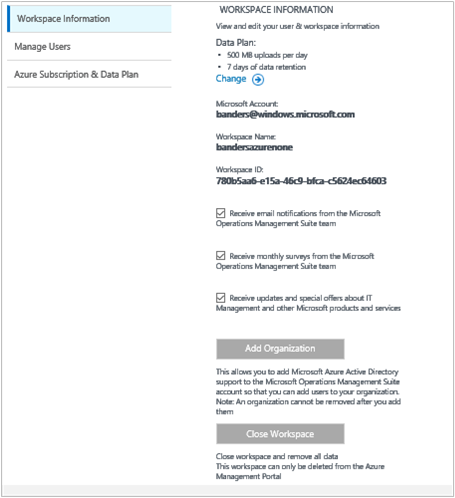
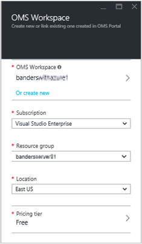
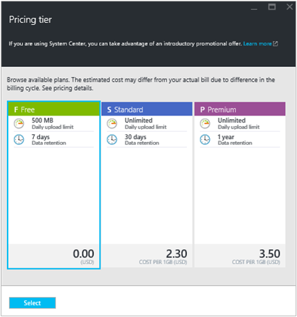

<properties
    pageTitle="Gerenciar o acesso a análise de Log | Microsoft Azure"
    description="Gerencie o acesso a análise de Log usando uma variedade de tarefas administrativas em usuários, contas, espaços de trabalho do OMS e contas do Azure."
    services="log-analytics"
    documentationCenter=""
    authors="bandersmsft"
    manager="jwhit"
    editor=""/>

<tags
    ms.service="log-analytics"
    ms.workload="na"
    ms.tgt_pltfrm="na"
    ms.devlang="na"
    ms.topic="get-started-article"
    ms.date="08/16/2016"
    ms.author="banders"/>

# Gerenciar o acesso a análise de Log

Para gerenciar o acesso a análise de Log, você usará uma variedade de tarefas administrativas em usuários, contas, espaços de trabalho do OMS e contas do Azure. Para criar um novo espaço de trabalho no pacote de gerenciamento de operações (OMS), que você escolha um nome de espaço de trabalho, associá-lo com sua conta e você escolher uma localização geográfica. Um espaço de trabalho é essencialmente um contêiner que inclui informações de conta e informações de configuração simples para a conta. Você ou outros membros da sua organização podem usar vários espaços de trabalho do OMS para gerenciar diferentes conjuntos de dados coletados de todos ou partes de sua infraestrutura.

O artigo [começar a usar a análise de Log](log-analytics-get-started.md) mostra como obter rapidamente para cima e em execução e o restante deste artigo descreve mais detalhadamente algumas das ações que você precisará gerenciar o acesso aos OMS.

Embora não talvez seja necessário realizar cada tarefa de gerenciamento primeiro, vamos abordar todas as tarefas comumente usadas que você pode usar nas seções a seguir:

- Determinar o número de espaços de trabalho que você precisa
- Gerenciar contas e usuários
- Adicionar um grupo a um espaço de trabalho existente
- Vincular um espaço de trabalho existente a uma assinatura do Azure
- Atualizar um espaço de trabalho para um plano de dados pagas
- Alterar um tipo de plano de dados
- Adicionar uma organização do Azure Active Directory para um espaço de trabalho existente
- Feche o seu espaço de trabalho do OMS

## Determinar o número de espaços de trabalho que você precisa

Um espaço de trabalho é um recurso do Azure e um contêiner onde dados são coletados, agregados, analisados e apresentados no portal do OMS.

É possível criar vários espaços de trabalho de análise de Log de OMS e para que os usuários tenham acesso a um ou mais espaços de trabalho. Em geral, você deseja minimizar o número de espaços de trabalho como isso permitirá que você consultar e correlação entre a maioria dos dados. Esta seção descreve quando ele pode ser útil para criar mais de um espaço de trabalho.

Hoje, um espaço de trabalho de análise de Log fornece:

- Uma localização geográfica para armazenamento de dados
- Detalhamento de cobrança
- Isolamento de dados

Com base nas características acima, talvez você queira criar vários espaços de trabalho se:

- Você é uma empresa global e você precisa de dados armazenados em regiões específicas por razões de conformidade ou Soberania de dados.
- Você está usando o Azure e deseja evitar encargos de transferência de dados de saída por ter um espaço de trabalho de análise de Log na mesma região como os Azure recursos que ele gerencia.
- Você deseja alocar encargos para diferentes departamentos ou grupos de negócios com base em seu uso. Quando você cria um espaço de trabalho para cada departamento ou grupo de negócios, seu demonstrativo de cobrança e o uso Azure mostra os encargos para cada espaço de trabalho separadamente.
- Você é um provedor de serviço gerenciado e precisar para manter os dados de análise de log para cada cliente gerenciar isolados dos outros dados de cliente.
- Gerenciar vários clientes e quiser que cada cliente ou departamento ou grupo de negócios para ver seus próprios dados, mas não os dados de outros clientes ou departamentos ou grupos de negócios.

Ao usar agentes para coletar dados, você pode configurar cada agente para relatar para o espaço de trabalho necessário.

Se você estiver usando o System Center Operations manager, cada grupo de gerenciamento do Operations Manager pode ser conectado com apenas um espaço de trabalho. Você pode instalar o agente de monitoramento da Microsoft em computadores gerenciados pelo Operations Manager e ter o relatório de agente para o Operations Manager e um espaço de trabalho de análise de Log diferentes.

### Informações de espaço de trabalho

No portal do OMS, você pode ver suas informações de espaço de trabalho e escolha se deseja receber informações da Microsoft.

#### Exibir informações do espaço de trabalho

1. Na OMS, clique no bloco de **configurações** .
2. Clique na guia **contas** .
3. Clique na guia **Informações de espaço de trabalho** .  
  

## Gerenciar contas e usuários

Cada espaço de trabalho pode ter várias contas de usuário associadas a ela, e cada conta de usuário (conta da Microsoft ou conta organizacional) pode ter acesso a vários espaços de trabalho do OMS.

Por padrão, a conta da Microsoft ou conta organizacional usados para criar o espaço de trabalho se torna o administrador do espaço de trabalho. O administrador pode convidar outras contas do Microsoft ou selecione os usuários no Active Directory do Azure.

Concedendo o acesso de pessoas no espaço de trabalho do OMS é controlada em 2 locais:

- No Azure, você pode usar o controle de acesso baseado em função para fornecer acesso à assinatura Azure e os recursos de Azure associados. Isso também é usado para acesso PowerShell e API REST.
- No portal do OMS, acesse somente OMS portal - não a assinatura do Azure associada.

Se você fornecer acesso pessoas portal OMS, mas não para a assinatura Azure que ele esteja vinculado a, em seguida, os blocos de solução de automação, Backup e recuperação de Site não mostrar todos os dados aos usuários quando eles entrar o portal OMS.

Para permitir que todos os usuários ver os dados nessas soluções, certifique-se de que eles têm pelo menos **leitor** acessar o Cofre de conta de automação, Cofre de Backup e recuperação do Site que esteja vinculado ao espaço de trabalho OMS.   

### Gerenciando o acesso a análise de Log usando o portal do Azure

Se você fornecer acesso de pessoas para o espaço de trabalho de análise de Log usando permissões Azure, no portal do Azure por exemplo, em seguida, os mesmos usuários podem acessar o portal de análise de Log. Se os usuários estiverem no portal do Azure, pode navegar para o portal OMS clicando na tarefa de **Portal de OMS** ao exibir o recurso de espaço de trabalho de análise de Log.

Alguns pontos a serem lembrados sobre o Azure portal:

- Isso não é um *controle de acesso baseado em função*. Se você tiver as permissões de acesso de *leitor* no portal do Azure para o espaço de trabalho de análise de Log, em seguida, você pode fazer alterações usando o portal OMS. O portal OMS tem um conceito de administrador, Colaborador e usuário de somente leitura. Se a conta que você está conectado com estiver no Azure Active Directory vinculado ao espaço de trabalho será um administrador no portal do OMS, caso contrário, você será um colaborador.

- Quando você entrar no portal do OMS usando http://mms.microsoft.com, em seguida, por padrão, você vê na lista **Selecionar um espaço de trabalho** . Ele contém apenas espaços de trabalho que foram adicionados usando o portal OMS. Para ver os espaços de trabalho tem acesso a com assinaturas do Azure e, em seguida, você precisa especificar um locatário como parte da URL. Por exemplo:

  `mms.microsoft.com/?tenant=contoso.com`O identificador de locatário costuma essa última parte do endereço de email que você entrar com.

- Se a conta que você entrar com uma conta no locatário Azure Active Directory, que normalmente é o caso, a menos que você está entrando-como um CSP, você será um *administrador* no portal do OMS. Se sua conta não estiver no locatário Azure Active Directory, você será um *usuário* no portal do OMS.

- Se você quiser navegar diretamente para um portal que você tenha acesso ao uso de permissões Azure, você precisa especificar o recurso como parte da URL. É possível obter essa URL usando o PowerShell.

  Por exemplo, `(Get-AzureRmOperationalInsightsWorkspace).PortalUrl`.

  A URL será parecida com:`https://eus.mms.microsoft.com/?tenant=contoso.com&resource=%2fsubscriptions%2faaa5159e-dcf6-890a-a702-2d2fee51c102%2fresourcegroups%2fdb-resgroup%2fproviders%2fmicrosoft.operationalinsights%2fworkspaces%2fmydemo12`

### Gerenciamento de usuários no portal do OMS

Gerenciar usuários e grupos na guia **Gerenciar usuários** em guia **contas** na página Configurações do. Lá, você pode executar as tarefas nas seções a seguir.  

#### Adicionar um usuário a um espaço de trabalho existente

Use as etapas a seguir para adicionar um usuário ou grupo para um espaço de trabalho do OMS. O usuário ou grupo poderão visualizar e atuar em todos os alertas que estão associados este espaço de trabalho.

>[AZURE.NOTE] Se você quiser adicionar um usuário ou grupo de sua conta organizacional do Active Directory do Azure, primeiro você deve garantir que associado a sua conta do OMS seu domínio Active Directory. Consulte [Adicionar uma Azure Active Directory organização um espaço de trabalho existente](#add-an-azure-active-directory-organization-to-an-existing-workspace).

1. Na OMS, clique no bloco de **configurações** .
2. Clique na guia **contas** e clique na guia **Gerenciar usuários** .
3. Na seção **Gerenciar usuários** , escolha o tipo de conta para adicionar: **Conta organizacional**, **Conta da Microsoft**, **Suporte da Microsoft**.
    - Se você escolher Account da Microsoft, digite o endereço de email do usuário associado com a Account da Microsoft.
    - Se você escolher conta organizacional, você pode inserir parte do usuário ou do grupo nome ou alias de email e será exibida uma lista de usuários e grupos. Selecione um usuário ou grupo.
    - Use o Microsoft Support para dar uma Microsoft Support engenharia acesso temporário ao seu espaço de trabalho para ajudar na solução de problemas.

    >[AZURE.NOTE] Para obter melhores resultados de desempenho, limite o número de grupos do Active Directory associados a uma única conta OMS para três — uma para os administradores, uma para os colaboradores e um para usuários de somente leitura. Usar mais grupos pode afetar o desempenho da análise de Log.

5. Escolha o tipo de grupo ou usuário para adicionar: **administrador**, **Colaborador**ou **Usuário de somente leitura** .  
6. Clique em **Adicionar**.

  Se você estiver adicionando uma conta da Microsoft, um convite para ingressar no espaço de trabalho é enviado ao email fornecido. Depois que o usuário siga as instruções no convite para ingressar OMS, o usuário pode exibir as informações de conta para essa conta OMS e alertas, e você poderá exibir as informações do usuário na guia **contas** da página **configurações** .
  Se você estiver adicionando uma conta organizacional, o usuário será capaz de acessar a análise de Log imediatamente.  
  

#### Editar um tipo de usuário existente

Você pode alterar a função de conta para um usuário associado a sua conta do OMS. Você tem as seguintes opções de função:

 - *Administrador*: pode gerenciar usuários, exibir e atuar em todos os alertas, adicionar e remover servidores

 - *Colaborador*: pode exibir e atuar em todos os alertas e adicionar e remover servidores

 - *Usuário de somente leitura*: usuários marcados como somente leitura não poderão:
   1. Adicionar/remover soluções. Galeria de soluções está oculta.
   2. Adicionar/modificar/remover blocos no **Meu Dashboard**.
   3. Exiba as páginas de **configurações** . As páginas estão ocultas.
   4. Na pesquisa de exibição, PowerBI configuração, pesquisas salvas e alertas de tarefas estão ocultas.

#### Para editar uma conta

1. Na OMS, clique no bloco de **configurações** .
2. Clique na guia **contas** e clique na guia **Gerenciar usuários** .
3. Selecione a função do usuário que você deseja alterar.
2. Na caixa de diálogo de confirmação, clique em **Sim**.

### Remover um usuário de um espaço de trabalho do OMS

Use as etapas a seguir para remover um usuário de um espaço de trabalho do OMS. Observe que isso não fechar o espaço de trabalho do usuário. Em vez disso, ele remove a associação entre o usuário e o espaço de trabalho. Se um usuário estiver associado a vários espaços de trabalho, esse usuário ainda poderão entrar OMS e ver os outros espaços de trabalho.

1. Na OMS, clique no bloco de **configurações** .
2. Clique na guia **contas** e clique na guia **Gerenciar usuários** .
3. Clique em **Remover** ao lado do nome de usuário que você deseja remover.
4. Na caixa de diálogo de confirmação, clique em **Sim**.

### Adicionar um grupo a um espaço de trabalho existente

1.  Siga as etapas 1 -4 em "To adicionar um usuário a um espaço de trabalho existente", acima.
2.  Em **Escolher usuário/grupo**, selecione o **grupo**.
    
3.  Insira o nome para exibição ou endereço de Email para o grupo que você gostaria de adicionar.
4.  Selecione o grupo nos resultados da lista e clique em **Adicionar**.

## Vincular um espaço de trabalho existente a uma assinatura do Azure

É possível criar um espaço de trabalho do site [microsoft.com/oms](https://microsoft.com/oms) .  No entanto, certos limites existirem nestes espaços de trabalho, o mais notável sendo um limite de 500MB/dia de carregamentos de dados se você estiver usando uma conta gratuita. Para fazer alterações a este espaço de trabalho, você precisará *vincular seu espaço de trabalho existente para uma assinatura do Azure*.

>[AZURE.IMPORTANT] Para vincular a um espaço de trabalho, sua conta do Azure já deve ter acesso ao espaço de trabalho que você gostaria de vincular.  Em outras palavras, a conta usada para acessar o portal Azure deve ser **igual** a conta usada para acessar o seu espaço de trabalho do OMS. Se esse não for o caso, consulte [Adicionar um usuário a um espaço de trabalho existente](#add-a-user-to-an-existing-workspace).

### Para vincular a um espaço de trabalho a uma assinatura do Azure no portal do OMS

Para vincular a um espaço de trabalho a uma assinatura do Azure no portal do OMS, o usuário conectado já deve ter uma conta do Microsoft Azure paga. O espaço de trabalho que você estiver usando ativamente obtém vinculado à conta do Azure.

1. Na OMS, clique no bloco de **configurações** .
2. Clique na guia **contas** e, em seguida, clique na guia **assinatura do Azure e plano de dados** .
3. Clique no plano de dados que você deseja usar.
4. Clique em **Salvar**.  
  

Um novo plano de dados é exibido na faixa de portal OMS na parte superior da sua página da web.

### Para vincular a um espaço de trabalho a uma assinatura do Azure no portal do Azure

1.  Entrar no [portal do Azure](http://portal.azure.com).
2.  Procurar **Analytics Log (OMS)** e, em seguida, selecioná-la.
3.  Você verá sua lista de espaços de trabalho existentes. Clique em **Adicionar**.  
    
4.  Em **Espaço de trabalho de OMS**, clique em **ou vincular a existente**.  
    
5.  Clique em **Configurar configurações necessárias**.  
    
6.  Você verá a lista de espaços de trabalho que ainda não estão vinculadas à sua conta do Azure. Selecione um espaço de trabalho.  
    
7.  Se necessário, você pode alterar valores para os seguintes itens:
    - Assinatura
    - Grupo de recursos
    - Local
    - Nível de preço  
        
8.  Clique em **criar**. O espaço de trabalho agora está vinculado à sua conta do Azure.

>[AZURE.NOTE] Se você não vir o espaço de trabalho que você gostaria de vincular, em seguida, sua assinatura do Azure não tem acesso ao espaço de trabalho OMS que você criou usando o site OMS.  Você precisará conceder acesso a esta conta de dentro do seu espaço de trabalho OMS usando o site OMS. Para fazer isso, consulte [Adicionar um usuário a um espaço de trabalho existente](#add-a-user-to-an-existing-workspace).

## Atualizar um espaço de trabalho para um plano de dados pagas

Há três dados de espaço de trabalho planejar tipos para OMS: **livre**, **Standard**e **Premium**.  Se você estiver em um plano de *livre* , você pode ter acertar ponta seus dados de 500 MB.  Você precisará atualizar seu espaço de trabalho para um ***plano flexível*** para coletar dados ultrapassar esse limite. A qualquer momento, você pode converter seu tipo de plano.  Para obter mais informações sobre preços do OMS, consulte [Detalhes de preços](https://www.microsoft.com/en-us/server-cloud/operations-management-suite/pricing.aspx).

>[AZURE.IMPORTANT] Planos de espaço de trabalho podem ser alterados somente se estiverem *vinculados* a uma assinatura do Azure.  Se você criou seu espaço de trabalho no Azure ou se você *já* vinculado seu espaço de trabalho, você pode ignorar esta mensagem.  Se você criou seu espaço de trabalho com o [site OMS](http://www.microsoft.com/oms), você precisará seguir as etapas no [Link um espaço de trabalho existente para uma assinatura do Azure](#link-an-existing-workspace-to-an-azure-subscription).

### Usando direitos do complemento OMS para System Center

O complemento do OMS para System Center fornece um direito para o plano de Premium de análise de Log de OMS, descrito na [OMS preços](https://www.microsoft.com/en-us/server-cloud/operations-management-suite/pricing.aspx).

Quando você compra o complemento do OMS para System Center, o complemento OMS é adicionado como um direito em seu contrato do System Center. Qualquer assinatura Azure criado sob este contrato pode fazer uso da qualificação. Isso permite que você, por exemplo, para ter vários espaços de trabalho do OMS que usam a qualificação do complemento OMS.

Para garantir que o uso de um espaço de trabalho do OMS é aplicado a seus direitos do complemento OMS, você precisará:

1. Vincular seu espaço de trabalho do OMS uma assinatura do Azure que faz parte do contrato Enterprise que inclui o OMS complemento compra e o uso de assinatura Azure
2. Selecione o plano de Premium para o espaço de trabalho

Ao revisar o seu uso no portal do Azure ou OMS, você não verá os direitos do complemento OMS. No entanto, você pode ver direitos no Portal Empresarial.  

Se você precisar alterar a assinatura Azure vinculado ao seu espaço de trabalho do OMS, você pode usar o cmdlet do PowerShell do Azure [AzureRmResource mover](https://msdn.microsoft.com/library/mt652516.aspx) .

### Usando o Azure confirmação de um contrato Enterprise

Se você optar por usar autônomo preços para componentes OMS, você se pagarão separadamente para cada componente do OMS e o uso aparecerá na fatura Azure.

Se você tiver uma confirmação de monetária Azure na inscrição de empresa ao qual suas assinaturas Azure estão vinculadas, qualquer uso da análise de Log será automaticamente débito contra qualquer confirmação monetária restante.

Se você precisar alterar a assinatura do Azure que o espaço de trabalho do OMS está vinculado a você pode usar o cmdlet do PowerShell do Azure [AzureRmResource mover](https://msdn.microsoft.com/library/mt652516.aspx) .  

### Para alterar um espaço de trabalho para um plano de dados pagas

1.  Entrar no [portal do Azure](http://portal.azure.com).
2.  Procurar **Analytics Log (OMS)** e, em seguida, selecioná-la.
3.  Você verá sua lista de espaços de trabalho existentes. Selecione um espaço de trabalho.  
    
4.  Em **configurações**, clique em **nível de preços**.  
    
5.  Em **nível de preços**, selecione um plano de dados e clique em **Selecionar**.  
    
6.  Quando você atualizar seu modo de exibição no portal do Azure, você verá o **nível de preços** atualizadas para o plano que você selecionou.  
    

Agora você pode coletar dados além o limite de dados "livre".

## Adicionar uma organização do Azure Active Directory para um espaço de trabalho existente

Você pode associar seu espaço de trabalho de análise de Log (OMS) com um domínio do Active Directory do Azure. Isso permite adicionar usuários do Active Directory diretamente ao seu espaço de trabalho do OMS sem a necessidade de uma conta da Microsoft separada.

Ao criar o espaço de trabalho a partir do portal Azure ou vincular seu espaço de trabalho a uma assinatura do Azure seu Azure Active Directory será vinculado como sua conta organizacional.

Quando você cria o espaço de trabalho a partir do portal OMS você será solicitado a vincular a uma assinatura do Azure e uma conta organizacional.

### Para adicionar uma organização do Azure Active Directory para um espaço de trabalho existente

1. Na página Configurações do OMS, clique em **contas** e, em seguida, clique na guia **Informações de espaço de trabalho** .  
2. Examine as informações sobre contas organizacionais e, em seguida, clique em **Adicionar organização**.  
    
3. Insira as informações de identidade para o administrador do seu domínio do Active Directory do Azure. Depois disso, você verá uma confirmação informando que seu espaço de trabalho está vinculado ao seu domínio do Active Directory do Azure.
    

>[AZURE.NOTE] Vinculação depois que sua conta está vinculada a uma conta organizacional, não pode ser removida ou alterada.

## Feche o seu espaço de trabalho do OMS

Quando você fecha um espaço de trabalho do OMS, todos os dados relacionados a seu espaço de trabalho é excluída do serviço OMS dentro de 30 dias de fechar o espaço de trabalho.

Se você for um administrador e há vários usuários associados com o espaço de trabalho, a associação entre os usuários e o espaço de trabalho será interrompida. Se os usuários estão associados a outros espaços de trabalho, eles podem continuar usando OMS com esses outros espaços de trabalho. No entanto, se elas não estão associadas a outros espaços de trabalho que eles precisará criar um novo espaço de trabalho para usar o OMS.

### Para fechar um espaço de trabalho do OMS

1. Na OMS, clique no bloco de **configurações** .
2. Clique na guia **contas** e, em seguida, clique na guia **Informações de espaço de trabalho** .
3. Clique em **Fechar do espaço de trabalho**.
4. Selecione um dos motivos para fechar o seu espaço de trabalho ou insira um motivo diferente na caixa de texto.
5. Clique em **Fechar espaço de trabalho**.

## Próximas etapas

- Consulte [computadores com Windows conectar-se para a análise de Log](log-analytics-windows-agents.md) para adicionar agentes e coletar dados.
- [Soluções de adicionar a análise de Log da Galeria de soluções](log-analytics-add-solutions.md) para adicionar funcionalidade e reunir dados.
- [Definir configurações de proxy e firewall na análise de Log](log-analytics-proxy-firewall.md) se sua organização usa um servidor proxy ou firewall para que agentes possam se comunicar com o serviço de análise de Log.
