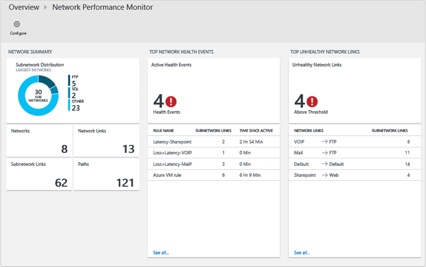
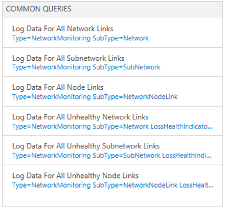
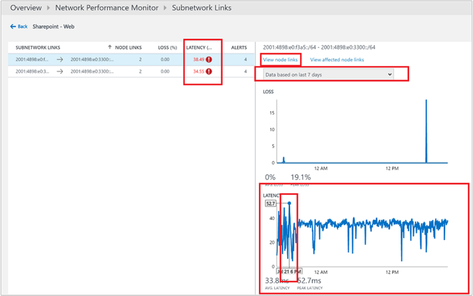

<properties
    pageTitle="Solução de desempenho no OMS de rede | Microsoft Azure"
    description="Ajuda a você monitorar o desempenho de suas redes de perto real-tempo para detectar o Monitor de desempenho de rede e localizar afunilamentos de desempenho de rede."
    services="log-analytics"
    documentationCenter=""
    authors="bandersmsft"
    manager="jwhit"
    editor=""/>

<tags
    ms.service="log-analytics"
    ms.workload="na"
    ms.tgt_pltfrm="na"
    ms.devlang="na"
    ms.topic="article"
    ms.date="07/28/2016"
    ms.author="banders"/>

# Solução de Monitor de desempenho (visualização) no OMS de rede

>[AZURE.NOTE] Esta é uma [solução de visualização](log-analytics-add-solutions.md#log-analytics-preview-solutions-and-features).

Este documento descreve como fazer a configuração e o uso da solução de Monitor de desempenho de rede no OMS, que ajuda a você monitorar o desempenho de suas redes de perto real-tempo para detecta e localizar rede gargalos de desempenho. Com a solução de Monitor de desempenho de rede, você pode monitorar a perda e latência entre duas redes, sub-redes ou servidores. Monitor de desempenho de rede detecte problemas de rede como tráfego blackholing roteamento erros e problemas que métodos de monitoramento de rede convencional não são capazes de detectar. Monitor de desempenho de rede gera alertas e notifica como e quando um limite é violado para um link de rede. Esses limites podem ser aprendidas automaticamente pelo sistema ou você pode configurá-los para usar regras de alerta personalizadas. Monitor de desempenho de rede garante a detecção imediata de problemas de desempenho de rede e localiza a origem do problema para um determinado segmento de rede ou dispositivo.

Você pode detectar problemas de rede com o painel de solução que exibe informações resumidas sobre sua rede incluindo eventos de integridade de rede recentes, links de rede não íntegra e links de sub-rede que estão enfrentando latência e alta perda de pacotes. Você pode drill down em um link de rede para exibir o status de integridade atual de links de sub-rede bem como links para nós. Você também pode exibir a tendência histórica da perda e latência na rede, sub-rede e nível de nó para nó. Você pode detectar problemas de rede temporário exibindo gráficos de tendência históricos de perda de pacotes e latência e localizar afunilamentos de rede em um mapa de topologia. O gráfico de topologia interativo permite que você visualize as rotas de rede de salto a salto e determinar a origem do problema. Como outras soluções, você pode usar a pesquisa de Log para diversos requisitos de análise para criar relatórios personalizados com base em dados coletados pelo Monitor de desempenho de rede.

A solução usa transações sintéticas como um mecanismo primário para detectar falhas na rede. Portanto, você pode usá-lo sem levar em consideração fornecedor de um dispositivo de rede específica ou o modelo. Ele funciona em ambientes híbridos, nuvem (IaaS) e locais. A solução detecta automaticamente a topologia de rede e várias rotas da sua rede.

Os produtos de monitoramento de rede típica focalizar monitorar a integridade do dispositivo (roteadores, opções etc.) de rede, mas não fornecem ideias para a qualidade real da conectividade de rede entre dois pontos, o que faz o Monitor de desempenho de rede.

### Usando a solução autônoma

Se você quiser monitorar a qualidade de conexões de rede entre as cargas de trabalho críticas, redes, data centers ou sites do office, em seguida, você pode usar a solução de Monitor de desempenho de rede por si só para monitorar a saúde de conectividade entre:

- vários sites dos data centers ou do office que estejam conectados usando uma rede pública ou privada
- cargas de trabalho essenciais que executam aplicativos linha de negócios
- Serviços de nuvem pública como Microsoft Azure ou Amazon Web Services (AWS) e redes de locais, se você tiver IaaS (máquina virtual) disponível e você tiver gateways configurados para permitir a comunicação entre redes locais e de nuvem
- Redes do Azure e local quando você usa o roteiro de Express

### Usando a solução com outras ferramentas de rede

Se você quiser monitorar um aplicativo de linha de negócios, você pode usar a solução de Monitor de desempenho de rede como uma solução complementar para outras ferramentas de rede. Uma rede lenta pode levar a aplicativos lentos e Monitor de desempenho de rede pode ajudá-lo a investigar problemas de desempenho de aplicativo que são causados por problemas de rede subjacentes. Como a solução não exigem qualquer acesso a dispositivos de rede, o administrador do aplicativo não precisa contar com uma equipe de rede para fornecer informações sobre como a rede está afetando os aplicativos.

Além disso, se você já investir em outra ferramentas de monitoramento de rede, a solução pode complementar essas ferramentas porque mais tradicionais soluções de monitoramento de rede não fornecem ideias para métricas de desempenho de rede de ponta a ponta como perda e latência.  A solução de Monitor de desempenho de rede pode ajudar a preencher esse espaço.

## Instalando e Configurando agentes para a solução

Use os processos básicos para instalar agentes em [computadores com Windows conectar-se para a análise de Log](log-analytics-windows-agents.md) e [Conectar o Operations Manager para análise de Log](log-analytics-om-agents.md).

>[AZURE.NOTE]
Você precisará instalar pelo menos 2 agentes para ter dados suficientes para detectar e monitorar os recursos de rede. Caso contrário, a solução permanecerá em um estado Configurando até você instalar e configurar agentes adicionais.

### Onde instalar os agentes

Antes de instalar agentes, considere a topologia de rede e quais partes da rede que você deseja monitorar. Recomendamos que você instale mais de um agente para cada sub-rede que você deseja monitorar. Em outras palavras, para cada sub-rede que você deseja monitorar, escolha dois ou mais servidores ou VMs e instalar o agente neles.

Se você não tiver certeza sobre a topologia de rede, instale os agentes em servidores com cargas de trabalho essenciais onde você deseja monitorar o desempenho de rede. Por exemplo, talvez você queira acompanhar de uma conexão de rede entre um servidor Web e um servidor executando o SQL Server. Neste exemplo, você deve instalar um agente em ambos os servidores.

Agentes monitoram a conectividade de rede (vínculos) entre hosts – não os próprios hosts. Portanto, para monitorar um link de rede, você deve instalar agentes em ambas as extremidades do link.

### Configurar agentes

Depois de instalar agentes, você precisará abrir portas de firewall para esses computadores para garantir que os agentes podem se comunicar. Você precisará baixar e execute o [script do PowerShell EnableRules.ps1](https://gallery.technet.microsoft.com/OMS-Network-Performance-04a66634) sem parâmetros em uma janela do PowerShell com privilégios administrativos

O script cria as chaves do registro necessárias para o Monitor de desempenho de rede e cria regras de firewall do Windows para permitir que agentes criar conexões de TCP uns com os outros. As chaves do Registro criadas pelo script também especificam se deseja registrar os logs de depuração e o caminho para o arquivo de logs. Ele também define a porta TCP agente usada para comunicação. Os valores para estas teclas são definidos automaticamente pelo script, para que você não deve alterar essas chaves manualmente.

A porta aberta por padrão é 8084. Você pode usar uma porta personalizada, fornecendo o parâmetro `portNumber` para o script. No entanto, a mesma porta deve ser usada em todos os computadores onde o script é executado.

>[AZURE.NOTE] O script EnableRules.ps1 configura as regras de firewall do Windows somente no computador onde o script é executado. Se você tiver um firewall de rede, você deverá garantir que ele permita o tráfego destinado a porta TCP sendo usada pelo Monitor de desempenho de rede.

## Configurar a solução

Use as informações a seguir para instalar e configurar a solução.

1. A solução de Monitor de desempenho de rede adquire dados de computadores que executam o Windows Server 2008 SP 1 ou posterior ou Windows 7 SP1 ou posterior, quais são os mesmos requisitos como o agente de monitoramento Microsoft (MMA).
2. Adicione a solução de Monitor de desempenho de rede ao seu espaço de trabalho OMS usando o processo descrito em [soluções de adicionar a análise de Log da Galeria de soluções](log-analytics-add-solutions.md).  
  
3. No portal do OMS, você verá um novo bloco intitulado **Monitor de desempenho de rede** com a mensagem *solução requer configuração adicional*. Você precisará configurar a solução para adicionar redes com base em sub-redes e nós que forem descobertos pelos agentes. Clique em **Monitor de desempenho de rede** para começar a configurar a rede padrão.  
  

### Configurar a solução com uma rede padrão

Na página de configuração, você verá uma única rede denominada **padrão**. Quando você ainda não tiver definido quaisquer redes, todas as sub-redes descobertos automaticamente são colocadas na rede padrão.

Sempre que você cria uma rede, você adiciona uma sub-rede-lo e sub-rede é removida da rede padrão. Se você excluir uma rede, todas as suas sub-redes automaticamente são retornadas à rede padrão.

Em outras palavras, a rede padrão é o contêiner para todas as sub-redes que não estão contidos em qualquer rede definidos pelo usuário. Você não pode editar ou excluir a rede padrão. Ela sempre permanece no sistema. No entanto, você pode criar quantas redes conforme necessário.

Na maioria dos casos, as sub-redes em sua organização serão organizadas em mais de uma rede e você deve criar uma ou mais redes para agrupar logicamente suas sub-redes.

### Criar novas redes

Uma rede no Monitor de desempenho de rede é um contêiner para sub-redes. Você pode criar uma rede com qualquer nome que você deseja e adiciona sub-redes à rede. Por exemplo, você pode criar uma rede denominada *Building1* e, em seguida, adicionar sub-redes ou você pode criar uma rede denominada *DMZ* e, em seguida, adicionar todas as sub-redes pertencentes a zona desmilitarizada a esta rede.

#### Para criar uma nova rede

1. Clique em **Adicionar rede** e digite o nome de rede e descrição.
2.  Selecione uma ou mais sub-redes e clique em **Adicionar**.
3. Clique em **Salvar** para salvar a configuração.  
  

### Aguarde a agregação de dados

Depois de salvar a configuração pela primeira vez, a solução começa coletando informações de latência e perda de pacotes de rede entre os nós onde os agentes estão instalados. Esse processo pode demorar um pouco, às vezes, 30 minutos. Durante esse estado, o bloco de Monitor de desempenho de rede na página Visão geral exibe uma mensagem informando *agregação de dados no processo*.

Quando os dados foi carregados, você verá os dados de mostrando de bloco atualizado do Monitor de desempenho de rede.

Clique no bloco para exibir o painel de Monitor de desempenho de rede.

### Editar configurações de monitoramento para sub-redes

Todas as sub-redes onde pelo menos um agente foi instalado estão listadas na guia **sub-redes** na página configuração.

#### Para habilitar ou desabilitar o monitoramento para sub-redes específicos

1. Marque ou desmarque a caixa próxima a **identificação de sub-rede** e, em seguida, certifique-se de que **uso para monitoramento** é selecionada ou desmarcada, conforme apropriado. Você pode marcar ou desmarcar várias sub-redes. Quando desativado, sub-redes não são monitoradas como os agentes serão atualizados para parar de ping outros agentes.
2. Escolha os nós que você deseja monitorar para uma determinada sub-rede selecionando sub-rede na lista e movendo os nós necessários entre as listas que contêm nós sem monitoramento e monitorados.
Você pode adicionar uma **Descrição** de personalizado para sub-rede, se desejar.
3. Clique em **Salvar** para salvar a configuração.  
  

### Escolha nós para monitorar

Todos os nós que possuem um agente instalado neles estão listados na guia **nós** .

#### Para habilitar ou desabilitar o monitoramento para nós

1. Marque ou desmarque os nós que você deseja monitorar ou parar monitoramento.
2. Clique em **usar para monitoramento**ou removê-la, conforme apropriado.
3. Clique em **Salvar**.  
  

### Definir regras de monitoramento

Monitor de desempenho de rede gera eventos de integridade sobre a conectividade entre um par de nós ou links de rede ou sub-rede quando um limite é violado. Esses limites podem ser aprendidas automaticamente pelo sistema ou você pode configurar regras de alerta personalizadas.

A *regra padrão* é criada pelo sistema e cria um evento de integridade sempre que perda ou latência entre qualquer par de redes ou sub-rede links violações o limite aprendeu de sistema. Você pode optar por desativar a regra padrão e criar regras de monitoramento personalizadas

#### Criar regras de monitoramento personalizadas

1. Clique em **Adicionar regra** na guia **Monitor** e insira o nome da regra e uma descrição.
2. Selecione o par dos links de rede ou sub-rede para monitorar a nas listas.
3. Primeiro, selecione a rede na qual a primeira sub-rede/s de interesse está contida na lista suspensa de rede e, em seguida, selecione a sub-rede/s na lista suspensa de sub-rede correspondente.
Selecione **todas as sub-redes** se você quiser monitorar todas as sub-redes em um link de rede. Da mesma forma, selecione a outra sub-rede/s de interesse. E, você pode clicar em **Adicionar exceção** para excluir o monitoramento para links de sub-rede específica da seleção que fez.
4. Se você não quiser criar eventos de integridade para os itens que você selecionou, desmarque **Habilitar monitoramento nos links cobertos por esta regra de integridade**.
5. Escolha monitoring condições.
Você pode definir limites personalizados para geração de eventos de integridade digitando valores de limite. Sempre que o valor da condição de fica acima seu limite selecionado para o par de rede/sub-rede selecionada, será gerado um evento de integridade.
6. Clique em **Salvar** para salvar a configuração.  
  

## Detalhes do conjunto de dados

Monitor de desempenho de rede usa pacotes de handshake TCP SYN-SYNACK-ACK para coletar perda e informações de latência e traceroute também é usado para obter informações de topologia.

A tabela a seguir mostra os métodos de coleta de dados e outros detalhes sobre como os dados são coletados para o Monitor de desempenho de rede.

| plataforma | Agente de direta | Agente do SCOM | Armazenamento do Azure | SCOM necessário? | Enviados via grupo de gerenciamento de dados do SCOM agente | frequência de conjunto |
|---|---|---|---|---|---|---|
| Windows ||||            || Handshakes TCP a cada 5 segundos, dados enviados cada 3 minutos |

A solução usa transações sintéticas para avaliar a integridade da rede. Agentes OMS instalados em vários ponto nos pacotes TCP de rede exchange uns com os outros e, no processo, Aprenda a perda de tempo e pacote de ida e volta, se houver. Periodicamente, cada agente também executa uma rota de rastreamento para outros agentes para localizar todas as várias rotas na rede que deve ser testada. Usando esses dados, os agentes são capazes de deduzir a latência de rede e figuras de perda de pacote. Os testes são repetidos a cada cinco segundos e dados são agregados por um período de três minutos pelos agentes antes de carregá-la OMS.

>[AZURE.NOTE] Embora agentes comunicarem frequentemente, elas não geram muitas tráfego de rede ao conduzir testes. Agentes dependem apenas pacotes de handshake TCP SYN-SYNACK-ACK para determinar a perda e latência – nenhum dado pacotes são trocadas. Durante esse processo, agentes comunicarem somente quando necessário e a topologia de comunicação do agente é otimizada para reduzir o tráfego de rede.

## Usando a solução

Esta seção explica todas as no painel funções e como usá-las.

### Bloco de visão geral da solução

Depois que você tiver habilitado a solução de Monitor de desempenho de rede, o bloco de solução na página Visão geral do OMS fornece uma rápida visão geral do funcionamento rede. Ele exibe um gráfico de rosca mostrando o número de links de sub-rede com e sem integridade. Quando você clica no bloco, ele abre o painel de solução.

### Painel de solução de desempenho de rede

A lâmina **Rede resumo** mostra um resumo das redes junto com seu tamanho relativo. Isso é seguido por peças mostrando o número total de links de rede, links de sub-rede e caminhos do sistema (um caminho consiste os endereços IP dos dois hosts com agentes e todos os saltos entre eles).

A lâmina de **Eventos de integridade de rede superior** fornece uma lista de eventos de integridade mais recentes e alertas no sistema e a hora desde que o evento foi ativo. Um evento de integridade ou alerta é gerada sempre que a perda de pacotes ou latência de um link de rede ou sub-rede excede um limite.

A lâmina de **Links de rede não íntegra superior** mostra uma lista de links de rede não íntegra. Esses são os links de rede que possuem um ou mais eventos de integridade negativos para eles no momento.

Os blades **Início sub-rede Links com mais perda** e **sub-rede com mais latência** mostram os links de sub-rede superior por perda de pacotes e sub-rede superior pela latência, respectivamente. Alta latência ou alguma quantidade de perda de pacotes pode ser esperada em determinados links de rede. Esses links aparecem nas listas de dez principais, mas não são marcados não íntegros.

A lâmina de **Consultas comuns** contém um conjunto de consultas de pesquisa que buscar monitoramento dados diretamente de rede bruto. Você pode usar essas consultas como ponto de partida para criar suas próprias consultas para relatórios personalizados.

### Busca detalhada de profundidade

Você pode clicar em vários links no solução painel para um drill-down mais profundo em qualquer área de interesse. Por exemplo, quando você vir um alerta ou um link de rede não íntegra aparecem no painel, você pode clicar em para investigar ainda mais. Você será levado para uma página que lista todos os links de sub-rede para o link de rede específico. Você poderá ver o status de integridade, a latência e a perda de cada link sub-rede e rapidamente descobrir quais links sub-rede estão causando o problema. Você pode clicar **links de nó do modo de exibição** para ver todos os links de nó para o link de sub-rede não íntegra. Em seguida, você pode ver links para nós individuais e localizar os links de nó não íntegra.

Você pode clicar em **topologia de modo de exibição** para exibir a topologia de salto a salto das rotas entre os nós de origem e destino. As rotas não íntegras ou saltos são mostrados em vermelho para que você possa identificar rapidamente o problema para uma parte específica da rede.

#### Gráficos de tendência

Em cada nível que você busca detalhada, você pode ver a tendência da perda e latência de um link de rede. Gráficos de tendência também estão disponíveis para links de sub-rede e nó. Você pode alterar o intervalo de tempo para o gráfico plotar usando o controle de tempo na parte superior do gráfico.

Gráficos de tendência mostram uma perspectiva histórica do desempenho de um link de rede. Alguns problemas de rede são temporárias natureza e seriam difícil capturar apenas examinando o estado atual da rede. Isso ocorre porque problemas podem expor rapidamente e desaparecem antes que alguém perceba, somente para repetir posteriormente no tempo. Esses problemas temporárias também podem ser difícil para administradores de aplicativo porque os problemas geralmente superfície como não explicadas aumenta o tempo de resposta do aplicativo, mesmo quando todos os componentes de aplicativo aparecem executar tranquilamente.

Você pode facilmente detectar esses tipos de problemas examinando um gráfico de tendências onde o problema aparecerá como um pico súbito na latência de rede ou perda de pacotes.

#### Mapa de topologia de salto a salto

Monitor de desempenho de rede mostra a topologia de salto a salto de rotas entre dois nós em um mapa de topologia interativo. Você pode exibir o mapa de topologia selecionando um link de nó e, em seguida, clicando em **topologia de modo de exibição**. Além disso, você pode exibir o mapa de topologia clicando **caminhos** bloco no painel. Quando você clica **caminhos** no painel, você terá que selecionar os nós de origem e destino do painel à esquerda e clique em **plotagem** para plotar as rotas entre os dois nós.

Mapa de topologia Exibe rotas quantos estão entre os dois nós e quais caminhos levar os pacotes de dados. Gargalos de desempenho de rede são marcados em vermelho no mapa de topologia. Você pode localizar uma conexão de rede com defeito ou um dispositivo de rede com defeito examinando vermelhos elementos coloridos no mapa de topologia.

Quando você clica em um nó ou passe o mouse sobre ele no mapa de topologia, você verá as propriedades do nó como o FQDN e o endereço IP. Clique em um salto para ver é endereço IP. Você pode realçar rotas determinadas desmarcando e selecionando apenas as rotas que você deseja realçar no mapa. Você pode ampliar ou reduzir o mapa de topologia usando a roda de mouse.

Observe que a topologia mostrada no mapa de topologia de camada 3 e não contém conexões e dispositivos de camada 2.

#### Localização de falhas

Monitor de desempenho de rede é capaz de localizar os afunilamentos de rede sem conexão com os dispositivos de rede. Com base nos dados que ele reúne da rede e aplicando algoritmos avançados no gráfico rede, Monitor de desempenho de rede faz uma estimativa probabilístico das partes da rede que provavelmente a origem do problema.

Essa abordagem é útil para determinar os afunilamentos de rede quando acessem saltos não está disponível porque não requer quaisquer dados a serem coletadas de dispositivos de rede como roteadores ou opções. Isso também é útil quando os saltos entre dois nós não estiverem em seu controle administrativo. Por exemplo, os saltos podem ser roteadores ISP.

### Pesquisa de log de análise

Todos os dados graficamente expostas por meio do painel de Monitor de desempenho de rede e drill down páginas também está disponível nativamente na pesquisa de análise de Log. Você pode consultar os dados usando a linguagem de consulta de pesquisa e criar relatórios personalizados ao exportar os dados para o Excel ou PowerBI. A lâmina de **Consultas comuns** no painel tem algumas consultas úteis que você pode usar como ponto de partida para criar suas próprias consultas e relatórios.

## Investigar a causa de um alerta de integridade

Agora que você leu sobre o Monitor de desempenho de rede, vamos examinar uma simple investigação causa de um evento de integridade.

1. Na página Visão geral, você receberá um instantâneo rápido da integridade de sua rede observando o **Monitor de desempenho de rede** lado a lado. Observe que fora os links de 80 sub-redes sob monitoramento, 43 não íntegra. Isso garante investigação. Clique no bloco para exibir o painel de solução.  
  

2. A imagem de exemplo abaixo, você notará que há 4 eventos de integridade atualmente e 4 links de rede que são não íntegras. Você decide investigar o problema e clique no link de rede **Web do Sharepoint** para descobrir a raiz do problema.  
  

3. A página de busca detalhada mostra todos os links de sub-rede no link de rede de **Web do Sharepoint** . Você notará que, para os dois links de sub-rede, a latência cruzou o limite tornando o link de rede não íntegra. Você também pode ver as tendências de latência dos links de sub-rede. Você pode usar a seleção de tempo controle no gráfico para focalizar o intervalo de tempo necessário. Você pode ver a hora do dia quando a latência atingiu seu pico. Posteriormente, você pode pesquisar os logs para esse período de tempo investigar o problema. Clique em **Exibir links de nó** para drill down ainda mais.  
  

4.  Semelhante à página anterior, a página de busca detalhada do link de sub-rede específico lista para baixo seus links de nó partes. Você pode executar ações semelhantes aqui como você fez na etapa anterior. Clique em **topologia de modo de exibição** para exibir a topologia entre 2 nós.  
  

5. Todos os caminhos entre 2 nós selecionados são plotados no mapa de topologia. Você pode visualizar a topologia de salto a salto de rotas entre dois nós no mapa de topologia. Oferece uma visão clara de rotas quantos existem entre os dois nós e quais caminhos os pacotes de dados estão demorando. Gargalos de desempenho de rede são marcados na cor vermelha. Você pode localizar uma conexão de rede com defeito ou um dispositivo de rede com defeito examinando vermelhos elementos coloridos no mapa de topologia.  
  

6. A perda, latência e o número de saltos em cada caminho podem ser examinados no painel de **Detalhes de caminho** . Neste exemplo, você pode ver que há 3 caminhos não íntegros conforme mencionado no painel. Use a barra de rolagem para exibir os detalhes desses caminhos não íntegra.  Use as caixas de seleção para selecionar um dos caminhos de forma que a topologia para apenas um caminho é plotada. Você pode usar a roda do mouse para ampliar ou reduzir o mapa de topologia.

  Na imagem abaixo você pode ver claramente a causa das áreas problema à seção específica da rede examinando os caminhos e saltos na cor vermelha. Clicar em um nó no mapa de topologia revela as propriedades do nó, incluindo o FQDN e o endereço IP. Clicar em um salto mostra o endereço IP do salto.  
  

## Próximas etapas

- [Logs de pesquisa](log-analytics-log-searches.md) para exibir registros de dados de desempenho de rede detalhado.
