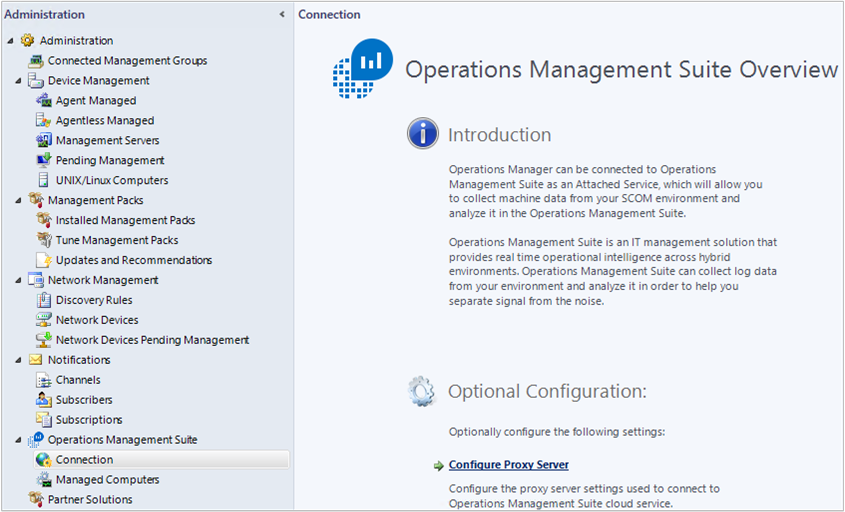
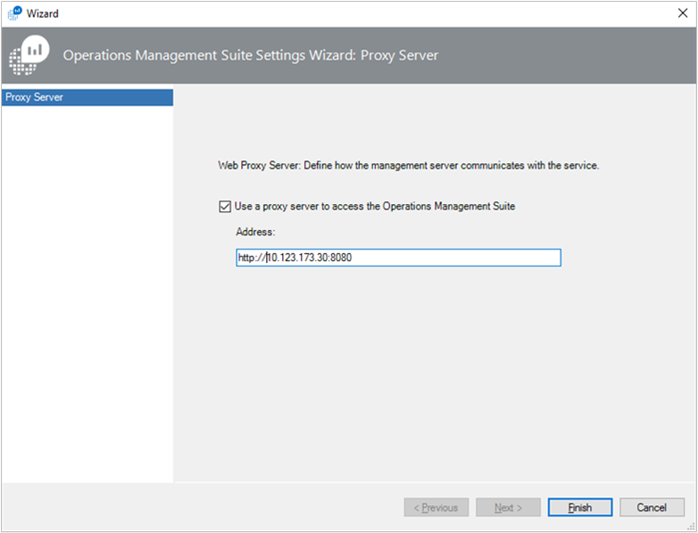
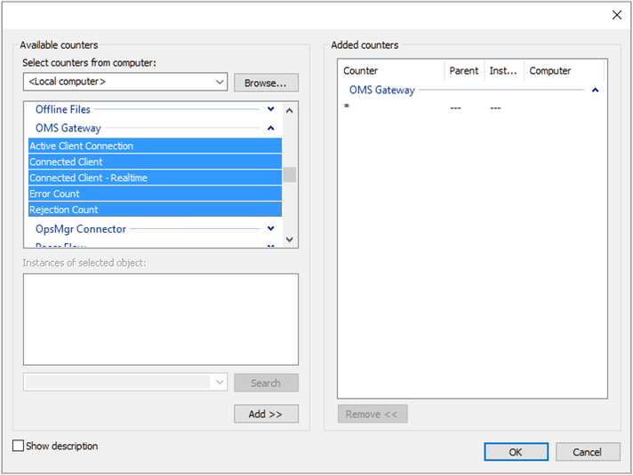

<properties
    pageTitle="Conectar computadores e dispositivos OMS usando o Gateway OMS | Microsoft Azure"
    description="Conecte o dispositivos gerenciados OMS e computadores monitorados Operations Manager com o Gateway OMS para enviar dados para o serviço OMS quando eles não tem acesso à Internet."
    services="log-analytics"
    documentationCenter=""
    authors="bandersmsft"
    manager="jwhit"
    editor=""/>
<tags
    ms.service="log-analytics"
    ms.workload="na"
    ms.tgt_pltfrm="na"
    ms.devlang="na"
    ms.topic="article"
    ms.date="10/26/2016"
    ms.author="banders"/>

# Conectar computadores e dispositivos OMS usando o Gateway OMS

Este documento descreve como seus dispositivos gerenciados OMS e computadores monitorados SCOM do System Center Operations Manager podem enviar dados para o serviço de OMS quando eles não tem acesso à Internet. O Gateway OMS pode coletar os dados e enviá-lo para o serviço OMS em seu nome.

O gateway é um proxy de encaminhamento de HTTP que ofereça suporte HTTP túnel usando o comando HTTP se conectar. O gateway pode lidar com até 2.000 dispositivos OMS conectado simultaneamente quando executados em uma CPU de 4-core, 16 GB servidor executando o Windows.

Como exemplo, sua empresa ou organização de grande porte pode ter servidores com conectividade de rede, mas pode não ter conectividade com a Internet. Em outro exemplo, você pode ter muitos ponto de dispositivos de venda (POS) com nenhum meio de monitoramento-los diretamente. E em outro exemplo, Operations Manager podem usar o Gateway OMS como um servidor proxy. Nesses exemplos, o Gateway OMS pode transferir dados dos agentes que são instalados nesses servidores ou dispositivos de POS para OMS.

Em vez de cada agente individuais enviando dados diretamente ao OMS e exigir uma conexão de Internet direto, todos os dados de agente em vez disso, é enviada por meio de um único computador que tem uma conexão de Internet. Computador é onde você pode instalar e usa o gateway. Neste cenário, você pode instalar agentes em todos os computadores onde você deseja coletar dados. O gateway transfere dados dos agentes para OMS diretamente — o gateway não analisar os dados que são transferidos.

Para monitorar o Gateway OMS e analisar desempenho ou dados de evento para o servidor onde ele está instalado, você deve instalar o agente OMS no computador onde o gateway também está instalado.

O gateway deve ter acesso à Internet para carregar dados para OMS. Cada agente também deve ter conectividade de rede com o seu gateway para que agentes automaticamente podem transferir dados de e para o gateway. Para obter melhores resultados, não instale o gateway em um computador que também é um controlador de domínio.

Eis um diagrama que mostra o fluxo de dados de agentes diretos para OMS.

Eis um diagrama que mostra o fluxo de dados do Operations Manager para OMS.

## Instalar o Gateway OMS

Instalar esse Gateway substitui as versões anteriores do Gateway se você instalou (encaminhadores de análise de Log).

Pré-requisitos: .net Framework 4,5, Windows Server 2012 R2 SP1 e acima

1. Baixe a versão mais recente do Gateway OMS no [Centro de Download da Microsoft](http://download.microsoft.com/download/2/5/C/25CF992A-0347-4765-BD7D-D45D5B27F92C/OMS%20Gateway.msi).
2. Para iniciar a instalação, clique duas vezes **Gateway.msi OMS**.
3. Na página Welcome, **Avançar**.  
    
4. Na página Contrato de licença, selecione **aceito os termos do contrato de licença** para aceitar o EULA e clique em seguida **Avançar**.
5. Na página endereço proxy e porta:
    1. Digite o número da porta TCP a ser usada para o gateway. Configuração abre esse número de porta do firewall do Windows. O valor padrão é 8080.
    O intervalo válido do número da porta é 1 a 65535. Se a entrada não se encaixa este intervalo, uma mensagem de erro será exibida.
    2. Opcionalmente, se o servidor onde o gateway está instalado precisa usar um proxy, digite o endereço de proxy onde o gateway precisa se conectar. Por exemplo, `http://myorgname.corp.contoso.com:80` se em branco, o gateway tentará se conectar à Internet diretamente. Caso contrário, o gateway se conecta ao proxy. Se seu servidor proxy requer autenticação, digite seu nome de usuário e senha.
          
    3. Clique em **Avançar**
6. Se você não tiver o Microsoft Updates habilitado, a página do Microsoft Update é exibida, onde você pode optar por habilitar o Microsoft Updates. Faça uma seleção e clique em **Avançar**. Caso contrário, prossiga para a próxima etapa.
7. Na página pasta de destino, deixe o de pasta padrão **%ProgramFiles%\OMS Gateway** ou digite o local onde você deseja instalar o gateway e, em seguida, clique em **Avançar**.
8. Sobre o página pronto para instalar, clique em **instalar**. Um controle de conta de usuário podem aparecer solicitando permissão para instalar. Em caso afirmativo, clique em **Sim**.
9. Após a conclusão da instalação, clique em **Concluir**. Você pode confirmar que o serviço está em execução, abrindo o snap-in Services. msc e verifique se o **Gateway de OMS** aparece na lista de serviços.  
    

## Instale um agente dispositivos

Se necessário, consulte [computadores com Windows conectar-se para a análise de Log](log-analytics-windows-agents.md) para obter informações sobre como instalar diretamente conectados agentes. Este artigo descreve como você pode instalar o agente usando um Assistente de configuração ou usando a linha de comando.

## Configurar agentes de OMS

Consulte [definir configurações de proxy e firewall com o agente de monitoramento da Microsoft](log-analytics-proxy-firewall.md) para obter informações sobre como configurar um agente para usar um servidor proxy, que é este caso é o gateway.

Agentes do Operations Manager enviam alguns dados como alertas, avaliação de configuração, espaço de instância e dados de capacidade, por meio do servidor de gerenciamento do Operations Manager. Outros dados de alto volume, como IIS logs, desempenho e segurança são enviados diretamente para o Gateway de OMS. Consulte [soluções de adicionar a análise de Log da Galeria de soluções](log-analytics-add-solutions.md) para uma lista completa dos dados que são enviados por meio de cada canal.

>[AZURE.NOTE]
Se você planeja usar o Gateway com balanceamento de carga de rede, consulte [Configurar opcionalmente balanceamento de carga de rede](#optionally-configure-network-load-balancing).

## Configurar um servidor de proxy SCOM

Configurar Operations Manager para adicionar o gateway para agir como um servidor proxy. Quando você atualiza a configuração de proxy, a configuração de proxy é automaticamente aplicada a todos os agentes de relatório para o Operations Manager.

Para usar o Gateway para suporte do Operations Manager, você precisa ter:

- Microsoft Agent de monitoramento (versão de agente – **8.0.10900.0** e posterior) instalados no servidor do Gateway e configurados para os espaços de trabalho OMS com o qual você deseja se comunicar.
- O gateway deve ter conectividade com a Internet ou estar conectado a um servidor de proxy que.

### Configurar o SCOM para o gateway

1. Abra o console do Operations Manager e em **Pacote de gerenciamento de operações**, clique em **Conexão** e, em seguida, clique em **Configurar o servidor de Proxy**:  
    
2. Selecione **usar um servidor proxy para acessar o pacote de gerenciamento de operações** e digite o endereço IP do servidor OMS Gateway. Certifique-se de que você inicie com a `http://` prefixo:  
    
3. Clique em **Concluir**. Seu servidor do Operations Manager está conectado a seu espaço de trabalho do OMS.

## Configurar balanceamento de carga de rede

Você pode configurar o gateway para alta disponibilidade usando criando um cluster de balanceamento de carga de rede. O cluster gerencia o tráfego de seus agentes redirecionando as conexões solicitadas dos Microsoft monitoramento agentes entre seus nós. Se um servidor de Gateway falhar, o tráfego é redirecionado para outros nós.

1. Abra o Gerenciador de balanceamento de carga de rede e criar um cluster.
2. Clique com botão direito do cluster antes de adicionar gateways e selecione **Propriedades Cluster.** Configure o cluster para ter seu próprio endereço IP:  
    
3. Para se conectar a um servidor Gateway OMS com o agente de monitoramento do Microsoft instalado, endereço IP do cluster de atalho e, em seguida, clique em **Adicionar Host ao Cluster**.  
    
4. Insira o endereço IP do servidor do Gateway que você deseja se conectar:  
    
5. Em computadores que não têm conectividade com a Internet, certifique-se de usar o endereço IP do cluster quando você configura as **Propriedades do agente de monitoramento Microsoft**:  
    

## Configurar para trabalhadores de híbrido de automação

Se você tiver trabalhadores de híbrido de automação em seu ambiente, as etapas a seguir fornecem soluções alternativas manuais, temporárias para configurar o Gateway para oferecer suporte a elas.

Nas etapas a seguir, você precisa saber o Azure região onde reside a conta de automação. Para localizar o local:

1. Entrar no [portal do Azure](https://portal.azure.com/).
2. Selecione o serviço de automação do Azure.
3. Selecione a conta de automação do Azure apropriada.
4. Exiba sua região em **local**.  
    

Use as tabelas a seguir para identificar a URL para cada local:

**URLs de serviço de dados de tempo de execução de trabalho**

| **local** | **URL** |
| --- | --- |
| Centro Norte dos EUA | ncus-jobruntimedata-produção-su1.azure-automation.net |
| Europa Ocidental | nós-jobruntimedata-produção-su1.azure-automation.net |
| Centro Sul dos EUA | scus-jobruntimedata-produção-su1.azure-automation.net |
| Leste EUA | eus-jobruntimedata-produção-su1.azure-automation.net |
| Canadá central | Cc-jobruntimedata-produção-su1.azure-automation.net |
| Norte da Europa | ne-jobruntimedata-produção-su1.azure-automation.net |
| Sudeste da Ásia | Mar-jobruntimedata-produção-su1.azure-automation.net |
| Índia central | CID-jobruntimedata-produção-su1.azure-automation.net |
| Japão | jpe-jobruntimedata-produção-su1.azure-automation.net |
| Austrália | ASE-jobruntimedata-produção-su1.azure-automation.net |

**URLs de serviço do agente**

| **local** | **URL** |
| --- | --- |
| Centro Norte dos EUA | ncus-agentservice-produção-1.azure-automation.net |
| Europa Ocidental | nós-agentservice-produção-1.azure-automation.net |
| Centro Sul dos EUA | scus-agentservice-produção-1.azure-automation.net |
| Leste EUA | eus2-agentservice-produção-1.azure-automation.net |
| Canadá central | Cc-agentservice-produção-1.azure-automation.net |
| Norte da Europa | ne-agentservice-produção-1.azure-automation.net |
| Sudeste da Ásia | Mar-agentservice-produção-1.azure-automation.net |
| Índia central | CID-agentservice-produção-1.azure-automation.net |
| Japão | jpe-agentservice-produção-1.azure-automation.net |
| Austrália | ASE-agentservice-produção-1.azure-automation.net |

Se seu computador está registrado como um trabalhador híbrido automaticamente para patch usando a solução de gerenciamento de atualização, siga estas etapas:

1. Adicione as URLs de serviço de dados de tempo de execução de trabalho à lista de permitidos Host no Gateway OMS. Por exemplo: `Add-OMSGatewayAllowedHost we-jobruntimedata-prod-su1.azure-automation.net`
2. Reinicie o serviço de Gateway OMS usando o seguinte cmdlet do PowerShell:`Restart-Service OMSGatewayService`

Se seu computador está em-hospedados à automação do Azure usando o cmdlet do registro de trabalhador híbrida, siga estas etapas:

1. Adicione a URL de registro do serviço de agente à lista de permitidos Host no Gateway OMS. Por exemplo:`Add-OMSGatewayAllowedHost ncus-agentservice-prod-1.azure-automation.net`
2. Adicione as URLs de serviço de dados de tempo de execução de trabalho à lista de permitidos Host no Gateway OMS. Por exemplo: `Add-OMSGatewayAllowedHost we-jobruntimedata-prod-su1.azure-automation.net`
3. Reinicie o serviço de Gateway OMS.
    `Restart-Service OMSGatewayService`

## Útil cmdlets do PowerShell

Cmdlets pode ajudá-lo a concluir tarefas que são necessárias para atualizar as configurações de configuração do Gateway OMS. Antes de você usá-los, certifique-se a:

1. Instale o Gateway OMS (MSI).
2. Abra a janela do PowerShell.
3. Para importar o módulo, digite o seguinte comando:`Import-Module OMSGateway`
4. Se nenhum erro ocorrido na etapa anterior, o módulo foram importado com êxito e os cmdlets podem ser usados. Tipo`Get-Module OMSGateway`
5. Após fazer alterações usando os cmdlets, certifique-se de que você reinicie o serviço de Gateway.

Se você receber um erro na etapa 3, o módulo não foi importado. O erro pode ocorrer quando não é possível localizar o módulo do PowerShell. Você pode encontrá-lo no caminho de instalação do Gateway: C:\Program Programas\Microsoft OMS Gateway\PowerShell.

| **Cmdlet** | **Parâmetros** | **Descrição** | **Exemplos** |
| --- | --- | --- | --- |
| `Set-OMSGatewayConfig` | Chave (obrigatório)   Valor | Altera a configuração do serviço | `Set-OMSGatewayConfig -Name ListenPort -Value 8080` |
| `Get-OMSGatewayConfig` | Chave | Obtém a configuração do serviço | `Get-OMSGatewayConfig`     `Get-OMSGatewayConfig -Name ListenPort` |
| `Set-OMSGatewayRelayProxy` | Endereço   Nome de usuário   Senha | Define o endereço (e credencial) do proxy (superior) relay | 1. Defina um proxy de resposta e a credencial:`Set-OMSGatewayRelayProxy -Address http://www.myproxy.com:8080 -Username user1 -Password 123`     2. Defina um proxy de resposta que não exige autenticação:`Set-OMSGatewayRelayProxy -Address http://www.myproxy.com:8080`     3. Limpe o proxy de resposta definindo, ou seja, não é necessário um proxy de resposta:`Set-OMSGatewayRelayProxy -Address ""` |
| `Get-OMSGatewayRelayProxy` |   | Obtém o endereço de proxy (superior) relay | `Get-OMSGatewayRelayProxy` |
| `Add-OMSGatewayAllowedHost` | Host (obrigatório) | Adiciona o host à lista de permitidos | `Add-OMSGatewayAllowedHost -Host www.test.com` |
| `Remove-OMSGatewayAllowedHos`t | Host (obrigatório) | Remove o host da lista de permitidos | `Remove-OMSGatewayAllowedHost -Host www.test.com` |
| `Get-OMSGatewayAllowedHost` |   | Obtém o host atualmente permitido (somente configurada localmente permissão host, não inclua automaticamente baixados hosts permitidos) | `Get-OMSGatewayAllowedHost` |
| `Add-OMSGatewayAllowedClientCertificate` | Assunto (obrigatório) | Adiciona o certificado de cliente sujeitos a lista de permitidos | `Add-OMSGatewayAllowedClientCertificate -Subject mycert` |
| `Remove-OMSGatewayAllowedClientCertificate` | Assunto (obrigatório) | Remove o assunto do certificado de cliente da lista de permitidos | `Remove- OMSGatewayAllowedClientCertificate -Subject mycert` |
| `Get-OMSGatewayAllowedClientCertificat`e |   | Obtém o cliente no momento permitido assuntos de certificado (somente é os assuntos permitidos configurados localmente, não inclua automaticamente baixados assuntos permitidos) | `Get-OMSGatewayAllowedClientCertificate` |

## Solucionar problemas

Recomendamos que você instale o agente OMS em computadores que tenham o gateway instalado. Você pode usar o agente para coletar os eventos que são registrados pelo gateway.

**Identificações de evento do OMS Gateway e descrições**

A tabela a seguir mostra as IDs de evento e descrições para eventos de Log de Gateway OMS.

| **ID** | **Descrição** |
| --- | --- |
| 400 | Qualquer erro de aplicativo que não tem uma ID específica |
| 401 | Configuração incorreta. Por exemplo: listenPort = "texto" em vez de um número inteiro |
| 402 | Exceção ao analisar mensagens de handshake do TLS |
| 403 | Erro de rede. Por exemplo: não é possível conectar ao servidor de destino |
| 100 | Informações gerais |
| 101 | O serviço foi iniciado |
| 102 | Serviço parou |
| 103 | Recebido um comando HTTP conectar do cliente |
| 104 | Não é um comando HTTP conectar |
| 105 | Servidor de destino não está na lista de permitidos ou a porta de destino não é porta segura (443)     Certifique-se de que o agente MMA no seu servidor Gateway e os agentes se comunicar com o Gateway está conectado ao mesmo espaço de trabalho de análise de Log.|
| 105 | Erro TcpConnection – certificado de cliente inválido: CN = Gateway    Garantir que:     & #149; Você está usando um Gateway com número de versão 1.0.395.0 ou maior.   & #149; O agente MMA no seu servidor Gateway e os agentes se comunicar com o Gateway está conectado o mesmo espaço de trabalho de análise de Log. |
| 106 | Qualquer motivo a sessão TLS seja suspeito e rejeitada |
| 107 | A sessão TLS tiver sido verificada |

**Contadores de desempenho para coletar**

A tabela a seguir mostra os contadores de desempenho disponíveis para o Gateway de OMS. Você pode adicionar os contadores usando o Monitor de desempenho.

| **Nome** | **Descrição** |
| --- | --- |
| Conexão de cliente do OMS Gateway/ativo | Número de conexões de rede (TCP) de cliente ativas |
| Contagem de Gateway/erro OMS | Número de erros |
| Cliente do OMS Gateway/conectado | Número de clientes conectados |
| Contagem de Gateway/rejeição de OMS | Número de rejeições devido a qualquer erro de validação de TLS |

## Obter assistência

Quando você estiver conectado no portal do Azure, você pode criar uma solicitação de assistência com o Gateway OMS ou qualquer outro serviço Azure ou recurso de um serviço.
Para solicitar assistência, clique no símbolo de ponto de interrogação no canto superior direito do portal e clique em **nova solicitação de suporte**. Em seguida, conclua o novo formulário de solicitação de suporte.

Você também pode deixar comentários sobre o OMS ou a análise de Log no [Fórum de comentários do Microsoft Azure](https://feedback.azure.com/forums/267889).

## Próximas etapas

- [Adicionar fontes de dados](log-analytics-data-sources.md) para coletar dados de fontes de conectado no seu espaço de trabalho do OMS e armazená-lo no repositório OMS.
