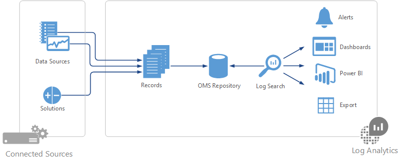

<properties
   pageTitle="O que é a análise de Log? | Microsoft Azure"
   description="Análise de log é um serviço no pacote de gerenciamento de operações (OMS) que ajuda você a coletar e analisar dados operacionais gerados por recursos em sua nuvem e ambiente local.  Este artigo fornece uma breve visão geral dos diferentes componentes de análise de Log e links para conteúdo detalhado."
   services="log-analytics"
   documentationCenter=""
   authors="bwren"
   manager="jwhit"
   editor="tysonn" />
<tags
   ms.service="log-analytics"
   ms.devlang="na"
   ms.topic="hero-article"
   ms.tgt_pltfrm="na"
   ms.workload="infrastructure-services"
   ms.date="09/06/2016"
   ms.author="bwren" />

# O que é a análise de Log?
Análise de log é um serviço no [pacote de gerenciamento de operações \(OMS\) ](../operations-management-suite/operations-management-suite-overview.md) que ajuda você a coletar e analisar dados gerados por recursos em sua nuvem e ambientes locais. Ele fornece ideias em tempo real usando pesquisa integrada e painéis personalizados prontamente analisar milhões de registros em todas as cargas de trabalho e servidores, independentemente de sua localização física.

## Componentes de análise de log
No Centro de Log Analytics é o repositório OMS que está hospedado na nuvem Azure.  Dados são coletados para o repositório de fontes conectadas por Configurando fontes de dados e soluções de adicionar à sua assinatura.  Fontes de dados e soluções cada criará diferentes tipos de registro que tem seu próprio conjunto de propriedades, mas ainda podem ser analisados juntos em consultas no repositório.  Isso permite que você use as mesmas ferramentas e métodos para trabalhar com diferentes tipos de dados coletados pelo fontes diferentes.

Fontes conectadas são os computadores e outros recursos que geram dados coletados pelo análise de Log.  Isso pode incluir agentes ou agentes instalados nos computadores [Windows](log-analytics-windows-agents.md) e [Linux](log-analytics-linux-agents.md) que se conectam diretamente em um [grupo de gerenciamento do System Center Operations Manager conectado](log-analytics-om-agents.md).  Análise de log também pode coletar dados de [armazenamento do Azure](log-analytics-azure-storage.md).

[Fontes de dados](log-analytics-data-sources.md) são os diferentes tipos de dados coletados de cada fonte conectada.  Isso inclui eventos e [dados de desempenho](log-analytics-data-sources-performance-counters.md) do [Windows](log-analytics-data-sources-windows-events.md) e agentes Linux além de fontes como [logs do IIS](log-analytics-data-sources-iis-logs.md)e [logs de texto personalizado](log-analytics-data-sources-custom-logs.md).  Configurar cada fonte de dados que deseja coletar e a configuração é fornecida automaticamente para cada fonte conectada.

## Análise de dados de análise de Log
Na maioria das sua interação com a análise de Log será por meio do portal OMS que é executado em qualquer navegador e fornece acesso às configurações e várias ferramentas para analisar e atuar sobre os dados coletados.  A partir do portal, você pode aproveitar [as pesquisas de log](log-analytics-log-searches.md) onde você construir consultas para analisar os dados coletados, [painéis](log-analytics-dashboards.md) que você pode personalizar com modos de exibição gráficos de pesquisas mais valiosas e [soluções](log-analytics-add-solutions.md) que fornecem funcionalidade adicional e ferramentas de análise.

Análise de log fornece uma sintaxe de consulta para recuperar rapidamente e consolidar dados no repositório.  Você pode criar e salvar [As pesquisas de Log](log-analytics-log-searches.md) para analisar os dados no portal do OMS diretamente ou pesquisas de log executou automaticamente para criar um alerta, se os resultados da consulta indicam uma condição importante.

Para dar uma rápida visualização gráfica da integridade de todo o seu ambiente, você pode adicionar visualizações para pesquisas de log salvo ao seu [painel](log-analytics-dashboards.md).   

Para analisar dados fora da análise de Log, você pode exportar os dados do repositório OMS em ferramentas como [Power BI](log-analytics-powerbi.md) ou o Excel.  Você também pode aproveitar a [API de pesquisa de Log](log-analytics-log-search-api.md) para criar soluções personalizadas que utilizam os dados de análise de Log ou para integrar com outros sistemas.

## Soluções
Soluções de adicionam funcionalidade a análise de Log.  Eles principalmente executadas na nuvem e fornecem análise de dados coletados no repositório OMS. Eles também podem definir novos tipos de registro a serem coletados que podem ser analisados com pesquisas de Log ou pela interface de usuário adicionais fornecidos pela solução no painel OMS.  

Soluções estão disponíveis para uma variedade de funções, e você poderá facilmente procurar soluções disponíveis e [adicioná-los ao seu espaço de trabalho do OMS](log-analytics-add-solutions.md) da Galeria de soluções.  Muitos serão implantados automaticamente e começar a trabalhar imediatamente, enquanto outras pessoas podem exigir algumas configurações.

## Arquitetura de análise de log
Requisitos de implantação de análise de Log são mínimos, pois os componentes centrais são hospedados na nuvem Azure.  Isso inclui o repositório além os serviços que permitem que você correlação e analisar os dados coletados.  O portal pode ser acessado de qualquer navegador, então não há nenhum requisito de software do cliente.

Você deve instalar agentes em computadores [Windows](log-analytics-windows-agents.md) e [Linux](log-analytics-linux-agents.md) , mas houver um agente adicional necessário para computadores que já são membros de um [grupo de gerenciamento do SCOM conectado](log-analytics-om-agents.md).  Agentes SCOM continuará para se comunicar com os servidores de gerenciamento que encaminharão seus dados para a análise de Log.  Algumas soluções apesar exigirão agentes para se comunicar diretamente com a análise de Log.  A documentação de cada solução, especifique seus requisitos de comunicação.

Quando você [se inscrever no Log de análise](log-analytics-get-started.md), você irá criar um espaço de trabalho do OMS.  Você pode considerar o espaço de trabalho como um ambiente de OMS exclusivo com seu próprio repositório de dados, fontes de dados e soluções. Você pode criar vários espaços de trabalho em sua assinatura para dar suporte a vários ambientes como produção e testar.

## Próximas etapas

- [Inscreva-se em uma conta gratuita da análise de Log de](log-analytics-get-started.md) teste em seu próprio ambiente.
- Exiba a diferentes [Fontes de dados](log-analytics-data-sources.md) disponíveis para coletar dados para o repositório OMS.
- [Procurar as soluções disponíveis na Galeria de soluções](log-analytics-add-solutions.md) para adicionar funcionalidade a análise de Log.
