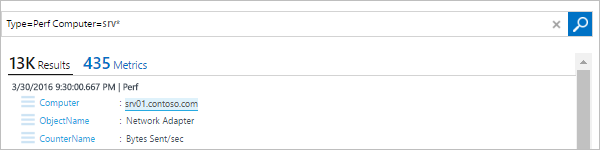
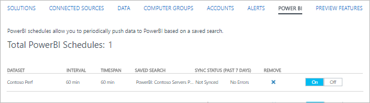

<properties
   pageTitle="Exportar dados de análise de Log para o Power BI | Microsoft Azure"
   description="Power BI é um serviço de análise de negócios baseado em nuvem da Microsoft que fornece relatórios e visualizações avançadas para análise de diferentes conjuntos de dados.  Análise de log continuamente pode exportar dados do repositório OMS no Power BI para que você possa aproveitar seus visualizações e ferramentas de análise.  Este artigo descreve como configurar consultas na análise de Log que exportar automaticamente ao Power BI em intervalos regulares."
   services="log-analytics"
   documentationCenter=""
   authors="bwren"
   manager="jwhit"
   editor="tysonn" />
<tags
   ms.service="log-analytics"
   ms.devlang="na"
   ms.topic="article"
   ms.tgt_pltfrm="na"
   ms.workload="infrastructure-services"
   ms.date="10/18/2016"
   ms.author="bwren" />

# Exportar dados de análise de Log para o Power BI

[Power BI](https://powerbi.microsoft.com/documentation/powerbi-service-get-started/) é um serviço de análise de negócios baseado em nuvem da Microsoft que fornece relatórios e visualizações avançadas para análise de diferentes conjuntos de dados.  Análise de log automaticamente pode exportar dados do repositório OMS no Power BI para que você possa aproveitar seus visualizações e ferramentas de análise.

Quando você configura o Power BI com a análise de Log, você cria consultas de log que exportar seus resultados para conjuntos de dados correspondentes no Power BI.  A consulta e exportação continuará a ser executado automaticamente em uma agenda que você define para manter o conjunto de dados atualizados com os últimos dados coletados pelo análise de Log.

## Cronogramas do Power BI

Um *Cronograma de BI do Power* inclui uma pesquisa de log que exporta um conjunto de dados do repositório OMS para um conjunto de dados correspondente no Power BI e um cronograma que define a frequência esta pesquisa é executada para manter o conjunto de dados atual.

Os campos no dataset corresponderão as propriedades dos registros retornados pela pesquisa log.  Se a pesquisa retorna registros de diferentes tipos dataset incluirá todas as propriedades de cada um dos tipos de registro fornecidos.  

> [AZURE.NOTE] É uma prática recomendada para usar uma consulta de pesquisa de log que retorna dados processados em vez de executar qualquer consolidação usando comandos como [medida](log-analytics-search-reference.md#measure).  Você pode executar qualquer agregação e cálculos no Power BI dos dados processados.

## Conectando o espaço de trabalho OMS Power BI

Antes de poder exportar de análise de Log ao Power BI, você deve se conectar seu espaço de trabalho do OMS à sua conta de Power BI usando o procedimento a seguir.  

1. No console do OMS clique no bloco de **configurações** .
2. Selecione **contas**.
3. Na seção **Informações de espaço de trabalho** , clique em **conectar à conta do Power BI**.
4. Digite as credenciais da sua conta do Power BI.

## Criar um cronograma do Power BI

Crie um agendamento de BI do Power para cada conjunto de dados usando o procedimento a seguir.

1. No console do OMS clique no bloco de **Pesquisa de Log** .
2. Digite uma nova consulta ou selecionar uma pesquisa salva que retorna os dados que você deseja exportar para o **Power BI**.  
3. Clique no botão de **Power BI** na parte superior da página para abrir a caixa de diálogo do **Power BI** .
4. Forneça as informações da tabela a seguir e clique em **Salvar**.

| Propriedade | Descrição |
|:--|:--|
| Nome | Nome para identificar o agendamento quando você exibir a lista dos cronogramas de Power BI. |
| Pesquisa salva | A pesquisa de log para executar.  Você pode selecionar a consulta atual ou selecione uma pesquisa salva existente na caixa suspensa. |
| Cronograma | A frequência de executar a pesquisa salva e exportar para o conjunto de dados do Power BI.  O valor deve estar entre 15 minutos e 24 horas. |
| Nome do conjunto de dados | O nome do conjunto de dados no Power BI.  Ele será criado se ele não existir e atualizado se ela existir. |

## Exibindo e removendo cronogramas do Power BI

Exiba a lista de agendas de Power BI existentes com o procedimento a seguir.

1. No console do OMS clique no bloco de **configurações** .
2. Selecione **Power BI**.

Além dos detalhes do cronograma, o número de vezes que o agendamento foi executado na semana passada e o status da última sincronização são exibidos.  Se a sincronização encontrou erros, você pode clicar no link para executar uma pesquisa de log de registros com detalhes do erro.

Você pode remover um cronograma clicando no **X** na **Remover coluna**.  Você pode desativar uma agenda selecionando **desativado**.  Para modificar um agendamento, você deve removê-lo e recriá-lo com as novas configurações.

## Explicação passo a passo de amostra
A seção a seguir descreve um exemplo de criação de uma agenda de BI Power e usando o seu conjunto de dados para criar um relatório simples.  Neste exemplo, todos os dados de desempenho para um conjunto de computadores é exportado ao Power BI e um gráfico de linha é criado para exibir a utilização do processador.

### Criar pesquisa de log
Vamos começar pela criação de uma pesquisa de log para os dados que desejamos enviar para o conjunto de dados.  Neste exemplo, vamos usar uma consulta que retorna todos os dados de desempenho para computadores com um nome que começa com *srv*.  

### Criar pesquisa do Power BI
Podemos clique no botão de **Power BI** para abrir a caixa de diálogo do Power BI e forneça as informações necessárias.  Queremos esta pesquisa para executar uma vez por hora e criar um conjunto de dados chamado *Contoso desempenho*.  Como já temos a pesquisa abrir que cria os dados queremos, podemos manter o padrão de *usar a consulta de pesquisa atual* para **Pesquisa salva**.

### Verifique se a pesquisa do Power BI
Para verificar que criamos o cronograma corretamente, podemos ver a lista de pesquisas do Power BI sob o bloco **configurações** no painel OMS.  Estamos Aguarde alguns minutos e atualizar essa exibição até que ele informa que a sincronização foi executada.

### Verifique se o conjunto de dados no Power BI
Podemos fazer logon em nossa conta na [powerbi.microsoft.com](http://powerbi.microsoft.com/) e role para **conjuntos de dados** na parte inferior do painel esquerdo.  Podemos ver que o conjunto de dados de *Desempenho de Contoso* está listado indicando que nosso exportação ficou com êxito.

### Criar relatório com base no conjunto de dados
Podemos selecionar o conjunto de dados de **Desempenho de Contoso** e clique nos **resultados** no painel **campos** à direita para exibir os campos que fazem parte deste DataSet.  Para criar um gráfico de linhas mostrando a utilização do processador para cada computador, podemos executar as seguintes ações.

1. Selecione a visualização de gráfico de linha.
2. Arraste **ObjectName** para **nível filtro de relatório** e **processador**.
3. Arraste **CounterName** para **nível filtro de relatório** e marque **% tempo de processador**.
4. Arraste **CounterValue** aos **valores**.
5. Arraste o **computador** para **legenda**.
6. Arraste **TimeGenerated** ao **eixo**.

Podemos ver que o gráfico de linhas resultante é exibido com os dados de nosso dataset.

### Salvar o relatório
Estamos salvar o relatório, clicando no botão Salvar na parte superior da tela e validar que agora está listado na seção de relatórios no painel esquerdo.

## Próximas etapas

- Saiba mais sobre [as pesquisas de log](log-analytics-log-searches.md) criar consultas que podem ser exportadas para o Power BI.
- Saiba mais sobre o [Power BI](http://powerbi.microsoft.com) para criar visualizações com base em exportações de análise de Log.
