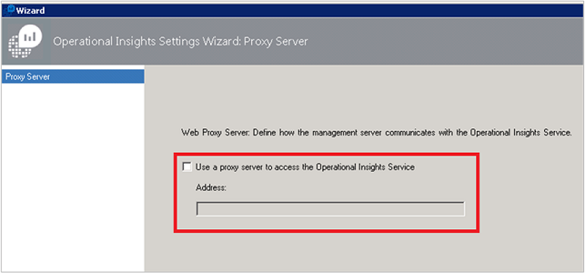
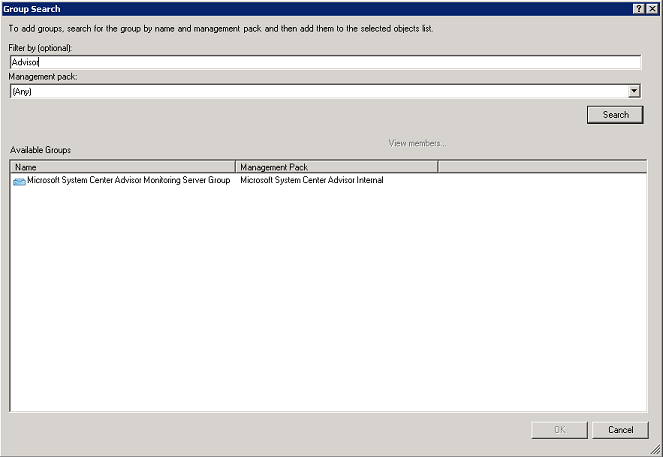
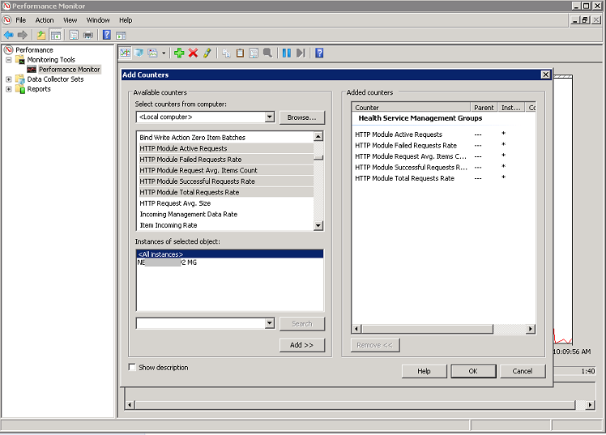

<properties
    pageTitle="Definir configurações de proxy e firewall na análise de Log | Microsoft Azure"
    description="Definir configurações de proxy e firewall quando seus agentes ou serviços OMS precisam usar portas específicas."
    services="log-analytics"
    documentationCenter=""
    authors="bandersmsft"
    manager="jwhit"
    editor=""/>

<tags
    ms.service="log-analytics"
    ms.workload="na"
    ms.tgt_pltfrm="na"
    ms.devlang="na"
    ms.topic="get-started-article"
    ms.date="08/23/2016"
    ms.author="banders;magoedte"/>

# <a name="configure-proxy-and-firewall-settings-in-log-analytics"></a>Definir configurações de proxy e firewall na análise de Log

Ações necessárias para configurar o proxy e as configurações de firewall para análise de Log no OMS diferem quando você usa o Operations Manager e seus agentes versus agentes monitoramento da Microsoft que se conectam diretamente aos servidores. Examine as seções a seguir para o tipo de agente que você usar.

## <a name="configure-proxy-and-firewall-settings-with-the-microsoft-monitoring-agent"></a>Definir configurações de proxy e firewall com o agente de monitoramento da Microsoft

Para o Microsoft monitoramento agente conectem e registrar com o serviço OMS, ele deve ter acesso ao número da porta dos seus domínios e as URLs. Se você usar um servidor proxy para comunicação entre o agente e o serviço OMS, você precisará garantir que os recursos apropriados estejam acessíveis. Se você usar um firewall para restringir o acesso à Internet, você precisa configurar seu firewall para permitir acesso ao OMS. As tabelas a seguir listam as portas que precisa de OMS.

|**Recurso do agente**|**Portas**|**Ignorar inspeção de HTTPS**|
|--------------|-----|--------------|
|\*. ods.opinsights.azure.com|443|Sim|
|\*. oms.opinsights.azure.com|443|Sim|
|\*. blob.core.windows.net|443|Sim|
|ods.systemcenteradvisor.com|443| |

Você pode usar o procedimento a seguir para definir configurações de proxy para o agente de monitoramento do Microsoft usando o painel de controle. Você precisará usar o procedimento para cada servidor. Se você tiver muitos servidores que você precisa configurar, talvez seja mais fácil de usar um script para automatizar esse processo. Em caso afirmativo, consulte o próximo procedimento [para definir configurações de proxy para o agente de monitoramento do Microsoft usando um script](#to-configure-proxy-settings-for-the-microsoft-monitoring-agent-using-a-script).

### <a name="to-configure-proxy-settings-for-the-microsoft-monitoring-agent-using-control-panel"></a>Definir configurações de proxy para o agente de monitoramento do Microsoft usando o painel de controle

1. Abra o **Painel de controle**.

2. Abra o **Microsoft Agent de monitoramento**.

3. Clique na guia **Configurações de Proxy** .<br>  
  

4. Selecione **usar um servidor proxy** , digite a URL e número de porta, se necessário, semelhante ao exemplo mostrado. Se seu servidor proxy requer autenticação, digite o nome de usuário e senha para acessar o servidor proxy.

Use o procedimento a seguir para criar um script PowerShell que você pode executar para definir as configurações de proxy para cada agente que conecta-se diretamente aos servidores.

### <a name="to-configure-proxy-settings-for-the-microsoft-monitoring-agent-using-a-script"></a>Definir configurações de proxy para o agente de monitoramento do Microsoft usando um script

Copiar o exemplo a seguir, atualizá-lo com informações específicas ao seu ambiente, salve-o com uma extensão de nome de arquivo PS1 e execute o script em cada computador que se conecta diretamente para o serviço OMS.

        
    param($ProxyDomainName="http://proxy.contoso.com:80", $cred=(Get-Credential))

    # First we get the Health Service configuration object.  We need to determine if we
    #have the right update rollup with the API we need.  If not, no need to run the rest of the script.
    $healthServiceSettings = New-Object -ComObject 'AgentConfigManager.MgmtSvcCfg'

    $proxyMethod = $healthServiceSettings | Get-Member -Name 'SetProxyInfo'

    if (!$proxyMethod)
    {
         Write-Output 'Health Service proxy API not present, will not update settings.'
         return
    }

    Write-Output "Clearing proxy settings."
    $healthServiceSettings.SetProxyInfo('', '', '')

    $ProxyUserName = $cred.username

    Write-Output "Setting proxy to $ProxyDomainName with proxy username $ProxyUserName."
    $healthServiceSettings.SetProxyInfo($ProxyDomainName, $ProxyUserName, $cred.GetNetworkCredential().password)
        

## <a name="configure-proxy-and-firewall-settings-with-operations-manager"></a>Definir configurações de proxy e firewall com o Operations Manager

Para um grupo de gerenciamento do Operations Manager conectem e registrar com o serviço OMS, ele deve ter acesso aos números de porta de seus domínios e URLs. Se você usar um servidor proxy para comunicação entre o servidor de gerenciamento do Operations Manager e o serviço OMS, você precisará garantir que os recursos apropriados estejam acessíveis. Se você usar um firewall para restringir o acesso à Internet, você precisa configurar seu firewall para permitir acesso ao OMS. Mesmo se um servidor de gerenciamento do Operations Manager não está atrás de um servidor proxy, talvez seja seus agentes. Nesse caso, o servidor proxy deve ser configurado da mesma maneira como os agentes são para habilitar e permitir a segurança e dados de solução de gerenciamento de Log para obter enviadas para o OMS serviço web.

Em ordem para agentes do Operations Manager para se comunicar com o serviço OMS, sua infraestrutura de Operations Manager (incluindo agentes) deve ter as configurações de proxy correto e versão. A configuração para agentes do proxy é especificado no console do Operations Manager. Sua versão deve ser um destes procedimentos:

- Operations Manager 2012 SP1 cumulativo 7 ou posterior
- Operations Manager 2012 R2 cumulativo 3 ou posterior


As tabelas a seguir listam as portas relacionadas a essas tarefas.

>[AZURE.NOTE] Alguns dos recursos a seguir mencionar Advisor e ideias operacionais, ambos foram versões anteriores do OMS. No entanto, os recursos listados serão alterado no futuro.

Aqui está uma lista de recursos do agente e portas:<br>

|**Recurso do agente**|**Portas**|
|--------------|-----|
|\*. ods.opinsights.azure.com|443|
|\*. oms.opinsights.azure.com|443|
|\*.blob.Core.Windows.NET/\*|443|
|ods.systemcenteradvisor.com|443|
<br>
Aqui está uma lista de recursos do servidor de gerenciamento e portas:<br>

|**Recurso de servidor de gerenciamento**|**Portas**|**Ignorar inspeção de HTTPS**|
|--------------|-----|--------------|
|Service.systemcenteradvisor.com|443| |
|\*. service.opinsights.azure.com|443| |
|\*. blob.core.windows.net|443|Sim| 
|Data.systemcenteradvisor.com|443| | 
|ods.systemcenteradvisor.com|443| | 
|\*. ods.opinsights.azure.com|443|Sim| 
<br>
Aqui está uma lista de recursos do console OMS e Operations Manager e portas.<br>

|**Recurso de console OMS e Operations Manager**|**Portas**|
|----|----|
|Service.systemcenteradvisor.com|443|
|\*. service.opinsights.azure.com|443|
|\*. live.com|Portas 80 e 443|
|\*. microsoft.com|Portas 80 e 443|
|\*. microsoftonline.com|Portas 80 e 443|
|\*. mms.microsoft.com|Portas 80 e 443|
|login.Windows.NET|Portas 80 e 443|
<br>

Use os procedimentos a seguir para registrar seu grupo de gerenciamento do Operations Manager com o serviço OMS. Se você estiver tendo problemas de comunicação entre o grupo de gerenciamento e o serviço OMS, use os procedimentos de validação para solucionar problemas de transmissão de dados para o serviço OMS.

### <a name="to-request-exceptions-for-the-oms-service-endpoints"></a>Para solicitar exceções para os pontos de extremidade do serviço OMS

1. Use as informações da primeira tabela apresentada anteriormente para garantir que os recursos necessários para o servidor de gerenciamento do Operations Manager estão acessíveis por meio de qualquer firewalls talvez seja necessário.
2. Use as informações da segunda tabela apresentada anteriormente para garantir que os recursos necessários do console de operações em Operations Manager e OMS estão acessíveis por meio de qualquer firewalls talvez seja necessário.
3. Se você usar um servidor proxy com o Internet Explorer, certifique-se de que ele está configurado e funcionando corretamente. Para verificar, você pode abrir uma conexão de web seguro (HTTPS), por exemplo [https://bing.com](https://bing.com). Se a conexão segura na web não funcionar em um navegador, ela provavelmente não funcionarão no console de gerenciamento do Operations Manager com serviços da web na nuvem.

### <a name="to-configure-the-proxy-server-in-the-operations-manager-console"></a>Para configurar o servidor de proxy no console do Operations Manager

1. Abra o console do Operations Manager e selecione o espaço de trabalho de **Administração** .

2. Expanda **Operacionais ideias**e selecione **Operacionais obtenção de informações de Conexão**.<br>  
    
3. No modo de exibição OMS Conexão, clique em **Configurar o servidor de Proxy**.<br>  
    
4. No assistente configurações operacionais de ideias: Servidor Proxy, selecione **usar um servidor proxy para acessar o serviço da Web operacionais ideias**e digite a URL com a porta número, por exemplo, **http://myproxy:80**.<br>  
    


### <a name="to-specify-credentials-if-the-proxy-server-requires-authentication"></a>Para especificar credenciais se o servidor proxy requer autenticação
 Configurações e credenciais do servidor proxy necessário para se propagarem para computadores gerenciados que irá relatar OMS. Esses servidores devem estar no *Microsoft sistema Center Advisor Monitoring Server Group*. Credenciais são criptografadas no registro de cada servidor no grupo.

1. Abra o console do Operations Manager e selecione o espaço de trabalho de **Administração** .
2. Em **Configuração de RunAs**, selecione **perfis**.
3. Abra o perfil **Central Advisor executar como perfil Proxy do sistema** .  
    
4. No executar como Assistente de perfil, clique em **Adicionar** para usar uma conta executar como. Você pode criar uma nova conta de executar como ou usar uma conta existente. Essa conta precisa ter permissões suficientes para passar pelo servidor proxy.  
    
5. Para configurar a conta para gerenciar, escolha **uma classe selecionada, o grupo ou o objeto** para abrir a caixa de pesquisa do objeto.  
    
6. Procure e selecione **Microsoft sistema Center Advisor Monitoring Server Group**.  
    
7. Clique **Okey** para fechar a caixa Adicionar um executar como conta.  
    
8. Concluir o assistente e salvar as alterações.  
    


### <a name="to-validate-that-oms-management-packs-are-downloaded"></a>Para validar que o gerenciamento OMS pacotes são baixados

Se você adicionou soluções OMS, você pode exibi-los no console do Operations Manager como pacotes de gerenciamento em **Administração**. Pesquisar *System Center Advisor* para encontrá-las rapidamente.  
     ou, você também pode verificar os pacotes de gerenciamento de OMS usando o seguinte comando do Windows PowerShell no servidor de gerenciamento do Operations Manager:

    ```
    Get-ScomManagementPack | where {$_.DisplayName -match 'Advisor'} | select Name,DisplayName,Version,KeyToken
    ```

### <a name="to-validate-that-operations-manager-is-sending-data-to-the-oms-service"></a>Para validar que Operations Manager está enviando dados para o serviço de OMS

1. No servidor de gerenciamento do Operations Manager, abra o Monitor de desempenho (perfmon.exe) e selecione o **Monitor de desempenho**.
2. Clique em **Adicionar**e selecione **Grupos de gerenciamento de serviço de integridade**.
3. Adicione todos os contadores que começam com **HTTP**.  
    
4. Se a configuração do Operations Manager é bom, que você verá a atividade para contadores de gerenciamento de serviço de integridade de eventos e outros itens de dados, com base nos pacotes de gerenciamento que você adicionou na OMS e a política de conjunto de log configurado.  
    


## <a name="next-steps"></a>Próximas etapas

- [Soluções de adicionar a análise de Log da Galeria de soluções](log-analytics-add-solutions.md) para adicionar funcionalidade e reunir dados.
- Familiarize-se com [pesquisas de log](log-analytics-log-searches.md) exibir informações detalhadas coletadas por soluções.
