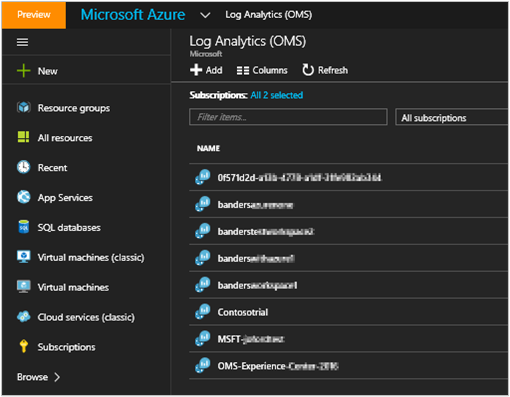
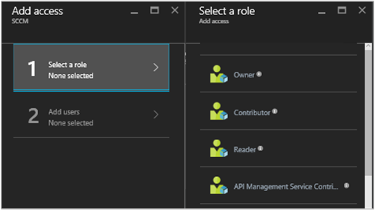
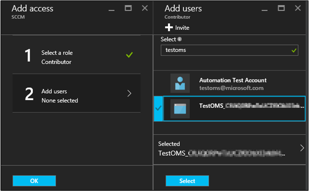
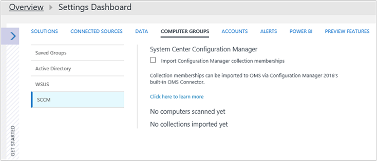
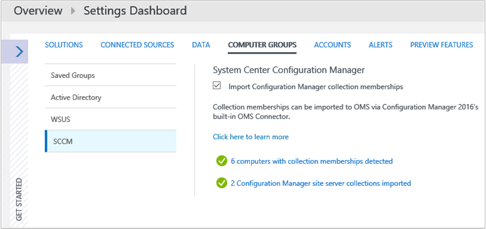

<properties
    pageTitle="Conectar o Gerenciador de configuração a análise de Log | Microsoft Azure"
    description="Este artigo mostra as etapas para conectar o Gerenciador de configuração a análise de Log e iniciar a análise de dados."
    services="log-analytics"
    documentationCenter=""
    authors="bandersmsft"
    manager="jwhit"
    editor=""/>

<tags
    ms.service="log-analytics"
    ms.workload="na"
    ms.tgt_pltfrm="na"
    ms.devlang="na"
    ms.topic="article"
    ms.date="08/29/2016"
    ms.author="banders"/>

# Conectar o Gerenciador de configuração a análise de Log

Você pode conectar o Gerenciador de configuração do System Center para análise de Log no OMS aos dados do conjunto de dispositivo de sincronização. Isso disponibiliza dados de sua implantação do Gerenciador de configuração do OMS.

Há várias etapas necessárias para conectar o Gerenciador de configuração para OMS, então, aqui está um resumo rápido do processo geral:

1. No Portal de gerenciamento do Azure, registre o Gerenciador de configuração como um aplicativo de aplicativo da Web e/ou Web API e garantir que você tenha a ID do cliente e chave secreta do cliente do registro do Azure Active Directory. Consulte o [portal de uso para criar o aplicativo do Active Directory e serviço principal que podem acessar os recursos](../resource-group-create-service-principal-portal.md) para obter informações detalhadas sobre como executar esta etapa.
2. No Portal do Azure gerenciamento, [forneça o Gerenciador de configuração (o aplicativo web registrado) com permissão para acessar OMS](#provide-configuration-manager-with-permissions-to-oms).
3. No Gerenciador de configuração, [Adicione uma conexão usando o Assistente de Conexão do OMS adicionar](#add-an-oms-connection-to-configuration-manager).
4. No Gerenciador de configuração, você pode [atualizar as propriedades de conexão](#update-oms-connection-properties) se a chave secreta senha ou cliente nunca expira ou é perdida.
5. Com as informações do portal do OMS, [Baixe e instale o agente de monitoramento da Microsoft](#download-and-install-the-agent) no computador com a conexão de serviço do Gerenciador de configuração ponto de função de sistema de site. O agente envia dados do Gerenciador de configuração para OMS.
6. Em OMS, [Importar conjuntos em Gerenciador de configuração](#import-collections) como grupos de computador.
7. No OMS, exiba dados em Gerenciador de configuração como [grupos de computador](log-analytics-computer-groups.md).

Você pode ler mais sobre como conectar o Gerenciador de configuração do OMS dados de [sincronização do Gerenciador de configuração para o pacote de gerenciamento de operações do Microsoft](https://technet.microsoft.com/library/mt757374.aspx).

## Fornecer Gerenciador de configuração de permissões ao OMS

O procedimento a seguir fornece o Portal de gerenciamento do Azure com permissões para acessar OMS. Especificamente, você deve conceder a *função Colaborador* aos usuários no grupo de recursos. Por sua vez, que permite que o Portal de gerenciamento do Azure conectar o Gerenciador de configuração do OMS.

>[AZURE.NOTE] Você deve especificar permissões para OMS Gerenciador de configuração. Caso contrário, você receberá uma mensagem de erro quando você usa o Assistente de configuração no Gerenciador de configuração.

1. Abra o [portal do Azure](https://portal.azure.com/) e clique em **Procurar** > **a análise de Log (OMS)** para abrir a lâmina de análise de Log (OMS).  
2. Na lâmina **a análise de Log (OMS)** , clique em **Adicionar** para abrir o **Espaço de trabalho de OMS** blade.  
  
3. No **Espaço de trabalho de OMS** blade, forneça as seguintes informações e clique em **Okey**.
  - **Espaço de trabalho OMS**
  - **Assinatura**
  - **Grupo de recursos**
  - **Local**
  - **Nível de preço**  
      

    >[AZURE.NOTE] O exemplo acima cria um novo grupo de recursos. O grupo de recursos só é usado para fornecer o Gerenciador de configuração com permissões para o espaço de trabalho OMS neste exemplo.

4. Clique em **Procurar** > **grupos de recursos** para abrir a lâmina de **grupos de recursos** .
5. Na lâmina **grupos de recursos** , clique em grupo de recursos que você criou acima para abrir o &lt;nome do grupo de recursos&gt; lâmina de configurações.  
  
6. No &lt;nome do grupo de recursos&gt; lâmina de configurações, clique em controle de acesso (IAM) para abrir o &lt;nome do grupo de recursos&gt; lâmina de usuários.  
    
7. No &lt;nome do grupo de recursos&gt; lâmina de usuários, clique em **Adicionar** para abrir a lâmina de **acesso de adicionar** .
8. Na lâmina **Adicionar acesso** , clique em **Selecionar uma função**e selecione a função **Colaborador** .  
    
9. Clique em **Adicionar usuários**, selecione o usuário do Gerenciador de configuração, clique em **Selecionar**e clique em **Okey**.  
    

## Adicionar uma conexão de OMS ao Gerenciador de configuração

Para adicionar uma conexão de OMS, seu ambiente do Gerenciador de configuração deve ter um [ponto de conexão de serviço](https://technet.microsoft.com/library/mt627781.aspx) configurados para o modo online.

1. Em **Administração do** espaço de trabalho do Gerenciador de configuração, selecione o **Conector de OMS**. Isso abre o **Assistente para Adicionar Conexão de OMS**. Selecione **Avançar**.

2. Na tela **gerais** , confirme que você fez as seguintes ações e que você tem detalhes de cada item e selecione **Avançar**.
  1. No Portal de gerenciamento do Azure, você já se registrou Gerenciador de configuração como um aplicativo de aplicativo da Web e/ou Web API e que você tenha a [ID do cliente do registro](../active-directory/active-directory-integrating-applications.md).
  2. No Portal de gerenciamento do Azure, você criou uma chave secreta do aplicativo para o aplicativo registrado no Active Directory do Azure.  
  3. No Portal de gerenciamento do Azure, que você forneceu o aplicativo web registrado com permissão para acessar OMS.  
  

3. Na tela do **Active Directory do Azure** , configurar suas configurações de conexão para OMS, fornecendo seu **locatário** , **ID do cliente** e **Chave de segredo do cliente** e selecione **Avançar**.  
  

4. Se você realizou todos os outros procedimentos com êxito, em seguida, as informações na tela de **Configuração de Conexão do OMS** aparecerão automaticamente nesta página. Informações para as configurações de conexão deverão aparecer para sua **assinatura do Azure** , **grupo de recursos Azure** e **o espaço de trabalho de pacote de gerenciamento de operações**.  
  

5. O assistente se conecta ao serviço OMS usando as informações que você tenha de entrada. Selecione os conjuntos de dispositivo que você deseja sincronizar com o OMS e clique em **Adicionar**.  
  

6. Verifique suas configurações de conexão na tela de **Resumo** e, em seguida, selecione **Avançar**. A tela de **progresso** mostra o status de conexão, em seguida, deve **concluída**.

>[AZURE.NOTE] Você deve se conectar OMS até o site de nível superior da sua hierarquia. Se você conecta OMS a um site primário autônomo e, em seguida, adicionar um site de administração central para seu ambiente, você precisará exclua e recrie a conexão OMS dentro da nova hierarquia.

Depois que você vinculou Gerenciador de configuração do OMS, você pode adicionar ou remover coleções e exibir as propriedades de conexão do OMS.

## Atualizar as propriedades de conexão de OMS

Se uma senha ou cliente chave secreta nunca expira ou é perdida, você precisará atualizar manualmente as propriedades de conexão do OMS.

1. No Gerenciador de configuração, navegue até **Serviços de nuvem** e selecione **OMS conector** para abrir a página de **Propriedades de Conexão de OMS** .
2. Nesta página, clique na guia do **Active Directory do Azure** para exibir seu **locatário**, **ID do cliente**, **expiração de chave secreta do cliente**. **Verifique se** a **chave secreta do cliente** se ela tiver expirado.

## Baixe e instale o agente

1. No portal do OMS, [Baixe o arquivo de configuração do agente do OMS](log-analytics-windows-agents.md#download-the-agent-setup-file-from-oms).
2. Use um dos seguintes métodos para instalar e configurar o agente no computador com a função de sistema do Gerenciador de configuração serviço conexão ponto site:
  - [Instalar o agente usando configuração](log-analytics-windows-agents.md#install-the-agent-using-setup)
  - [Instalar o agente usando a linha de comando](log-analytics-windows-agents.md#install-the-agent-using-the-command-line)
  - [Instalar o agente usando DSC em automação do Azure](log-analytics-windows-agents.md#install-the-agent-using-dsc-in-azure-automation)

## Coleções de importação

Depois de adicionado ao Gerenciador de configuração de uma conexão de OMS e instalou o agent no computador com a conexão de serviço do Gerenciador de configuração ponto função de sistema de site, a próxima etapa é importar conjuntos em Gerenciador de configuração do OMS como grupos de computador.

Após a importação está habilitada, as informações de associação do conjunto são recuperadas cada 3 horas para manter os membros do conjunto atual. Você pode optar por desativar importação a qualquer momento.

1. No portal do OMS, clique em **configurações**.
2. Clique na guia **Grupos de computador** e clique na guia **SCCM** .
3. Selecione **associações de coleção de Gerenciador de configuração de importação** e clique em **Salvar**.  
  

## Exibir dados em Gerenciador de configuração

Depois de adicionado ao Gerenciador de configuração de uma conexão de OMS e instalou o agent no computador com a função de sistema do Gerenciador de configuração serviço conexão ponto site, dados do agente são enviados à OMS. No OMS, seus conjuntos de Gerenciador de configuração aparecem como [grupos de computador](log-analytics-computer-groups.md). Você pode exibir os grupos da página do **Gerenciador de configuração** em **Grupos de computador** em **configurações**.

Após os conjuntos de importação, você pode ver quantos computadores com associações de coleção foram detectados. Você também pode ver o número de coleções que foram importados.

Quando você clica em qualquer um, pesquisa abre, exibindo em todos os grupos importados ou todos os computadores que pertencem a cada grupo. Usando a [Pesquisa de Log](log-analytics-log-searches.md), você pode iniciar uma análise aprofundada para os dados do Gerenciador de configuração.

## Próximas etapas

- Use [A pesquisa de Log](log-analytics-log-searches.md) para exibir informações detalhadas sobre os dados do Gerenciador de configuração.
