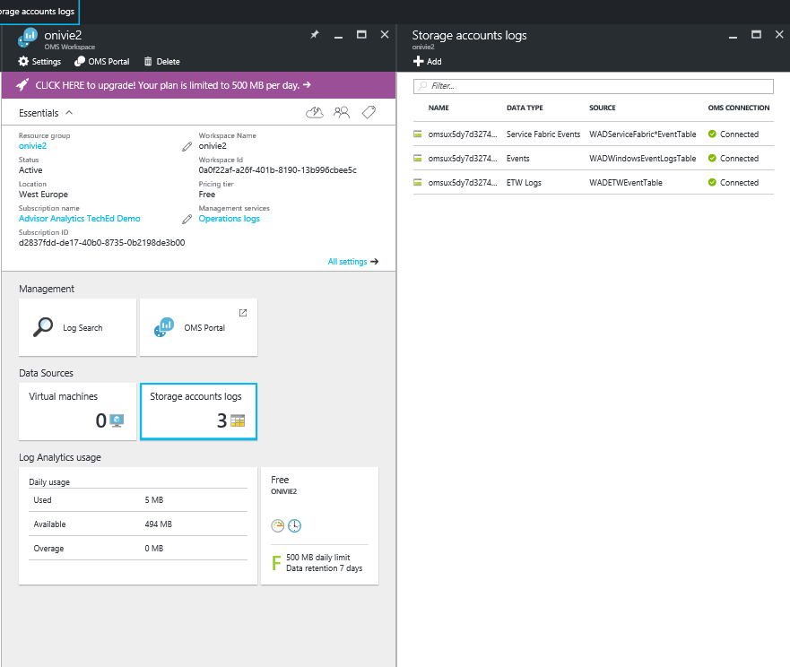
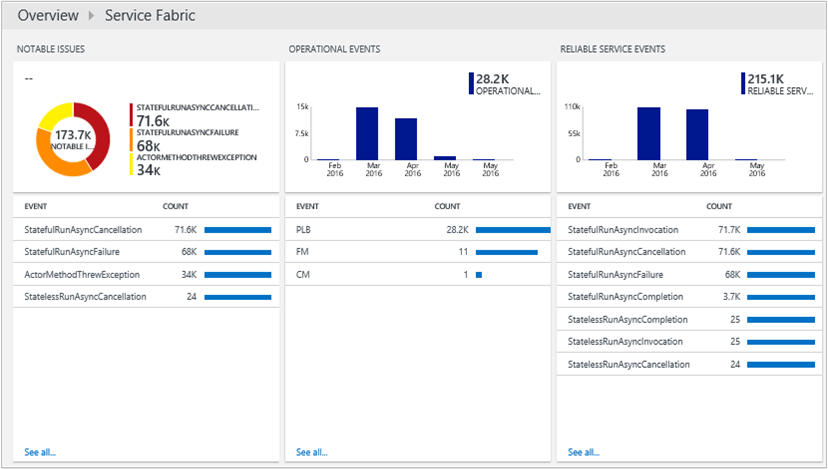

<properties
    pageTitle="Otimizar seu ambiente com a solução de serviço tecidos da análise de Log | Microsoft Azure"
    description="Você pode usar a solução de serviço tecidos para avaliar o risco e a integridade de seu serviço tecidos aplicativos, micro-services, nós e clusters."
    services="log-analytics"
    documentationCenter=""
    authors="niniikhena"
    manager="jochan"
    editor=""/>

<tags
    ms.service="log-analytics"
    ms.workload="na"
    ms.tgt_pltfrm="na"
    ms.devlang="na"
    ms.topic="article"
    ms.date="09/21/2016"
    ms.author="nini"/>


# <a name="service-fabric-solution-in-log-analytics"></a>Solução de tecidos Service no Log de análise

> [AZURE.SELECTOR]
- [Gerenciador de recursos](log-analytics-service-fabric-azure-resource-manager.md)
- [PowerShell](log-analytics-service-fabric.md)

Este artigo descreve como usar a solução de serviço tecidos em análise de Log para ajudar a identificar e solucionar problemas em seu cluster de estrutura de serviço.

A solução de serviço tecidos usa dados de diagnóstico do Azure de VMs de tecidos seu serviço, coletando dados das tabelas WAD do Azure. Análise de log, em seguida, lê eventos de estrutura de serviço tecidos, incluindo **Eventos de serviço confiáveis**, **Eventos de ator**, **Eventos operacionais**e **eventos ETW personalizado**. Com o painel de solução, você é capazes de exibir notáveis problemas e eventos relevantes no seu ambiente de estrutura de serviço.

Para começar a usar a solução, você precisará conectar seu cluster de estrutura de serviço a um espaço de trabalho de análise de Log. Aqui estão três cenários a considerar:

1. Se você não tiver implantado seu cluster de estrutura de serviço, use as etapas em ***implantar um Cluster de estrutura de serviço conectado a um espaço de trabalho de análise de Log*** para implantar um novo cluster e configurado para o relatório de análise de Log.

2. Se você precisar coletar contadores de desempenho de seus hosts para usar outras soluções OMS como segurança em seu Cluster de estrutura de serviço, siga as etapas em ***implantar um Cluster de estrutura de serviço conectado a um espaço de trabalho do OMS com extensão de máquina virtual instalada.***

3. Se você já implantou seu cluster de estrutura de serviço e deseja conectá-lo à análise de Log, siga as etapas em ***Adicionando uma conta existente do armazenamento a análise de Log.***


##<a name="deploy-a-service-fabric-cluster-connected-to-a-log-analytics-workspace"></a>Implante um Cluster de estrutura de serviço conectado a um espaço de trabalho de análise de Log.
Este modelo faz o seguinte:


1. Implanta um cluster de estrutura de serviço do Azure já conectado a um espaço de trabalho de análise de Log. Você tem a opção para criar um novo espaço de trabalho ao implantar o modelo ou entrada o nome de um espaço de trabalho de análise de Log já existente.
2. Adiciona a conta de armazenamento diagnóstico no espaço de trabalho de análise de Log.
3. Habilita a solução de serviço tecidos em seu espaço de trabalho de análise de Log.

[](https://portal.azure.com/#create/Microsoft.Template/uri/https%3A%2F%2Fraw.githubusercontent.com%2Fazure%2Fazure-quickstart-templates%2Fmaster%2Fservice-fabric-oms%2F%2Fazuredeploy.json)


Depois de selecionar o botão de implantar acima, você chegará no portal do Azure com parâmetros para edição. Certifique-se de criar um novo grupo de recursos se você digitar um novo nome de espaço de trabalho de análise de Log: 


Aceite os termos legais e acertar "Criar" para iniciar a implantação. Quando a implantação for concluída, você deverá ver o novo espaço de trabalho e cluster criado e o WADServiceFabric * evento, WADWindowsEventLogs e WADETWEvent tabelas adicionadas:


##<a name="deploy-a-service-fabric-cluster-connected-to-an-oms-workspace-with-vm-extension-installed"></a>Implante um Cluster de estrutura de serviço conectado a um espaço de trabalho do OMS com extensão de máquina virtual instalada.
Este modelo faz o seguinte:

1. Implanta um cluster de estrutura de serviço do Azure já conectado a um espaço de trabalho de análise de Log. Você pode criar um novo espaço de trabalho ou usar uma existente.
2. Adiciona as contas de armazenamento diagnóstico no espaço de trabalho de análise de Log.
3. Habilita a solução de serviço tecidos no espaço de trabalho de análise de Log.
4. Instala a extensão do agente MMA em cada escala de máquina virtual definir no seu cluster de estrutura de serviço. Com o agente MMA instalado, você é capazes de exibir métricas de desempenho sobre seus nós.


[](https://portal.azure.com/#create/Microsoft.Template/uri/https%3A%2F%2Fraw.githubusercontent.com%2Fazure%2Fazure-quickstart-templates%2Fmaster%2Fservice-fabric-vmss-oms%2F%2Fazuredeploy.json)


Seguindo as mesmas etapas acima, os parâmetros necessários de entrada e disparar uma implantação. Novamente, você verá o novo espaço de trabalho, cluster e tabelas WAD tudo criadas:



###<a name="viewing-performance-data"></a>Exibir dados de desempenho

Para exibir dados de desempenho de sua nós:
</br>
- Inicie o espaço de trabalho de análise de Log do portal do Azure.


- Vá para configurações no painel esquerdo e selecione dados >> contadores de desempenho do Windows >> "Adicionar contadores de desempenho selecionados": 

- Na pesquisa de Log, use as seguintes consultas para aprofundar principais métricas sobre seus nós:
</br>

    a. Compare a utilização de CPU média em todos os seus nós na última hora para ver quais nós estão enfrentando problemas e o intervalo de tempo um nó tinha um pico:

    ``` Type=Perf ObjectName=Processor CounterName="% Processor Time"|measure avg(CounterValue) by Computer Interval 1HOUR. ```

    


    b. Exibir gráficos de linhas semelhantes para memória disponível em cada nó com esta consulta:

    ```Type=Perf ObjectName=Memory CounterName="Available MBytes Memory" | measure avg(CounterValue) by Computer Interval 1HOUR.```

    Para exibir uma lista de todos os seus nós, mostrando o valor médio exato MBytes disponíveis para cada nó, use esta consulta:

    ```Type=Perf (ObjectName=Memory) (CounterName="Available MBytes") | measure avg(CounterValue) by Computer ```

    


    c. No caso que você deseja fazer drill down em um nó específico examinando o por hora média, mínimo e máximo 75 percentil uso de CPU, conseguir fazer isso usando essa consulta (Substituir campo computador):

    ```Type=Perf CounterName="% Processor Time" InstanceName=_Total Computer="BaconDC01.BaconLand.com"| measure min(CounterValue), avg(CounterValue), percentile75(CounterValue), max(CounterValue) by Computer Interval 1HOUR```

    

    Leia mais informações sobre métricas de desempenho no Log Analytics [aqui]. (https://blogs.technet.microsoft.com/msoms/tag/metrics/)


##<a name="adding-an-existing-storage-account-to-log-analytics"></a>Adicionando uma conta existente do armazenamento a análise de Log

Este modelo simplesmente adiciona suas contas de armazenamento existente para um espaço de trabalho de análise de Log do novo ou existente.
</br>

[](https://portal.azure.com/#create/Microsoft.Template/uri/https%3A%2F%2Fraw.githubusercontent.com%2FAzure%2Fazure-quickstart-templates%2Fmaster%2Foms-existing-storage-account%2Fazuredeploy.json)

>[AZURE.NOTE] Selecionar um grupo de recursos, se você estiver trabalhando com um espaço de trabalho de análise de Log já existente, selecione "Usar existentes" e procure o grupo de recursos que contém o espaço de trabalho do OMS. Criar um novo caso contrário.


Após ter sido implantado este modelo, você poderá ver a conta de armazenamento conectada ao seu espaço de trabalho de análise de Log. Neste exemplo, eu adicionei mais uma conta de armazenamento no espaço de trabalho do Exchange que eu criei acima.


## <a name="view-service-fabric-events"></a>Exibir eventos de estrutura de serviço

Depois que as implantações são concluídas e a solução de estrutura de serviço foi habilitada em seu espaço de trabalho, selecione o bloco de **Estrutura de serviço** no portal de análise de Log para iniciar o painel de estrutura de serviço. O painel inclui as colunas da tabela a seguir. Cada coluna lista os eventos de dez principais por contagem correspondam aos critérios da coluna para o intervalo de tempo especificado. Você pode executar uma pesquisa de log que fornece a lista inteira clicando em **ver todos** na parte inferior direita de cada coluna, ou clicando no cabeçalho da coluna.

| **Evento de estrutura de serviço** | **Descrição** |
| --- | --- |
| Problemas de notáveis | Uma exibição de problemas como RunAsyncFailures RunAsynCancellations e liste nó. |
| Eventos operacionais | Eventos operacionais notáveis como implantações e atualização do aplicativo. |
| Eventos de serviço confiável | Eventos de serviço confiável notáveis tal um Runasyncinvocations. |
| Eventos de ator | Eventos de ator notáveis gerados pelo seu microserviços, como exceções lançadas por um método de ator, ativações ator e desativações e assim por diante. |
| Eventos de aplicativo | Todos os personalizados ETW eventos gerados por seus aplicativos. |




A tabela a seguir mostra os métodos de coleta de dados e outros detalhes sobre como os dados são coletados tecidos de serviço.

| plataforma | Agente de direta | Agente do SCOM | Armazenamento do Azure | SCOM necessário? | Enviados via grupo de gerenciamento de dados do SCOM agente | frequência de conjunto |
|---|---|---|---|---|---|---|
|Windows||| |            ||10 minutos |


>[AZURE.NOTE] Você pode alterar o escopo desses eventos na solução serviço tecidos clicando em **dados com base nos últimos 7 dias** na parte superior do painel de controle. Você também pode mostrar eventos gerados os últimos 7 dias, 1 dia ou seis horas. Ou, você pode selecionar **personalizado** para especificar um intervalo de datas personalizado.


## <a name="next-steps"></a>Próximas etapas

- Use [Pesquisas de Log no Log de análise](log-analytics-log-searches.md) para exibir dados detalhados de evento tecidos de serviço.
