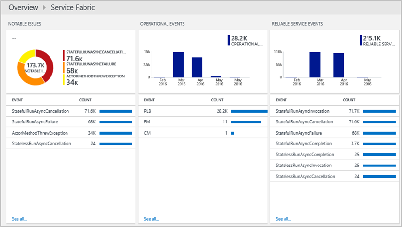
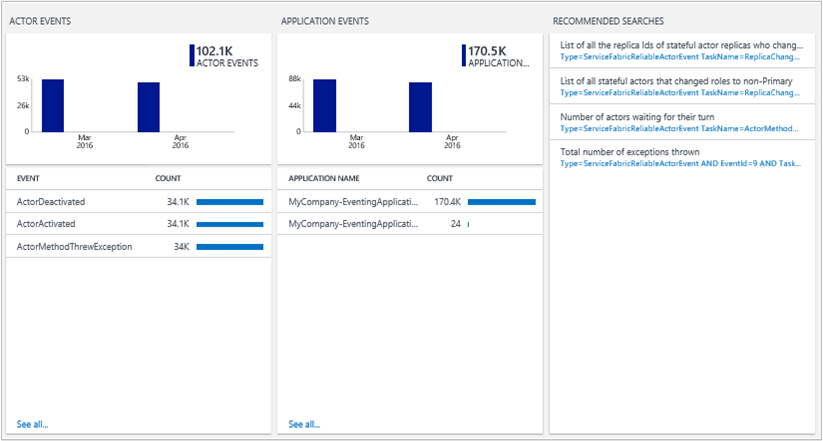

<properties
    pageTitle="Otimizar seu ambiente com a solução de serviço tecidos da análise de Log | Microsoft Azure"
    description="Você pode usar a solução de serviço tecidos para avaliar o risco e a integridade de seu serviço tecidos aplicativos, micro-services, nós e clusters."
    services="log-analytics"
    documentationCenter=""
    authors="niniikhena"
    manager="jochan"
    editor=""/>

<tags
    ms.service="log-analytics"
    ms.workload="na"
    ms.tgt_pltfrm="na"
    ms.devlang="na"
    ms.topic="article"
    ms.date="09/21/2016"
    ms.author="nini"/>


# <a name="service-fabric-solution-in-log-analytics"></a>Solução de tecidos Service no Log de análise

> [AZURE.SELECTOR]
- [Gerenciador de recursos](log-analytics-service-fabric-azure-resource-manager.md)
- [PowerShell](log-analytics-service-fabric.md)

Este artigo descreve como usar a solução de serviço tecidos em análise de Log para ajudar a identificar e solucionar problemas em seu cluster de estrutura de serviço, obtendo visibilidade em como os nós de serviço tecidos estiver executando e como seus aplicativos e serviços de micro estão sendo executados.

A solução de serviço tecidos usa dados de diagnóstico do Azure de VMs de tecidos seu serviço, coletando dados das tabelas WAD do Azure. Análise de log, em seguida, lê eventos de estrutura de serviço tecidos, incluindo **Eventos de serviço confiáveis**, **Eventos de ator**, **Eventos operacionais**e **eventos ETW personalizado**. No painel de solução de serviço tecidos mostra notáveis problemas e eventos relevantes no seu ambiente de estrutura de serviço.

## <a name="installing-and-configuring-the-solution"></a>Instalando e configurando a solução

Siga estas três etapas fáceis para instalar e configurar a solução:

1. Certifique-se de que o espaço de trabalho OMS que você usa está associado a mesma assinatura do Azure que você usou para criar todos os recursos de cluster, incluindo contas de armazenamento. Consulte a [começar a usar a análise de Log](log-analytics-get-started.md) para obter informações sobre como criar um espaço de trabalho do OMS.
2. Configure OMS para coletar e exibir logs de serviço tecidos.
3. Habilite a solução de serviço tecidos em seu espaço de trabalho.

## <a name="configure-oms-to-collect-and-view-service-fabric-logs"></a>Configurar OMS para coletar e exibir logs de estrutura de serviço
Nesta seção, você aprenderá como configurar OMS para recuperar logs de serviço tecidos. Os logs permite que você exibir, analisar e solucionar problemas no seu cluster ou em aplicativos e serviços executando em desse cluster, usando o portal OMS.

>[AZURE.NOTE] A extensão de diagnóstico do Azure deverá ser configurada para carregar os logs em tabelas de armazenamento que coincidem com as quais OMS irá procurar. Veja [como coletar logs de diagnóstico do Azure](../service-fabric/service-fabric-diagnostics-how-to-setup-wad.md) para obter mais informações sobre como coletar logs. Os exemplos de configurações de configuração neste artigo mostram que quais os nomes das tabelas de armazenamento será. Depois de diagnóstico está configurado no cluster e está sendo carregado logs para uma conta de armazenamento, a próxima etapa é configurar OMS para coletar esses logs.

Certifique-se de que você atualize a seção **EtwEventSourceProviderConfiguration** no arquivo **template.json** adicionar entradas para a nova EventSources antes de aplicar a atualização de configuração executando **deploy.ps1**. A tabela de carregamento é a mesma que (ETWEventTable). No momento, OMS só pode ler eventos do aplicativo ETW dessa tabela. No entanto, o suporte para tabelas ETW personalizadas está em desenvolvimento.

As seguintes ferramentas são usadas para executar algumas das operações nesta seção:

-   PowerShell Azure
-   [Pacote de gerenciamento de operações](http://www.microsoft.com/oms)

### <a name="configure-an-oms-workspace-to-show-the-cluster-logs"></a>Configurar um espaço de trabalho do OMS para mostrar os logs de cluster

Depois de criar um espaço de trabalho do OMS conforme descrito acima, a próxima etapa é configurar o espaço de trabalho para separar os registros das tabelas armazenamento do Azure onde eles estão sendo carregados em cluster pela extensão de diagnóstico. Para fazer isso, execute o seguinte script do PowerShell:

```
<#
    This script will configure an Operations Management Suite workspace (previously called an Operational Insights workspace) to read Diagnostics from an Azure Storage account.
    It will enable all supported data types (currently Service Fabric Events, ETW Events and IIS Logs).
    It supports Resource Manager storage accounts.
    If you have more than one Azure Subscription, you will be prompted for the subscription to configure.
    If you have more than one OMS workspace you will be prompted for the workspace to configure.
    It will then look through your Service Fabric clusters, and configure your OMS workspace to read Diagnostics from storage accounts that are connected to that cluster and have diagnostics enabled.
#>

try
{
    Get-AzureRMContext
}
catch [System.Management.Automation.PSInvalidOperationException]
{
    Add-AzureRmAccount
}

$validTables = "WADServiceFabric*EventTable", "WADETWEventTable"
function Select-Subscription {
      $subscription = ""
      $allSubscriptions = Get-AzureRmSubscription
      switch ($allSubscriptions.Count) {
             0 {Write-Error "No Operations Management Suite workspaces found"}
             1 {return $allSubscriptions}
        default {
            $uiPrompt = "Enter the number corresponding to the Azure subscription you would like to work with.`n"

            $count = 1
            foreach ($subscription in $allSubscriptions) {
                $uiPrompt += "$count. " + $subscription.SubscriptionName + " (" + $subscription.SubscriptionId + ")`n"
                $count++
            }
            $answer = (Read-Host -Prompt $uiPrompt) - 1
            $subscription = $allSubscriptions[$answer]
             Write-Host $subscription.SubscriptionId
        }  
    }
    return $subscription
}

function Select-Workspace {
    $workspace = ""
    $allWorkspaces = Get-AzureRmOperationalInsightsWorkspace  

    switch ($allWorkspaces.Count) {
        0 {Write-Error "No Operations Management Suite workspaces found. `n"}
        1 {return $allWorkspaces}
        default {
            $uiPrompt = "Enter the number corresponding to the workspace you want to configure.`n"
            $count = 1
            foreach ($workspace in $allWorkspaces) {
                $uiPrompt += "$count. " + $workspace.Name + " (" + $workspace.CustomerId + ")`n"
                $count++
            }
            $answer = (Read-Host -Prompt $uiPrompt) - 1
            $workspace = $allWorkspaces[$answer]
             Write-Host $workspace.WorkspaceName
        }  
    }
    return $workspace
}

function Check-ETWProviderLogging {
     param(
     [string]$id,
     [string]$provider,
     [string]$expectedTable,
     [string]$table
    )       
         Write-Debug ("ID: $id Provider: $provider ExpectedTable $expectedTable ActualTable $table")
         if ( ($table -eq $null) -or ($table -eq ""))  
         {
             Write-Warning ("$id No configuration found for $provider. Configure Azure diagnostics to write to $expectedTable.")
         }  
         elseif ( $table -ne $expectedTable )
         {
             Write-Warning ("$id $provider events are being written to $table instead of WAD$expectedTable. Events will not be collected by OMS")
         }  
         else
         {
             Write-Verbose "$id $provider events are being written to WAD$expectedTable (Correct configuration.)"
         }
 }

function Check-ServiceFabricScaleSetDiagnostics {
     param(
          [psobject]$scaleSetDiagnostics
   )
     $storageAccountsFound = @()
     Write-Verbose ("Checking " + $scaleSetDiagnostics)
     $sfReliableActorTable = $null
     $sfReliableServiceTable = $null
     $sfOperationalTable = $null

     Write-Debug $scaleSetDiagnostics
     $serviceFabricProviderList = ""
     $etwManifestProviderList = ""

     if ( $scaleSetDiagnostics.xmlCfg )  
      {
             Write-Debug ("Found XMLcfg")
             $xmlCfg = [System.Text.Encoding]::UTF8.GetString([System.Convert]::FromBase64String($scaleSetDiagnostics.xmlCfg))
             Write-Debug $xmlCfg
             $etwProviders = Select-Xml -Content $xmlCfg -XPath "//EtwProviders"                 
             $serviceFabricProviderList = $etwProviders.Node.EtwEventSourceProviderConfiguration
             $etwManifestProviderList = $etwProviders.Node.EtwManifestProviderConfiguration
      } elseif ($scaleSetDiagnostics.WadCfg )  
     {
         Write-Debug ("Found WADcfg")
         Write-Debug $scaleSetDiagnostics.WadCfg
         $serviceFabricProviderList = $scaleSetDiagnostics.WadCfg.DiagnosticMonitorConfiguration.EtwProviders.EtwEventSourceProviderConfiguration
         $etwManifestProviderList = $scaleSetDiagnostics.WadCfg.DiagnosticMonitorConfiguration.EtwProviders.EtwManifestProviderConfiguration
     } else
     {
         Write-Error "Unable to parse Azure Diagnostics setting for $id"
             Write-Warning ("$id does not have diagnostics enabled")
     }
     foreach ($provider in $serviceFabricProviderList)  
     {
         Write-Debug ("Event Source Provider: " + $provider.Provider + " Destination: " + $provider.DefaultEvents.eventDestination)
         if ($provider.Provider -eq "Microsoft-ServiceFabric-Actors")
         {
             $sfReliableActorTable = $provider.DefaultEvents.eventDestination  
         } elseif ($provider.Provider -eq "Microsoft-ServiceFabric-Services")  
         {  
             $sfReliableServiceTable = $provider.DefaultEvents.eventDestination  
         } else  
         {
             Check-ETWProviderLogging $id $provider.Provider "ETWEventTable" $provider.DefaultEvents.eventDestination
         }
     }
     foreach ($provider in $etwManifestProviderList)
     {
         Write-Debug ("Manifest Provider: " + $provider.Provider + " Destination: " + $provider.DefaultEvents.eventDestination)
         if ($provider.Provider -eq "cbd93bc2-71e5-4566-b3a7-595d8eeca6e8")
         {
             $sfOperationalTable = $provider.DefaultEvents.eventDestination  
         } else  
         {
             Check-ETWProviderLogging $id $provider.Provider "ETWEventTable" $provider.DefaultEvents.eventDestination
         }
     }

     Check-ETWProviderLogging $id "Microsoft-ServiceFabric-Actors" "ServiceFabricReliableActorEventTable" $sfReliableActorTable
     Check-ETWProviderLogging $id "Microsoft-ServiceFabric-Services" "ServiceFabricReliableServiceEventTable" $sfReliableServiceTable
     Check-ETWProviderLogging $id "cbd93bc2-71e5-4566-b3a7-595d8eeca6e8 (System events)" "ServiceFabricSystemEventTable" $sfOperationalTable

     Write-Verbose ("StorageAccount: " + $scaleSetDiagnostics.StorageAccount)
     $storageAccountsFound += ($scaleSetDiagnostics.StorageAccount)
     return ($storageAccountsFound)
 }

function Select-StorageAccount {
    $allResources = Get-AzureRmResource #pulls in all resources
    $serviceFabricClusters = $allResources.Where({$_.ResourceType -eq "Microsoft.ServiceFabric/clusters"}) #pulls in all service fabric clusters in the resource
    $storageAccountList = @()
    foreach($cluster in $serviceFabricClusters) {
        Write-Host("Checking cluster: " + $cluster.Name)
         $scaleSet = $allResources.Where({($_.ResourceType -eq "Microsoft.Compute/virtualMachineScaleSets") -and ($_.ResourceGroupName -eq $cluster.ResourceGroupName)})

         foreach($set in $scaleSet) {
             $resource = Get-AzureRmResource -ResourceId $set.ResourceId
             $extensions = $resource.Properties.VirtualMachineProfile.ExtensionProfile.Extensions

             foreach($ext in $extensions) {
                 if ($ext.Properties.Publisher -eq "Microsoft.Azure.Diagnostics" -and $ext.Properties.Type -eq "IaaSDiagnostics") {
                     $storageAccountList += (Check-ServiceFabricScaleSetDiagnostics $ext.Properties.Settings)
                 }
             }
          }

         $storageAccountsToCheck = $allResources.Where({($_.ResourceType -eq "Microsoft.Storage/storageAccounts") -and ($_.ResourceName -in $storageAccountList)})

         if ($storageAccountsToCheck.Count -eq "0") {
                Write-Error "No storage accounts found"
           }
           else {
                    foreach ($storageAccount in $storageAccountsToCheck) {
                        Write-Host("Checking Storage Account: " + $storageAccount.Name)
                        $insightsName = $storageAccount.Name + $workspace.Name
                        $existingConfig = ""
                        try
                            {
                                $existingConfig = Get-AzureRmOperationalInsightsStorageInsight -Workspace $workspace -Name $insightsName -ErrorAction Stop
                            }
                        catch [Hyak.Common.CloudException]
                            {
                                # HTTP Not Found is returned if the storage insight doesn't exist
                            }
                        if ($existingConfig) {                         
                                  [array]$Tables = $existingConfig.Tables
                                   foreach($table in $validTables) {
                                         if($Tables -notcontains $table) {
                                               $Tables += $table
                                               $dirty = $true;
                                               Write-Host "Adding Table: $table";
                                         }
                                         else {
                                               Write-Host "$table is already configured.`n";
                                             }
                                      }
                                      # If any of the tables from the table list are not already monitored, then we add them
                                   if($dirty -eq $true) {
                                           Set-AzureRmOperationalInsightsStorageInsight -Workspace $workspace -Name $insightsName -Tables $Tables
                                           Write-Host "Updating Storage Insight. `n"
                                    }
                                    else {
                                           Write-Host "Storage Insight already updated."
                                  }
                          }
                     else {
                            $key = (Get-AzureRmStorageAccountKey -ResourceGroupName $storageAccount.ResourceGroupName -Name $storageAccount.Name)[0].Value
                           New-AzureRmOperationalInsightsStorageInsight -Workspace $workspace -Name $insightsName -StorageAccountResourceId $storageAccount.ResourceId -StorageAccountKey $key -Tables $validTables
                            Write-Host "New Azure Storage Insight Configured. `n"
                           }
                    }
             }
      }
      return
     }

$subscription = Select-Subscription
$subscriptionId = $subscription.SubscriptionId
$subscription = Select-AzureRmSubscription -SubscriptionId $subscriptionId
$workspace = Select-Workspace
$storageAccount = Select-StorageAccount
```

Depois que você configurou o espaço de trabalho do OMS para ler as tabelas do Azure em sua conta de armazenamento, faça login no portal do Azure e selecione o espaço de trabalho do OMS de **Todos os recursos**. Depois de selecionada, você verá o número de armazenamento logs conectados ao espaço de trabalho OMS de conta. Selecione o bloco de **registros de conta de armazenamento** e verifique se a lista de registros de conta de armazenamento que sua conta de armazenamento está conectada a esse espaço de trabalho do OMS:


## <a name="enable-the-service-fabric-solution"></a>Habilitar a solução de estrutura de serviço
Use o script a seguir para adicionar a solução ao seu espaço de trabalho do OMS. Execute o script do PowerShell, usando a assinatura do Azure que está associada com o espaço de trabalho OMS que você deseja habilitar a solução tecidos de serviço.

```
function Select-Subscription {
      $subscription = ""
      $allSubscriptions = Get-AzureRmSubscription
      switch ($allSubscriptions.Count) {
             0 {Write-Error "No Operations Management Suite workspaces found"}
             1 {return $allSubscriptions}
        default {
            $uiPrompt = "Enter the number corresponding to the Azure subscription you would like to work with.`n"
            $count = 1
            foreach ($subscription in $allSubscriptions) {
                $uiPrompt += "$count. " + $subscription.SubscriptionName + " (" + $subscription.SubscriptionId + ")`n"
                $count++
            }
            $answer = (Read-Host -Prompt $uiPrompt) - 1
            $subscription = $allSubscriptions[$answer]
             Write-Host $subscription.SubscriptionId
        }  
    }
    return $subscription
}

function Select-Workspace {
    $workspace = ""
    $allWorkspaces = Get-AzureRmOperationalInsightsWorkspace  
    switch ($allWorkspaces.Count) {
        0 {Write-Error "No Operations Management Suite workspaces found"}
        1 {return $allWorkspaces}
        default {
            $uiPrompt = "Enter the number corresponding to the workspace you want to configure.`n"
            $count = 1
            foreach ($workspace in $allWorkspaces) {
                $uiPrompt += "$count. " + $workspace.Name + " (" + $workspace.CustomerId + ")`n"
                $count++
            }
            $answer = (Read-Host -Prompt $uiPrompt) - 1
            $workspace = $allWorkspaces[$answer]
                           Write-Host $workspace.WorkspaceName
        }  
    }
    return $workspace
}
$subscription = Select-Subscription
$subscriptionId = $subscription.SubscriptionId
$subscription = Select-AzureRmSubscription -SubscriptionId $subscriptionId
$workspace = Select-Workspace
Set-AzureRmOperationalInsightsIntelligencePack -ResourceGroupName $workspace.ResourceGroupName -WorkspaceName $workspace.Name -IntelligencePackName "ServiceFabric" -Enabled $true
```

Depois que a solução estiver habilitada, o bloco de estrutura de serviço é adicionado à sua página de visão geral do OMS, com um modo de exibição dos notáveis problemas como falhas de runAsync e cancelamentos que ocorreram no últimas 24 horas.


### <a name="view-service-fabric-events"></a>Exibir eventos de estrutura de serviço

Clique no bloco de **Estrutura de serviço** para abrir o painel de estrutura de serviço. O painel inclui as colunas da tabela a seguir. Cada coluna lista os eventos de dez principais por contagem correspondam aos critérios da coluna para o intervalo de tempo especificado. Você pode executar uma pesquisa de log que fornece a lista inteira clicando em **ver todos** na parte inferior direita de cada coluna, ou clicando no cabeçalho da coluna.

| **Evento de estrutura de serviço** | **Descrição** |
| --- | --- |
| Problemas de notáveis | Uma exibição de problemas como RunAsyncFailures RunAsynCancellations e liste nó. |
| Eventos operacionais | Eventos operacionais notáveis como implantações e atualização do aplicativo. |
| Eventos de serviço confiável | Eventos de serviço confiável notáveis tal um Runasyncinvocations. |
| Eventos de ator | Eventos de ator notáveis gerados pelo seu microserviços, como exceções lançadas por um método de ator, ativações ator e desativações e assim por diante. |
| Eventos de aplicativo | Todos os personalizados ETW eventos gerados por seus aplicativos. |






A tabela a seguir mostra os métodos de coleta de dados e outros detalhes sobre como os dados são coletados tecidos de serviço.

| plataforma | Agente de direta | Agente do SCOM | Armazenamento do Azure | SCOM necessário? | Enviados via grupo de gerenciamento de dados do SCOM agente | frequência de conjunto |
|---|---|---|---|---|---|---|
|Windows||| |            ||10 minutos |


>[AZURE.NOTE] Você pode alterar o escopo desses eventos na solução serviço tecidos clicando em **dados com base nos últimos 7 dias** na parte superior do painel de controle. Você também pode mostrar eventos gerados os últimos 7 dias, 1 dia ou 6 horas. Ou, você pode selecionar **personalizado** para especificar um intervalo de datas personalizado.


## <a name="troubleshoot-your-service-fabric-and-oms-configuration"></a>Solucionar problemas de configuração do seu serviço tecidos e OMS

Se você precisar verificar sua configuração de OMS porque você não consegue exibir dados de evento de OMS, use o script abaixo. Ele lê sua configuração de diagnóstico de serviço tecidos, verificações para os dados que estão sendo gravados em tabelas, e verifica que OMS é configurado para ler das tabelas.

```
<#
    Verify Service Fabric and OMS configuration
    1. Read Service Fabric diagnostics configuration
    2. Check for data being written into the tables
    3. Verify OMS is configured to read from the tables

    Supported tables:
    WADServiceFabricReliableActorEventTable
    WADServiceFabricReliableServiceEventTable
    WADServiceFabricSystemEventTable
    WADETWEventTable

    Script will write a warning for every misconfiguration detected
    To see items that are correctly configured set $VerbosePreference="Continue"
#>
Param
(
    [Parameter(Mandatory=$true,
    ValueFromPipeline=$true,
    Position=1)]
    [string]$workspaceName
)

$WADtables = @("WADServiceFabricReliableActorEventTable",
               "WADServiceFabricReliableServiceEventTable",
               "WADServiceFabricSystemEventTable",
               "WADETWEventTable"
               )

<#
    Check if OMS Log Analytics is configured to index service fabric events from the specified table
#>

function Check-OMSLogAnalyticsConfiguration {
    param(
    [psobject]$workspace,
    [psobject]$storageAccount,
    [string]$id
    )

    $existingInsights = Get-AzureRmOperationalInsightsStorageInsight -ResourceGroupName $workspace.ResourceGroupName -WorkspaceName $workspace.Name

    if ($existingInsights)
    {
        $currentStorageAccountInsight = $existingInsights.Where({$_.StorageAccountResourceId -eq $storageAccount.ResourceId})

        if ("WADServiceFabric*EventTable" -in $currentStorageAccountInsight.Tables)
        {
            Write-Verbose ("OMS Log Analytics workspace " + $workspace.Name + " is configured to index service fabric actor, service and operational events from " + $storageAccount.Name)
        } else
        {
            Write-Warning ("OMS Log Analytics workspace " + $workspace.Name + " is not configured to index service fabric actor, service and operational events from " + $storageAccount.Name)
        }
        if ("WADETWEventTable" -in $currentStorageAccountInsight.Tables)
        {
            Write-Verbose ("OMS Log Analytics workspace " + $workspace.Name + " is configured to index service fabric application events from " + $storageAccount.Name)
        } else
        {
            Write-Warning ("OMS Log Analytics workspace " + $workspace.Name + " is not configured to index service fabric application events from " + $storageAccount.Name)
        }
    } else
    {
        Write-Warning ("OMS Log Analytics workspace " + $workspace.Name + "is not configured to read service fabric events from " + $storageAccount.Name)
    }    
}

<#
    Check Azure table storage to confirm there is recent data written by Service Fabric
#>

function Check-TablesForData {
    param(
    [psobject]$storageAccount
    )

    $ctx = (Get-AzureRmStorageAccount -ResourceGroupName $storageAccount.ResourceGroupName -Name $storageAccount.ResourceName).Context

    $createdTables = Get-AzureStorageTable -Context $ctx

    $recently = Get-Date -Format s ((Get-Date).AddMinutes(-20).ToUniversalTime())
    $recently = $recently + "Z"

    foreach ($table in $WADtables)
    {
        if ($table -in $createdTables.Name)
        {
            $tbl = Get-AzureStorageTable -Name $table -Context $ctx
            $query = New-Object Microsoft.WindowsAzure.Storage.Table.TableQuery
            $list = New-Object System.Collections.Generic.List[string]
            $list.Add("RowKey")
            $list.Add("ProviderName")
            $list.Add("Timestamp")
            $query.FilterString = "Timestamp gt datetime'$recently'"
            $query.SelectColumns = $list
            $query.TakeCount = 20
            $entities = $tbl.CloudTable.ExecuteQuery($query)
            Write-Debug $entities
            if ($entities.Count -gt 0)
            {
                Write-Verbose ("Data was written to $table in " + $storageAccount.ResourceName + "after $recently")
            } else
            {
                Write-Warning ("No data after $recently is in  $table in " + $storageAccount.ResourceName)
            }
        } else
        {
            Write-Warning ("$table does not exist in storage account " + $storageAccount.ResourceName)
        }
    }
}

<#
    Check if ETW provider is configured to log events to the expected table storage
#>
function Check-ETWProviderLogging {
    param(
    [string]$id,
    [string]$provider,
    [string]$expectedTable,
    [string]$table
    )      
        Write-Debug ("ID: $id Provider: $provider ExpectedTable $expectedTable ActualTable $table")
        if ( ($table -eq $null) -or ($table -eq ""))
        {
            Write-Warning ("$id No configuration found for $provider. Configure Azure diagnostics to write to $expectedTable.")
        }
        elseif ( $table -ne $expectedTable )
        {
            Write-Warning ("$id $provider events are being written to $table instead of WAD$expectedTable. Events will not be collected by OMS")
        }
        else
        {
            Write-Verbose "$id $provider events are being written to WAD$expectedTable (Correct configuration.)"
        }
}

<#
    Check Azure Diagnostics Configuration for a Service Fabric cluster
#>
function Check-ServiceFabricScaleSetDiagnostics {
    param(
    [psobject]$scaleSetDiagnostics
    )

    $storageAccountsFound = @()
    Write-Verbose ("Checking " + $scaleSetDiagnostics)
    $sfReliableActorTable = $null
    $sfReliableServiceTable = $null
    $sfOperationalTable = $null
    Write-Debug $scaleSetDiagnostics
    $serviceFabricProviderList = ""
    $etwManifestProviderList = ""

    if ( $scaleSetDiagnostics.xmlCfg )
    {
        Write-Debug ("Found XMLcfg")
        $xmlCfg = [System.Text.Encoding]::UTF8.GetString([System.Convert]::FromBase64String($scaleSetDiagnostics.xmlCfg))
        Write-Debug $xmlCfg
        $etwProviders = Select-Xml -Content $xmlCfg -XPath "//EtwProviders"                
        $serviceFabricProviderList = $etwProviders.Node.EtwEventSourceProviderConfiguration
        $etwManifestProviderList = $etwProviders.Node.EtwManifestProviderConfiguration
    } elseif ($scaleSetDiagnostics.WadCfg )
    {
        Write-Debug ("Found WADcfg")
        Write-Debug $scaleSetDiagnostics.WadCfg
        $serviceFabricProviderList = $scaleSetDiagnostics.WadCfg.DiagnosticMonitorConfiguration.EtwProviders.EtwEventSourceProviderConfiguration
        $etwManifestProviderList = $scaleSetDiagnostics.WadCfg.DiagnosticMonitorConfiguration.EtwProviders.EtwManifestProviderConfiguration 
    } else
    {
        Write-Error "Unable to parse Azure Diagnostics setting for $id"
        Write-Warning ("$id does not have diagnostics enabled")
    }

    foreach ($provider in $serviceFabricProviderList)
    {
        Write-Debug ("Event Source Provider: " + $provider.Provider + " Destination: " + $provider.DefaultEvents.eventDestination)
        if ($provider.Provider -eq "Microsoft-ServiceFabric-Actors")
        {
            $sfReliableActorTable = $provider.DefaultEvents.eventDestination
        } elseif ($provider.Provider -eq "Microsoft-ServiceFabric-Services")
        {
            $sfReliableServiceTable = $provider.DefaultEvents.eventDestination
        } else
        {
            Check-ETWProviderLogging $id $provider.Provider "ETWEventTable" $provider.DefaultEvents.eventDestination
        }
    }
    foreach ($provider in $etwManifestProviderList)
    {
        Write-Debug ("Manifest Provider: " + $provider.Provider + " Destination: " + $provider.DefaultEvents.eventDestination)
        if ($provider.Provider -eq "cbd93bc2-71e5-4566-b3a7-595d8eeca6e8")
        {
            $sfOperationalTable = $provider.DefaultEvents.eventDestination
        } else
        {
            Check-ETWProviderLogging $id $provider.Provider "ETWEventTable" $provider.DefaultEvents.eventDestination
        }
    }

    Check-ETWProviderLogging $id "Microsoft-ServiceFabric-Actors" "ServiceFabricReliableActorEventTable" $sfReliableActorTable
    Check-ETWProviderLogging $id "Microsoft-ServiceFabric-Services" "ServiceFabricReliableServiceEventTable" $sfReliableServiceTable
    Check-ETWProviderLogging $id "cbd93bc2-71e5-4566-b3a7-595d8eeca6e8 (System events)" "ServiceFabricSystemEventTable" $sfOperationalTable

    Write-Verbose ("StorageAccount: " + $scaleSetDiagnostics.StorageAccount)

    $storageAccountsFound += ($scaleSetDiagnostics.StorageAccount)
    return ($storageAccountsFound)
}

# This script uses Get-AzureRmVMDiagnosticsExtension and needs a version where -Name is not a required parameter
Import-Module AzureRM.Compute -MinimumVersion 1.2.2

try
{
    Get-AzureRmContext
}
catch [System.Management.Automation.PSInvalidOperationException]
{
    Login-AzureRmAccount
}

$allResources = Get-AzureRmResource

$OMSworkspace = $allResources.Where({($_.ResourceType -eq "Microsoft.OperationalInsights/workspaces") -and ($_.ResourceName -eq $workspaceName)})

if ($OMSworkspace.Name -ne $workspaceName)
{
    Write-Error ("Unable to find OMS Workspace " + $workspaceName)
}

$serviceFabricClusters = $allResources.Where({$_.ResourceType -eq "Microsoft.ServiceFabric/clusters"})
$storageAccountList = @()
foreach($cluster in $serviceFabricClusters) {
    Write-Verbose ("Checking cluster: " + $cluster.Name)
    $scaleSet = ($allResources.Where({($_.ResourceType -eq "Microsoft.Compute/virtualMachineScaleSets") -and ($_.ResourceGroupName -eq $cluster.ResourceGroupName)}))

    foreach($set in $scaleSet) {
        $resource = Get-AzureRmResource -ResourceId $set.ResourceId
        $extensions = $resource.Properties.VirtualMachineProfile.ExtensionProfile.Extensions
        foreach($ext in $extensions) {
            if ($ext.Properties.Publisher -eq "Microsoft.Azure.Diagnostics" -and $ext.Properties.Type -eq "IaaSDiagnostics") {
                $storageAccountList += (Check-ServiceFabricScaleSetDiagnostics $ext.Properties.Settings)
            }
        }
    }
}

$storageAccountList = $storageAccountList | Sort-Object | Get-Unique
$storageAccountsToCheck = ($allResources.Where({($_.ResourceType -eq "Microsoft.Storage/storageAccounts") -and ($_.ResourceName -in $storageAccountList)}))

foreach($storageAccount in $storageAccountsToCheck)
{
    Check-TablesForData $storageAccount
    Check-OMSLogAnalyticsConfiguration $OMSworkspace $storageAccount
}
 ```


## <a name="next-steps"></a>Próximas etapas

- Use [Pesquisas de Log no Log de análise](log-analytics-log-searches.md) para exibir dados detalhados de evento tecidos de serviço.
