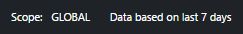

<properties
   pageTitle="O alerta de solução de gerenciamento no pacote de gerenciamento de operações (OMS) | Microsoft Azure"
   description="A solução de gerenciamento de alerta no Log Analytics ajuda você a analisar todos os alertas no seu ambiente.  Além de consolidar alertas gerados dentro OMS, ele importa alertas de conectada grupos de gerenciamento do System Center Operations Manager (SCOM) para a análise de Log."
   services="log-analytics"
   documentationCenter=""
   authors="bwren"
   manager="jwhit"
   editor="tysonn" />
<tags
   ms.service="operations-management-suite"
   ms.devlang="na"
   ms.topic="article"
   ms.tgt_pltfrm="na"
   ms.workload="infrastructure-services"
   ms.date="10/06/2016"
   ms.author="bwren" />

# Solução de gerenciamento de alerta no pacote de gerenciamento de operações (OMS)

 A solução de gerenciamento de alerta ajuda você a analisar todos os alertas no seu ambiente.  Além de consolidar alertas gerados dentro OMS, ele importa alertas de conectada grupos de gerenciamento do System Center Operations Manager (SCOM) para a análise de Log.  Em ambientes com vários grupos de gerenciamento, a solução de gerenciamento de alerta fornecerá uma exibição consolidada de alertas em todos os grupos de gerenciamento.

## Pré-requisitos

- Para importar os alertas do SCOM, essa solução requer uma conexão entre seu espaço de trabalho do OMS e um grupo de gerenciamento do SCOM usando o processo descrito em [Conectar o Operations Manager para análise de Log](log-analytics-om-agents.md).  

## Configuração

Adicione a solução de gerenciamento de alerta ao seu espaço de trabalho OMS usando o processo descrito em [soluções de adicionar](log-analytics-add-solutions.md).  Não há nenhuma configuração adicional necessária.

## Pacotes de gerenciamento

Se seu grupo de gerenciamento do SCOM estiver conectado a seu espaço de trabalho do OMS, em seguida, os seguintes pacotes de gerenciamento serão instalados no SCOM quando você adiciona esta solução.  Não há nenhuma configuração ou a manutenção desses pacotes de gerenciamento necessários.  

- Gerenciamento de alerta do Microsoft System Center Advisor (Microsoft.IntelligencePacks.AlertManagement)

Para obter mais informações sobre como os pacotes de gerenciamento de solução são atualizados, consulte [Conectar o Operations Manager para análise de Log](log-analytics-om-agents.md).

## Coleta de dados

### Agentes

A tabela a seguir descreve as fontes conectadas que são suportadas por esta solução.

| Fonte conectada | Suporte | Descrição |
|:--|:--|:--|
| [Agentes Windows](log-analytics-windows-agents.md) | Não | Direct agentes Windows não geraram SCOM alertas. |
| [Agentes Linux](log-analytics-linux-agents.md) | Não | Direct agentes Linux não geraram SCOM alertas. |
| [Grupo de gerenciamento do SCOM](log-analytics-om-agents.md) | Sim | Alertas que são gerados em agentes SCOM são entregues ao grupo de gerenciamento e então encaminhadas para a análise de Log.  Uma conexão direta do agente SCOM para análise de Log não é necessária. Dados de alerta são encaminhados do grupo de gerenciamento do repositório de OMS. |
| [Conta de armazenamento do Azure](log-analytics-azure-storage.md) | Não | Alertas SCOM não são armazenadas em contas de armazenamento do Azure. |

### Frequência de conjunto

Alertas geradas dentro OMS estão disponíveis para a solução imediatamente.  Alerta de dados é enviada a partir do grupo de gerenciamento do SCOM para análise de Log cada 3 minutos.  

## Usando a solução

Quando você adiciona a solução de gerenciamento de alerta para seu espaço de trabalho do OMS, o bloco de **Gerenciamento de alerta** será adicionado ao seu painel OMS.  Esse bloco exibe a contagem e representação gráfica do número de alertas ativas no momento que foram gerados dentro das últimas 24 horas.  Você não pode alterar este intervalo de tempo.

Clique no bloco **Gerenciamento de alerta** para abrir o painel de **Gerenciamento de alertas** .  O painel inclui as colunas da tabela a seguir.  Cada coluna lista os alertas de dez principais por contagem correspondam aos critérios da coluna para o intervalo de tempo e o escopo especificado.  Você pode executar uma pesquisa de log que fornece a lista inteira clicando em **ver todos** na parte inferior da coluna ou clicando no cabeçalho da coluna.

| Coluna| Descrição |
|:--|:--|
| Alertas críticos | Todos os alertas com uma gravidade crítica agrupada por nome de alerta.  Clique no nome de um alerta para executar uma pesquisa de log retornar todos os registros para o alerta. |
| Alertas de aviso | Todos os alertas com uma gravidade do aviso agrupada por nome de alerta.  Clique no nome de um alerta para executar uma pesquisa de log retornar todos os registros para o alerta. |
| Alertas SCOM ativa | Todos os alertas SCOM com qualquer status diferente de *fechado* agrupadas por fonte que gerou o alerta. |
| Todos os alertas de ativos | Todos os alertas com qualquer gravidade agrupadas por nome de alerta. Inclui somente alertas SCOM com qualquer estado diferente de *fechado*.|

Se você rolar para a direita, o painel listará várias consultas comuns que você pode clicar em para executar uma [pesquisa de log](log-analytics-log-searches.md) de dados de alerta.

## Intervalo de escopo e a hora

Por padrão, o escopo dos alertas analisados na solução de gerenciamento de alerta é de todos os grupos de gerenciamento conectados gerados dentro dos últimos 7 dias.  

- Para alterar os grupos de gerenciamento incluídos na análise, clique em **escopo** na parte superior do painel de controle.  Você pode selecionar **Global** para todos os grupos de gerenciamento conectados ou **Pelo grupo de gerenciamento** selecionar um grupo de gerenciamento único.

- Para alterar o intervalo de tempo de alertas, selecione **dados com base** na parte superior do painel de controle.  Você pode selecionar alertas gerados os últimos 7 dias, 1 dia ou 6 horas.  Ou você pode selecionar **personalizado** e especificar um intervalo de datas personalizado.

## Registros de log de análise

A solução de gerenciamento de alerta analisa qualquer registro com um tipo de **alerta**.  Ele também importar alertas do SCOM e criar um registro correspondente para cada uma com um tipo de **alerta** e um SourceSystem de **OpsManager**.  Esses registros têm as propriedades da tabela a seguir.  

| Propriedade | Descrição |
|:--|:--|
| Tipo | *Alerta* |
| SourceSystem | *OpsManager* |
| AlertContext | Detalhes do item de dados que causou o alerta será gerado em formato XML. |
| AlertDescription | Descrição detalhada do alerta. |
| AlertId | GUID do alerta. |
| AlertName | Nome do alerta. |
| AlertPriority | Nível de prioridade do alerta. |
| AlertSeverity | Nível de gravidade do alerta. |
| AlertState | Estado de resolução mais recente do alerta. |
| Última modificação feita por | Nome do usuário que modificou pela última vez o alerta. |
| ManagementGroupName | Nome do grupo de gerenciamento onde o alerta foi gerado. |
| RepeatCount | Número de hora que mesmo alerta foi gerado para a mesma monitorar objeto desde a ser resolvido. |
| ResolvedBy | Nome do usuário que resolvido o alerta. Vazia se o alerta ainda não foi resolvido. |
| SourceDisplayName | Nome de exibição do objeto monitoramento que gerou o alerta. |
| SourceFullName | Nome completo do objeto monitoramento que gerou o alerta. |
| TicketId | ID de ingressos para o alerta se o ambiente SCOM é integrado com um processo para atribuir permissões para alertas.  Esvaziar nenhum tíquete ID é atribuído. |
| TimeGenerated | Data e hora que o alerta foi criado. |
| TimeLastModified | Data e hora em que o alerta foi alterada pela última vez. |
| TimeRaised | Data e hora em que o alerta foi gerado. |
| TimeResolved | Data e hora em que o alerta foi resolvido. Vazia se o alerta ainda não foi resolvido. |

## Pesquisas de log de amostra

A tabela a seguir fornece pesquisas de log de amostra para registros de alerta coletadas por esta solução.  

| Consulta | Descrição |
|:--|:--|
| Tipo = alerta SourceSystem = OpsManager AlertSeverity = erro TimeRaised > agora 24 horas | Alertas críticos geradas durante as últimas 24 horas |
| Tipo = AlertSeverity alerta = aviso TimeRaised > agora 24 horas | Alertas de aviso geradas durante as últimas 24 horas  |
| Tipo = alerta SourceSystem = OpsManager AlertState! = TimeRaised fechada > agora 24 horas & #124; Count () medida como contagem por SourceDisplayName | Fontes com alertas ativos geradas durante as últimas 24 horas |
| Tipo = alerta SourceSystem = OpsManager AlertSeverity = erro TimeRaised > agora 24 horas AlertState! = fechado | Alertas críticos geradas durante as últimas 24 horas que ainda estão ativas |
| Tipo = alerta SourceSystem = OpsManager TimeRaised > AlertState agora 24 horas = fechado | Alertas geradas durante as últimas 24 horas que agora são fechadas |
| Tipo = alerta SourceSystem = OpsManager TimeRaised > agora - 1 dia & #124; Count () medida como contagem por AlertSeverity | Alertas elevadas durante o dia 1 passado agrupado por sua gravidade |
| Tipo = alerta SourceSystem = OpsManager TimeRaised > agora - 1 dia & #124; Classificar RepeatCount desc | Alertas elevadas durante o dia 1 passado classificado por seu valor de contagem de repetição |

## Próximas etapas

- Saiba mais sobre [alertas no Log de análise](log-analytics-alerts.md) para obter detalhes sobre a geração de alertas de análise de Log.
