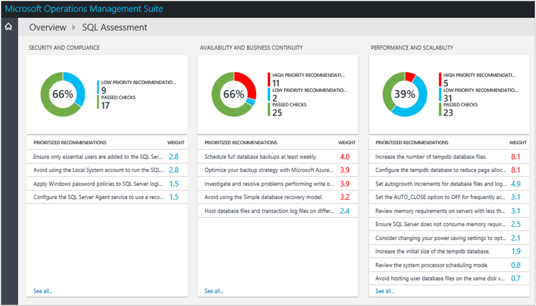
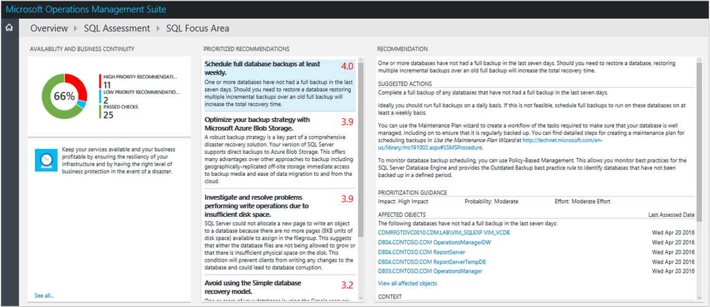
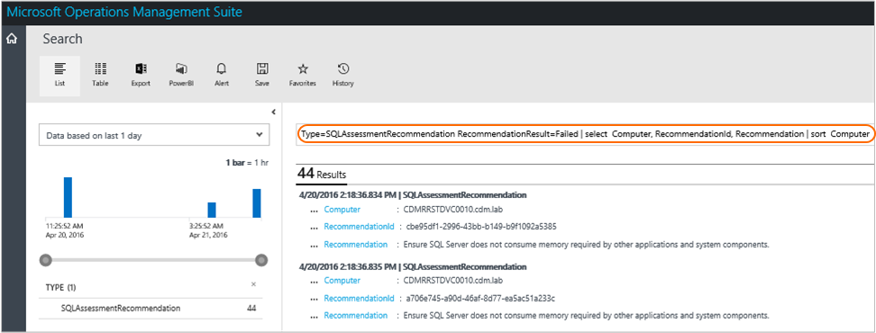

<properties
    pageTitle="Otimizar seu ambiente com a solução de avaliação de SQL da análise de Log | Microsoft Azure"
    description="Você pode usar a solução de avaliação de SQL para avaliar o risco e a integridade dos seus ambientes de servidor em um intervalo regular."
    services="log-analytics"
    documentationCenter=""
    authors="bandersmsft"
    manager="jwhit"
    editor=""/>

<tags
    ms.service="log-analytics"
    ms.workload="na"
    ms.tgt_pltfrm="na"
    ms.devlang="na"
    ms.topic="article"
    ms.date="08/11/2016"
    ms.author="banders"/>

# <a name="optimize-your-environment-with-the-sql-assessment-solution-in-log-analytics"></a>Otimizar seu ambiente com a solução de avaliação de SQL da análise de Log


Você pode usar a solução de avaliação de SQL para avaliar o risco e a integridade dos seus ambientes de servidor em um intervalo regular. Este artigo ajudará você a instalar a solução para que você possa ser corretivas problemas em potencial.

Essa solução fornece uma lista de prioridades de recomendações específicas em sua infraestrutura de servidor implantado. As recomendações são categorizadas em seis áreas de foco que ajudá-lo rapidamente entender o risco e tomar medidas corretivas.

As recomendações baseiam o conhecimento e a experiência obtida pelos engenheiros da Microsoft de milhares de visitas de cliente. Cada recomendação fornece orientações sobre por que um problema pode são importantes para você e como implementar as alterações sugeridas.

Você pode escolher áreas de foco que são mais importantes para sua organização e controlar seu progresso em direção executando um ambiente de saúde e gratuitos de risco.

Depois que você adicionou a solução e uma avaliação estiver concluída, resumo informações para as áreas de foco são mostradas no painel de **Avaliação de SQL** para a infraestrutura em seu ambiente. As seções a seguir descrevem como usar as informações no painel de **Avaliação de SQL** , onde você pode exibir e então realizar ações recomendadas para sua infraestrutura do SQL server.




## <a name="installing-and-configuring-the-solution"></a>Instalando e configurando a solução
Avaliação de SQL funciona com todas as versões atualmente suportadas do SQL Server para as edições Standard, desenvolvedor e Enterprise.

Use as informações a seguir para instalar e configurar a solução.

- Agentes devem ser instalados em servidores que têm o SQL Server instalado.
- A solução de avaliação de SQL requer o .NET Framework 4 instalado em cada computador que tenha um agente OMS.
- Ao usar o agente do Operations Manager com avaliação de SQL, você precisará usar uma conta do Operations Manager Run-As. Consulte [Operations Manager contas de execução para OMS](#operations-manager-run-as-accounts-for-oms) abaixo para obter mais informações.

    >[AZURE.NOTE] O agente MMA não dá suporte a contas do Operations Manager Run-As.

- Adicione a solução de avaliação de SQL ao seu espaço de trabalho OMS usando o processo descrito em [soluções de adicionar a análise de Log da Galeria de soluções](log-analytics-add-solutions.md). Não há nenhuma configuração adicional necessária.

>[AZURE.NOTE] Depois que você adicionou a solução, o arquivo de AdvisorAssessment.exe é adicionado aos servidores com agentes. Dados de configuração é ler e, em seguida, enviados para o serviço OMS na nuvem para processamento. Lógica é aplicada aos dados recebidos e os dados de registros do serviço de nuvem.

## <a name="sql-assessment-data-collection-details"></a>Detalhes de conjunto de dados de avaliação de SQL

Avaliação de SQL coleta dados WMI, dados do registro, dados de desempenho e resultados de modo de exibição de gerenciamento dinâmico do SQL Server usando os agentes que você ativou.

A tabela a seguir mostra os métodos de coleta de dados para agentes, se Operations Manager (SCOM) é necessária e como dados geralmente são coletados por um agente.

| plataforma | Agente de direta | Agente do SCOM | Armazenamento do Azure | SCOM necessário? | Enviados via grupo de gerenciamento de dados do SCOM agente | frequência de conjunto |
|---|---|---|---|---|---|---|
|Windows||||    ||   7 dias|

## <a name="operations-manager-run-as-accounts-for-oms"></a>Operations Manager contas de execução para OMS

Análise de log no OMS usa o grupo de gerenciamento e agente do Operations Manager para coletar e enviar dados para o serviço OMS. Compilações OMS durante a pacotes de gerenciamento para cargas de trabalho fornecer valor agregado serviços. Cada carga de trabalho requer privilégios de carga de trabalho específica para executar pacotes de gerenciamento em um contexto de segurança diferente, como uma conta de domínio. Você precisará fornecer informações de credencial Configurando uma conta de operações os Manager executar como.

Use as informações a seguir para definir a Operations Manager executar como conta de avaliação de SQL.

### <a name="set-the-run-as-account-for-sql-assessment"></a>Configurar a conta executar como para avaliação de SQL

 Se você já estiver usando o pacote de gerenciamento do SQL Server, você deve usar essa conta executar como.

#### <a name="to-configure-the-sql-run-as-account-in-the-operations-console"></a>Configurar a conta SQL executar como no console de operações

>[AZURE.NOTE] Se você estiver usando o agente direto OMS, ao invés do agente do SCOM, o pacote de gerenciamento sempre é executado no contexto de segurança da conta do sistema Local. Ignorar as etapas de 1 a 5 abaixo e, em seguida, execute o T-SQL ou amostra do Powershell, especificando o sistema/Autoridade NT como o nome de usuário.

1. No Operations Manager, abra o console de operações e, em seguida, clique em **Administração**.

2. Em **Configuração Executar como**, clique em **perfis**e abra **OMS SQL avaliação perfil executar como**.

3. Na página **Contas executar como** , clique em **Adicionar**.

4. Selecione uma conta executar como do Windows que contém as credenciais necessárias para o SQL Server ou clique em **novo** para criar um.
    >[AZURE.NOTE] O tipo de conta executar como deve ser Windows. A conta executar como também deve ser parte do grupo de administradores locais em todos os servidores de Windows hospedagem instâncias do SQL Server.

5. Clique em **Salvar**.

6. Modificar e, em seguida, execute o seguinte exemplo de T-SQL em cada instância do SQL Server para conceder permissões mínimas necessárias para executar como conta para realizar avaliação de SQL. No entanto, você não precisa fazer isso se executar como conta já faz parte do servidor sysadmin em instâncias do SQL Server.

```
---
    -- Replace <UserName> with the actual user name being used as Run As Account.
    USE master

    -- Create login for the user, comment this line if login is already created.
    CREATE LOGIN [<UserName>] FROM WINDOWS

    -- Grant permissions to user.
    GRANT VIEW SERVER STATE TO [<UserName>]
    GRANT VIEW ANY DEFINITION TO [<UserName>]
    GRANT VIEW ANY DATABASE TO [<UserName>]

    -- Add database user for all the databases on SQL Server Instance, this is required for connecting to individual databases.
    -- NOTE: This command must be run anytime new databases are added to SQL Server instances.
    EXEC sp_msforeachdb N'USE [?]; CREATE USER [<UserName>] FOR LOGIN [<UserName>];'

```
#### <a name="to-configure-the-sql-run-as-account-using-windows-powershell"></a>Configurar a conta SQL executar como usando o Windows PowerShell

Abra uma janela do PowerShell e execute o seguinte script depois que você atualizou-lo com suas informações:

```

    import-module OperationsManager
    New-SCOMManagementGroupConnection "<your management group name>"
     
    $profile = Get-SCOMRunAsProfile -DisplayName "OMS SQL Assessment Run As Profile"
    $account = Get-SCOMrunAsAccount | Where-Object {$_.Name -eq "<your run as account name>"}
    Set-SCOMRunAsProfile -Action "Add" -Profile $Profile -Account $Account
```

## <a name="understanding-how-recommendations-are-prioritized"></a>Noções básicas sobre como recomendações são priorizamos

Cada recomendação feita é dado um valor de ponderação que identifica a importância relativa da recomendação. Apenas as dez recomendações mais importantes são mostradas.

### <a name="how-weights-are-calculated"></a>Como pesos são calculados

Ponderações são valores agregados com base em três principais fatores:

- A *probabilidade* que um problema identificado causará problemas. Maior probabilidade equivale a uma pontuação geral maior para a recomendação.

- O *impacto* do problema na sua organização se ele causar um problema. Um impacto maior equivale a uma pontuação geral maior para a recomendação.

- O *esforço* necessário para implementar a recomendação. Um esforço maior equivale a uma pontuação geral menor para a recomendação.

A ponderação para cada recomendação é expresso como uma porcentagem do total pontuação disponível para cada área de foco. Por exemplo, se uma recomendação na área de foco de segurança e conformidade tiver uma pontuação de 5%, implementar essa recomendação aumentará seu % de pontuação por 5 de segurança e conformidade geral.

### <a name="focus-areas"></a>Áreas de foco

**Segurança e conformidade** - nesta área de foco mostra recomendações para requisitos de conformidade regulatória e técnico, legal e violações, políticas corporativas e possíveis ameaças de segurança.

**Disponibilidade e continuidade de negócios** - nesta área de foco mostra recomendações para disponibilidade do serviço, resiliência de sua infraestrutura e proteção de negócios.

**Desempenho e escalabilidade** - nesta área de foco mostra recomendações para ajudar a sua organização infraestrutura crescer, certifique-se de que seu ambiente de TI atende aos requisitos de desempenho atuais e é capaz de responder às necessidades de infraestrutura.

**Atualizar, migração e implantação** - nesta área de foco mostra recomendações para ajudá-lo a atualizar, migrar e implantar o SQL Server em sua infraestrutura existente.

**Operações e monitoramento** - nesta área de foco mostra recomendações para ajudar a simplificar as operações de TI, implementar manutenção prevenção e maximizar o desempenho.

**Gerenciamento de configuração e alteração** - nesta área de foco mostra recomendações para ajudar a proteger as operações diárias, garantir que as alterações não afetam sua infraestrutura negativamente, estabeleça procedimentos de controle de alterações e para controlar e auditar configurações do sistema.

### <a name="should-you-aim-to-score-100-in-every-focus-area"></a>Você deve objetivo pontuação 100% em cada área de foco?

Não necessariamente. As recomendações baseiam o conhecimento e experiências obtidas pelos engenheiros da Microsoft em milhares de visitas de cliente. Entretanto, sem infra-estruturas dois server são as mesmas e recomendações específicas podem ser mais ou menos relevantes para você. Por exemplo, algumas recomendações de segurança podem ser menos relevantes se suas máquinas virtuais não estão expostas na Internet. Algumas recomendações de disponibilidade podem ser menos relevantes para serviços que fornecem o conjunto de dados ad hoc de baixa prioridade e relatórios. Problemas que são importantes para um negócio desenvolvido podem ser menos importantes para uma inicialização. Talvez você queira identificar quais áreas de foco são suas prioridades e examine como sua pontuação alterar ao longo do tempo.

Cada recomendação inclui orientações sobre por que é importante. Você deve usar este guia para avaliar se implementar a recomendação é adequada para você, considerando a natureza dos seus serviços de TI e as necessidades de negócios da sua organização.

## <a name="use-assessment-focus-area-recommendations"></a>Usar recomendações de área de foco de avaliação

Antes de você pode usar uma solução de avaliação do OMS, você deve ter a solução instalada. Para ler mais sobre como instalar soluções, consulte [soluções de adicionar a análise de Log da Galeria de soluções](log-analytics-add-solutions.md). Depois de instalado, você pode exibir o resumo de recomendações usando o bloco de avaliação de SQL na página Visão geral na OMS.

Exiba as avaliações de conformidade resumidos para sua infraestrutura e, em seguida, drill-em recomendações.

### <a name="to-view-recommendations-for-a-focus-area-and-take-corrective-action"></a>Para exibir recomendações para uma área de foco e tomar medidas corretivas

1. Na página **Visão geral** , clique no bloco de **Avaliação de SQL** .
2. Na página de **Avaliação do SQL** , examine as informações de resumo em uma das lâminas área foco e clique em um para exibir recomendações para a área foco.
3. Em qualquer uma das páginas de área de foco, você pode exibir as prioridades recomendações para seu ambiente. Clique em uma recomendação em **Objetos afetados** para exibir detalhes sobre por que a recomendação é feita.  
    
4. Você pode tomar ações corretivas sugeridas na **Ações sugeridas**. Quando o item foi resolvido, avaliações posteriores gravará recomendado ações foram realizadas e sua pontuação de conformidade aumentará. Itens corrigidos aparecem como **Objetos passado**.

## <a name="ignore-recommendations"></a>Ignorar recomendações

Se você tiver recomendações que você deseja ignorar, você pode criar um arquivo de texto que OMS usará para impedir que as recomendações apareçam nos resultados da avaliação.

### <a name="to-identify-recommendations-that-you-will-ignore"></a>Identificar recomendações que você irá ignorar

1.  Entre no seu espaço de trabalho e abrir pesquisa de Log. Use a seguinte consulta às recomendações de lista com falha para computadores em seu ambiente.

    ```
    Type=SQLAssessmentRecommendation RecommendationResult=Failed | select  Computer, RecommendationId, Recommendation | sort  Computer
    ```

    Aqui está uma captura de tela mostrando a consulta de pesquisa de Log: 

2.  Escolha recomendações que você deseja ignorar. Você usará os valores para RecommendationId no próximo procedimento.


### <a name="to-create-and-use-an-ignorerecommendationstxt-text-file"></a>Criar e usar um arquivo de texto IgnoreRecommendations.txt

1.  Crie um arquivo denominado IgnoreRecommendations.txt.
2.  Cole ou digite cada RecommendationId para cada recomendação que você deseja que o OMS Ignorar em uma linha separada, salve e feche o arquivo.
3.  Coloque o arquivo na seguinte pasta em cada computador onde você deseja OMS ignorar recomendações.
    - Em computadores com o Microsoft Monitoring Agent (conectado diretamente ou por meio do Operations Manager) - *unidade do sistema*: \Program Files\Microsoft Agent\Agent de monitoramento
    - No servidor de gerenciamento do Operations Manager - *unidade do sistema*: \Program Files\Microsoft Manager\Server de R2\Operations do System Center 2012

### <a name="to-verify-that-recommendations-are-ignored"></a>Para verificar que recomendações são ignoradas

1.  Depois da próxima agendada execuções de avaliação, por padrão a cada 7 dias, as recomendações especificadas são marcadas ignorado e não aparecerá no painel de avaliação.
2.  Você pode usar as consultas de pesquisa de Log a seguir lista todas as recomendações ignoradas.

    ```
    Type=SQLAssessmentRecommendation RecommendationResult=Ignored | select  Computer, RecommendationId, Recommendation | sort  Computer
    ```
3.  Se você decidir depois que você deseja ver ignorados recomendações, remover quaisquer arquivos de IgnoreRecommendations.txt ou você pode remover RecommendationIDs delas.

## <a name="sql-assessment-solution-faq"></a>Solução de avaliação de SQL perguntas Frequentes

*Frequência uma avaliação é executado?*
- A avaliação é executado a cada 7 dias.

*Existe uma maneira de configurar a frequência de execução a avaliação?*
- Não neste momento.

*Se outro servidor para for descoberto depois adicionei a solução de avaliação do SQL, será ele ser avaliado?*
- Sim, quando for detectado que é avaliado de então, cada 7 dias.

*Se um servidor é desativado, quando será-removido da avaliação?*
- Se um servidor não enviar dados para 3 semanas, ele será removido.

*O que é o nome do processo que faz a coleta de dados?*
- AdvisorAssessment.exe

*Quanto tempo leva para dados a serem coletados?*
- O conjunto de dados reais no servidor leva cerca de 1 hora. Pode levar mais tempo em servidores que têm um grande número de instâncias do SQL ou bancos de dados.

*Tipo de dados é coletado?*
- Os seguintes tipos de dados são coletados:
    - WMI
    - Registro
    - Contadores de desempenho
    - Exibições de gerenciamento dinâmico de SQL (DMV).

*Existe uma maneira de configurar quando os dados são coletados?*
- Não neste momento.

*Por que tenho que configurar uma executar como conta?*
- Para SQL Server, um pequeno número de consultas SQL é executado. Em ordem para que elas sejam executados, um executar como conta com permissões de exibir estado do servidor para SQL deve ser usada.  Além disso, para consultar WMI, as credenciais de administrador local são necessárias.

*Por que exibir somente as recomendações de 10 principais?*
- Em vez de dando a você uma lista completa de impressionante das tarefas, recomendamos que você se concentrar endereçamento as recomendações prioridades primeiro. Depois de você solucioná-los, recomendações adicionais serão disponibilizados. Se você preferir ver a lista detalhada, você pode exibir todas as recomendações usando a pesquisa de log OMS.

*Existe uma maneira de ignorar uma recomendação?*
- Sim, consulte [recomendações de ignorar](#ignore-recommendations) seção acima.


## <a name="next-steps"></a>Próximas etapas

- [Logs de pesquisa](log-analytics-log-searches.md) para exibir dados detalhados de avaliação de SQL e recomendações.
