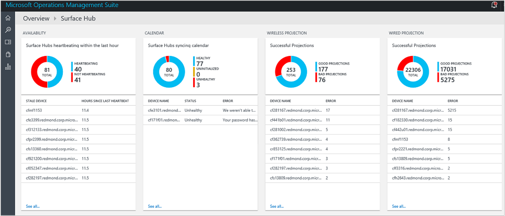

<properties
    pageTitle="Monitorar superfície Hubs com a análise de Log | Microsoft Azure"
    description="Use a solução de superfície Hub para controlar a integridade do seu Hubs de superfície e compreender como eles estão sendo usados."
    services="log-analytics"
    documentationCenter=""
    authors="bandersmsft"
    manager="jwhit"
    editor=""/>

<tags
    ms.service="log-analytics"
    ms.workload="na"
    ms.tgt_pltfrm="na"
    ms.devlang="na"
    ms.topic="article"
    ms.date="08/11/2016"
    ms.author="banders"/>

# Monitor superfície Hubs com a análise de Log

Este artigo descreve como você pode usar a solução de Hub de superfície na análise de Log para monitorar dispositivos Microsoft Surface Hub com o pacote de gerenciamento do Microsoft operações (OMS). Análise de log ajuda você a acompanhar a integridade do seu Hubs de superfície, bem como entender como eles estão sendo usados.

Cada Hub de superfície tem o agente de monitoramento do Microsoft instalado. Seu através do agente que você pode enviar dados de seu Hub de superfície para OMS. Arquivos de log são lidos da sua superfície Hubs e são depois são enviados para o serviço de OMS. Problemas como servidores sendo offline, o calendário não está sincronizando, ou se a conta do dispositivo não for capaz de login Skype são mostradas na OMS no painel Hub de superfície. Usando os dados no painel de controle, você pode identificar dispositivos que não estejam executando, ou que está tendo outros problemas e potencialmente aplicar correções para os problemas detectados.

## Instalando e configurando a solução

Use as informações a seguir para instalar e configurar a solução. Para gerenciar seu Hubs de superfície do pacote de gerenciamento do Microsoft operações (OMS), será necessário o seguinte:

- Uma assinatura válida do [OMS](http://www.microsoft.com/oms).
- Um nível de [assinatura de OMS](https://azure.microsoft.com/pricing/details/log-analytics/) que aceitará o número de dispositivos que você deseja monitorar. OMS preços variam dependendo quantos dispositivos registrados e a quantidade de dados-processos. Você vai querer levar isso em consideração ao planejar a distribuição de Hub de superfície.

Em seguida, você irá adicionar uma assinatura de OMS à sua assinatura do Microsoft Azure existente ou criar um novo espaço de trabalho diretamente por meio do portal OMS. Instruções detalhadas para usar qualquer um dos métodos é [começar a usar a análise de Log](log-analytics-get-started.md). Depois que a assinatura de OMS é configurada, há duas maneiras de registrar seus dispositivos de superfície Hub:

- Automaticamente pelo InTune
- Manualmente por meio de **configurações** no dispositivo Hub de superfície.

## Configurar o monitoramento

Você pode monitorar a saúde e a atividade do seu Hub de superfície usando a análise de Log no OMS. Você pode registrar o Hub superfície OMS usando o InTune ou localmente usando **configurações** no Hub superfície.

## Conectar Hubs superfície OMS através de InTune

Você precisará a identificação de espaço de trabalho e a chave de espaço de trabalho para o espaço de trabalho OMS que gerenciará suas Hubs de superfície. Você pode obter aqueles a partir do portal OMS.

InTune é um produto Microsoft que permite que você gerencie centralmente as definições de configuração de OMS que são aplicadas a um ou mais dos seus dispositivos. Siga estas etapas para configurar seus dispositivos por meio de InTune:

1. Entrar no InTune.
2. Navegue até **configurações** > **conectado fontes**.
3. Criar ou editar uma regra com base no modelo de Hub de superfície.
4. Navegue até a seção OMS (Azure operacionais ideias) da política e adicione o *ID de espaço de trabalho* e a *Chave de espaço de trabalho* à política.
5. Salve a política.
6. Associe a política de grupo apropriado de dispositivos.

  

Em seguida, o InTune sincroniza as configurações de OMS com os dispositivos do grupo de destino, inscrevendo-las em seu espaço de trabalho do OMS.

## Conectar Hubs de superfície ao OMS usando o aplicativo de configurações

Você precisará a identificação de espaço de trabalho e a chave de espaço de trabalho para o espaço de trabalho OMS que gerenciará suas Hubs de superfície. Você pode obter aqueles a partir do portal OMS.

Se você não usa o InTune para gerenciar seu ambiente, você pode registrar dispositivos manualmente por meio de **configurações** em cada Hub de superfície:

1. Em seu Hub de superfície, abra **configurações**.
2. Digite as credenciais de administrador do dispositivo quando solicitado.
3. Clique **neste dispositivo**e em **monitoramento**, clique em **Configurar definições de OMS**.
4. Selecione **Ativar monitoramento**.
6. Na caixa de diálogo Configurações OMS, digite a **ID de espaço de trabalho** e digite a **Chave do espaço de trabalho**.  
  
7. Clique em **Okey** para concluir a configuração.

Uma confirmação será exibida informando ou não a configuração de OMS foi aplicada com êxito no dispositivo. Se tiver sido, uma mensagem informando que o agente conectado com êxito para o serviço de OMS. O dispositivo inicia a enviar dados para OMS onde você pode exibir e atuar sobre ela.

## Monitor Hubs de superfície

Monitorar seu Hubs de superfície usando o OMS é muito semelhante monitoramento quaisquer outros dispositivos registrados.

1. Entre portal do OMS.
2. Navegue até o painel de pacote de solução de Hub de superfície.
3. Integridade do dispositivo é exibida.

  

Você pode criar [alertas](log-analytics-alerts.md) com base em pesquisas de log existente ou personalizado. Usando os dados que do OMS coletará do seu Hubs de superfície, você pode procurar problemas e alerta sobre as condições que você define para seus dispositivos.

## Próximas etapas

- Use [pesquisas de Log no Log de análise](log-analytics-log-searches.md) para exibir dados detalhados de Hub de superfície.
- Crie [alertas](log-analytics-alerts.md) para notificá-lo quando ocorrerem problemas com sua Hubs de superfície.
