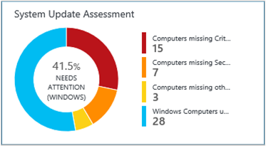
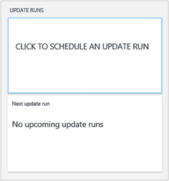

<properties
    pageTitle="Solução de avaliação de atualização do sistema no Log Analytics | Microsoft Azure"
    description="Você pode usar a solução de atualizações do sistema no Log de análise para ajudá-lo a aplicar atualizações ausentes para servidores em sua infraestrutura."
    services="log-analytics"
    documentationCenter=""
    authors="bandersmsft"
    manager="jwhit"
    editor=""/>

<tags
    ms.service="log-analytics"
    ms.workload="na"
    ms.tgt_pltfrm="na"
    ms.devlang="na"
    ms.topic="article"
    ms.date="08/11/2016"
    ms.author="banders"/>

# Solução de avaliação de atualização de sistema no Log de análise

Você pode usar a solução de atualizações do sistema no Log de análise para ajudá-lo a aplicar atualizações ausentes para servidores em sua infraestrutura. Depois de instalar a solução, você pode exibir as atualizações que estão falta dos seus servidores monitoradas usando o bloco de **Avaliação de atualização do sistema** na página **Visão geral** na OMS.

Se forem encontradas atualizações ausentes, detalhes são mostrados no painel **atualizações** . Você pode usar o painel de **atualizações** para trabalhar com atualizações ausentes e desenvolver um plano para aplicá-las aos servidores que precisam deles.

## Instalando e configurando a solução
Use as informações a seguir para instalar e configurar a solução.

- Adicione a solução de avaliação de atualização do sistema para o seu espaço de trabalho OMS usando o processo descrito em [soluções de adicionar a análise de Log da Galeria de soluções](log-analytics-add-solutions.md).  Não há nenhuma configuração adicional necessária.

## Detalhes de conjunto de dados de atualização do sistema

Avaliação de atualização do sistema coleta de dados de metadados e estado usando os agentes que você ativou.

A tabela a seguir mostra os métodos de coleta de dados e outros detalhes sobre como os dados são coletados para avaliação de atualização do sistema.

| plataforma | Agente de direta | Agente do SCOM | Armazenamento do Azure | SCOM necessário? | Enviados via grupo de gerenciamento de dados do SCOM agente | frequência de conjunto |
|---|---|---|---|---|---|---|
|Windows||||            || Pelo menos de 2 multiplicado por dia e 15 minutos depois de instalar uma atualização|

A tabela a seguir mostra exemplos de tipos de dados coletados pelo avaliação de atualização do sistema:

|**Tipo de dados**|**Campos**|
|---|---|
|Metadados|BaseManagedEntityId, ObjectStatus, OrganizationalUnit, ActiveDirectoryObjectSid, PhysicalProcessors, NetworkName, endereço IP, ForestDNSName, NetbiosComputerName, VirtualMachineName, LastInventoryDate, HostServerNameIsVirtualMachine, endereço IP, NetbiosDomainName, LogicalProcessors, DNSName, DisplayName, DomainDnsName, ActiveDirectorySite, PrincipalName, OffsetInMinuteFromGreenwichTime|
|Estado|StateChangeEventId, StateId, NewHealthState, OldHealthState, contexto, TimeGenerated, TimeAdded, StateId2, BaseManagedEntityId, MonitorId, HealthState, LastModified, LastGreenAlertGenerated, DatabaseTimeModified|

### Para trabalhar com atualizações

1. Na página **Visão geral** , clique no bloco de **Avaliação de atualização do sistema** .  
    
2. No painel de **atualizações** , exiba as categorias de atualização.  
    
3. Role para a direita da página para exibir a lâmina **Atualizações críticas/segurança do Windows** e, em **classificação**, clique em **Atualizações de segurança**.  
    
4. Na página de pesquisa de Log, uma variedade de informações é mostrada sobre as atualizações de segurança que foram encontradas ausentes em servidores em sua infraestrutura. Clique em **lista** para exibir informações detalhadas sobre as atualizações.  
    
5. Na página de pesquisa de Log, informações detalhadas sobre cada atualização são mostradas. Ao lado do número KBID, clique em **modo de exibição** para exibir o artigo correspondente no site da Web de suporte da Microsoft.  
    
6. Seu navegador da web abre a página de suporte da Microsoft para a atualização em uma nova guia. Exiba as informações sobre a atualização está ausente.  
    
7. Usando as informações a usando Localizar, você pode criar um plano para aplicar manualmente a atualização está ausente ou você pode continuar seguindo as etapas restantes para aplicar automaticamente a atualização.
8. Se você quiser aplicar automaticamente a atualização está ausente, volte ao painel de **atualizações** e em **Execuções atualizar**, clique em **clique para agendar uma atualização executar**.  
    
9. Na página **Atualizar executa** na guia **agendado** , clique em **Adicionar** para criar uma nova execução de atualização.  
    
10. Na página **Nova atualização executar** , digite um nome para a atualização executar, adicionar computadores individuais ou grupos, definir uma agenda e clique em **Salvar**.  
    
11. Guia **agendado** no **Execuções atualizar** página mostra a nova atualização executar que agendou.  
    
12. Quando a atualização executar for iniciado, você verá informações para ele na guia **em execução** .  
    
13. Após a atualização executar for concluído, na guia **concluída** exibe status.
14. Se as atualizações foram aplicadas da atualização executar, na lâmina **Atualizações críticas/segurança do Windows** , você verá que o número de atualizações é reduzido.  
    

## Próximas etapas

- [Logs de pesquisa](log-analytics-log-searches.md) para exibir dados de atualização do sistema detalhadas.
