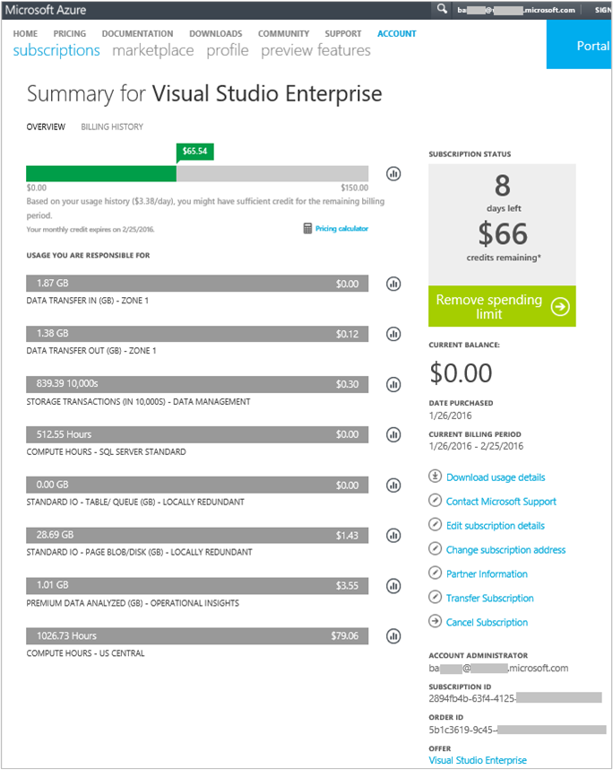

<properties
    pageTitle="Analisar dados de uso na análise de Log | Microsoft Azure"
    description="Você pode usar a página de uso na análise de Log para exibir a quantidade de dados está sendo enviado para o serviço de OMS."
    services="log-analytics"
    documentationCenter=""
    authors="bandersmsft"
    manager="jwhit"
    editor=""/>

<tags
    ms.service="log-analytics"
    ms.workload="na"
    ms.tgt_pltfrm="na"
    ms.devlang="na"
    ms.topic="get-started-article"
    ms.date="08/11/2016"
    ms.author="banders"/>

# Analisar dados de uso na análise de Log

Análise de log no pacote de gerenciamento de operações (OMS) coleta dados e envia para o serviço OMS periodicamente.  Você pode usar a página de **uso** para exibir a quantidade de dados está sendo enviado para o serviço de OMS. A página de **uso** também mostra a quantidade de dados está sendo enviado diariamente por soluções e com que frequência seus servidores estiver enviando dados.

>[AZURE.NOTE] Se você tiver uma conta gratuita criada usando o [site OMS](http://www.microsoft.com/oms), você está limitado a enviar 500 MB de dados para o serviço OMS diariamente. Se você atingir o limite diário, análises de dados serão interromper e retomar no início do dia seguinte. Você também precisará reenviar quaisquer dados que não foi aceita ou processados pelo OMS.

Você pode exibir seu uso usando o bloco de **uso** no painel **Visão geral** do OMS.

Se você excedeu seu limite de uso diário, ou se você estiver próximo ao seu limite, opcionalmente, você pode remover uma solução para reduzir a quantidade de dados que você enviar para o serviço OMS. Para obter mais informações sobre como remover soluções, consulte [soluções de adicionar a análise de Log da Galeria de soluções](log-analytics-add-solutions.md).

A página de **uso** exibe as seguintes informações:

- Uso médio por dia
- Uso de dados para cada solução nos últimos 30 dias
- Quanto os servidores em seu ambiente são o envio de dados para o serviço de OMS nos últimos 30 dias
- Seu plano de dados de preços camada e custo estimado
- Informações sobre o contrato de nível de serviço (SLA), incluindo quanto tempo leva OMS para processar seus dados

## Para trabalhar com dados de uso

1. Na página **Visão geral** , clique no bloco de **uso** .
2. Na página **uso** , exiba as categorias de uso que mostram áreas que estiver preocupado.
3. Se você tiver uma solução que está consumindo muito da sua cota de carregamento diário, você pode considerar a remoção dessa solução.

## Para exibir o custo estimado e informações de cobrança
1. Na página **Visão geral** , clique no bloco de **uso** .
2. Na página **uso** em **uso**, clique na divisa (**>**) ao lado de **custo previsto**.
3. Em expandida detalhes de **seu plano de dados** , você pode ver sua estimado custo mensal.  
    
4. Se você quiser ver suas informações de cobranças, clique em **Exibir minha fatura** para ver suas informações de assinatura.
    - Na página assinaturas, clique em sua assinatura para exibir detalhes e uma lista de item de linha de uso.  
        
    - Na página de resumo para sua assinatura, você pode executar diversas tarefas para gerenciar e exibir mais detalhes sobre sua assinatura.  
        

## Exibir lotes de dados para seu SLA
1. Na página **Visão geral** , clique no bloco de **uso** .
2. Sob **Contrato de nível de serviço**, clique em **detalhes do Download SLA**.
3. Um arquivo do Excel XLSX é baixado para que você examine.  
    

## Próximas etapas

- Consulte [pesquisas de Log no Log de análise](log-analytics-log-searches.md) para exibir informações detalhadas coletadas por soluções.
