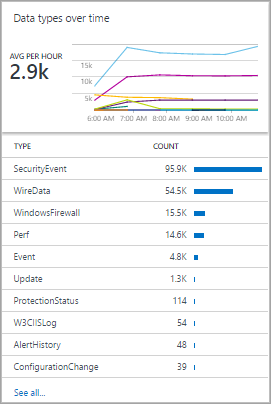

<properties
    pageTitle="Designer de modo de exibição de análise de logon | Microsoft Azure"
    description="Designer de modo de exibição em análise de Log permite que você criar exibições personalizadas no console OMS que contêm diferentes visualizações de dados no repositório OMS. Este artigo fornece uma referência as configurações de cada uma das partes visualização disponíveis para uso em suas exibições personalizadas."
    services="log-analytics"
    documentationCenter=""
    authors="bwren"
    manager="jwhit"
    editor=""/>

<tags
    ms.service="log-analytics"
    ms.workload="na"
    ms.tgt_pltfrm="na"
    ms.devlang="na"
    ms.topic="article"
    ms.date="10/20/2016"
    ms.author="bwren"/>

# Referência de parte de visualização de Designer de modo de exibição de análise de log
O Designer de modo de exibição em análise de Log permite que você criar exibições personalizadas no console OMS que contêm diferentes visualizações de dados do repositório OMS. Este artigo fornece uma referência as configurações de cada uma das partes visualização disponíveis para uso em suas exibições personalizadas.

Outros artigos disponíveis para View Designer são:

- [Exibir Designer](log-analytics-view-designer.md) - visão geral do Designer de modo de exibição e procedimentos para criar e editar exibições personalizadas.
- [Referência de peças](log-analytics-view-designer-tiles.md) - referência as configurações para cada um dos blocos de disponível para uso em suas exibições personalizadas. 

A tabela a seguir descreve os diferentes tipos de blocos disponíveis no modo de exibição Designer.  As seções a seguir descrevem cada tipo de bloco em detalhes e suas propriedades.

| Tipo de exibição | Descrição |
|:--|:--|
| [Lista de consultas](#list-of-queries-part) | Exibe uma lista de consultas de pesquisa de log.  O usuário pode clicar em cada consulta para exibir seus resultados.  |
| [Número & lista](#number-amp-list-part) | Cabeçalho tem uma único número mostrando contagem de registros de uma consulta de pesquisa de log.  Lista exibe os dez principais resultados de uma consulta com um gráfico que indica o valor relativo de uma coluna numérica ou sua alteração ao longo do tempo. |
| [Dois números & lista](#two-numbers-amp-list-part) | Cabeçalho tem dois números mostrando a contagem de registros das consultas de pesquisa de log separado.  Lista exibe os dez principais resultados de uma consulta com um gráfico que indica o valor relativo de uma coluna numérica ou sua alteração ao longo do tempo. |
| [& Lista de rosca](#donut-amp-list-part) | Cabeçalho exibe um único número resumido de uma coluna de valor em uma consulta de log.  A rosca graficamente exibe os resultados dos três registros superiores. |
| [Duas linhas do tempo & lista](#two-timelines-amp-list-part) | Cabeçalho exibe os resultados das duas consultas de log ao longo do tempo, como gráficos de coluna com um balão exibindo um único número resumido de uma coluna de valor em uma consulta de log.  Lista exibe os dez principais resultados de uma consulta com um gráfico que indica o valor relativo de uma coluna numérica ou sua alteração ao longo do tempo. |   
| [Informações](#information-part) | Cabeçalho exibe texto estático e um link opcional.  Lista exibe um ou mais itens com texto estático e título. |
| [Lista, o texto explicativo e o gráfico de linhas](#line-chart-callout-amp-list-part) | Cabeçalho exibe um gráfico de linha com várias séries de uma consulta de log ao longo do tempo e um texto explicativo com um valor resumido.  Lista exibe os dez principais resultados de uma consulta com um gráfico que indica o valor relativo de uma coluna numérica ou sua alteração ao longo do tempo. |
| [Lista & gráfico de linhas](#line-chart-amp-list-part) | Cabeçalho exibe um gráfico de linha com várias séries de uma consulta de log ao longo do tempo.  Lista exibe os dez principais resultados de uma consulta com um gráfico que indica o valor relativo de uma coluna numérica ou sua alteração ao longo do tempo. |
| [Pilha de parte de gráficos de linha](#stack-of-line-charts-part) | Exibe três gráficos de linha separada com várias séries de uma consulta de log ao longo do tempo. |

## Lista de parte de consultas

Exibe uma lista de consultas de pesquisa de log.  O usuário pode clicar em cada consulta para exibir seus resultados.  O modo de exibição incluirá uma única consulta por padrão e clique em **+ consulta** para adicionar consultas adicionais.

| Configuração | Descrição |
|:--|:--|
| **Geral** |
| Título | Texto para exibição na parte superior do modo de exibição. |
| Novo grupo | Selecione para criar um novo grupo no modo de exibição, começando pelo modo de exibição atual. |
| Filtros previamente selecionados | Lista de propriedades para incluir o painel filtro à esquerda quando o usuário seleciona uma consulta delimitada por vírgulas. |
| Modo de renderização | Modo de exibição inicial exibido quando a consulta estiver selecionada.  O usuário pode selecionar qualquer modos de exibição disponíveis após abrir a consulta. |
| **Consultas** |
| Consulta de pesquisa | Consulta para executar. |
| Nome amigável | Nome descritivo da consulta para exibir para o usuário. |

## Parte de lista & número

Cabeçalho tem uma único número mostrando contagem de registros de uma consulta de pesquisa de log.  Lista exibe os dez principais resultados de uma consulta com um gráfico que indica o valor relativo de uma coluna numérica ou sua alteração ao longo do tempo.

| Configuração | Descrição |
|:--|:--|
| **Geral** |
| Título do grupo | Texto para exibição na parte superior do modo de exibição. |
| Novo grupo | Selecione para criar um novo grupo no modo de exibição, começando pelo modo de exibição atual. |
| Ícone | Arquivo de imagem para exibir ao lado do resultado no cabeçalho.
| Ícone de uso | Selecione para que a exibição do ícone. |
| **Título** |
| Legenda | Texto para exibição na parte superior do cabeçalho. |
| Consulta | Consulta para executar para o cabeçalho.  A contagem do número de registros retornados pela consulta será exibida. |
| **Lista** |
| Consulta | Consulta para executá-lo para a lista.  As duas primeiras propriedades para os dez primeiros registros nos resultados serão exibidas.  A primeira propriedade deve ser um valor de texto e a segunda propriedade um valor numérico.  Barras são criadas automaticamente com base no valor relativo da coluna numérica.  Use o comando Classificar na consulta para classificar os registros na lista.  O usuário pode clicar em ver todo para executar a consulta e retornar todos os registros. |
| Ocultar o gráfico | Selecione para desativar o gráfico à direita da coluna de dados numérica. |
| Habilitar minigráficos | Selecione para exibir o Minigráfico em vez de barra horizontal.  Consulte [As configurações comuns](#sparklines) para obter detalhes. |
| Cor | Cor das barras ou Minigráficos. |
| Nome & separador de valor | Único caractere delimitador se você quiser analisar a propriedade de texto em vários valores.  Consulte [As configurações comuns](#name-value-separator) para obter detalhes. |
| Consulta de navegação | Consulta para ser executada quando o usuário seleciona um item na lista.  Consulte [As configurações comuns](#navigation-query) para obter detalhes. |
| **Lista** | **> Títulos de coluna** |
| Nome | Texto para exibição na parte superior da primeira coluna da lista. |
| Valor | Texto para exibição na parte superior da segunda coluna da lista. |
| **Lista** | **> Limites** |
| Habilitar limites | Selecione Habilitar limites.  Consulte [As configurações comuns](#thresholds) para obter detalhes. |

## Dois números e parte de lista

Cabeçalho tem dois números mostrando a contagem de registros das consultas de pesquisa de log separado.  Lista exibe os dez principais resultados de uma consulta com um gráfico que indica o valor relativo de uma coluna numérica ou sua alteração ao longo do tempo.

| Configuração | Descrição |
|:--|:--|
| **Geral** |
| Título do grupo | Texto para exibição na parte superior do modo de exibição. |
| Novo grupo | Selecione para criar um novo grupo no modo de exibição, começando pelo modo de exibição atual. |
| Ícone | Arquivo de imagem para exibir ao lado do resultado no cabeçalho.
| Ícone de uso | Selecione para que a exibição do ícone. |
| **Título** |
| Legenda | Texto para exibição na parte superior do cabeçalho. |
| Consulta | Consulta para executar para o cabeçalho.  A contagem do número de registros retornados pela consulta será exibida. |
| **Lista** |
| Consulta | Consulta para executá-lo para a lista.  As duas primeiras propriedades para os dez primeiros registros nos resultados serão exibidas.  A primeira propriedade deve ser um valor de texto e a segunda propriedade um valor numérico.  Barras são criadas automaticamente com base no valor relativo da coluna numérica.  Use o comando Classificar na consulta para classificar os registros na lista.  O usuário pode clicar em ver todo para executar a consulta e retornar todos os registros. |
| Ocultar o gráfico | Selecione para desativar o gráfico à direita da coluna de dados numérica. |
| Habilitar minigráficos | Selecione para exibir o Minigráfico em vez de barra horizontal.  Consulte [As configurações comuns](#sparklines) para obter detalhes. |
| Cor | Cor das barras ou Minigráficos. |
| Operação | Operação para executar o minigráfico.  Consulte [As configurações comuns](#sparklines) para obter detalhes. |
| Nome & separador de valor | Único caractere delimitador se você quiser analisar a propriedade de texto em vários valores.  Consulte [As configurações comuns](#name-value-separator) para obter detalhes. |
| Consulta de navegação | Consulta para ser executada quando o usuário seleciona um item na lista.  Consulte [As configurações comuns](#navigation-query) para obter detalhes. |
| **Lista** | **> Títulos de coluna** |
| Nome | Texto para exibição na parte superior da primeira coluna da lista. |
| Valor | Texto para exibição na parte superior da segunda coluna da lista. |
| **Lista** | **> Limites** |
| Habilitar limites | Selecione Habilitar limites.  Consulte [As configurações comuns](#thresholds) para obter detalhes. |

## Parte & lista de rosca

Cabeçalho exibe um único número resumido de uma coluna de valor em uma consulta de log.  A rosca graficamente exibe os resultados dos três registros superiores.

| Configuração | Descrição |
|:--|:--|
| **Geral** |
| Título do grupo | Texto para exibição na parte superior do bloco de. |
| Novo grupo | Selecione para criar um novo grupo no modo de exibição, começando pelo modo de exibição atual. |
| Ícone | Arquivo de imagem para exibir ao lado do resultado no cabeçalho. |
| Ícone de uso | Selecione para que a exibição do ícone. |
| **Cabeçalho** |
| Título | Texto para exibição na parte superior do cabeçalho.
| Subtítulo | Texto exibido sob o título na parte superior do cabeçalho.
| **Rosca** |
| Consulta | Consulta a ser executada para a rosca.  A primeira propriedade deve ser um valor de texto e a segunda propriedade um valor numérico. |
| **Rosca** |  **> Central** |
| Texto | Texto exibido sob o valor dentro do rosca. |
| Operação | A operação para executar a propriedade de valor para resumir um único valor.  -Soma: Adicione os valores de todos os registros. -Porcentagem: Porcentagem os registros retornados pelos valores na **usado na operação de centro de valores de resultado** para o total de registros na consulta. |
| Valores de resultado usados na operação de centro | Opcionalmente, clique no sinal de mais para adicionar um ou mais valores.  Os resultados da consulta são limitados aos registros com os valores de propriedade que você especificar.  Se não há valores são adicionados, todos os registros são incluídos na consulta. |
| **Opções adicionais** | **> Cores** |
| Cor 1 Cor 2 Cor de 3 | Selecione a cor para a cada um dos valores exibidos na rosca. |
| **Opções adicionais** | **> Mapeamento de cores avançadas** |
| Valor do campo | Digite o nome de um campo para exibi-la como uma cor diferente, se ele está incluído na rosca. |
| Cor | Selecione a cor para o campo exclusivo. |
| **Lista** |
| Consulta | Consulta para executá-lo para a lista.  A contagem do número de registros retornados pela consulta será exibida. |
| Ocultar o gráfico | Selecione para desativar o gráfico à direita da coluna de dados numérica. |
| Habilitar minigráficos | Selecione para exibir o Minigráfico em vez de barra horizontal.  Consulte [As configurações comuns](#sparklines) para obter detalhes. |
| Cor | Cor das barras ou Minigráficos. |
| Operação | Operação para executar o minigráfico.  Consulte [As configurações comuns](#sparklines) para obter detalhes. |
| Nome & separador de valor | Único caractere delimitador se você quiser analisar a propriedade de texto em vários valores.  Consulte [As configurações comuns](#name-value-separator) para obter detalhes. |
| Consulta de navegação | Consulta para ser executada quando o usuário seleciona um item na lista.  Consulte [As configurações comuns](#navigation-query) para obter detalhes. |
| **Lista** | **> Títulos de coluna** |
| Nome | Texto para exibição na parte superior da primeira coluna da lista. |
| Valor | Texto para exibição na parte superior da segunda coluna da lista. |
| **Lista** | **> Limites** |
| Habilitar limites | Selecione Habilitar limites.  Consulte [As configurações comuns](#thresholds) para obter detalhes. |

## Duas partes de cronogramas & lista

Cabeçalho exibe os resultados das duas consultas de log ao longo do tempo, como gráficos de coluna com um balão exibindo um único número resumido de uma coluna de valor em uma consulta de log.  Lista exibe os dez principais resultados de uma consulta com um gráfico que indica o valor relativo de uma coluna numérica ou sua alteração ao longo do tempo.

| Configuração | Descrição |
|:--|:--|
| **Geral** |
| Título do grupo | Texto para exibição na parte superior do bloco de. |
| Novo grupo | Selecione para criar um novo grupo no modo de exibição, começando pelo modo de exibição atual. |
| Ícone | Arquivo de imagem para exibir ao lado do resultado no cabeçalho. |
| Ícone de uso | Selecione para que a exibição do ícone. |
| **Primeiro gráfico segundo gráfico** |
| Legenda | Texto exibido sob o texto explicativo para a primeira série. |
| Cor | Cor a ser usada para as colunas da série. |
| Consulta | Consulta para executar para a primeira série.  A contagem do número de registros sobre cada intervalo de tempo será representada pelas colunas do gráfico. |
| Operação | A operação para executar a propriedade de valor para resumir um único valor para o texto explicativo.  -Soma: Soma do valor de todos os registros. -Média: Média do valor de todos os registros. -Última amostra: O valor do último intervalo incluído no gráfico. -Primeiro exemplo: O valor do primeiro intervalo incluído no gráfico. -Contagem: Contagem de todos os registros retornados pela consulta.|
| **Lista** |
| Consulta | Consulta para executá-lo para a lista.  A contagem do número de registros retornados pela consulta será exibida. |
| Ocultar o gráfico | Selecione para desativar o gráfico à direita da coluna de dados numérica. |
| Habilitar minigráficos | Selecione para exibir o Minigráfico em vez de barra horizontal.  Consulte [As configurações comuns](#sparklines) para obter detalhes. |
| Cor | Cor das barras ou Minigráficos. |
| Operação | Operação para executar o minigráfico.  Consulte [As configurações comuns](#sparklines) para obter detalhes. |
| Consulta de navegação | Consulta para ser executada quando o usuário seleciona um item na lista.  Consulte [As configurações comuns](#navigation-query) para obter detalhes. |
| **Lista** | **> Títulos de coluna** |
| Nome | Texto para exibição na parte superior da primeira coluna da lista. |
| Valor | Texto para exibição na parte superior da segunda coluna da lista. |
| **Lista** | **> Limites** |
| Habilitar limites | Selecione Habilitar limites.  Consulte [As configurações comuns](#thresholds) para obter detalhes. |

## Parte de informações

Cabeçalho exibe texto estático e um link opcional.  Lista exibe um ou mais itens com texto estático e título.

| Configuração | Descrição |
|:--|:--|
| **Geral** |
| Título do grupo | Texto para exibição na parte superior do bloco de. |
| Novo grupo | Selecione para criar um novo grupo no modo de exibição, começando pelo modo de exibição atual. |
| Cor | Cor de fundo do cabeçalho. |
| **Cabeçalho** |
| Imagem | Arquivo de imagem para exibir no cabeçalho. |
| Rótulo | Texto a ser exibido no cabeçalho. |
| **Cabeçalho** | **> Link** |
| Rótulo | Texto do link. |
| URL | URL do link. |
| **Itens de informações** |
| Título | Texto para exibição do título de cada item. |
| Conteúdo | Texto a ser exibida para cada item. |

## Gráfico de linha, o texto explicativo e parte de lista

Cabeçalho exibe um gráfico de linha com várias séries de uma consulta de log ao longo do tempo e um texto explicativo com um valor resumido.  Lista exibe os dez principais resultados de uma consulta com um gráfico que indica o valor relativo de uma coluna numérica ou sua alteração ao longo do tempo.

| Configuração | Descrição |
|:--|:--|
| **Geral** |
| Título do grupo | Texto para exibição na parte superior do bloco de. |
| Novo grupo | Selecione para criar um novo grupo no modo de exibição, começando pelo modo de exibição atual. |
| Ícone | Arquivo de imagem para exibir ao lado do resultado no cabeçalho. |
| Ícone de uso | Selecione para que a exibição do ícone. |
| **Cabeçalho** |
| Título | Texto para exibição na parte superior do cabeçalho. |
| Subtítulo | Texto exibido sob o título na parte superior do cabeçalho. |
| **Gráfico de linhas** |
| Consulta | Consulta a ser executada para o gráfico de linhas.  A primeira propriedade deve ser um valor de texto e a segunda propriedade um valor numérico.  Isso geralmente é uma consulta que usa a palavra-chave **medida** para resumir resultados.  Se a consulta usa a palavra-chave de **intervalo** , o eixo x do gráfico usará esse intervalo de tempo.  Se a consulta não inclua a palavra-chave **intervalo** intervalos por hora são usados para o eixo x. |
| **Gráfico de linhas** | **> Texto explicativo** |
| Título do texto explicativo | Texto exibido acima do valor de texto explicativo. |
| Nome da série | Valor de propriedade para a série usar para o valor de texto explicativo.  Se nenhuma série for fornecido, todos os registros da consulta são usados. |
| Operação | A operação para executar a propriedade de valor para resumir um único valor para o texto explicativo.  -Média: Média do valor de todos os registros. -Contagem de contagem de todos os registros retornados pela consulta. -Última amostra: O valor do último intervalo incluído no gráfico. -Máx: Valor máximo dos intervalos incluídos no gráfico. -Min: Valor mínimo dos intervalos incluídos no gráfico. -Soma: Soma do valor de todos os registros. |
| **Gráfico de linhas** | **> Eixo Y** |
| Usar escala logarítmica | Selecione para usar uma escala logarítmica para o eixo y. |
| Unidades | Especifique as unidades para os valores retornados pela consulta.  Essas informações são usadas para exibir os rótulos no gráfico que indica os tipos de valor e, opcionalmente, para converter os valores.  O tipo de unidade Especifica a categoria da unidade e define os valores de tipo de unidade atual que estão disponíveis.  Se você selecionar um valor em Converter em e em seguida, os valores numéricos são convertidos do tipo de unidade atual para converter a digitar. |
| Etiqueta personalizada | Texto para exibição para o eixo Y ao lado do rótulo para o tipo de unidade.  Se nenhum rótulo for especificado, apenas o tipo de unidade é exibido. |
| **Lista** |
| Consulta | Consulta para executá-lo para a lista.  A contagem do número de registros retornados pela consulta será exibida. |
| Ocultar o gráfico | Selecione para desativar o gráfico à direita da coluna de dados numérica. |
| Habilitar minigráficos | Selecione para exibir o Minigráfico em vez de barra horizontal.  Consulte [As configurações comuns](#sparklines) para obter detalhes. |
| Cor | Cor das barras ou Minigráficos. |
| Operação | Operação para executar o minigráfico.  Consulte [As configurações comuns](#sparklines) para obter detalhes. |
| Nome & separador de valor | Único caractere delimitador se você quiser analisar a propriedade de texto em vários valores.  Consulte [As configurações comuns](#name-value-separator) para obter detalhes. |
| Consulta de navegação | Consulta para ser executada quando o usuário seleciona um item na lista.  Consulte [As configurações comuns](#navigation-query) para obter detalhes. |
| **Lista** | **> Títulos de coluna** |
| Nome | Texto para exibição na parte superior da primeira coluna da lista. |
| Valor | Texto para exibição na parte superior da segunda coluna da lista. |
| **Lista** | **> Limites** |
| Habilitar limites | Selecione Habilitar limites.  Consulte [As configurações comuns](#thresholds) para obter detalhes. |

## Parte de lista & gráfico de linha

Cabeçalho exibe um gráfico de linha com várias séries de uma consulta de log ao longo do tempo.  Lista exibe os dez principais resultados de uma consulta com um gráfico que indica o valor relativo de uma coluna numérica ou sua alteração ao longo do tempo.

| Configuração | Descrição |
|:--|:--|
| **Geral** |
| Título do grupo | Texto para exibição na parte superior do bloco de. |
| Novo grupo | Selecione para criar um novo grupo no modo de exibição, começando pelo modo de exibição atual. |
| Ícone | Arquivo de imagem para exibir ao lado do resultado no cabeçalho. |
| Ícone de uso | Selecione para que a exibição do ícone. |
| **Cabeçalho** |
| Título | Texto para exibição na parte superior do cabeçalho. |
| Subtítulo | Texto exibido sob o título na parte superior do cabeçalho. |
| **Gráfico de linhas** |
| Consulta | Consulta a ser executada para o gráfico de linhas.  A primeira propriedade deve ser um valor de texto e a segunda propriedade um valor numérico.  Isso geralmente é uma consulta que usa a palavra-chave **medida** para resumir resultados.  Se a consulta usa a palavra-chave de **intervalo** , o eixo x do gráfico usará esse intervalo de tempo.  Se a consulta não inclua a palavra-chave **intervalo** intervalos por hora são usados para o eixo x. |
| **Gráfico de linhas** | **> Eixo Y** |
| Usar escala logarítmica | Selecione para usar uma escala logarítmica para o eixo y. |
| Unidades | Especifique as unidades para os valores retornados pela consulta.  Essas informações são usadas para exibir os rótulos no gráfico que indica os tipos de valor e, opcionalmente, para converter os valores.  O tipo de unidade Especifica a categoria da unidade e define os valores de tipo de unidade atual que estão disponíveis.  Se você selecionar um valor em Converter em e em seguida, os valores numéricos são convertidos do tipo de unidade atual para converter a digitar. |
| Etiqueta personalizada | Texto para exibição para o eixo Y ao lado do rótulo para o tipo de unidade.  Se nenhum rótulo for especificado, apenas o tipo de unidade é exibido. |
| **Lista** |
| Consulta | Consulta para executá-lo para a lista.  A contagem do número de registros retornados pela consulta será exibida. |
| Ocultar o gráfico | Selecione para desativar o gráfico à direita da coluna de dados numérica. |
| Habilitar minigráficos | Selecione para exibir o Minigráfico em vez de barra horizontal.  Consulte [As configurações comuns](#sparklines) para obter detalhes. |
| Cor | Cor das barras ou Minigráficos. |
| Operação | Operação para executar o minigráfico.  Consulte [As configurações comuns](#sparklines) para obter detalhes. |
| Nome & separador de valor | Único caractere delimitador se você quiser analisar a propriedade de texto em vários valores.  Consulte [As configurações comuns](#name-value-separator) para obter detalhes. |
| Consulta de navegação | Consulta para ser executada quando o usuário seleciona um item na lista.  Consulte [As configurações comuns](#navigation-query) para obter detalhes. |
| **Lista** | **> Títulos de coluna** |
| Nome | Texto para exibição na parte superior da primeira coluna da lista. |
| Valor | Texto para exibição na parte superior da segunda coluna da lista. |
| **Lista** | **> Limites** |
| Habilitar limites | Selecione Habilitar limites.  Consulte [As configurações comuns](#thresholds) para obter detalhes. |

## Pilha de parte de gráficos de linha

Exibe três gráficos de linha separada com várias séries de uma consulta de log ao longo do tempo.

| Configuração | Descrição |
|:--|:--|
| **Geral** |
| Título do grupo | Texto para exibição na parte superior do bloco de. |
| Novo grupo | Selecione para criar um novo grupo no modo de exibição, começando pelo modo de exibição atual. |
| Ícone | Arquivo de imagem para exibir ao lado do resultado no cabeçalho. |
| **Gráfico 1 gráfico 2 3 de gráfico** | **> Cabeçalho** |
| Título | Texto para exibição na parte superior do gráfico. |
| Subtítulo | Texto exibido sob o título na parte superior do gráfico. |
| **Gráfico 1 gráfico 2 3 de gráfico** | **Gráfico de linhas** |
| Consulta | Consulta a ser executada para o gráfico de linhas.  A primeira propriedade deve ser um valor de texto e a segunda propriedade um valor numérico.  Isso geralmente é uma consulta que usa a palavra-chave **medida** para resumir resultados.  Se a consulta usa a palavra-chave de **intervalo** , o eixo x do gráfico usará esse intervalo de tempo.  Se a consulta não inclua a palavra-chave **intervalo** intervalos por hora são usados para o eixo x. |
| **Gráfico** | **> Eixo Y** |
| Usar escala logarítmica | Selecione para usar uma escala logarítmica para o eixo y. |
| Unidades | Especifique as unidades para os valores retornados pela consulta.  Essas informações são usadas para exibir os rótulos no gráfico que indica os tipos de valor e, opcionalmente, para converter os valores.  O tipo de unidade Especifica a categoria da unidade e define os valores de tipo de unidade atual que estão disponíveis.  Se você selecionar um valor em Converter em e em seguida, os valores numéricos são convertidos do tipo de unidade atual para converter a digitar. |
| Etiqueta personalizada | Texto para exibição para o eixo Y ao lado do rótulo para o tipo de unidade.  Se nenhum rótulo for especificado, apenas o tipo de unidade é exibido. |

## Configurações comuns
As seções a seguir descrevem configurações comuns a várias partes de visualização.

### <a name="name-value-separator">Nome & separador de valor</a>
Único caractere delimitador se você quiser analisar a propriedade de texto de uma consulta de lista em vários valores.  Se você especificar um delimitador, você pode fornecer nomes para cada campo separados por um delimitador mesmo na caixa nome.

Por exemplo, considere uma propriedade chamada *local* que incluídos valores como *construção Redmond 41* e *Bellevue-Building12*.  Você pode especificar – o nome & separador de valor e *Criação de cidade* para o nome.  Isso seria analisar cada valor em duas propriedades chamadas *Cidade* e *construção*. 

### <a name="navigation-query">Consulta de navegação</a>
Consulta para ser executada quando o usuário seleciona um item na lista.  Use *{item selecionado}* para incluir a sintaxe de item que o usuário selecionado.

Por exemplo, se a consulta tem uma coluna chamada *computador* e a consulta de navegação é *{item selecionado}*, uma consulta como *computador = "Meu computador"* seria executado quando o usuário selecionado um computador.  Se a consulta de navegação for *tipo = evento {item selecionado}* a consulta *tipo = evento computador = "Meu computador"* seria executado.

### <a name="sparklines">Minigráficos</a>
Um minigráfico é um gráfico de linha pequena que ilustra o valor de uma entrada da lista ao longo do tempo.  Para partes de visualização com uma lista, você pode selecionar se deseja exibir uma barra indicando o valor relativo de uma coluna numérica ou um minigráfico indicando seu valor ao longo do tempo horizontal.

A tabela a seguir descreve as configurações para os Minigráficos.

| Configuração | Descrição |
|:--|:--|
| Habilitar minigráficos | Selecione para exibir o Minigráfico em vez de barra horizontal. |
| Operação | Se os Minigráficos são habilitados, esta é a operação para executar em cada propriedade na lista para calcular os valores para o minigráfico.  -Exemplo último: Último valor para a série sobre o intervalo de tempo. -Máx: Valor máximo para a série sobre o intervalo de tempo. -Min: Valor mínimo para a série sobre o intervalo de tempo. -Soma: Soma dos valores para a série sobre o intervalo de tempo. -Resumo: Usa o mesmo comando de medida como a consulta no cabeçalho. |

### <a name="thresholds">Limites</a>
Limites permitem exibem um ícone colorido ao lado de cada item em uma lista, dando a você um indicador visual rápido de itens que exceda um determinado valor ou estão dentro de um determinado intervalo.  Por exemplo, você pode exibir um ícone verde para itens com um valor aceitável, se o valor for dentro de um intervalo que indica um aviso de amarelo e vermelho se ele exceder um valor de erro.

Quando você habilita limites para uma parte, você deverá especificar um ou mais limites.  Se o valor de um item for maior do que um valor limite e menor que o valor de limite próximo, essa cor é usada.  Se o item for maior que, em seguida, maior valor de limite, essa cor é definida.   

Cada conjunto de limite tem um limite com um valor **padrão**.  Esta é a cor definir se não há outros valores são excedidos.  Você pode adicionar ou remover limites clicando a **+** ou botão **x** .

A tabela a seguir descreve as configurações para tresholds.

| Configuração | Descrição |
|:--|:--|
| Habilitar limites | Selecione para exibir um ícone de cor para a esquerda de cada valor indicando que sua integridade relativo limites especificados. |
| Nome | Nome para identificar o valor de limite. |
| Limite | Valor para o limite.  A cor de integridade para cada item de lista está definida como a cor do maior valor de limite excedido pelo valor do item.  Não há um limite de padrão que é a cor se não há valores de limite são excedidos. |
| Cor | Cor para o valor de limite. |

## Próximas etapas

- Saiba mais sobre [as pesquisas de log](log-analytics-log-searches.md) oferecer suporte as consultas em partes de visualização.