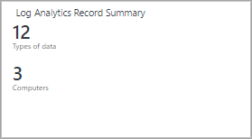
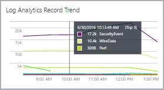

<properties
    pageTitle="Referência de Designer bloco do modo de exibição de análise de logon | Microsoft Azure"
    description="Designer de modo de exibição em análise de Log permite que você criar exibições personalizadas no console OMS que contêm diferentes visualizações de dados no repositório OMS. Este artigo fornece uma referência as configurações para cada um dos blocos de disponível para uso em suas exibições personalizadas."
    services="log-analytics"
    documentationCenter=""
    authors="bwren"
    manager="jwhit"
    editor=""/>

<tags
    ms.service="log-analytics"
    ms.workload="na"
    ms.tgt_pltfrm="na"
    ms.devlang="na"
    ms.topic="article"
    ms.date="09/27/2016"
    ms.author="bwren"/>

# Referência de bloco de Designer de modo de exibição de análise de log
O Designer de modo de exibição em análise de Log permite que você criar exibições personalizadas no console OMS que contêm diferentes visualizações de dados no repositório OMS. Este artigo fornece uma referência as configurações para cada um dos blocos de disponível para uso em suas exibições personalizadas.

Outros artigos disponíveis para View Designer são:

- [Exibir Designer](log-analytics-view-designer.md) - visão geral do Designer de modo de exibição e procedimentos para criar e editar exibições personalizadas.
- [Referência de parte de visualização](log-analytics-view-designer-parts.md) - referência as configurações para cada um dos blocos de disponível para uso em suas exibições personalizadas. 

A tabela a seguir lista os diferentes tipos de blocos disponíveis no modo de exibição Designer.  As seções a seguir descrevem cada tipo de bloco em detalhes e suas propriedades.

| Bloco | Descrição |
|:--|:--|
| [Número](#number-tile) | Número único mostrando a contagem de registros de uma consulta. |
| [Dois números](#two-numbers-tile) | Dois números único mostrando contagens de registros das duas consultas diferentes. |
| [Rosca](#donut-tile) | Gráfico de rosca com base em uma consulta com um valor de resumo no centro. |
| [Texto explicativo & gráfico de linhas](#line-chart-amp-callout-tile) | Gráfico de linhas com base em uma consulta e um texto explicativo com um valor de resumo. |
| [Gráfico de linhas](#line-chart-tile) | Gráfico de linhas com base em uma consulta. |
| [Dois cronogramas](#two-timelines-tile) | Gráfico de colunas com duas séries que cada baseado em uma consulta separada. |

## Bloco do número

O bloco de **número** exibe um único número mostrando a contagem de registros de uma consulta de log e um rótulo.

| Configuração | Descrição |
|:--|:--|
| Nome        | Texto para exibição na parte superior do bloco de. |
| Descrição | Texto exibido sob o nome do bloco.    |
| **Bloco** |
| Legenda | Texto exibido sob o valor. |
| Consulta | Consulta para executar.  A contagem do número de registros retornados pela consulta será exibida. |
| **Avançadas** |  **> Verificação de fluxo de dados** |
| Habilitado | Selecione se a verificação de fluxo de dados deve ser habilitada para o bloco.  Isso fornece uma mensagem alternativa se dados não estão disponíveis para o bloco.  Isso geralmente é usado para fornecer uma mensagem durante o período temporário quando o modo de exibição está instalado e dados vem disponíveis. |
| Consulta | Consulta para executar para verificar se os dados estão disponíveis para o modo de exibição.  Se a consulta não retorna nenhum resultado, uma mensagem é exibida em vez do valor da consulta principal. |
| Mensagem | Mensagem para exibir se a consulta de verificação do fluxo de dados não retorna nenhum dado.  Se você não fornecer nenhuma mensagem, *Realizando avaliação* é exibida. |
| **Intervalo de tempo** |
| Duração | Duração da data atual a ser usado para o intervalo de tempo da consulta.  Por exemplo, se **7 dias** for especificada, a consulta está limitada aos registros criados a partir de 7 dias para a data atual. |
| Deslocamento de dados de fim | Deslocamento opcional dos dados atuais para usar para o intervalo de tempo da consulta principal.  Por exemplo, se o **dia de -1** é usado para o **deslocamento de data de término** e **7 dias** usado para a **duração**, a consulta está limitada aos registros criados a partir de 8 dias atrás para ontem. |

## Bloco de dois números

O bloco de **Número dois** exibe dois números mostrando a contagem de registros das duas consultas de log diferente e um rótulo para cada um.

| Configuração | Descrição |
|:--|:--|
| Nome        | Texto para exibição na parte superior do bloco de. |
| Descrição | Texto exibido sob o nome do bloco.    |
| **Primeiro ladrilho** |
| Legenda | Texto exibido sob o valor. |
| Consulta | Consulta para executar.  A contagem do número de registros retornados pela consulta será exibida. |
| **Bloco do segundo** |
| Legenda | Texto exibido sob o valor. |
| Consulta | Consulta para executar.  A contagem do número de registros retornados pela consulta será exibida. |
| **Avançadas** | **> Verificação de fluxo de dados** |
| Habilitado | Selecione se a verificação de fluxo de dados deve ser habilitada para o bloco.  Isso fornece uma mensagem alternativa se dados não estão disponíveis para o bloco.  Isso geralmente é usado para fornecer uma mensagem durante o período temporário quando o modo de exibição está instalado e dados vem disponíveis. |
| Consulta | Consulta para executar para verificar se os dados estão disponíveis para o modo de exibição.  Se a consulta não retorna nenhum resultado, uma mensagem é exibida em vez do valor da consulta principal. |
| Mensagem | Mensagem para exibir se a consulta de verificação do fluxo de dados não retorna nenhum dado.  Se você não fornecer nenhuma mensagem, *Realizando avaliação* é exibida. |
| **Intervalo de tempo** |
| Duração | Duração da data atual a ser usado para o intervalo de tempo da consulta.  Por exemplo, se **7 dias** for especificada, a consulta está limitada aos registros criados a partir de 7 dias para a data atual. |
| Deslocamento de dados de fim | Deslocamento opcional dos dados atuais para usar para o intervalo de tempo da consulta principal.  Por exemplo, se o **dia de -1** é usado para o **deslocamento de data de término** e **7 dias** usado para a **duração**, a consulta está limitada aos registros criados a partir de 8 dias atrás para ontem. |

## Bloco de rosca

O bloco de **rosca** exibe um único número resumido de uma coluna de valor em uma consulta de log.  A rosca graficamente exibe os resultados dos três registros superiores.

| Configuração | Descrição |
|:--|:--|
| Nome        | Texto para exibição na parte superior do bloco de. |
| Descrição | Texto exibido sob o nome do bloco.    |
| **Rosca** |
| Consulta | Consulta a ser executada para a rosca.  A primeira propriedade deve ser um valor de texto e a segunda propriedade um valor numérico.  Isso geralmente é uma consulta que usa a palavra-chave **medida** para resumir resultados. |
| **Rosca** | **> Central** |
| Texto | Texto exibido sob o valor dentro do rosca. |
| Operação | A operação para executar a propriedade de valor para resumir um único valor.  -Soma: Adicione os valores de todos os registros com o valor da propriedade. -Porcentagem: Porcentagem dos valores somados dos registros com o valor da propriedade comparado aos valores somados de todos os registros. |
| Valores de resultado usados na operação de centro | Opcionalmente, clique no sinal de mais para adicionar um ou mais valores.  Os resultados da consulta são limitados aos registros com os valores de propriedade que você especificar.  Se não há valores são adicionados, que todos os registros serão incluídos na consulta. |
| **Rosca** | **> Opções adicionais** |
| Cores | A cor a ser exibida para cada uma das três propriedades superiores.  Se você quiser especificar cores alternadas para valores de propriedade específica, use avançadas mapeamento de cor. |
| Mapeamento de cores avançadas | Exibe uma cor para valores de propriedade específicos.  Se o valor especificado estiver nos três principais, a cor alternativa é exibida em vez da cor padrão.  Se a propriedade não estiver nos três superior, a cor não é exibida. |
| **Avançadas** | **> Verificação de fluxo de dados** |
| Habilitado | Selecione se a verificação de fluxo de dados deve ser habilitada para o bloco.  Isso fornece uma mensagem alternativa se dados não estão disponíveis para o bloco.  Isso geralmente é usado para fornecer uma mensagem durante o período temporário quando o modo de exibição está instalado e dados vem disponíveis. |
| Consulta | Consulta para executar para verificar se os dados estão disponíveis para o modo de exibição.  Se a consulta não retorna nenhum resultado, uma mensagem é exibida em vez do valor da consulta principal. |
| Mensagem | Mensagem para exibir se a consulta de verificação do fluxo de dados não retorna nenhum dado.  Se você não fornecer nenhuma mensagem, *Realizando avaliação* é exibida. |
| **Intervalo de tempo** |
| Duração | Duração da data atual a ser usado para o intervalo de tempo da consulta.  Por exemplo, se **7 dias** for especificada, a consulta está limitada aos registros criados a partir de 7 dias para a data atual. |
| Deslocamento de dados de fim | Deslocamento opcional dos dados atuais para usar para o intervalo de tempo da consulta principal.  Por exemplo, se o **dia de -1** é usado para o **deslocamento de data de término** e **7 dias** usado para a **duração**, a consulta está limitada aos registros criados a partir de 8 dias atrás para ontem. |

## Ajuda é baixado

O bloco de **gráfico de linha** exibe um gráfico de linha com várias séries de uma consulta de log ao longo do tempo.  

| Configuração | Descrição |
|:--|:--|
| Nome        | Texto para exibição na parte superior do bloco de. |
| Descrição | Texto exibido sob o nome do bloco.    |
| **Gráfico de linhas** |  
| Consulta | Consulta a ser executada para o gráfico de linhas.  A primeira propriedade deve ser um valor de texto e a segunda propriedade um valor numérico.  Isso geralmente é uma consulta que usa a palavra-chave **medida** para resumir resultados.  Se a consulta usa a palavra-chave de **intervalo** , o eixo x do gráfico usará esse intervalo de tempo.  Se a consulta não inclua a palavra-chave **intervalo** intervalos por hora são usados para o eixo x. |
| **Gráfico de linhas** | **> Eixo Y** |
| Usar escala logarítmica | Selecione para usar uma escala logarítmica para o eixo y. |
| Unidades | Especifique as unidades para os valores retornados pela consulta.  Essas informações são usadas para exibir os rótulos no gráfico que indica os tipos de valor e, opcionalmente, para converter os valores.  O **Tipo de unidade** Especifica a categoria da unidade e define os valores de **Tipo de unidade atual** que estão disponíveis.  Se você selecionar um valor em **Converter para** os valores numéricos são convertidos do tipo de **Unidade atual** para o tipo de **Converter em** . |
| Etiqueta personalizada | Texto para exibição para o eixo Y ao lado do rótulo para o tipo de unidade.  Se nenhum rótulo for especificado, apenas o tipo de unidade é exibido. |
| **Avançadas** | **> Verificação de fluxo de dados** |
| Habilitado | Selecione se a verificação de fluxo de dados deve ser habilitada para o bloco.  Isso fornece uma mensagem alternativa se dados não estão disponíveis para o bloco.  Isso geralmente é usado para fornecer uma mensagem durante o período temporário quando o modo de exibição está instalado e dados vem disponíveis. |
| Consulta | Consulta para executar para verificar se os dados estão disponíveis para o modo de exibição.  Se a consulta não retorna nenhum resultado, uma mensagem é exibida em vez do valor da consulta principal. |
| Mensagem | Mensagem para exibir se a consulta de verificação do fluxo de dados não retorna nenhum dado.  Se você não fornecer nenhuma mensagem, *Realizando avaliação* é exibida. |
| **Intervalo de tempo** |
| Duração | Duração da data atual a ser usado para o intervalo de tempo da consulta.  Por exemplo, se **7 dias** for especificada, a consulta está limitada aos registros criados a partir de 7 dias para a data atual. |
| Deslocamento de dados de fim | Deslocamento opcional dos dados atuais para usar para o intervalo de tempo da consulta principal.  Por exemplo, se o **dia de -1** é usado para o **deslocamento de data de término** e **7 dias** usado para a **duração**, a consulta está limitada aos registros criados a partir de 8 dias atrás para ontem. |

## Bloco de texto explicativo & gráfico de linha

O bloco de **texto explicativo & gráfico de linha** exibe um gráfico de linha com várias séries de uma consulta de log ao longo do tempo e um texto explicativo com um valor resumido.  

| Configuração | Descrição |
|:--|:--|
| Nome        | Texto para exibição na parte superior do bloco de. |
| Descrição | Texto exibido sob o nome do bloco.    |
| **Gráfico de linhas** |  
| Consulta | Consulta a ser executada para o gráfico de linhas.  A primeira propriedade deve ser um valor de texto e a segunda propriedade um valor numérico.  Isso geralmente é uma consulta que usa a palavra-chave **medida** para resumir resultados.  Se a consulta usa a palavra-chave de **intervalo** , o eixo x do gráfico usará esse intervalo de tempo.  Se a consulta não inclua a palavra-chave **intervalo** intervalos por hora são usados para o eixo x. |
| **Gráfico de linhas** | **> Texto explicativo** |
| Texto explicativo | Texto de título para exibir acima do valor de texto explicativo. |
| Nome da série | Valor de propriedade para a série usar para o valor de texto explicativo.  Se nenhuma série for fornecido, todos os registros da consulta são usados. |
| Operação | A operação para executar a propriedade de valor para resumir um único valor para o texto explicativo. -Média: Média do valor de todos os registros.  -Contagem: Contagem de todos os registros retornados pela consulta. -Última amostra: O valor do último intervalo incluído no gráfico. -Máx: Valor máximo dos intervalos incluídos no gráfico. -Min: Valor mínimo dos intervalos incluídos no gráfico. -Soma: Soma do valor de todos os registros. |
| **Gráfico de linhas** | **> Eixo Y** |
| Usar escala logarítmica | Selecione para usar uma escala logarítmica para o eixo y. |
| Unidades | Especifique as unidades para os valores retornados pela consulta.  Essas informações são usadas para exibir os rótulos no gráfico que indica os tipos de valor e, opcionalmente, para converter os valores.  O **Tipo de unidade** Especifica a categoria da unidade e define os valores de **Tipo de unidade atual** que estão disponíveis.  Se você selecionar um valor em **Converter para** os valores numéricos são convertidos do tipo de **Unidade atual** para o tipo de **Converter em** . |
| Etiqueta personalizada | Texto para exibição para o eixo Y ao lado do rótulo para o tipo de unidade.  Se nenhum rótulo for especificado, apenas o tipo de unidade é exibido. |
| **Avançadas** | **> Verificação de fluxo de dados** |
| Habilitado | Selecione se a verificação de fluxo de dados deve ser habilitada para o bloco.  Isso fornece uma mensagem alternativa se dados não estão disponíveis para o bloco.  Isso geralmente é usado para fornecer uma mensagem durante o período temporário quando o modo de exibição está instalado e dados vem disponíveis. |
| Consulta | Consulta para executar para verificar se os dados estão disponíveis para o modo de exibição.  Se a consulta não retorna nenhum resultado, uma mensagem é exibida em vez do valor da consulta principal. |
| Mensagem | Mensagem para exibir se a consulta de verificação do fluxo de dados não retorna nenhum dado.  Se você não fornecer nenhuma mensagem, *Realizando avaliação* é exibida. |
| **Intervalo de tempo** |
| Duração | Duração da data atual a ser usado para o intervalo de tempo da consulta.  Por exemplo, se **7 dias** for especificada, a consulta está limitada aos registros criados a partir de 7 dias para a data atual. |
| Deslocamento de dados de fim | Deslocamento opcional dos dados atuais para usar para o intervalo de tempo da consulta principal.  Por exemplo, se o **dia de -1** é usado para o **deslocamento de data de término** e **7 dias** usado para a **duração**, a consulta está limitada aos registros criados a partir de 8 dias atrás para ontem. |

## Bloco de dois cronogramas

O bloco de **dois cronogramas** exibe os resultados das duas consultas de log ao longo do tempo, como gráficos de coluna.  Um balão é exibido para cada série.  

| Configuração | Descrição |
|:--|:--|
| Nome        | Texto para exibição na parte superior do bloco de. |
| Descrição | Texto exibido sob o nome do bloco.    |
| Primeiro gráfico   
| Legenda | Texto exibido sob o texto explicativo para a primeira série.
| Cor | Cor a ser usada para as colunas na primeira série.
| Consulta de gráfico | Consulta para executar para a primeira série.  A contagem do número de registros sobre cada intervalo de tempo será representada pelas colunas do gráfico.
| Operação | A operação para executar a propriedade de valor para resumir um único valor para o texto explicativo.  -Média: Média do valor de todos os registros. -Contagem: Contagem de todos os registros retornados pela consulta. -Última amostra: O valor do último intervalo incluído no gráfico. -Máx: Valor máximo dos intervalos incluídos no gráfico.
| **Segundo gráfico** |
| Legenda | Texto exibido sob o texto explicativo para a segunda série.
| Cor | Cor a ser usada para as colunas da série de segundo.
| Consulta de gráfico | Consulta para executar para a segunda série.  A contagem do número de registros sobre cada intervalo de tempo será representada pelas colunas do gráfico.
| Operação | A operação para executar a propriedade de valor para resumir um único valor para o texto explicativo.  -Média: Média do valor de todos os registros. -Contagem: Contagem de todos os registros retornados pela consulta. -Última amostra: O valor do último intervalo incluído no gráfico. -Máx: Valor máximo dos intervalos incluídos no gráfico. |
| **Avançadas** | **> Verificação de fluxo de dados** |
| Habilitado | Selecione se a verificação de fluxo de dados deve ser habilitada para o bloco.  Isso fornece uma mensagem alternativa se dados não estão disponíveis para o bloco.  Isso geralmente é usado para fornecer uma mensagem durante o período temporário quando o modo de exibição está instalado e dados vem disponíveis. |
| Consulta | Consulta para executar para verificar se os dados estão disponíveis para o modo de exibição.  Se a consulta não retorna nenhum resultado, uma mensagem é exibida em vez do valor da consulta principal. |
| Mensagem | Mensagem para exibir se a consulta de verificação do fluxo de dados não retorna nenhum dado.  Se você não fornecer nenhuma mensagem, *Realizando avaliação* é exibida. |
| **Intervalo de tempo** |
| Duração | Duração da data atual a ser usado para o intervalo de tempo da consulta.  Por exemplo, se **7 dias** for especificada, a consulta está limitada aos registros criados a partir de 7 dias para a data atual. |
| Deslocamento de dados de fim | Deslocamento opcional dos dados atuais para usar para o intervalo de tempo da consulta principal.  Por exemplo, se o **dia de -1** é usado para o **deslocamento de data de término** e **7 dias** usado para a **duração**, a consulta está limitada aos registros criados a partir de 8 dias atrás para ontem. |

## Próximas etapas

- Saiba mais sobre [as pesquisas de log](log-analytics-log-searches.md) oferecer suporte as consultas em blocos.
- Adicione [Partes de visualização](log-analytics-view-designer-parts.md) para seu modo de exibição personalizado.