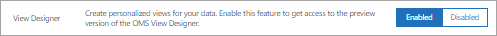

<properties
    pageTitle="Designer de modo de exibição de análise de logon | Microsoft Azure"
    description="Designer de modo de exibição em análise de Log permite que você criar exibições personalizadas no console OMS que contêm diferentes visualizações de dados no repositório OMS. Este artigo contém uma visão geral do Designer de modo de exibição e procedimentos para criar e editar exibições personalizadas."
    services="log-analytics"
    documentationCenter=""
    authors="bwren"
    manager="jwhit"
    editor=""/>

<tags
    ms.service="log-analytics"
    ms.workload="na"
    ms.tgt_pltfrm="na"
    ms.devlang="na"
    ms.topic="article"
    ms.date="09/27/2016"
    ms.author="bwren"/>

# Designer de modo de exibição de análise de log
O Designer de modo de exibição em análise de Log permite que você criar exibições personalizadas no console OMS que contêm diferentes visualizações de dados no repositório OMS. Este artigo contém uma visão geral do Designer de modo de exibição e procedimentos para criar e editar exibições personalizadas.

Outros artigos disponíveis para View Designer são:

- [Referência de peças](log-analytics-view-designer-tiles.md) - referência as configurações para cada um dos blocos de disponível para uso em suas exibições personalizadas. 
- [Referência de parte de visualização](log-analytics-view-designer-parts.md) - referência as configurações para cada um dos blocos de disponível para uso em suas exibições personalizadas. 

## Conceitos
Modos de exibição criados com o Designer de modo de exibição contêm os elementos da tabela a seguir.

| Parte | Descrição |
|:--|:--|
| Bloco | Exibido no painel de visão geral de análise de Log principal.  Inclui um visual resumir as informações contidas no modo de exibição personalizado.  Diferentes tipos de bloco fornecem diferentes visualizações de registros no repositório OMS.  Clique no bloco para abrir o modo de exibição personalizado. |
| Modo de exibição personalizado | Exibido quando o usuário clica no bloco.  Contém uma ou mais partes de visualização. |
| Partes de visualização | Visualização de dados no repositório OMS com base em uma ou mais [pesquisas de log](log-analytics-log-searches.md).  A maioria das partes incluirá um cabeçalho que fornece uma visualização de alto nível e uma lista dos resultados superiores.  Tipos de parte diferentes fornecem diferentes visualizações de registros no repositório OMS.  Clique em elementos na parte para realizar uma pesquisa de log fornecendo registros detalhados. |

## Adicionar View Designer ao seu espaço de trabalho
Enquanto View Designer está na visualização, você deve adicioná-lo ao seu espaço de trabalho selecionando **Visualização de recursos** na seção **configurações** do portal do OMS.

## Criar e editar modos de exibição

### Criar uma nova exibição
Abra um novo modo de exibição no **Designer de modo de exibição** clicando no bloco View Designer no painel OMS principal.

### Editar uma exibição existente
Para editar uma exibição existente no Designer de modo de exibição, abra o modo de exibição clicando no seu bloco no painel OMS principal.  Clique no botão **Editar** para abrir o modo de exibição no Designer de modo de exibição.

### Clonar uma exibição existente
Quando você clonar um modo de exibição, ele cria uma nova exibição e abre no Designer de modo de exibição.  A nova exibição terá o mesmo nome do original com "Copiar" acrescentadas ao final dele.  Para clonar um modo de exibição, abra o modo de exibição existente clicando no seu bloco no painel OMS principal.  Clique no botão de **clonar** para abrir o modo de exibição no Designer de modo de exibição.

### Excluir uma exibição existente
Para excluir um modo de exibição existente, abra o modo de exibição clicando no seu bloco no painel OMS principal.  Em seguida, clique no botão **Editar** para abrir o modo de exibição no Designer de modo de exibição e clique em **Excluir visualização**.

### Exportar uma exibição existente
Você pode exportar um modo de exibição para um arquivo JSON que você pode importar para outro espaço de trabalho ou usar em um [modelo do Gerenciador de recursos do Azure](../resource-group-authoring-templates.md).  Para exportar um modo de exibição existente, abra o modo de exibição clicando no seu bloco no painel OMS principal.  Clique no botão **Exportar** para criar um arquivo na pasta de download do navegador.  O nome do arquivo será o nome do modo de exibição com a extensão *omsview*.

### Importar uma exibição existente
Você pode importar um arquivo de *omsview* que você exportou de outro grupo de gerenciamento.  Para importar uma exibição existente, primeiro crie uma nova exibição.  Em seguida, clique no botão **Importar** e selecione o arquivo *omsview* .  A configuração no arquivo será copiada para o modo de exibição existente.

## Trabalhando com o Designer de modo de exibição
O Designer de modo de exibição tem três painéis.  O painel de **Design** representa o modo de exibição personalizado.  Quando você adiciona peças e partes do painel de **controle** ao painel de **Design** que eles são adicionados ao modo de exibição.  O painel de **Propriedades** exibirá as propriedades para o bloco ou a parte selecionada.

### Configurar o bloco de modo de exibição
Uma exibição personalizada pode ter somente um ladrilho.  Selecione a guia **lado a lado** no painel de **controle** para exibir a peça atual ou selecione um alternativo.  O painel de **Propriedades** exibirá as propriedades do bloco atual.  Configurar as propriedades do bloco de acordo com as informações detalhadas na [Referência de bloco](log-analytics-view-designer-tiles.md) e clique em **Aplicar** para salvar as alterações.

### Configurar partes de visualização
Um modo de exibição pode incluir qualquer número de partes de visualização.  Selecione a guia **Exibir** e uma parte de visualização para adicionar à exibição.  O painel de **Propriedades** exibirá as propriedades para a parte selecionada.  Configurar as exibir propriedades de acordo com as informações detalhadas na [referência de parte de visualização](log-analytics-view-designer-parts.md) e clique em **Aplicar** para salvar as alterações.

### Excluir uma parte de visualização
Você pode remover uma parte da visualização do modo de exibição clicando no botão **X** no canto superior direito da parte.

### Reorganizar partes de visualização
Modos de exibição tem apenas uma linha de partes de visualização.  Reorganize partes existentes em uma exibição clicando e arrastando-os para um novo local.

## Próximas etapas

- Adicione [blocos](log-analytics-view-designer-tiles.md) para o modo de exibição personalizado.
- Adicione [Partes de visualização](log-analytics-view-designer-parts.md) para seu modo de exibição personalizado.
