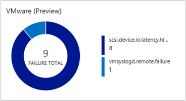
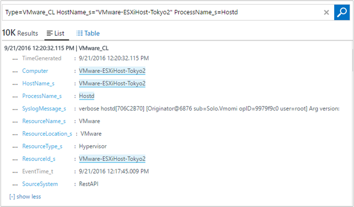
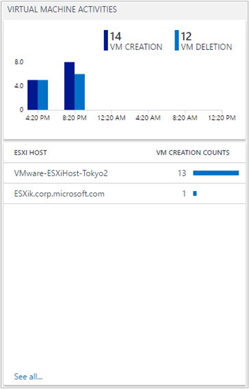
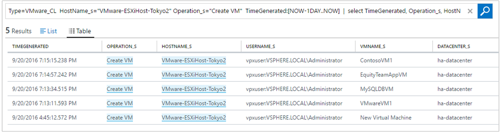

<properties
    pageTitle="Solução VMware monitoramento no Log Analytics | Microsoft Azure"
    description="Saiba mais sobre como a solução de monitoramento VMware pode ajudar gerenciar logs e monitorar ESXi hosts."
    services="log-analytics"
    documentationCenter=""
    authors="bandersmsft"
    manager="jwhit"
    editor=""/>

<tags
    ms.service="log-analytics"
    ms.workload="na"
    ms.tgt_pltfrm="na"
    ms.devlang="na"
    ms.topic="article"
    ms.date="10/28/2016"
    ms.author="banders"/>

# <a name="vmware-monitoring-preview-solution-in-log-analytics"></a>Solução VMware monitoramento (visualização) no Log de análise

A solução VMware monitoramento de análise de Log é uma solução que ajuda você a criar um log centralizado e a abordagem de monitoramento de logs de VMware grandes. Este artigo descreve como você pode solucionar problemas, capturar e gerenciar os hosts ESXi em um único local usando a solução. Com a solução, você pode ver dados detalhados para todos os seus hosts ESXi em um único local. Você pode ver contagens de evento superior, status e tendências de hosts de máquina virtual e ESXi fornecidos por meio dos logs de host ESXi. Você pode solucionar exibindo e pesquisando logs de host ESXi centralizados. E, você pode criar alertas com base em consultas de pesquisa de log.

A solução usa a funcionalidade de syslog nativo do host ESXi aos dados de envio para um máquina virtual, que tem OMS agente de destino. No entanto, a solução não escreva arquivos no syslog dentro de máquina virtual de destino. O agente OMS abre porta 1514 e ouve isso. Depois que ele recebe os dados, o agente OMS envia os dados para OMS.

## <a name="installing-and-configuring-the-solution"></a>Instalando e configurando a solução

Use as informações a seguir para instalar e configurar a solução.

- Adicione a solução VMware monitoramento ao seu espaço de trabalho OMS usando o processo descrito em [soluções de adicionar a análise de Log da Galeria de soluções](log-analytics-add-solutions.md).

#### <a name="supported-vmware-esxi-hosts"></a>Hosts VMware ESXi suportados
vSphere ESXi Host 5.5 e 6.0

#### <a name="prepare-a-linux-server"></a>Preparar um servidor Linux
Crie um sistema operacional do Linux máquina virtual para receber todos os dados de syslog de hosts ESXi. O [OMS Linux agente](log-analytics-linux-agents.md) é o ponto de coleta para todos os dados de syslog de host ESXi. Você pode usar vários ESXi hosts para encaminhar logs em um único servidor Linux, como no exemplo a seguir.  

   

### <a name="configure-syslog-collection"></a>Configurar coleta de syslog

1. Configure o encaminhamento de syslog para VSphere. Para obter informações detalhadas ajudar a configurar o encaminhamento de syslog, consulte [Configurando syslog em ESXi 5. x e 6.0 (2003322)](https://kb.vmware.com/selfservice/microsites/search.do?language=en_US&cmd=displayKC&externalId=2003322). Acesse a **configuração do Host de ESXi** > **Software** > **Configurações avançadas** > **Syslog**.
    

2. No campo *Syslog.global.logHost* , adicione seu servidor Linux e o número de porta *1514*. Por exemplo, `tcp://hostname:1514` ou`tcp://123.456.789.101:1514`

3. Abra o firewall do host de ESXi para syslog. **Configuração de Host ESXi** > **Software** > **Perfil de segurança** > **Firewall** e abrir **Propriedades**.  

      

      

4. Verifique o vSphere Console para verificar se essa syslog está configurada corretamente. Confirmar no host ESXI porta **1514** está configurado.

5. Testar a conectividade entre o servidor Linux e o host ESXi usando o `nc` comando no Host de ESXi. Por exemplo:

    ```
    [root@ESXiHost:~] nc -z 123.456.789.101 1514
    Connection to 123.456.789.101 1514 port [tcp/*] succeeded!
    ```

6. Baixe e instale o agente de OMS para Linux no servidor Linux. Para obter mais informações, consulte a [documentação do agente de OMS para Linux](https://github.com/Microsoft/OMS-Agent-for-Linux).

7. Depois que o agente de OMS para Linux estiver instalado, vá para o diretório /etc/opt/microsoft/omsagent/sysconf/omsagent.d e copie o arquivo de vmware_esxi.conf ao diretório /etc/opt/microsoft/omsagent/conf/omsagent.d e alterar o proprietário/grupo e permissões do arquivo. Por exemplo:

    ```
    sudo cp /etc/opt/microsoft/omsagent/sysconf/omsagent.d/vmware_esxi.conf /etc/opt/microsoft/omsagent/conf/omsagent.d
sudo chown omsagent:omiusers /etc/opt/microsoft/omsagent/conf/omsagent.d/vmware_esxi.conf
    ```

8.  Reinicie o agente de OMS para Linux executando `sudo /opt/microsoft/omsagent/bin/service_control restart`.

9. No Portal do OMS, realize uma pesquisa de log para `Type=VMware_CL`. Quando OMS coleta os dados de syslog, ele retém o formato syslog. No portal do, são capturados alguns campos específicos, como *nome do host* e *ProcessName*.  

      

    Se os resultados de pesquisa de log de modo de exibição serão semelhantes a imagem acima, você está configurado para usar o painel de solução OMS VMware monitoramento.  

## <a name="vmware-data-collection-details"></a>Detalhes de conjunto de dados VMware

A solução VMware monitoramento coleta vários dados de log e métricas de desempenho de hosts ESXi usando os agentes de OMS para Linux que você ativou.

A tabela a seguir mostra os métodos de coleta de dados e outros detalhes sobre como os dados são coletados.

| plataforma | Agente OMS para Linux | Agente do SCOM | Armazenamento do Azure | SCOM necessário? | Enviados via grupo de gerenciamento de dados do SCOM agente | frequência de conjunto |
|---|---|---|---|---|---|---|
|Linux||||            || cada 3 minutos|


A tabela a seguir mostram exemplos de campos de dados coletados pela solução VMware monitoramento:

| nome do campo | Descrição |
| --- | --- |
| Device_s| Dispositivos de armazenamento do VMware |
| ESXIFailure_s | tipos de falha |
| EventTime_t | hora quando o evento ocorreu |
| HostName_s | Nome do host ESXi |
| Operation_s | Criar máquina virtual ou excluir máquina virtual |
| ProcessName_s | nome do evento |
| ResourceId_s | nome do host VMware |
| ResourceLocation_s | VMware |
| ResourceName_s | VMware |
| ResourceType_s | Hyper-V |
| SCSIStatus_s | Status de VMware SCSI |
| SyslogMessage_s | Dados de syslog |
| UserName_s | usuário que criou ou excluídos máquina virtual |
| VMName_s | Nome de máquina virtual |
| Computador | computador host |
| TimeGenerated | tempo de que dados foi gerados |
| DataCenter_s | Data center VMware |
| StorageLatency_s | latência de armazenamento (ms) |

## <a name="vmware-monitoring-solution-overview"></a>Visão geral da solução VMware monitoramento

O bloco de VMware aparece no portal do OMS. Ele fornece uma visão geral do quaisquer falhas. Quando você clica no bloco, ir para um modo de exibição do painel de controle.



#### <a name="navigate-the-dashboard-view"></a>Navegar o modo de exibição de painel

No modo de exibição de painel **VMware** , blades são organizados por:

- Contagem de Status de falhas
- Contagens de Host superior por evento
- Contagens de evento superior
- Atividades de máquina virtual
- Eventos de disco ESXi Host


Clique em qualquer blade para abrir o painel de pesquisa de análise de Log que mostra as informações detalhadas específico para a lâmina.

A partir daqui, você pode editar a consulta de pesquisa para modificá-lo para algo específico. Para um tutorial sobre noções básicas de pesquisa OMS, confira o [tutorial de pesquisa de log OMS.](log-analytics-log-searches.md)

#### <a name="find-esxi-host-events"></a>Localizar ESXi host eventos

Um único host ESXi gera vários logs, com base em seus processos. A solução VMware monitoramento centraliza-los e resume as contagens de evento. Este modo de exibição centralizado ajuda você a compreender qual host ESXi tem um alto volume de eventos e os eventos que ocorrem com mais frequência no seu ambiente.


É possível fazer drill adicional clicando em um host ESXi ou um tipo de evento.

Quando você clica em um nome de host ESXi, você vê as informações do host ESXi. Se você quiser restringir resultados com o tipo de evento, adicione `“ProcessName_s=EVENT TYPE”` em sua consulta de pesquisa. Você pode selecionar **ProcessName** no filtro de pesquisa. Que limita as informações para você.



#### <a name="find-high-vm-activities"></a>Encontrar altas atividades de máquina virtual

Uma máquina virtual podem ser criada e excluída em qualquer host ESXi. É útil para um administrador identificar quantos VMs cria um host ESXi. No virada, ajuda a entender o planejamento de capacidade e desempenho. Mantendo o controle de eventos de atividade de máquina virtual é fundamental ao gerenciamento de seu ambiente.



Se você quiser ver mais dados de criação de máquina virtual para host ESXi, clique em um nome de host ESXi.



#### <a name="common-search-queries"></a>Consultas de pesquisa comuns

A solução inclui outras consultas úteis que podem ajudá-lo a gerenciar seus hosts ESXi, como o espaço de armazenamento alto, latência de armazenamento e falha de caminho.


#### <a name="save-queries"></a>Salvar consultas

Salvando consultas de pesquisa é um recurso padrão no OMS e pode ajudá-lo a manter todas as consultas que você encontrou útil. Depois de criar uma consulta que você ache útil, salvá-lo clicando em **Favoritos**. Uma consulta salva permite que você facilmente reutilizá-la posteriormente da página [Dashboard meu](log-analytics-dashboards.md) onde você pode criar seus próprios painéis personalizados.


#### <a name="create-alerts-from-queries"></a>Criar alertas de consultas

Depois que você criou suas consultas, talvez você queira usar as consultas para alertar quando ocorrem eventos específicos. Consulte [alertas na análise de Log](log-analytics-alerts.md) para obter informações sobre como criar alertas. Para obter exemplos de alerta consultas e outros exemplos de consulta, consulte a postagem do blog do [Monitor VMware usando a análise de Log OMS](https://blogs.technet.microsoft.com/msoms/2016/06/15/monitor-vmware-using-oms-log-analytics) .

## <a name="frequently-asked-questions"></a>Perguntas frequentes

### <a name="what-do-i-need-to-do-on-the-esxi-host-setting-what-impact-will-it-have-on-my-current-environment"></a>O que eu preciso no ESXi host configuração? Que impacto ele terá no meu ambiente atual?
A solução usa nativo ESXi Host Syslog mecanismo de encaminhamento. Você não precisa qualquer software da Microsoft adicional no ESXi Host para capturar os logs. Ele deve ter um impacto baixo para seu ambiente existente. No entanto, você precisa definir o encaminhamento de syslog, que é a funcionalidade ESXI.

### <a name="do-i-need-to-restart-my-esxi-host"></a>Eu preciso para reiniciar o host do meu ESXi?
Não. Esse processo não exige a reinicialização. Às vezes, vSphere não atualizar corretamente syslog. Nesse caso, faça logon para o host ESXi e recarregar syslog. Novamente, você não precisa reiniciar o host, para que esse processo não é interrupções para seu ambiente.

### <a name="can-i-increase-or-decrease-the-volume-of-log-data-sent-to-oms"></a>Pode aumentar ou diminuir o volume dos dados de log enviados para OMS?
Sim, você pode. Você pode usar as configurações de nível de Log de Host ESXi no vSphere. Coleta de log baseia-se no nível de *informações* . Portanto, se você deseja fazer auditoria máquina virtual criação ou exclusão, você precisa manter o nível de *informações* em Hostd. Para obter mais informações, consulte o [VMware Knowledge Base](https://kb.vmware.com/selfservice/microsites/search.do?&cmd=displayKC&externalId=1017658).

### <a name="why-is-hostd-not-providing-data-to-oms-my-log-setting-is-set-to-info"></a>Por que Hostd não está fornecendo dados para OMS? Minha configuração de log está definida para informações.
Ocorreu um erro de host ESXi para o carimbo de hora do syslog. Para obter mais informações, consulte o [VMware Knowledge Base](https://kb.vmware.com/selfservice/microsites/search.do?language=en_US&cmd=displayKC&externalId=2111202). Depois de aplicar a solução alternativa, Hostd deve funcionar normalmente.

### <a name="can-i-have-multiple-esxi-hosts-forwarding-syslog-data-to-a-single-vm-with-omsagent"></a>Posso ter vários hosts ESXi encaminhando syslog dados para uma única VM com omsagent?
Sim. Você pode ter vários hosts ESXi encaminhamento para uma única VM com omsagent.

### <a name="why-dont-i-see-data-flowing-into-oms"></a>Por que não vejo dados fluindo em OMS?

Pode haver vários motivos:

- O host ESXi não é insistem dados corretamente para a máquina virtual executando omsagent. Para testar, execute as seguintes etapas:
    1. Para confirmar, faça logon ao host ESXi usando ssh e execute o seguinte comando:`nc -z ipaddressofVM 1514`

        Se não for bem-sucedida, serão prováveis que vSphere configurações na configuração avançada não corrigir. Consulte [Configurar syslog conjunto](#configure-syslog-collection) para obter informações sobre como configurar o host ESXi para encaminhamento de syslog.

    2. Se a conectividade de porta syslog foi bem-sucedida, mas você ainda não vê qualquer dado, em seguida, recarregar syslog do host ESXi usando ssh para executar o comando a seguir:` esxcli system syslog reload`

- A máquina virtual com agente de OMS não está definida corretamente. Para testar isso, execute as seguintes etapas:
    1. OMS ouve a porta 1514 e envia dados em OMS. Para verificar que ela está aberta, execute o seguinte comando:`netstat -a | grep 1514`
    2. Você deve ver porta `1514/tcp` abrir. Se você não fizer isso, verifique se o omsagent está instalado corretamente. Se você não ver as informações de porta, a porta de syslog não é aberta na máquina virtual.
        1. Verificar se o agente de OMS está executando usando `ps -ef | grep oms`. Se ele não está sendo executado, inicie o processo executando o comando` sudo /opt/microsoft/omsagent/bin/service_control start`
        2. Abrir o `/etc/opt/microsoft/omsagent/conf/omsagent.d/vmware_esxi.conf` arquivo.

            Verificar se o usuário adequado e configuração do grupo é válido, semelhante a:`-rw-r--r-- 1 omsagent omiusers 677 Sep 20 16:46 vmware_esxi.conf`

            Se o arquivo não existir ou a configuração de grupo e o usuário está errado, tome medidas corretivas por [Preparando um servidor Linux](#prepare-a-linux-server).

## <a name="next-steps"></a>Próximas etapas

- Use [As pesquisas de Log](log-analytics-log-searches.md) da análise de Log para exibir dados detalhados de host VMware.
- [Criar seus próprios painéis](log-analytics-dashboards.md) mostrando dados de host do VMware.
- [Criar alertas](log-analytics-alerts.md) quando ocorrem eventos de host VMware específicos.
