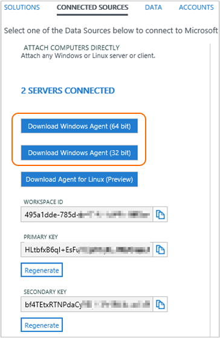

<properties
    pageTitle="Conectar computadores Windows a análise de Log | Microsoft Azure"
    description="Este artigo mostra as etapas para conectar os computadores Windows em sua infraestrutura de local diretamente à OMS usando uma versão personalizada do agente de monitoramento Microsoft (MMA)."
    services="log-analytics"
    documentationCenter=""
    authors="bandersmsft"
    manager="jwhit"
    editor=""/>

<tags
    ms.service="log-analytics"
    ms.workload="na"
    ms.tgt_pltfrm="na"
    ms.devlang="na"
    ms.topic="article"
    ms.date="08/11/2016"
    ms.author="banders"/>


# <a name="connect-windows-computers-to-log-analytics"></a>Conectar computadores Windows a análise de Log

Este artigo mostra as etapas para conectar os computadores Windows em sua infraestrutura de local diretamente para espaços de trabalho OMS usando uma versão personalizada do agente de monitoramento Microsoft (MMA). Você precisa instalar e conectar agentes para todos os computadores que você deseja a integrado ao OMS na ordem para que elas para enviar dados para OMS e para visualizar e agir nos dados no portal do OMS. Cada agente pode relatar à vários espaços de trabalho.

Você pode instalar agentes usando configuração, linha de comando, ou com desejado estado configuração (DSC) na automação do Azure.  

>[AZURE.NOTE] Para máquinas virtuais em execução no Azure, você pode simplificar a instalação usando a [extensão de máquina virtual](log-analytics-azure-vm-extension.md).

Em computadores com conectividade com a Internet, o agente usará a conexão à Internet para enviar dados para OMS. Para computadores que não têm conectividade com a Internet, você pode usar um proxy ou os encaminhadores de análise de Log de OMS.

Conectando seus computadores Windows OMS é simples usando 3 etapas simples:

1. Baixar o arquivo de configuração do agente
2. Instalar o agente usando o método escolhido
3. Configurar o agente ou adicionar espaços de trabalho adicionais, se necessário

O diagrama a seguir mostra a relação entre computadores Windows e OMS depois de instalado e configurado agentes.


## <a name="system-requirements-and-required-configuration"></a>Requisitos do sistema e configuração necessárias
Antes de instalar ou implantar agentes, examine os seguintes detalhes para garantir que você atende aos requisitos necessários.

- Só é possível instalar o OMS MMA em computadores que executam o Windows Server 2008 SP 1 ou posterior ou Windows 7 SP1 ou posterior.
- Você precisará de uma assinatura do OMS.  Para obter informações adicionais, consulte [começar a usar a análise de Log](log-analytics-get-started.md).
- Cada computador Windows deve ser capaz de se conectar à Internet usando HTTPS. Esta conexão pode ser direta, por meio de um proxy, ou os encaminhadores de análise de Log de OMS.
- Você pode instalar o OMS MMA em computadores autônomos, servidores e máquinas virtuais. Se você deseja se conectar máquinas de virtuais hospedados Azure OMS, consulte [Conectar Azure máquinas virtuais a análise de Log](log-analytics-azure-vm-extension.md).
- O agent precisa usar portas TCP 443 para vários recursos. Para obter mais informações, consulte [definir configurações de proxy e firewall na análise de Log](log-analytics-proxy-firewall.md).

## <a name="download-the-agent-setup-file-from-oms"></a>Baixar o arquivo de configuração do agente do OMS
1. No portal do OMS, na página **Visão geral** , clique no bloco de **configurações** .  Clique na guia **Fontes conectadas** na parte superior.  
    
2. Em **Anexar computadores diretamente**, clique em **Baixar o Windows Agent** aplicável ao seu tipo de processador do computador para baixar o arquivo de configuração.
3. À direita da **Identificação de espaço de trabalho**, clique no ícone copiar e colar a identificação no bloco de notas.
4. À direita de **Chave primária**, clique no ícone copiar e colar a chave no bloco de notas.     
    

## <a name="install-the-agent-using-setup"></a>Instalar o agente usando configuração
1. Execute a instalação para instalar o agente em um computador que você deseja gerenciar.
2. Na página de boas-vindas, clique em **Avançar**.
3. Na página termos de licença, leia a licença e clique em **concordo**.
4. Na página pasta de destino, alterar ou manter a pasta de instalação padrão e clique em **Avançar**.
5. Na página Opções de configuração do agente, você pode optar por conectar o agente ao Azure Log Analytics (OMS), Operations Manager, ou você pode deixar as opções em branco se você quiser configurar o agente mais tarde. Clique em **Avançar**.   
    - Se você escolheu para se conectar ao Azure Log Analytics (OMS), cole a **Identificação de espaço de trabalho** e a **Chave de espaço de trabalho (chave primária)** que você copiou no bloco de notas no procedimento anterior e clique em **Avançar**.  
        
    - Se você escolheu para se conectar ao Operations Manager, digite o **Nome do grupo de gerenciamento**, o nome do **Servidor de gerenciamento** e **Porta de servidor de gerenciamento**e clique em **Avançar**. Na página da conta de Ação agente, escolha uma conta do sistema Local ou uma conta de domínio local e clique em **Avançar**.  
        

6. Na página pronto para instalar, examine suas escolhas e clique em **instalar**.
7. Sobre a configuração concluída com êxito da página, clique em **Concluir**.
8. Ao concluir, o **Microsoft Agent de monitoramento** aparece no **Painel de controle**. Você pode revisar sua configuração lá e verificar se o agente está conectado ao operacionais ideias (OMS). Quando conectado ao OMS, o agente exibe uma mensagem informando: **o agente de monitoramento Microsoft tem conectado com êxito para o serviço do pacote de gerenciamento de operações de Microsoft.**

## <a name="install-the-agent-using-the-command-line"></a>Instalar o agente usando a linha de comando
- Modificar e use o exemplo a seguir para instalar o agente usando a linha de comando.

    >[AZURE.NOTE] Se você quiser um agente de atualização, você precisa usar a análise de Log API script. Consulte a próxima seção para atualizar um agente.

    ```
    MMASetup-AMD64.exe /Q:A /R:N /C:"setup.exe /qn ADD_OPINSIGHTS_WORKSPACE=1 OPINSIGHTS_WORKSPACE_ID=<your workspace id> OPINSIGHTS_WORKSPACE_KEY=<your workspace key> AcceptEndUserLicenseAgreement=1"
    ```

## <a name="upgrade-the-agent-and-add-a-workspace-using-a-script"></a>O agente de atualização e adicione um espaço de trabalho usando um script
Você pode atualizar um agente e adicionar um espaço de trabalho usando a análise de Log API de script com o PowerShell de exemplo a seguir.

```
$mma = New-Object -ComObject 'AgentConfigManager.MgmtSvcCfg'
$mma.AddCloudWorkspace($workspaceId, $workspaceKey)
$mma.ReloadConfiguration()
```

>[AZURE.NOTE] Se você usou a linha de comando ou script anteriormente para instalar ou configurar o agente, `EnableAzureOperationalInsights` foi substituído pelo `AddCloudWorkspace`.

## <a name="install-the-agent-using-dsc-in-azure-automation"></a>Instalar o agente usando DSC em automação do Azure

>[AZURE.NOTE] Este exemplo de procedimento e script não atualizará um agente existente.

1. Importe o módulo DSC xPSDesiredStateConfiguration de [http://www.powershellgallery.com/packages/xPSDesiredStateConfiguration](http://www.powershellgallery.com/packages/xPSDesiredStateConfiguration) para automação do Azure.  
2.  Crie ativos de variável de automação do Azure para *OPSINSIGHTS_WS_ID* e *OPSINSIGHTS_WS_KEY*. Defina *OPSINSIGHTS_WS_ID* à sua identificação de espaço de trabalho de análise de Log de OMS e defina *OPSINSIGHTS_WS_KEY* na chave primária da área de trabalho.
3.  Use o script abaixo e salve-o como MMAgent.ps1
4.  Modificar e use o exemplo a seguir para instalar o agente usando DSC em automação do Azure. Importe MMAgent.ps1 para automação do Azure usando a interface de automação do Azure ou o cmdlet.
5.  Atribua um nó na configuração. Em 15 minutos o nó verificará sua configuração e o MMA será enviado para o nó.

```
Configuration MMAgent
{
    $OIPackageLocalPath = "C:\MMASetup-AMD64.exe"
    $OPSINSIGHTS_WS_ID = Get-AutomationVariable -Name "OPSINSIGHTS_WS_ID"
    $OPSINSIGHTS_WS_KEY = Get-AutomationVariable -Name "OPSINSIGHTS_WS_KEY"


    Import-DscResource -ModuleName xPSDesiredStateConfiguration

    Node OMSnode {
        Service OIService
        {
            Name = "HealthService"
            State = "Running"
            DependsOn = "[Package]OI"
        }

        xRemoteFile OIPackage {
            Uri = "http://download.microsoft.com/download/0/C/0/0C072D6E-F418-4AD4-BCB2-A362624F400A/MMASetup-AMD64.exe"
            DestinationPath = $OIPackageLocalPath
        }

        Package OI {
            Ensure = "Present"
            Path  = $OIPackageLocalPath
            Name = "Microsoft Monitoring Agent"
            ProductId = "8A7F2C51-4C7D-4BFD-9014-91D11F24AAE2"
            Arguments = '/C:"setup.exe /qn ADD_OPINSIGHTS_WORKSPACE=1 OPINSIGHTS_WORKSPACE_ID=' + $OPSINSIGHTS_WS_ID + ' OPINSIGHTS_WORKSPACE_KEY=' + $OPSINSIGHTS_WS_KEY + ' AcceptEndUserLicenseAgreement=1"'
            DependsOn = "[xRemoteFile]OIPackage"
        }
    }
}  


```


## <a name="configure-an-agent-manually-or-add-additional-workspaces"></a>Configurar um agente manualmente ou adicionar espaços de trabalho adicionais
Se você instalou agentes, mas não os configurou ou se quiser que o agente para relatar para vários espaços de trabalho, você pode usar as informações a seguir para habilitar um agente ou reconfigure-o. Depois que você configurou o agente, ele registrará com o serviço do agente e obterá informações de configuração necessárias e pacotes de gerenciamento que contêm informações de solução.

1. Depois de instalar o agente de monitoramento da Microsoft, abra o **Painel de controle**.
2. Abra o **Microsoft Agent de monitoramento** e clique na guia de **Análise de Log do Azure (OMS)** .   
3. Clique em **Adicionar** para abrir a caixa **Adicionar um espaço de trabalho de análise de Log** .
4. Cole a **Identificação de espaço de trabalho** e a **Chave de espaço de trabalho (chave primária)** que você copiou no bloco de notas em um procedimento anterior para o espaço de trabalho que você deseja adicionar e clique em **Okey**.  
    

Depois de dados são coletados de computadores monitorados pelo agente, o número de computadores monitorados pelo OMS aparecerão no portal do OMS na guia **Fontes conectadas** nas **configurações** como **Servidores conectados**.


## <a name="to-disable-an-agent"></a>Para desativar um agente
1. Depois de instalar o agente, abra o **Painel de controle**.
2. Abra o Microsoft Agent de monitoramento e clique na guia de **Análise de Log do Azure (OMS)** .
3. Selecione um espaço de trabalho e clique em **Remover**. Repita esta etapa para todos os outros espaços de trabalho.


## <a name="optionally-configure-agents-to-report-to-an-operations-manager-management-group"></a>Opcionalmente, configurar agentes para relatar para um grupo de gerenciamento do Operations Manager

Se você usar o Operations Manager na sua infraestrutura, você também pode usar o agente MMA como um agente do Operations Manager.

### <a name="to-configure-mma-agents-to-report-to-an-operations-manager-management-group"></a>Configurar agentes MMA para relatar para um grupo de gerenciamento do Operations Manager
1.  No computador onde o agente está instalado, abra o **Painel de controle**.
2.  Abra o **Microsoft Agent de monitoramento** e clique na guia **Operations Manager** .
    
3.  Se seus servidores Operations Manager tem integração com o Active Directory, clique em **Atualizar automaticamente as atribuições do grupo de gerenciamento do AD DS**.
4.  Clique em **Adicionar** para abrir a caixa de diálogo **Adicionar um grupo de gerenciamento** .  
    
5.  Na caixa **nome do grupo de gerenciamento** , digite o nome do seu grupo de gerenciamento.
6.  Na caixa **servidor de gerenciamento principal** , digite o nome do computador do servidor gerenciamento principal.
7.  Na caixa **porta do servidor de gerenciamento** , digite o número da porta TCP.
8.  Em **Conta de Ação agente**, escolha uma conta do sistema Local ou uma conta de domínio local.
9.  Clique em **Okey** para fechar a caixa de diálogo **Adicionar um grupo de gerenciamento** e clique em **Okey** para fechar a caixa de diálogo **Propriedades do agente de monitoramento Microsoft** .

## <a name="optionally-configure-agents-to-use-the-oms-log-analytics-forwarder"></a>Opcionalmente, configurar agentes para usar os encaminhadores de análise de Log de OMS

Se você tiver servidores ou clientes que não têm uma conexão à Internet, você pode ainda tê-los enviar dados para OMS usando os encaminhadores de análise de Log de OMS.  Quando você usa os encaminhadores, todos os dados de agentes é enviada por meio de um único servidor que tenha acesso à Internet. Os encaminhadores transfere dados dos agentes OMS diretamente sem analisar os dados que são transferidos.

Consulte [OMS Log Analytics encaminhadores](https://blogs.technet.microsoft.com/msoms/2016/03/17/oms-log-analytics-forwarder) para saber mais sobre os encaminhadores, incluindo a instalação e configuração.

Para obter informações sobre como configurar seus agentes para usar um servidor proxy, que é nesse caso os encaminhadores OMS, consulte [definir configurações de proxy e firewall na análise de Log](log-analytics-proxy-firewall.md).

## <a name="optionally-configure-proxy-and-firewall-settings"></a>Opcionalmente, definir configurações de proxy e firewall
Se você tiver servidores proxy ou firewalls em seu ambiente que restringem o acesso à Internet, consulte [definir configurações de proxy e firewall na análise de Log](log-analytics-proxy-firewall.md) para habilitar seus agentes para se comunicar com o serviço OMS.

## <a name="next-steps"></a>Próximas etapas

- [Soluções de adicionar a análise de Log da Galeria de soluções](log-analytics-add-solutions.md) para adicionar funcionalidade e reunir dados.
- [Definir configurações de proxy e firewall na análise de Log](log-analytics-proxy-firewall.md) se sua organização usa um servidor proxy ou firewall para que agentes possam se comunicar com o serviço de análise de Log.
