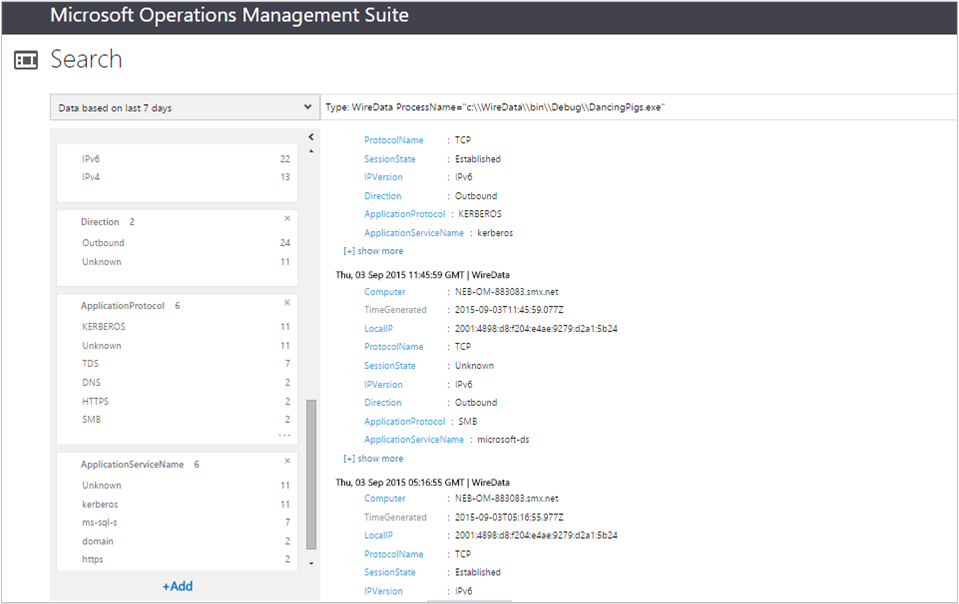
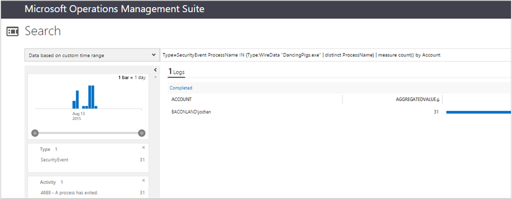

<properties
    pageTitle="Conectar a delineação de solução de dados a análise de Log | Microsoft Azure"
    description="Dados de fios são dados consolidados de rede e desempenho de computadores com agentes OMS, incluindo Operations Manager e agentes Windows conectados. Dados de rede são combinados com os dados de log para ajudá-lo a correlação de dados."
    services="log-analytics"
    documentationCenter=""
    authors="bandersmsft"
    manager="jwhit"
    editor=""/>

<tags
    ms.service="log-analytics"
    ms.workload="na"
    ms.tgt_pltfrm="na"
    ms.devlang="na"
    ms.topic="article"
    ms.date="08/11/2016"
    ms.author="banders"/>

# <a name="wire-data-solution-in-log-analytics"></a>Conectar a delineação de solução de dados a análise de Log

Dados de fios são dados consolidados de rede e desempenho de computadores com agentes OMS, incluindo Operations Manager e agentes Windows conectados. Dados de rede são combinados com os dados de log para ajudá-lo a correlação de dados. Agentes OMS instalados em computadores em seus dados de rede IT infraestrutura monitor enviados e recebidas desses computadores para níveis de rede 2-3 no [modelo OSI](https://en.wikipedia.org/wiki/OSI_model) , incluindo os diversos protocolos e portas usadas.

>[AZURE.NOTE] A solução fios de dados não está disponível atualmente a ser adicionado a espaços de trabalho. Os clientes que já têm a solução de dados de fios habilitada podem continuar a usar a solução de dados de fios.

Por padrão, o OMS coleta dados registrados para CPU, memória, disco e dados de desempenho de rede de contadores integrados do Windows. Rede e outro conjunto de dados é feito em tempo real para cada agente, incluindo sub-redes e protocolos do nível de aplicativo estão sendo usados pelo computador. Você pode adicionar outros contadores de desempenho na página Configurações da guia de Logs.

Se você já utilizou [sFlow](http://www.sflow.org/) ou outro software com [protocolo de NetFlow da Cisco](http://www.cisco.com/c/en/us/products/collateral/ios-nx-os-software/ios-netflow/prod_white_paper0900aecd80406232.html), então as estatísticas e você verá a partir de dados de conexão de dados será familiares para você.

Alguns dos tipos de consultas de pesquisa de Log internos incluem:

- Agentes que fornecem dados de fios
- Endereço IP de fornecer dados de fios de agentes
- Comunicações de saída por endereços IP
- Número de bytes enviados por protocolos de aplicativo
- Número de bytes enviados por um serviço de aplicativo
- Bytes recebidos pelo protocolos diferentes
- Total de bytes enviados e recebidos por IP
- Endereços IP que se comunicar com agentes na sub-rede 10.0.0.0/8
- Latência média para conexões que foram medido confiável
- Processos de computador que iniciada ou recebeu tráfego de rede
- Quantidade de tráfego de rede para um processo

Quando você pesquisa usando conexão de dados, você pode filtrar e agrupar dados para exibir informações sobre os protocolos superiores e agentes superiores. Ou você pode examinar quando determinados computadores (endereços de MAC/endereços IP) comunicados uns com os outros, por quanto tempo, e a quantidade de dados foi enviada – basicamente, você vê metadados sobre o tráfego de rede, que é baseado em pesquisa.

No entanto, desde que estiver visualizando metadados, não é necessariamente útil para solução de problemas detalhada. Dados de fios em OMS não serão uma captura completa dos dados da rede. Portanto ele não se destina profunda nível de pacote de solução de problemas.
A vantagem de usar o agente, em comparação com outros métodos de coleção, é que você não precisa instalar eletrodomésticos, reconfigure as opções de rede ou executar configurações complicadas. Dados de fios são simplesmente baseada em agente – você instala o agente em um computador e ele irá monitorar seu próprio tráfego de rede. Outra vantagem é quando você quiser monitorar cargas de trabalho em execução em provedores de nuvem ou provedor de serviços de hospedagem ou Microsoft Azure, onde o usuário não pertence a camada de tecidos.

Em contraste, você não tem visibilidade completa do que ocorre na rede se você não instalar agentes em todos os computadores em sua infraestrutura de rede.

## <a name="installing-and-configuring-the-solution"></a>Instalando e configurando a solução
Use as informações a seguir para instalar e configurar a solução.

- A solução de dados de fios adquire dados de computadores que executam o Windows Server 2012 R2, Windows 8.1 e sistemas operacionais posteriores.
- Microsoft .NET Framework 4.0 ou posterior é necessário em computadores onde você deseja obter dados de fios de.
- Adicione a solução de fios dados ao seu espaço de trabalho OMS usando o processo descrito em [soluções de adicionar a análise de Log da Galeria de soluções](log-analytics-add-solutions.md).  Não há nenhuma configuração adicional necessária.
- Se desejar exibir dados de fios para uma solução específica, você precisará ter a solução que já foram adicionada ao seu espaço de trabalho do OMS.

## <a name="wire-data-data-collection-details"></a>Conectar a delineação detalhes de conjunto de dados de dados

Dados de fios coleta metadados sobre o tráfego de rede usando os agentes que você ativou.

A tabela a seguir mostra os métodos de coleta de dados e outros detalhes sobre como os dados são coletados para dados de fios.


| plataforma | Agente de direta | Agente do SCOM | Armazenamento do Azure | SCOM necessário? | Enviados via grupo de gerenciamento de dados do SCOM agente | frequência de conjunto |
|---|---|---|---|---|---|---|
|Windows (2012 R2 / 8.1 ou posterior)||||            || cada 1 minuto|


## <a name="combining-wire-data-with-other-solution-data"></a>Dados de fios de combinação com outros dados de solução

Dados retornados de consultas internas mostradas acima talvez seja interessantes por si só. No entanto, a utilidade dos dados de fios realizada quando você combina-lo com as informações de outras soluções de OMS. Por exemplo, você pode usar os dados de eventos de segurança coletados pela solução de segurança e auditoria e combine com dados de fios para procurar tentativas de logon de rede incomuns para processos nomeados.  Neste exemplo, você usaria os operadores em e DISTINCT ingressar pontos de dados em sua consulta de pesquisa.

Requisitos: Para poder usar o exemplo a seguir, você precisará ter a solução de segurança e auditoria instalada. No entanto, você pode usar dados de outras soluções para combinar com dados de fios para obter resultados semelhantes.

### <a name="to-combine-wire-data-with-security-events"></a>Combinar dados de fios com eventos de segurança

1. Na página Visão geral, clique no bloco de **WireData** .
2. Na lista de **Consultas WireData comuns**, clique em **Quantidade de tráfego de rede (em Bytes) pelo processo** para ver a lista de processos retornados.
    
3. Se a lista de processos é longa demais para exibir facilmente, você pode modificar a consulta de pesquisa para lembrar:

    ```
    Type WireData | measure count() by ProcessName | where AggregatedValue <40
    ```
    Mostrado no exemplo a seguir é um processo denominado DancingPigs.exe, que podem aparecer suspeito.
    

4. Usando os dados retornados em sua lista, clique em um processo nomeado. Neste exemplo, DancingPigs.exe foi clicado. Os resultados mostrados abaixo descrevem o tipo de tráfego de rede como comunicação de saída sobre diversos protocolos.
    

5. Como a solução de segurança e auditoria é instalada, você pode teste para os eventos de segurança que têm o mesmo valor do campo ProcessName modificando sua consulta de pesquisa usando os operadores de consulta de pesquisa em e DISTINCT. Você pode fazer isso, em seguida, quando os dados de fios e outros logs de solução têm valores no mesmo formato. Modificar a consulta de pesquisa para lembrar:

    ```
    Type=SecurityEvent ProcessName IN {Type:WireData "DancingPigs.exe" | distinct ProcessName}
    ```    

    
6. Nos resultados da acima, você verá que as informações da conta são mostradas. Agora você pode refinar sua consulta de pesquisa para descobrir quantas vezes a conta, mostrando dados de segurança e auditoria, foi usada pelo processo com uma consulta semelhante:        

    ```
    Type=SecurityEvent ProcessName IN {Type:WireData "DancingPigs.exe" | distinct ProcessName} | measure count() by Account
    ```

    


## <a name="next-steps"></a>Próximas etapas

- [Logs de pesquisa](log-analytics-log-searches.md) para exibir registros de pesquisa de dados de fios detalhadas.
- Ver [postar usando dados de fios no blog de pesquisa de Log de pacote de gerenciamento de operações de Dan](http://blogs.msdn.com/b/dmuscett/archive/2015/09/09/using-wire-data-in-operations-management-suite.aspx) com informações adicionais sobre a frequência dados são coletados e como você pode modificar propriedades do conjunto de agentes do Operations Manager.
