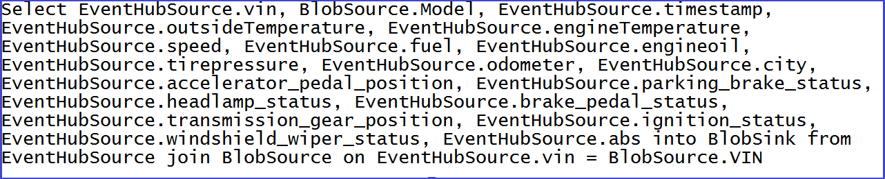
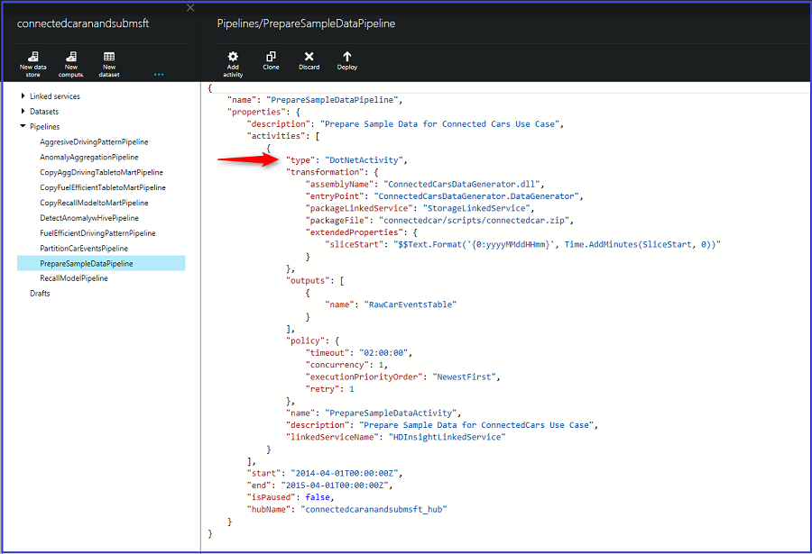
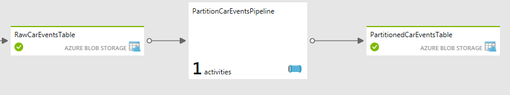
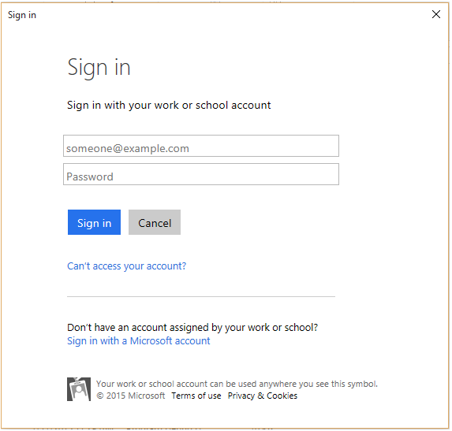
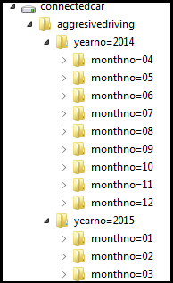
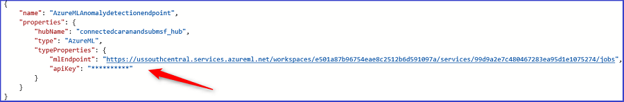

<properties 
    pageTitle="Guia estratégico de solução de análise de telemetria veículo: detalhamento da solução | Microsoft Azure" 
    description="Usar os recursos de inteligência de Cortana para obter ideias de previsão e em tempo real sobre integridade de um veículo e conduzir hábitos." 
    services="machine-learning" 
    documentationCenter="" 
    authors="bradsev" 
    manager="jhubbard" 
    editor="cgronlun" />

<tags 
    ms.service="machine-learning" 
    ms.workload="data-services" 
    ms.tgt_pltfrm="na" 
    ms.devlang="na" 
    ms.topic="article" 
    ms.date="09/12/2016" 
    ms.author="bradsev" />

# Guia estratégico de solução de análise de telemetria veículo: detalhamento da solução

Esse links de **menu** para as seções deste manual: 

[AZURE.INCLUDE [cap-vehicle-telemetry-playbook-selector](../../includes/cap-vehicle-telemetry-playbook-selector.md)]

Drills esta seção para baixo em cada um dos estágios descritos na arquitetura de solução com instruções e ponteiros para personalização. 

## Fontes de dados

A solução usa duas fontes de dados diferentes:

- **sinais de veículo simulado e dataset diagnóstico** e 
- **Catálogo de veículo**

Um simulador de telematics veículo está incluído como parte da solução. Ele emite informações de diagnóstico e sinaliza correspondente para o estado do veículo e o padrão de carro em um determinado ponto no tempo. Clique em [Veículo Telemáticas da Simulator](http://go.microsoft.com/fwlink/?LinkId=717075) para baixar a **Veículo Telemáticas da Simulator solução do Visual Studio** para personalizações de acordo com suas necessidades. O catálogo de veículo contém um conjunto de dados de referência com um VIN para mapeamento de modelo.

*Figura 2 – veículo Telematics Simulator*

Este é um conjunto de dados formatados como JSON que contém o esquema a seguir.

Coluna | Descrição | Valores 
 ------- | ----------- | --------- 
VIN | Número de identificação gerado aleatoriamente veículo | Isso é obtido de uma lista mestra de 10.000 números de identificação de veículo gerado aleatoriamente.
Temperatura externa | A temperatura externa onde o veículo está orientando | Número gerado aleatoriamente de 0-100
Temperatura de mecanismo | A temperatura de mecanismo do veículo | Número gerado aleatoriamente de 0-500
Velocidade | A velocidade de mecanismo em que o veículo está orientando | Número gerado aleatoriamente de 0-100
Combustível | O nível de combustível do veículo | Número gerado aleatoriamente de 0-100 (indica a porcentagem de nível de combustível)
EngineOil | O nível de petróleo mecanismo do veículo | Número gerado aleatoriamente de 0-100 (indica a porcentagem do nível de mecanismo petróleo)
Pneus pressão | A pressão pneus do veículo | Número gerado aleatoriamente de 0-50 (indica a porcentagem do nível de pressão pneus)
Odômetro | A leitura do odômetro do veículo | Número gerado aleatoriamente de 0-200000
Accelerator_pedal_position | A posição de pedais accelerator do veículo | Número gerado aleatoriamente de 0-100 (indica a porcentagem do nível de aceleração)
Parking_brake_status | Indica se o veículo é estacionado ou não | VERDADEIRO ou falso
Headlamp_status | Indica onde a lâmpada frontal no ou não | VERDADEIRO ou falso
Brake_pedal_status | Indica se o pedal de freio é pressionado ou não | VERDADEIRO ou falso
Transmission_gear_position | A posição de engrenagem de transmissão do veículo | Estados: primeiro, segundo, terceiro, quarta, quinta, sexta, sétima, oitavo
Ignition_status | Indica se o veículo está em execução ou parado | VERDADEIRO ou falso
Windshield_wiper_status | Indica se o wiper para-brisa está habilitada ou não | VERDADEIRO ou falso
ABS | Indica se ABS está ativada ou não | VERDADEIRO ou falso
Carimbo de hora | O carimbo de hora quando o ponto de dados é criado | Data
Cidade | O local do veículo | 4 cidades nesta solução: Bellevue, Redmond, Sammamish, Seattle

O conjunto de dados de referência do modelo de veículo contém VIN para o mapeamento de modelo. 

VIN | Modelo |
--------------|------------------
FHL3O1SA4IEHB4WU1 | Sedã |
8J0U8XCPRGW4Z3NQE | Híbrido |
WORG68Z2PLTNZDBI7 | Família Saloon |
JTHMYHQTEPP4WBMRN | Sedã |
W9FTHG27LZN1YWO0Y | Híbrido |
MHTP9N792PHK08WJM | Família Saloon |
EI4QXI2AXVQQING4I | Sedã |
5KKR2VB4WHQH97PF8 | Híbrido |
W9NSZ423XZHAONYXB | Família Saloon |
26WJSGHX4MA5ROHNL | Conversíveis |
GHLUB6ONKMOSI7E77 | Caminhonetes |
9C2RHVRVLMEJDBXLP | Carro compacto |
BRNHVMZOUJ6EOCP32 | GRANDE pequeno |
VCYVW0WUZNBTM594J | Carro esportivo |
HNVCE6YFZSA5M82NY | GRANDE médio |
4R30FOR7NUOBL05GJ | Caminhonetes |
WYNIIY42VKV6OQS1J | GRANDE grande |
8Y5QKG27QET1RBK7I | GRANDE grande |
DF6OX2WSRA6511BVG | Coupe |
Z2EOZWZBXAEW3E60T | Sedã |
M4TV6IEALD5QDS3IR | Híbrido |
VHRA1Y2TGTA84F00H | Família Saloon |
R0JAUHT1L1R3BIKI0 | Sedã |
9230C202Z60XX84AU | Híbrido |
T8DNDN5UDCWL7M72H | Família Saloon |
4WPYRUZII5YV7YA42 | Sedã |
D1ZVY26UV2BFGHZNO | Híbrido |
XUF99EW9OIQOMV7Q7 | Família Saloon
8OMCL3LGI7XNCC21U | Conversíveis |
…….  |   |

### Para gerar simulados dados
1.  Para baixar o pacote de simulator de dados, clique na seta no canto superior direito do nó veículo Telematics Simulator. Salve e extrair os arquivos localmente em seu computador. *Figura 3 – esquema de solução de análise de telemetria veículo*

2.  Em sua máquina local, vá para a pasta onde você extraídos do pacote de veículo Telematics Simulator. *Figura 4 – pasta veículo Telemáticas da Simulator*

3.  Execute o aplicativo **CarEventGenerator.exe**.

### Referências

[Solução do veículo Telematics Simulator Visual Studio](http://go.microsoft.com/fwlink/?LinkId=717075) 

[Hub de evento Azure](https://azure.microsoft.com/services/event-hubs/)

[Fábrica de dados do Azure](https://azure.microsoft.com/documentation/learning-paths/data-factory/)

## Inclusão
Combinações de Hubs de evento do Azure, a análise de fluxo e fábrica de dados são aproveitadas para incluir os sinais de veículo, os eventos de diagnósticos e em tempo real e a análise de lote. Todos esses componentes sejam criados e configurados como parte da implantação da solução. 

### Análise em tempo real
Os eventos gerados pelo Simulator Telemáticas da veículo são publicados no Hub do evento usando o SDK do Hub de evento. O trabalho de análise de fluxo consome esses eventos do Hub evento e processa os dados em tempo real para analisar a integridade de um veículo. 

 

*Figura 5 - painel de controle do Hub de evento*

 

*Figura 6 - trabalho de análise de fluxo, processamento de dados*

O trabalho de análise de fluxo;

- consome dados de Hub do evento 
- executa uma junção com os dados de referência para mapear o veículo VIN para o modelo correspondente 
- persisti-los para o armazenamento de blob do Microsoft Azure para análise avançada de lote. 

A seguinte consulta de análise de fluxo é usada para manter os dados para o armazenamento de blob do Microsoft Azure. 

 

*Figura 7 - query de trabalho de análise de fluxo para inclusão de dados*

### Análise de lote
Nós também estão gerando um volume adicional de sinais de veículo simulado e conjunto de dados de diagnóstico para análise de lote mais elaborado. Isso é necessário para garantir um volume de dados de representante bons para processamento em lotes. Para essa finalidade, estamos usando um pipeline denominado "PrepareSampleDataPipeline" do fluxo de trabalho de fábrica de dados do Azure para gerar registros um ano de sinais de veículo simulado e dataset diagnóstico. Clique em [atividade personalizada de fábrica de dados](http://go.microsoft.com/fwlink/?LinkId=717077) para baixar a atividade de DotNet dados fábrica personalizada solução do Visual Studio para personalizações de acordo com suas necessidades. 

 

*Figura 8 - preparar dados de exemplo de fluxo de trabalho de processamento em lotes*

O pipeline consiste em um .net AAD personalizado atividade, mostrar aqui:

 

*Figura 9 - PrepareSampleDataPipeline*

Depois que o pipeline executa com êxito e conjunto de dados de "RawCarEventsTable" está marcado como "Pronto", diagnóstico e de um ano patrimônio dos sinais de veículo simulada dados são produzidos. Você ver na seguinte pasta e arquivo criado em sua conta de armazenamento sob o recipiente "connectedcar":

 

*Figura 10 - saída PrepareSampleDataPipeline*

### Referências

[Azure SDK do Hub de evento para inclusão de fluxo](../event-hubs/event-hubs-csharp-ephcs-getstarted.md)

[Recursos de movimentação de dados do Azure Data Factory](../data-factory/data-factory-data-movement-activities.md)
[Azure dados fábrica DotNet atividade](../data-factory/data-factory-use-custom-activities.md)

[Solução do visual studio de atividade de dados fábrica DotNet Azure para preparar dados de exemplo](http://go.microsoft.com/fwlink/?LinkId=717077) 

## Partição dataset

O sinais de veículo semiestruturados bruto e o diagnóstico dataset são particionados na etapa de preparação de dados em um formato de ano/mês. Essa divisão promove a consulta mais eficiente e armazenamento de longo prazo scalable habilitando falhas sobre de conta de um blob para o próximo conforme a primeira conta é preenchida. 

>[AZURE.NOTE] Esta etapa na solução é aplicável somente para processamento em lotes.

Entrada e saída gerenciamento de dados de dados:

- Os **dados de saída** (rotulada *PartitionedCarEventsTable*) é sejam mantidas por um longo período de tempo, como o formulário básico / "rawest" de dados na do cliente "Lucerne de dados". 
- Os **dados de entrada** para esse pipeline normalmente seria descartada como os dados de saída tem total fidelidade à entrada: basta ele está armazenado (particionados) melhor para uso posterior.

*Figura 11 – fluxo de trabalho de partição carro eventos*

Os dados processados são particionados usando uma atividade de seção HDInsight em "PartitionCarEventsPipeline". Os dados de exemplo gerados na etapa 1 para um ano são divididos pela ano/mês. As partições são usadas para gerar sinais de veículo e dados de diagnóstico para cada mês (totais 12 partições) de um ano. 

*Figura 12 - PartitionCarEventsPipeline*

O seguinte script de seção, denominado "partitioncarevents.hql", é usado para a partição e está localizado na pasta "\demo\src\connectedcar\scripts" do zip baixado. 

    SET hive.exec.dynamic.partition=true;
    SET hive.exec.dynamic.partition.mode = nonstrict;
    set hive.cli.print.header=true;

    DROP TABLE IF EXISTS RawCarEvents; 
    CREATE EXTERNAL TABLE RawCarEvents 
    (
                vin                             string,
                model                           string,
                timestamp                       string,
                outsidetemperature              string,
                enginetemperature               string,
                speed                           string,
                fuel                            string,
                engineoil                       string,
                tirepressure                    string,
                odometer                        string,
                city                            string,
                accelerator_pedal_position      string,
                parking_brake_status            string,
                headlamp_status                 string,
                brake_pedal_status              string,
                transmission_gear_position      string,
                ignition_status                 string,
                windshield_wiper_status         string,
                abs                             string,
                gendate                         string
                
    ) ROW FORMAT DELIMITED FIELDS TERMINATED BY ',' LINES TERMINATED BY '10' STORED AS TEXTFILE LOCATION '${hiveconf:RAWINPUT}'; 

    DROP TABLE IF EXISTS PartitionedCarEvents; 
    CREATE EXTERNAL TABLE PartitionedCarEvents 
    (
                vin                             string,
                model                           string,
                timestamp                       string,
                outsidetemperature              string,
                enginetemperature               string,
                speed                           string,
                fuel                            string,
                engineoil                       string,
                tirepressure                    string,
                odometer                        string,
                city                            string,
                accelerator_pedal_position      string,
                parking_brake_status            string,
                headlamp_status                 string,
                brake_pedal_status              string,
                transmission_gear_position      string,
                ignition_status                 string,
                windshield_wiper_status         string,
                abs                             string,
                gendate                         string
    ) partitioned by (YearNo int, MonthNo int) ROW FORMAT DELIMITED FIELDS TERMINATED BY ',' LINES TERMINATED BY '10' STORED AS TEXTFILE LOCATION '${hiveconf:PARTITIONEDOUTPUT}';

    DROP TABLE IF EXISTS Stage_RawCarEvents; 
    CREATE TABLE IF NOT EXISTS Stage_RawCarEvents 
    (
                vin                             string,
                model                           string,
                timestamp                       string,
                outsidetemperature              string,
                enginetemperature               string,
                speed                           string,
                fuel                            string,
                engineoil                       string,
                tirepressure                    string,
                odometer                        string,
                city                            string,
                accelerator_pedal_position      string,
                parking_brake_status            string,
                headlamp_status                 string,
                brake_pedal_status              string,
                transmission_gear_position      string,
                ignition_status                 string,
                windshield_wiper_status         string,
                abs                             string,
                gendate                         string,
                YearNo                          int,
                MonthNo                         int) 
    ROW FORMAT delimited fields terminated by ',' LINES TERMINATED BY '10';

    INSERT OVERWRITE TABLE Stage_RawCarEvents
    SELECT
        vin,            
        model,
        timestamp,
        outsidetemperature,
        enginetemperature,
        speed,
        fuel,
        engineoil,
        tirepressure,
        odometer,
        city,
        accelerator_pedal_position,
        parking_brake_status,
        headlamp_status,
        brake_pedal_status,
        transmission_gear_position,
        ignition_status,
        windshield_wiper_status,
        abs,
        gendate,
        Year(gendate),
        Month(gendate)

    FROM RawCarEvents WHERE Year(gendate) = ${hiveconf:Year} AND Month(gendate) = ${hiveconf:Month}; 

    INSERT OVERWRITE TABLE PartitionedCarEvents PARTITION(YearNo, MonthNo) 
    SELECT
        vin,            
        model,
        timestamp,
        outsidetemperature,
        enginetemperature,
        speed,
        fuel,
        engineoil,
        tirepressure,
        odometer,
        city,
        accelerator_pedal_position,
        parking_brake_status,
        headlamp_status,
        brake_pedal_status,
        transmission_gear_position,
        ignition_status,
        windshield_wiper_status,
        abs,
        gendate,
        YearNo,
        MonthNo
    FROM Stage_RawCarEvents WHERE YearNo = ${hiveconf:Year} AND MonthNo = ${hiveconf:Month};

*Figura 13 - PartitionConnectedCarEvents seção Script*

Depois que o pipeline é executado com êxito, você vê as seguintes partições geradas na sua conta de armazenamento sob o recipiente "connectedcar".

*Figura 14 - particionada de saída*

Os dados agora é otimizado, é mais gerenciável e pronto para processamento posterior para obter ideias de lote avançada. 

## Análise de dados

Nesta seção, você verá como combinar Azure fluxo Analytics, aprendizado de máquina do Azure, fábrica de dados do Azure e Azurehdinsight para rich análise avançada sobre integridade de um veículo e conduzir hábitos. Há três subseções aqui:

1.  **Aprendizado de máquina**: Esta subseção contém informações sobre a experiência de detecção de anomalias que foram usados nesta solução prever veículos exigindo a manutenção de manutenção e veículos exigindo recupera devido a problemas de segurança.
2.  **Análise em tempo real**: Esta subseção contém informações sobre a análise em tempo real usando a linguagem de consulta do fluxo de análise e operacionalização a experiência de aprendizado de máquina em tempo real usando um aplicativo personalizado.
3.  **Análise de lote**: Esta subseção contém informações sobre a transformação e processamento de dados em lotes usando Azurehdinsight e aprendizado de máquina do Azure operacionalizada pela fábrica de dados do Azure.

### Aprendizado de máquina

Veja nosso objetivo é prever veículos que requerem manutenção ou cancelamento com base em determinadas estatísticas de integridade. Podemos fazer as seguintes suposições

- Se um dos três condições a seguir forem VERDADEIRO, veículos requerem **manutenção manutenção**:
    - Pneus pressão está baixa
    - Nível de petróleo mecanismo está baixo
    - Mecanismo de temperatura está alto

- Se uma das seguintes condições forem verdadeira, veículos podem ter um **problema de segurança** e exigir **cancelamento**:
    - Temperatura de mecanismo é alta, mas temperatura externa está baixa
    - Temperatura de mecanismo está baixa, mas fora temperatura está alta

Com base em requisitos de anterior, criamos dois modelos separados para detectar problemas, uma para a detecção de manutenção de veículo e outra para a detecção de cancelamento de veículo. Em ambos os esses modelos, o algoritmo de análise de componente Principal (PCA) interna é usado para detecção de anomalias. 

**Modelo de detecção de manutenção**

Se um dos três indicadores pneus pressão, petróleo mecanismo ou temperatura de mecanismo - satisfizer seu respectiva condição, o modelo de detecção de manutenção relatórios uma anomalia. Como resultado, só precisamos considerar estes três variáveis na criação do modelo. Em nosso experimento no aprendizado de máquina do Azure, primeiro usamos um módulo de **Selecionar colunas no conjunto de dados** para extrair estas três variáveis. Em seguida, usamos o módulo de detecção de anomalias baseado em PCA para criar o modelo de detecção de anomalias. 

Análise de componente principal (PCA) é uma técnica estabelecida em aprendizado de máquina que pode ser aplicado à seleção de recursos, classificação e detecção de anomalias. PCA converte um conjunto de maiusculas e minúsculas contendo possivelmente correlacionadas variáveis, em um conjunto de valores chamados componentes principais. A ideia chave de modelagem baseado em PCA é dados de projeto em um espaço inferior dimensionais para que os recursos e problemas podem ser identificados com mais facilidade.
 
Para cada nova entrada para o modelo de detecção, o detector anomalia primeiro computa sua projeção na eigenvectors e depois calcula o erro de reconstrução normalizado. Este erro normalizado é a pontuação de anomalia. Quanto maior o erro, mais anômalos a instância é. 

No problema de detecção de manutenção, cada registro pode ser considerado como um ponto em um espaço de 3-dimensional definido pelo pneus pressão, petróleo mecanismo e temperatura de mecanismo coordenadas. Para capturar esses problemas, podemos projetar os dados originais no espaço de 3-dimensional para um espaço 2 dimensional usando PCA. Assim, podemos definir o parâmetro número de componentes para usar em PCA 2. Este parâmetro desempenha um papel importante na aplicação de detecção de anomalias baseado em PCA. Depois de projeção dados usando PCA, podemos identificar esses problemas mais facilmente.

**Cancelar o modelo de detecção de anomalia** O modelo de detecção de anomalias de cancelamento, podemos usar selecionar colunas no conjunto de dados e baseado em PCA anomalia módulos de detecção de maneira similar. Especificamente, podemos primeiro extrair três variáveis - mecanismo temperatura, temperatura externa e velocidade - usar o módulo de **Selecionar colunas no conjunto de dados** . Nós também incluir a variável de velocidade desde que a temperatura de mecanismo normalmente é correlacionada à velocidade. Avançar usamos módulo de detecção de anomalias baseado em PCA para projetar os dados de espaço 3 dimensionais em um espaço 2 dimensionais. Os critérios de cancelamento são satisfeitos e então o veículo requer o cancelamento quando temperatura de mecanismo e temperatura externa altamente negativamente estão correlacionadas. Usando o algoritmo de detecção de anomalias baseado em PCA, podemos capturar os problemas depois de executar PCA. 

Quando o modelo de treinamento, precisamos usar dados normais, que não exige manutenção ou cancelamento como dados de entrada para treinar o modelo de detecção de anomalias baseado em PCA. O experimento pontuação, podemos usar o modelo de detecção de anomalia treinamento para detectar estando ou não o veículo requer manutenção ou cancelamento. 

### Análise em tempo real

A seguinte consulta SQL de análise de fluxo é usada para obter a média de todos os parâmetros de veículo importantes como velocidade de veículo nível de combustível, temperatura de mecanismo, leitura do odômetro, pneus pressão, nível de petróleo mecanismo e outras pessoas. As médias são usadas para detectar problemas, emitir alertas e determinar as condições de saúde geral de veículos operados na região específico e correlação para demografia. 

Figura 15 – query de análise de fluxo para processamento em tempo real

Todas as médias são calculadas ao longo de uma TumblingWindow de 3 segundos. Estamos usando TubmlingWindow nesse caso como podemos exigem intervalos de tempo não sobrepostas e contíguos. 

Para saber mais sobre todos os recursos de "Janelas" no Azure fluxo análise, clique em [janelas (análise de fluxo de Azure)](https://msdn.microsoft.com/library/azure/dn835019.aspx).

**Previsão em tempo real**

Um aplicativo é incluído como parte da solução tornem operacional o modelo de aprendizado de máquina em tempo real. Este aplicativo chamado "RealTimeDashboardApp" é criado e configurado como parte da implantação da solução. O aplicativo executa o seguinte:

1.  Ouve uma instância de Hub de evento, onde a análise de fluxo está publicando os eventos em um padrão continuamente. *Figura 16 – consulta de análise de fluxo para publicar os dados em uma saída instância do Hub de evento* 

2.  Para cada evento que recebe este aplicativo: 

    - Processa os dados usando o ponto de extremidade de pontuação de solicitação-resposta de aprendizado de máquina (RR). O ponto de extremidade de RR é automaticamente publicado como parte da implantação.
    - A saída de RR é publicada em um conjunto de dados do PowerBI usando o envio APIs.

Esse padrão também se aplica a cenários em que você deseja integrar um aplicativo de linha de negócios (LoB) com o fluxo de análise em tempo real, para cenários como mensagens, notificações e alertas.

Clique em [Baixar RealtimeDashboardApp](http://go.microsoft.com/fwlink/?LinkId=717078) para baixar a solução RealtimeDashboardApp Visual Studio para personalizações. 

**Para executar o aplicativo de painel em tempo real**

1.  Clique no nó PowerBI no modo de exibição de diagrama e clique no link "Baixar o aplicativo do painel em tempo real" no painel Propriedades. *Figura 17 – instruções de configuração do painel de PowerBI*
2.  Extrair e salvar localmente  *Figura 18 – RealtimeDashboardApp pasta*
3.  Executar o aplicativo RealtimeDashboardApp.exe
4.  Fornecer credenciais válidas do Power BI, entrar e clique em aceitar  

*Figura 19 – RealtimeDashboardApp: Entrar no PowerBI*

>[AZURE.NOTE] Se você quiser liberar o conjunto de dados PowerBI, execute o RealtimeDashboardApp com o parâmetro "flushdata": 

    RealtimeDashboardApp.exe -flushdata

### Análise de lote

O objetivo aqui é mostrar como Contoso Motors utiliza os recursos de computação Azure aproveitar grandes dados para obter ideias avançadas em conduzir padrão, o comportamento de uso e integridade de um veículo. Isso possibilita:

- Melhorar a experiência do cliente e torná-lo mais barato, fornecendo ideias sobre conduzir hábitos e comportamentos de carro eficiente de combustível
- Conheça proativamente clientes e seus padrões de carro regem decisões de negócios e fornecer a melhor na classe produtos e serviços

Nesta solução, pretendemos as seguintes métricas:

1.  **Comportamento de carro rigorosas**: identifica a tendência dos modelos, locais, determinante condições e período do ano para obter ideias sobre padrões de carro rigorosas. Contoso Motors pode usar esses ideias para campanhas de marketing, conduzir a novos recursos personalizados e seguros baseados em uso.
2.  **O comportamento de carro eficiente de combustível**: identifica a tendência dos modelos, locais, determinante condições e período do ano para obter ideias sobre padrões de carro eficiente de combustível. Contoso Motors pode usar esses ideias para campanhas de marketing conduzir a novos recursos e relatórios proativos para os drivers para custo efetiva e ambiente hábitos carro amigáveis. 
3.  **Cancelar modelos**: identifica modelos exigindo recupera por operacionalização a experiência de aprendizado de máquina detecção de anomalia

Vamos dar uma olhada em detalhes de cada um dos seguintes métricas,

**Padrão de carro rigorosas**

Os dados de diagnósticos e sinais de veículo particionada são processados no pipeline denominado "AggresiveDrivingPatternPipeline" usando a seção para determinar os modelos, local, veículos, determinantes condições e outros parâmetros que apresenta rigorosas padrão de carro.

 
*Figura 20 – agressivo dirigir o fluxo de trabalho padrão*

O script de seção denominado "aggresivedriving.hql" usados para analisar rigorosas padrão de condição carro está localizado na pasta "\demo\src\connectedcar\scripts" do zip baixado. 

    DROP TABLE IF EXISTS PartitionedCarEvents; 
    CREATE EXTERNAL TABLE PartitionedCarEvents
    (
                vin                             string,
                model                           string,
                timestamp                       string,
                outsidetemperature              string,
                enginetemperature               string,
                speed                           string,
                fuel                            string,
                engineoil                       string,
                tirepressure                    string,
                odometer                        string,
                city                            string,
                accelerator_pedal_position      string,
                parking_brake_status            string,
                headlamp_status                 string,
                brake_pedal_status              string,
                transmission_gear_position      string,
                ignition_status                 string,
                windshield_wiper_status         string,
                abs                             string,
                gendate                         string
                                
    ) ROW FORMAT DELIMITED FIELDS TERMINATED BY ',' LINES TERMINATED BY '10' STORED AS TEXTFILE LOCATION '${hiveconf:PARTITIONEDINPUT}';

    DROP TABLE IF EXISTS CarEventsAggresive; 
    CREATE EXTERNAL TABLE CarEventsAggresive
    (
                vin                         string, 
                model                       string,
                timestamp                   string,
                city                        string,
                speed                       string,
                transmission_gear_position  string,
                brake_pedal_status          string,
                Year                        string,
                Month                       string
                                
    ) ROW FORMAT DELIMITED FIELDS TERMINATED BY ',' LINES TERMINATED BY '10' STORED AS TEXTFILE LOCATION '${hiveconf:AGGRESIVEOUTPUT}';

    INSERT OVERWRITE TABLE CarEventsAggresive
    select
    vin,
    model,
    timestamp,
    city,
    speed,
    transmission_gear_position,
    brake_pedal_status,
    "${hiveconf:Year}" as Year,
    "${hiveconf:Month}" as Month
    from PartitionedCarEvents
    where transmission_gear_position IN ('fourth', 'fifth', 'sixth', 'seventh', 'eight') AND brake_pedal_status = '1' AND speed >= '50'

*Figura 21 – agressivo conduzir a consulta de seção padrão*

Ele usa a combinação de transmissão engrenagem posição do veículo, status pedais do freio e velocidade para detectar precipitado rigorosas comportamento carro com base no modelo padrão em alta velocidade. 

Depois que o pipeline é executado com êxito, você vê as seguintes partições geradas na sua conta de armazenamento sob o recipiente "connectedcar".

 

*Figura 22 – AggressiveDrivingPatternPipeline saída*

**Padrão de carro eficiente de combustível**

Os dados de diagnósticos e sinais de veículo particionada são processados no pipeline denominado "FuelEfficientDrivingPatternPipeline". Seção é usada para determinar os modelos, local, veículos, condições determinantes e outras propriedades que apresentam combustível eficiente por padrão.

 

*Figura 23 – combustível eficiente determinante padrão fluxo de trabalho*

O script de seção denominado "fuelefficientdriving.hql" usados para analisar rigorosas padrão de condição determinante está localizado na pasta "\demo\src\connectedcar\scripts" do zip baixado. 

    DROP TABLE IF EXISTS PartitionedCarEvents; 
    CREATE EXTERNAL TABLE PartitionedCarEvents
    (
                vin                             string,
                model                           string,
                timestamp                       string,
                outsidetemperature              string,
                enginetemperature               string,
                speed                           string,
                fuel                            string,
                engineoil                       string,
                tirepressure                    string,
                odometer                        string,
                city                            string,
                accelerator_pedal_position      string,
                parking_brake_status            string,
                headlamp_status                 string,
                brake_pedal_status              string,
                transmission_gear_position      string,
                ignition_status                 string,
                windshield_wiper_status         string,
                abs                             string,
                gendate                         string
                                
    ) ROW FORMAT DELIMITED FIELDS TERMINATED BY ',' LINES TERMINATED BY '10' STORED AS TEXTFILE LOCATION '${hiveconf:PARTITIONEDINPUT}';

    DROP TABLE IF EXISTS FuelEfficientDriving; 
    CREATE EXTERNAL TABLE FuelEfficientDriving
    (
                vin                         string, 
                model                       string,
                city                        string,
                speed                       string,
                transmission_gear_position  string,                
                brake_pedal_status          string,            
                accelerator_pedal_position  string,                             
                Year                        string,
                Month                       string
                                
    ) ROW FORMAT DELIMITED FIELDS TERMINATED BY ',' LINES TERMINATED BY '10' STORED AS TEXTFILE LOCATION '${hiveconf:FUELEFFICIENTOUTPUT}';

    INSERT OVERWRITE TABLE FuelEfficientDriving
    select
    vin,
    model,
    city,
    speed,
    transmission_gear_position,
    brake_pedal_status,
    accelerator_pedal_position,
    "${hiveconf:Year}" as Year,
    "${hiveconf:Month}" as Month
    from PartitionedCarEvents
    where transmission_gear_position IN ('fourth', 'fifth', 'sixth', 'seventh', 'eight') AND parking_brake_status = '0' AND brake_pedal_status = '0' AND speed <= '60' AND accelerator_pedal_position >= '50'

*Figura 24 – consulta determinante eficiente de seção padrão de combustível*

Ele usa a combinação de posição de engrenagem de transmissão do veículo, status pedais do freio, a velocidade e aceleração pedal posição para detectar comportamento determinante eficiente combustível com base em aceleração, modelo e aceleram padrões. 

Depois que o pipeline é executado com êxito, você vê as seguintes partições geradas na sua conta de armazenamento sob o recipiente "connectedcar".

 

*Figura 25 – FuelEfficientDrivingPatternPipeline saída*

**Cancelar previsões**

A experimento de aprendizado de máquina está provisionada e publicada como um serviço da web como parte da implantação da solução. O lote de ponto de extremidade de pontuação é utilizado neste fluxo de trabalho registrado como um serviço de fábrica vinculada de dados e operacionalizada usando o lote de fábrica dados pontuação atividade.

 

*Figura 26 – ponto de extremidade de aprendizado de máquina registrado como um serviço vinculado em fábrica de dados*

Serviço de vinculada registrado é usado no DetectAnomalyPipeline para pontuação os dados usando o modelo de detecção de anomalias. 

 

*Figura 27 – atividade pontuação de lote de aprendizado de máquina Azure em fábrica de dados* 

Existem algumas etapas executadas nesse pipeline de preparação de dados para que ele pode ser operacionalizado com o lote de pontuação de serviço web. 

 

*Figura 28 – DetectAnomalyPipeline para prever veículos exigindo recupera* 

Depois que a pontuação é concluída, uma atividade de HDInsight é usada para processar e agregar os dados que são categorizados como anomalias pelo modelo com uma pontuação de probabilidade de 0,60 ou superior.

    DROP TABLE IF EXISTS CarEventsAnomaly; 
    CREATE EXTERNAL TABLE CarEventsAnomaly 
    (
                vin                         string,
                model                       string,
                gendate                     string,
                outsidetemperature          string,
                enginetemperature           string,
                speed                       string,
                fuel                        string,
                engineoil                   string,
                tirepressure                string,
                odometer                    string,
                city                        string,
                accelerator_pedal_position  string,
                parking_brake_status        string,
                headlamp_status             string,
                brake_pedal_status          string,
                transmission_gear_position  string,
                ignition_status             string,
                windshield_wiper_status     string,
                abs                         string,
                maintenanceLabel            string,
                maintenanceProbability      string,
                RecallLabel                 string,
                RecallProbability           string
                                
    ) ROW FORMAT DELIMITED FIELDS TERMINATED BY ',' LINES TERMINATED BY '10' STORED AS TEXTFILE LOCATION '${hiveconf:ANOMALYOUTPUT}';

    DROP TABLE IF EXISTS RecallModel; 
    CREATE EXTERNAL TABLE RecallModel 
    (

                vin                         string,
                model                       string,
                city                        string,
                outsidetemperature          string,
                enginetemperature           string,
                speed                       string,
                Year                        string,
                Month                       string              
                                
    ) ROW FORMAT DELIMITED FIELDS TERMINATED BY ',' LINES TERMINATED BY '10' STORED AS TEXTFILE LOCATION '${hiveconf:RECALLMODELOUTPUT}';

    INSERT OVERWRITE TABLE RecallModel
    select
    vin,
    model,
    city,
    outsidetemperature,
    enginetemperature,
    speed,
    "${hiveconf:Year}" as Year,
    "${hiveconf:Month}" as Month
    from CarEventsAnomaly
    where RecallLabel = '1' AND RecallProbability >= '0.60'

Depois que o pipeline é executado com êxito, você vê as seguintes partições geradas na sua conta de armazenamento sob o recipiente "connectedcar".

 

*Figura 30 – Figura 30 – DetectAnomalyPipeline saída*

## Publicar

### Análise em tempo real

Uma das consultas no trabalho de análise de fluxo publica os eventos para uma saída instância do Hub de evento. 

*Figura 31 – fluxo de trabalho de análise publica uma saída instância do Hub de evento*

*Figura 32 – fluxo análise da consulta para publicar a saída da instância do Hub de evento*

Este fluxo de eventos é consumido pela RealTimeDashboardApp incluído na solução. Este aplicativo utiliza o serviço da web de aprendizado de máquina solicitação-resposta de pontuação em tempo real e publica os dados resultantes para um conjunto de dados de PowerBI para consumo. 

### Análise de lote

Os resultados do lote e processamento em tempo real são publicados as tabelas de banco de dados do Azure SQL para consumo. O servidor do SQL Azure, banco de dados e as tabelas são criadas automaticamente como parte do script de instalação. 

*Figura 33 – copiar resultados ao fluxo de trabalho de armazém de dados de processamento em lotes*

*Figura 34 – fluxo de trabalho de análise publica armazém de dados*

*Figura 35 – definindo no trabalho de análise de fluxo de armazém de dados*

## Consumir

Power BI dá esta solução um painel rich dados em tempo real e visualizações de análise de previsão. 

Clique aqui para obter instruções detalhadas sobre como configurar os relatórios de PowerBI e o painel de controle. No painel final tem esta aparência:

*Figura 36 - PowerBI Dashboard*

## Resumo

Este documento contém um detalhamento da solução veículo telemetria Analytics. Isso apresenta um padrão de arquitetura lambda para em tempo real e análise com previsões e ações de lote. Esse padrão se aplica a uma ampla variedade de casos de uso que exigem caminho quente (em tempo real) e a análise de caminho fria (em lotes). 
