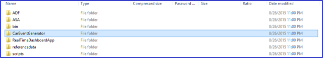
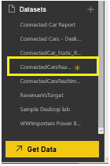
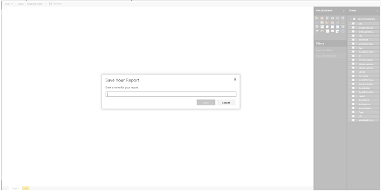
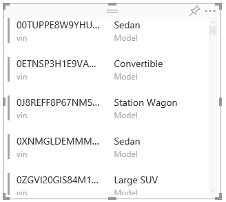
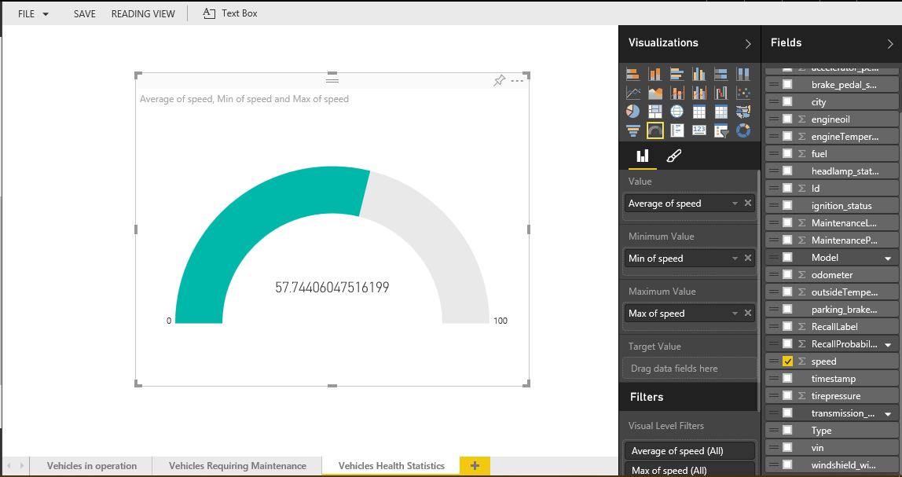
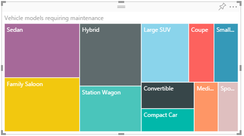
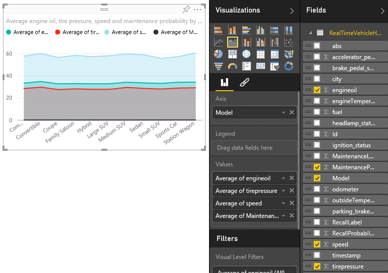
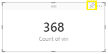

<properties 
    pageTitle="Instruções de instalação do modelo de solução de análise do veículo telemetria PowerBI Dashboard | Microsoft Azure" 
    description="Usar os recursos de inteligência de Cortana para obter ideias de previsão e em tempo real sobre integridade de um veículo e conduzir hábitos." 
    services="machine-learning" 
    documentationCenter="" 
    authors="bradsev" 
    manager="jhubbard" 
    editor="cgronlun" />

<tags 
    ms.service="machine-learning" 
    ms.workload="data-services" 
    ms.tgt_pltfrm="na" 
    ms.devlang="na" 
    ms.topic="article" 
    ms.date="09/12/2016" 
    ms.author="bradsev" />

# Instruções de configuração do veículo telemetria analytics solução modelo PowerBI Dashboard

Esse links de **menu** para os capítulos neste manual. 

[AZURE.INCLUDE [cap-vehicle-telemetry-playbook-selector](../../includes/cap-vehicle-telemetry-playbook-selector.md)]

A solução de análise de telemetria do veículo demonstra como revendedores de carro, fabricantes de automóvel e companhias podem aproveitar os recursos de inteligência de Cortana para obter ideias de previsão e em tempo real sobre integridade de um veículo e experiência de carro hábitos para gerar melhorias na área do cliente, P & D e campanhas de marketing. Este documento contém instruções passo a passo de como você pode configurar os relatórios de PowerBI e dashboard depois que a solução for implantada em sua assinatura. 

## Pré-requisitos
1.  Implantar a solução de análise de telemetria do veículo, navegando até [https://gallery.cortanaanalytics.com/SolutionTemplate/Vehicle-Telemetry-Analytics-3](https://gallery.cortanaanalytics.com/SolutionTemplate/Vehicle-Telemetry-Analytics-3)  
2.  [Instalar o Microsoft Power BI Desktop](http://www.microsoft.com/download/details.aspx?id=45331)
3.  Uma [assinatura do Azure](https://azure.microsoft.com/pricing/free-trial/). Se você não tiver uma assinatura do Azure, começar a usar assinatura gratuita do Azure
4.  Conta da Microsoft PowerBI
    

## Componentes de pacote de inteligência de Cortana
Como parte do modelo de solução de análise de telemetria do veículo, os seguintes serviços de inteligência de Cortana são implantados em sua assinatura.

- **Hubs de evento** para a inclusão de milhões de eventos de telemetria do veículo em Azure.
- S **Fluxo analítico**para obter ideias em tempo real sobre integridade de um veículo e persistir esses dados para o armazenamento de longo prazo para análise de lote mais elaborado.
- **Aprendizado de máquina** para detecção de anomalias em tempo real e processamento em lotes para obter ideias de previsão.
- **HDInsight** é utilizado para transformar dados em escala
- **Data Factory** manipula coordenação, cronogramas, gerenciamento de recursos e monitoramento do pipeline de processamento em lotes.

**Power BI** dá esta solução um painel rich dados em tempo real e visualizações de análise de previsão. 

A solução usa duas fontes de dados diferentes: **sinais de veículo simulado e dataset diagnóstico** e **Catálogo de veículo**.

Um simulador de telematics veículo está incluído como parte da solução. Ele emite informações de diagnóstico e sinaliza correspondente ao estado do veículo e conduzir padrão em um determinado ponto no tempo. 

O catálogo de veículo é um conjunto de dados de referência contendo VIN para mapeamento de modelo

## Preparação do painel de PowerBI

### Implantação

Depois que a implantação for concluída, você deve ver o diagrama a seguir com todos esses componentes marcados em verde. 

- Para navegar para os serviços correspondentes para validar se todas essas tiveram implantado com êxito, clique na seta no canto superior direito de nós verdes.
- Para baixar o pacote de simulator de dados, clique na seta no canto superior direito no nó **Veículo Telemáticas da Simulator** . Salve e extrair os arquivos localmente em seu computador. 

Agora, você está pronto para configurar o painel de PowerBI com visualizações avançadas para obter em tempo real e hábitos de obtenção de informações de previsão sobre integridade de um veículo e conduzir. Ele leva cerca de 45 minutos em uma hora para criar todos os relatórios e configurar o painel. 

### Configurar o painel do Power BI em tempo real

**Gerar dados simulados**

1. Na sua máquina local, vá para a pasta onde você extraídos do pacote de veículo Telematics Simulator
2.  Execute o aplicativo ***CarEventGenerator.exe***.
3.  Ele emite informações de diagnóstico e sinaliza correspondente ao estado do veículo e conduzir padrão em um determinado ponto no tempo. Isso é publicado em uma instância de Hub de evento do Azure que está configurada como parte da sua implantação.

     
**Iniciar o aplicativo de painel em tempo real**

A solução inclui um aplicativo que gera um painel em tempo real no PowerBI. Este aplicativo ouve uma instância de Hub de evento, do qual a análise de fluxo publica os eventos continuamente. Para cada evento que recebe este aplicativo, ele processa os dados usando um ponto de extremidade de pontuação de aprendizado de máquina solicitação-resposta. O conjunto de dados resultante é publicado para o envio de PowerBI APIs para visualização. 

Para baixar o aplicativo:

1.  Clique no nó PowerBI no modo de exibição de diagrama e clique em **Baixar o aplicativo de painel em tempo real**' link no painel Propriedades.
2.  Extrair e salve o aplicativo localmente

3.  Executar o aplicativo **RealtimeDashboardApp.exe**
4.  Fornecer credenciais válidas do Power BI, entrar e clique em **Aceitar**
    
    
    
    

### Configurar relatórios de PowerBI
Os relatórios em tempo real e o painel levar cerca de 30-45 minutos para ser concluída. Navegue até [http://powerbi.com](http://powerbi.com) e faça logon.

Um novo conjunto de dados é gerado no Power BI. Clique em dataset **ConnectedCarsRealtime** .

Salve o relatório em branco usando **Ctrl + s**.

Fornece o nome do relatório *em tempo real a análise de telemetria veículo - relatórios*.

## Relatórios em tempo real
Há três relatórios em tempo real nesta solução:

1.  Veículos em operação
2.  Veículos que necessitam de manutenção
3.  Estatísticas de integridade de veículos

Você pode optar por configurar todos os três relatórios em tempo real ou parar após qualquer estágio e prossiga para a próxima seção de configurar os relatórios de lote. Recomendamos que você crie todos os relatórios de três para visualizar a obtenção de informações completa do caminho em tempo real da solução.  

### 1. veículos em operação
  
Clique duas vezes em **página 1** e renomeie-a "Veículos em operação"  
      

Selecione campo **vin** de **campos** e escolha o tipo de visualização como **"Cartão"**.  

Visualização de cartão é criada conforme mostrado na figura.  
    

Clique na área em branco para adicionar a nova visualização.  

Selecione campos **Cidade** e **vin** . Alterar a visualização para **"Mapa"**. Arraste **vin** na área valores. Arraste **Cidade** de campos para a área de **legenda** .   
    
  
Selecione a seção de **formato** de **visualizações**, clique em **título** e alterar o **texto** para **"Veículos em operação por cidade"**.  
       

Visualização final procura conforme mostrado na figura.    
    

Clique na área em branco para adicionar a nova visualização.  

Selecione **Cidade** e **vin**, altere o tipo de visualização para **Gráfico de colunas agrupadas**. Garantir que o campo **Cidade** na **área do eixo** e **vin** na **área de valor**  

Classificar o gráfico por **"Contagem de vin"**  
      

Alterar o **título** de gráfico para **"Veículos em operação por cidade"**  

A seção **formato** , clique em selecionar **Cores de dados**, clique na **"Em"** **Mostrar tudo**  
      

Altere a cor de cidade individual clicando no ícone de cor.  
      

Clique na área em branco para adicionar a nova visualização.  

Selecione a visualização de **Gráfico de colunas agrupadas** de visualizações, arraste o campo **cidade** na área de **eixo** , **modelo** na área de **legenda** e **vin** na área de **valor** .  
      
    
  
Reorganize visualização todos nesta página, conforme mostrado na figura.  
    

Você configurou com êxito o relatório em tempo real "Veículos em operação". Você pode continuar a criar o próximo relatório em tempo real ou parar aqui e configurar o painel. 

### 2. veículos que necessitam de manutenção
  
Clique em  para adicionar um novo relatório, renomeá-lo para **"veículos que exigem manutenção"**

  

Selecione campo **vin** e altere o tipo de visualização ao **cartão**.  
      

Temos um campo chamado "MaintenanceLabel" no conjunto de dados. Este campo pode ter um valor de "0" ou "1"." Ela é definida pelo modelo de aprendizado de máquina do Azure provisionados como parte de solução e integrado com o caminho em tempo real. O valor "1" indica que um veículo requerem manutenção. 

Para adicionar um filtro de **Nível de página** para mostrar dados de veículos, que são que necessitam de manutenção: 

1. Arraste o campo de **"MaintenanceLabel"** para **Filtros de nível de página**.  
  

2. Clique em menu de **Filtragem básica** presente na parte inferior da MaintenanceLabel filtro de nível de página.  
  

3.  Defina seu valor do filtro para **"1"**    
  

Clique na área em branco para adicionar a nova visualização.  

Selecione o **Gráfico de colunas agrupadas** de visualizações  
  

Arraste o campo **modelo** para área de **eixo** , **Vin** para área de **valor** . Classificar visualização por **contagem de vin**.  Alterar o **título** de gráfico para **"Veículos que necessitam de manutenção pelo modelo"**  

Arrastar campos do **vin** para **Saturação da cor** de presente **campos**  seção da guia de **visualização**  
  

Alterar **As cores de dados** nas visualizações de seção de **formato**  
Alterar a cor do mínimo: **F2C812**  
Alterar a cor do máximo: **FF6300**  
  
  

Clique na área em branco para adicionar a nova visualização.  

Selecione o **gráfico de coluna agrupada** de visualizações, arraste o campo **vin** para área de **valor** , arraste o campo **Cidade** para área de **eixo** . Classificar o gráfico por **"Contagem de vin"**. Alterar o **título** de gráfico para **"Veículos que necessitam de manutenção por cidade"**   
  

Clique na área em branco para adicionar a nova visualização.  

Selecione Visualização de **Cartão de várias linhas** de visualizações, arraste o **modelo** e **vin** para a área de **campos** .  
    

Reorganizar todos da visualização, o relatório final tem a seguinte aparência:  
  

Você configurou com êxito o relatório em tempo real "Veículos que exigem manutenção". Você pode continuar a criar o próximo relatório em tempo real ou parar aqui e configurar o painel. 

### 3. estatísticas de integridade de veículos
  
Clique em  para adicionar um novo relatório, renomeá-lo para **"estatísticas de integridade de veículos"**  

Selecione a visualização do **medidor** de visualizações e, em seguida, arraste o campo de **velocidade** para as áreas de **valor, o valor mínimo, o valor máximo** .  
  

Alterar a agregação padrão de **velocidade** na **área de valor** para **média** 

Alterar a agregação padrão de **velocidade** na **área mínima** **mínimo**

Alterar a agregação padrão de **velocidade** na **área máximo** **máximo**

  

Renomeie o **Título do medidor** para **"Velocidade média"** 
 
  

Clique na área em branco para adicionar a nova visualização.  

Da mesma forma, adicione um **indicador** para **petróleo mecanismo média**, **média combustível**e **Médio mecanismo de temperatura**.  

Alterar a agregação padrão dos campos em cada medidor conforme descrito acima as etapas em **"Velocidade média"** medir.

Clique na área em branco para adicionar a nova visualização.

Selecione **linha e gráfico de colunas agrupadas** visualizações, e em seguida, arraste o campo **cidade** para **Eixo compartilhado**, arraste **a velocidade**, **campos tirepressure e engineoil** na área de **Valores de coluna** , altere o tipo de agregação para **média**. 

Arraste o campo **engineTemperature** para área **Valores de linha** , altere o tipo de agregação para **média**. 

Altere o gráfico **título** **"velocidade média, pneus pressão, petróleo mecanismo**e temperatura de mecanismo".  

Clique na área em branco para adicionar a nova visualização.

Selecione Visualização de **Treemap** de visualizações, arraste o campo de **modelo** para a área de **grupo** e arraste o campo **MaintenanceProbability** para a área **valores** .

Altere o **título** do gráfico para **"Modelos de veículo que necessitam de manutenção"**.

Clique na área em branco para adicionar a nova visualização.

Selecione o **gráfico de barras 100% empilhadas** de visualização, arraste o campo **cidade** para a área de **eixo** e arraste o **MaintenanceProbability**, **RecallProbability** campos para a área de **valor** .

Clique em **Formatar**, selecione **Cores de dados**e defina a cor de **MaintenanceProbability** com o valor **"F2C80F"**.

Altere o **título** do gráfico para **"probabilidade de veículo manutenção & Cancelar por cidade"**.

Clique na área em branco para adicionar a nova visualização.

Selecione o **Gráfico de área** de visualização de visualizações, arraste o campo de **modelo** para a área **eixo** e arraste os campos **engineOil, tirepressure, velocidade e MaintenanceProbability** para a área **valores** . Altere o tipo de agregação para **"Média"**. 

Altere o título do gráfico para **"Média Azeite de oliva mecanismo, dos pneus probabilidade pressão, a velocidade e a manutenção pelo modelo"**.

Clique na área em branco para adicionar nova visualização:

1. Selecione a visualização de **Gráfico de dispersão** de visualizações.
2. Arraste o campo de **modelo** para a área de **detalhes** e **legenda** .
3. Arraste o campo de **combustível** para a área do **eixo x** , altere a agregação para **média**.
4. Arraste **engineTemparature** para **área de y**, altere a agregação para **média**
5. Arraste o campo **vin** para a área de **tamanho** .

Altere o **título** do gráfico para **"Médias de combustível, temperatura de mecanismo pelo modelo"**.

O relatório final aparência conforme mostrado abaixo.

### Visualizações de PIN dos relatórios ao painel de dados em tempo real
  
Crie um painel em branco, clicando no ícone de sinal de adição ao lado de painéis. Você pode atribuir o nome "Painel de análise de telemetria do veículo"

Fixe a visualização dos relatórios acima para o painel. 
 

No painel deve ter a seguinte aparência quando todos os relatórios de três são criados e visualizações correspondentes estão fixadas no painel. Se você não tiver criado todos os relatórios, seu painel pode parecer diferente. 

Parabéns! Você criou com êxito o painel em tempo real. Ao prosseguir executar CarEventGenerator.exe e RealtimeDashboardApp.exe, você deverá ver atualizações ao vivo no painel. Ele deve levar cerca de 10 a 15 minutos para concluir as etapas a seguir.

 
##  Configurar o painel de processamento de lote do Power BI

>[AZURE.NOTE] Ele leva cerca de duas horas (a partir da conclusão bem-sucedida de implantação) para o pipeline de processamento em lotes de ponta a ponta terminar a execução e processar um ano patrimônio de dados gerados. Portanto, aguarde o processamento concluir antes de prosseguir com as próximas etapas. 

**Baixar o arquivo de designer PowerBI**

-   Um arquivo de designer PowerBI pré-configurado está incluído como parte da implantação
-   Clique no nó PowerBI no modo de exibição de diagrama e clique em **baixar o arquivo de designer PowerBI** link no painel de propriedades

-   Salvar localmente

**Configurar relatórios de PowerBI**

-   Abra o arquivo de designer 'VehicleTelemetryAnalytics - Report.pbix de área de trabalho' usando a área de trabalho do PowerBI. Se você ainda não tiver, instale a área de trabalho do PowerBI da [área de trabalho do PowerBI instalar](http://www.microsoft.com/download/details.aspx?id=45331). 

-   Clique em **editar consultas**.

- Clique duas vezes a **fonte**.

- Atualize a cadeia de conexão do servidor com o servidor do SQL Azure que você tem provisionado como parte da implantação. Clique no nó do SQL Azure no diagrama e exiba o nome do servidor do painel Propriedades.

- Deixe o **banco de dados** como *connectedcar*.

- Clique em **Okey**.
- Você verá a guia de **credencial do Windows** selecionada por padrão, altere-a para **credenciais de banco de dados** clicando na guia de **banco de dados** à direita.
- Fornece o **nome de usuário** e a **senha** do seu banco de dados de SQL Azure que foi especificada durante sua configuração de implantação.

- Clique em **Conectar**
- Repita as etapas acima para cada uma das três consultas restantes presentes no painel direito e, em seguida, atualize os detalhes de conexão da fonte de dados.
- Clique em **Fechar e carregar**. Conjuntos de dados do Power BI Desktop arquivo estão conectados a tabelas de banco de dados do SQL Azure.
- **Fechar** Arquivo do Power BI Desktop.

- Clique em botão **Salvar** para salvar as alterações. 
 
Você já configurou todos os relatórios correspondente ao caminho de processamento em lotes na solução. 

## Carregar *powerbi.com*
 
1.  Navegue até o portal da web de PowerBI no http://powerbi.com e faça logon.
2.  Clique em **obter dados**  
3.  Carregue o arquivo de área de trabalho de BI do Power.  
4.  Para carregar, clique em **-obter dados > obter arquivos -> arquivo Local**  
5.  Navegue até o **"VehicleTelemetryAnalytics – Report.pbix da área de trabalho"**  
6.  Depois que o arquivo é carregado, você será direcionado para seu espaço de trabalho do Power BI.  

Um conjunto de dados, relatório e um painel em branco serão criados para você.  
 

Gráficos de PIN ao painel existente **Painel de análise de telemetria do veículo** no **Power BI**. Clique em Painel em branco criado acima e depois navegue até o clique de seção de **relatórios** no relatório recém-carregado.  

 

**Observe que o relatório tem seis páginas:**  
Página 1: Densidade de veículo  
Página 2: Integridade de um veículo em tempo real  
Página 3: Ativamente controlado veículos   
Página 4: Cancelada veículos  
Página 5: Combustível com eficiência controlado pelo veículos  
6 de página: Logotipo do Contoso  

 

**Na página 3**, fixar o seguinte:  

1.  Contagem de VIN  
     

2.  Ativamente controlados veículos por modelo – gráfico em cascata  
    

**Na página 5**, fixar o seguinte: 
 
1.  Contagem de vin    
      
2.  Veículos eficientes de combustível pelo modelo: gráfico de colunas agrupadas  
    

**Na página 4**, fixar o seguinte:  

1.  Contagem de vin  
     

2.  Modelo de veículos recuperados por cidade,: Treemap  
      

**Na página 6**, fixar o seguinte:  

1.  Logotipo do Contoso Motors  
    

**Organizar o painel**  

1.  Navegue até o painel
2.  Passe o mouse sobre cada gráfico e renomeie-lo com base na nomeação fornecida na imagem dashboard completa abaixo. Também mexa os gráficos para a aparência do painel abaixo.  
      
    
3.  Se você tiver criado todos os relatórios como mencionado neste documento, o painel concluído final deve parecer com a figura a seguir. 

Parabéns! Você criou com êxito os relatórios e hábitos de painel para obter em tempo real, previsão e lote ideias sobre integridade de um veículo e conduzir.  
